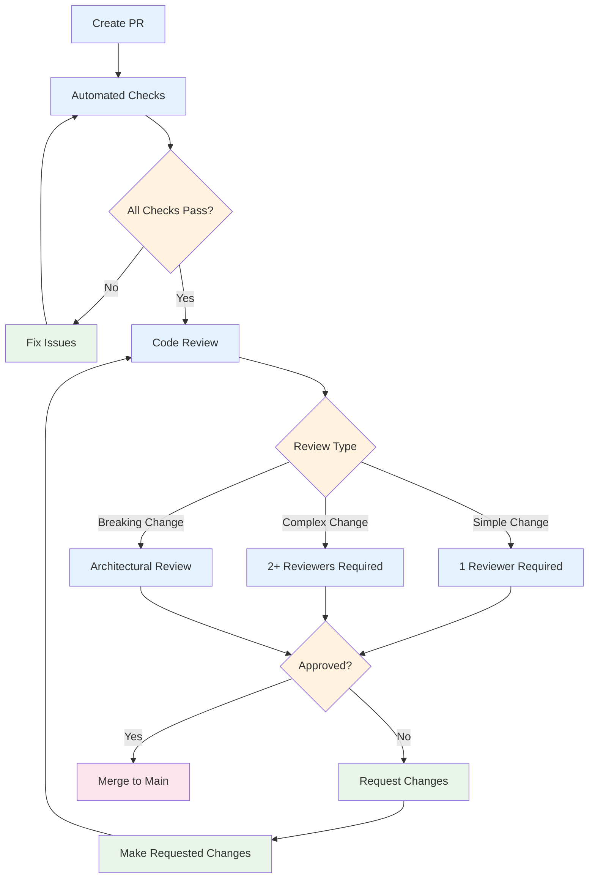

# Contributing Guidelines

Welcome to OpenFrame OSS Lib! This guide outlines how to contribute effectively to the project, including code style, branch naming, PR process, and review checklist.

## Getting Started

### Before You Contribute

1. **Join the Community**: Connect with other contributors on [OpenMSP Slack](https://join.slack.com/t/openmsp/shared_invite/zt-36bl7mx0h-3~U2nFH6nqHqoTPXMaHEHA)
2. **Understand the Architecture**: Review the [Architecture Overview](../architecture/README.md)
3. **Set Up Your Environment**: Follow the [Environment Setup Guide](../setup/environment.md)
4. **Read the Testing Guide**: Understand our [Testing Standards](../testing/README.md)

### Types of Contributions

We welcome several types of contributions:

| Contribution Type | Description | Approval Required |
|------------------|-------------|-------------------|
| **Bug Fixes** | Fix issues in existing DTOs | Code review |
| **New DTOs** | Add new data transfer objects | Architecture review + code review |
| **Documentation** | Improve docs and examples | Documentation review |
| **Test Coverage** | Add or improve tests | Code review |
| **Performance** | Optimize serialization or memory usage | Performance review + code review |
| **Security** | Security improvements | Security review + code review |

## Code Style and Conventions

### Java Code Style

OpenFrame OSS Lib follows **Google Java Style** with some specific adaptations:

```java
// ✅ Good: Proper formatting and style
@Data
@Builder
@NoArgsConstructor
@AllArgsConstructor
public class ExampleDTO {
    
    private String id;
    private String organizationId;
    private List<String> eventTypes;
    private LocalDateTime timestamp;
    
    /**
     * Validates that the DTO contains required fields.
     * 
     * @throws ValidationException if required fields are missing
     */
    public void validate() {
        if (id == null || id.trim().isEmpty()) {
            throw new ValidationException("ID is required");
        }
        if (organizationId == null || organizationId.trim().isEmpty()) {
            throw new ValidationException("Organization ID is required");
        }
    }
}
```

#### Key Style Guidelines

1. **Indentation**: 4 spaces (no tabs)
2. **Line Length**: 120 characters maximum
3. **Braces**: Opening brace on same line
4. **Naming**: CamelCase for classes, camelCase for fields/methods
5. **JavaDoc**: Required for all public APIs
6. **Imports**: Organize imports (java.*, javax.*, org.*, com.*)

### Lombok Conventions

Follow consistent Lombok patterns across all DTOs:

```java
// ✅ Standard DTO pattern
@Data                    // Generates getters, setters, toString, equals, hashCode
@Builder                 // Generates builder pattern
@NoArgsConstructor       // Default constructor for Jackson/JPA
@AllArgsConstructor      // Constructor with all arguments
public class StandardDTO {
    
    // Fields in logical order:
    // 1. Identifiers (id, organizationId)
    // 2. Primary data (name, description, etc.)
    // 3. Metadata (timestamps, status)
    // 4. Relationships (foreign keys, references)
    
    private String id;
    private String organizationId;
    private String name;
    private String description;
    private LocalDateTime createdAt;
    private LocalDateTime updatedAt;
    private String status;
    private List<String> relatedIds;
}
```

### Naming Conventions

#### Class Names

- **DTOs**: Descriptive noun + "DTO" suffix (optional for this project)
  ```java
  LogEvent              // ✅ Clear and concise
  AuditLogEvent         // ✅ More specific if needed
  DeviceFilterCriteria  // ✅ Describes purpose clearly
  ```

#### Field Names

- **IDs**: Always end with "Id"
  ```java
  private String id;             // Primary identifier
  private String organizationId; // Organization reference
  private String deviceId;       // Device reference
  ```

- **Collections**: Plural nouns
  ```java
  private List<String> eventTypes;      // ✅ Plural
  private List<String> organizationIds; // ✅ Plural
  private String eventType;             // ✅ Singular for single value
  ```

- **Timestamps**: Descriptive with clear intent
  ```java
  private LocalDateTime createdAt;    // ✅ Clear intent
  private LocalDateTime updatedAt;    // ✅ Clear intent
  private LocalDateTime timestamp;    // ✅ OK for general timestamps
  ```

#### Method Names

- **Validation**: Start with "validate" or "is"
  ```java
  public void validateCriteria() { }
  public boolean isValid() { }
  public boolean hasRequiredFields() { }
  ```

- **Conversion**: Descriptive conversion intent
  ```java
  public ExternalFormat toExternalFormat() { }
  public static InternalDTO fromExternalFormat(ExternalFormat external) { }
  ```

## Branch Naming and Git Workflow

### Branch Naming Convention

Use descriptive branch names that indicate the type of change:

```bash
# Feature branches
feature/add-device-configuration-dto
feature/improve-audit-filtering
feature/add-validation-annotations

# Bug fix branches  
bugfix/fix-serialization-null-values
bugfix/correct-timestamp-timezone-handling
bugfix/resolve-builder-inheritance-issue

# Documentation branches
docs/update-architecture-diagrams
docs/add-serialization-examples
docs/improve-getting-started-guide

# Performance branches
perf/optimize-json-serialization
perf/reduce-memory-allocation
perf/improve-query-performance
```

### Git Commit Message Format

Follow **Conventional Commits** specification:

```bash
# Format: <type>(<scope>): <description>

# Examples:
feat(audit): add LogDetails DTO for detailed audit events
fix(device): resolve null pointer in DeviceFilterCriteria validation
docs(readme): update installation instructions
test(integration): add JSON serialization tests for all DTOs
refactor(builder): improve builder pattern consistency
perf(serialization): optimize Jackson performance for large result sets
```

#### Commit Types

| Type | Description | When to Use |
|------|-------------|-------------|
| `feat` | New feature | Adding new DTOs or functionality |
| `fix` | Bug fix | Fixing issues in existing code |
| `docs` | Documentation | Documentation changes only |
| `test` | Tests | Adding or modifying tests |
| `refactor` | Code refactoring | Improving code without changing functionality |
| `perf` | Performance | Performance improvements |
| `style` | Code style | Formatting, missing semicolons, etc. |
| `ci` | CI/CD | Changes to build/CI configuration |

### Git Workflow

#### For Core Team Members

```bash
# 1. Update main branch
git checkout main
git pull origin main

# 2. Create feature branch
git checkout -b feature/add-new-dto

# 3. Make changes and commit
git add .
git commit -m "feat(dto): add DeviceConfigurationDTO for device settings"

# 4. Push and create PR
git push origin feature/add-new-dto
gh pr create --title "Add DeviceConfigurationDTO" --body "Implements new DTO for device configuration management"

# 5. After PR approval and merge
git checkout main
git pull origin main
git branch -d feature/add-new-dto
```

#### For External Contributors

```bash
# 1. Fork the repository
gh repo fork openframe/openframe-oss-lib --clone=true
cd openframe-oss-lib

# 2. Add upstream remote
git remote add upstream https://github.com/openframe/openframe-oss-lib.git

# 3. Create feature branch
git checkout -b feature/my-contribution

# 4. Make changes and commit
git add .
git commit -m "feat(audit): add severity enum for better type safety"

# 5. Push to your fork
git push origin feature/my-contribution

# 6. Create PR to upstream
gh pr create --repo openframe/openframe-oss-lib --title "Add severity enum" --body "Improves type safety for audit log severity levels"

# 7. Keep fork updated
git fetch upstream
git checkout main
git merge upstream/main
git push origin main
```

## Pull Request Process

### PR Requirements

Every PR must include:

- [ ] **Clear Description**: What changes were made and why
- [ ] **Test Coverage**: Tests for new functionality or bug fixes
- [ ] **Documentation**: Updates to docs if needed
- [ ] **No Breaking Changes**: Unless explicitly discussed and approved
- [ ] **Passing CI**: All tests and checks must pass

### PR Template

Use this template for your PRs:

```markdown
## Description

Brief description of what this PR does.

## Type of Change

- [ ] Bug fix (non-breaking change which fixes an issue)
- [ ] New feature (non-breaking change which adds functionality)
- [ ] Breaking change (fix or feature that would cause existing functionality to change)
- [ ] Documentation update
- [ ] Test coverage improvement

## Changes Made

- Added/Modified: List specific changes
- Fixed: List bugs fixed
- Updated: List documentation or tests updated

## Testing

- [ ] Added unit tests for new functionality
- [ ] All existing tests pass
- [ ] Manual testing performed
- [ ] Integration tests added if applicable

## Checklist

- [ ] My code follows the project's style guidelines
- [ ] I have performed a self-review of my code
- [ ] I have commented my code, particularly in hard-to-understand areas
- [ ] I have made corresponding changes to the documentation
- [ ] My changes generate no new warnings
- [ ] I have added tests that prove my fix is effective or that my feature works
- [ ] New and existing unit tests pass locally with my changes

## Related Issues

Closes #(issue number)
```

### Review Process


```mermaid
flowchart TD
    PR[Create PR] --> AutoChecks[Automated Checks]
    AutoChecks --> ChecksPassing{All Checks Pass?}
    ChecksPassing -->|No| FixIssues[Fix Issues]
    FixIssues --> AutoChecks
    ChecksPassing -->|Yes| CodeReview[Code Review]
    
    CodeReview --> ReviewType{Review Type}
    ReviewType -->|Simple Change| SingleReviewer[1 Reviewer Required]
    ReviewType -->|Complex Change| MultipleReviewers[2+ Reviewers Required]
    ReviewType -->|Breaking Change| ArchitecturalReview[Architectural Review]
    
    SingleReviewer --> Approved{Approved?}
    MultipleReviewers --> Approved
    ArchitecturalReview --> Approved
    
    Approved -->|No| RequestChanges[Request Changes]
    RequestChanges --> MakeChanges[Make Requested Changes]
    MakeChanges --> CodeReview
    
    Approved -->|Yes| Merge[Merge to Main]
    
    classDef process fill:#e3f2fd
    classDef decision fill:#fff3e0
    classDef action fill:#e8f5e8
    classDef final fill:#fce4ec
    
    class PR,AutoChecks,CodeReview,SingleReviewer,MultipleReviewers,ArchitecturalReview process
    class ChecksPassing,ReviewType,Approved decision
    class FixIssues,RequestChanges,MakeChanges action
    class Merge final
```

## Review Checklist

### For Reviewers

Use this checklist when reviewing PRs:

#### Code Quality
- [ ] **Code Style**: Follows project style guidelines
- [ ] **Lombok Usage**: Consistent annotation patterns
- [ ] **Naming**: Clear, descriptive names for classes and fields
- [ ] **Documentation**: JavaDoc for public APIs
- [ ] **Error Handling**: Appropriate exception handling

#### Architecture Compliance
- [ ] **Contract-First**: DTOs are implementation-agnostic
- [ ] **Multi-Tenancy**: Organization scoping where appropriate
- [ ] **Type Safety**: Proper use of generics and enums
- [ ] **Builder Pattern**: Consistent Lombok builder usage
- [ ] **Serialization**: Jackson-compatible structures

#### Security Review
- [ ] **No Sensitive Data**: No passwords, tokens, or credentials in DTOs
- [ ] **Input Validation**: Appropriate validation annotations
- [ ] **Organization Isolation**: Proper tenant scoping
- [ ] **Data Exposure**: No accidental information leakage

#### Testing
- [ ] **Test Coverage**: Adequate test coverage (minimum 85%)
- [ ] **Test Quality**: Well-written, descriptive tests
- [ ] **Edge Cases**: Tests cover boundary conditions
- [ ] **Serialization Tests**: JSON serialization/deserialization tested
- [ ] **Integration Tests**: Where appropriate

#### Documentation
- [ ] **README Updates**: If new functionality added
- [ ] **Architecture Docs**: If architectural changes made
- [ ] **Examples**: Code examples for new DTOs
- [ ] **Breaking Changes**: Documented if any

### For Contributors

Before submitting a PR:

- [ ] **Self Review**: Thoroughly review your own code
- [ ] **Run Tests**: All tests pass locally
- [ ] **Check Coverage**: Coverage meets minimum requirements
- [ ] **Update Documentation**: Relevant docs updated
- [ ] **Clean Commits**: Commit history is clean and descriptive
- [ ] **No TODOs**: Remove temporary comments and TODOs

## Release Process

### Version Numbering

OpenFrame OSS Lib follows **Semantic Versioning** (SemVer):

```
MAJOR.MINOR.PATCH

1.0.0 -> Initial release
1.0.1 -> Patch: Bug fixes
1.1.0 -> Minor: New DTOs, backward-compatible changes  
2.0.0 -> Major: Breaking changes
```

### Release Checklist

For maintainers preparing releases:

- [ ] **All Tests Pass**: Full test suite passes
- [ ] **Documentation Updated**: All docs reflect new features
- [ ] **CHANGELOG Updated**: Changes documented
- [ ] **Version Bumped**: POM version updated
- [ ] **Tag Created**: Git tag for release
- [ ] **Artifacts Published**: Maven artifacts deployed
- [ ] **Release Notes**: GitHub release with notes

## Community Guidelines

### Code of Conduct

- **Be Respectful**: Treat all contributors with respect
- **Be Constructive**: Provide helpful, actionable feedback
- **Be Collaborative**: Work together to improve the project
- **Be Patient**: Everyone is learning and contributing their best

### Communication

- **GitHub Issues**: For bug reports and feature requests
- **GitHub Discussions**: For questions and general discussion
- **OpenMSP Slack**: For real-time chat and collaboration
- **PR Comments**: For code-specific discussion

### Getting Help

If you need help:

1. **Check Documentation**: Start with existing docs
2. **Search Issues**: Look for similar problems
3. **Ask in Slack**: Get help from the community
4. **Create Issue**: If you find a bug or have a feature request

## Recognition

Contributors will be recognized in:

- **Contributors List**: GitHub contributors page
- **Release Notes**: Acknowledgment in release notes
- **Hall of Fame**: Special recognition for significant contributions

## Summary

Contributing to OpenFrame OSS Lib:

1. **Follow Style Guidelines**: Consistent code style and naming
2. **Use Proper Git Workflow**: Descriptive branches and conventional commits
3. **Write Comprehensive Tests**: Meet coverage requirements
4. **Document Changes**: Keep documentation up-to-date
5. **Collaborate Effectively**: Use PR process and reviews constructively

Your contributions help make OpenFrame OSS Lib better for everyone in the OpenFrame ecosystem!

---

*Thank you for contributing to OpenFrame OSS Lib! Your work helps power the entire OpenFrame platform and makes AI-driven MSP solutions accessible to organizations worldwide.*