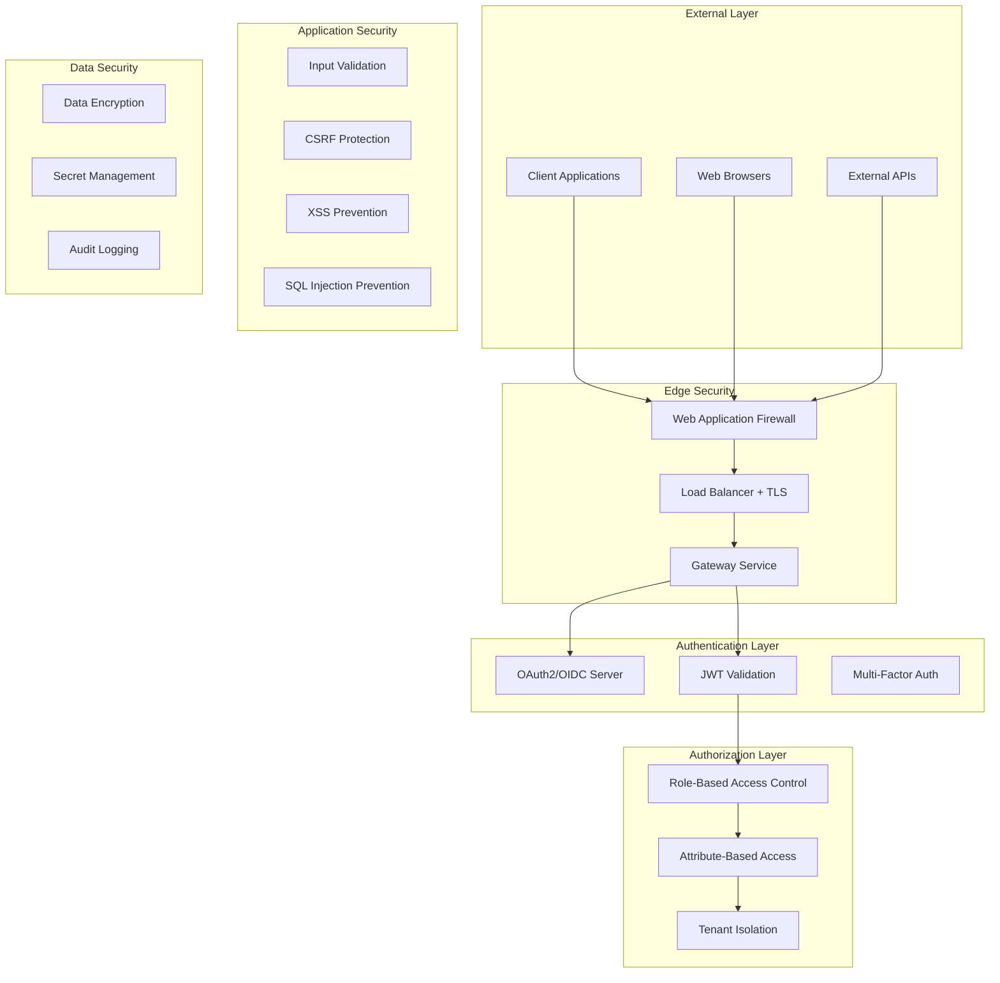

# Security Guidelines

OpenFrame OSS Libraries implements enterprise-grade security with multi-tenancy, OAuth2/OIDC compliance, and defense-in-depth strategies. This guide covers security best practices, implementation patterns, and common vulnerabilities to avoid.

## Security Architecture Overview



## Authentication and Authorization

### OAuth2/OIDC Implementation

OpenFrame uses Spring Authorization Server for OAuth2/OIDC compliance:

```java
@Configuration
@EnableAuthorizationServer
public class AuthorizationServerConfig {
    
    @Bean
    public RegisteredClientRepository registeredClientRepository() {
        return new MongoRegisteredClientRepository();
    }
    
    @Bean
    public JwtDecoder jwtDecoder(TenantKeyService keyService) {
        return new MultiTenantJwtDecoder(keyService);
    }
    
    @Bean 
    public OAuth2TokenCustomizer<JwtEncodingContext> tokenCustomizer() {
        return context -> {
            // Add tenant-specific claims
            String tenantId = extractTenantId(context);
            context.getClaims().claim("tenant_id", tenantId);
            context.getClaims().claim("tenant_domain", getTenantDomain(tenantId));
        };
    }
}
```

### Multi-Tenant JWT Security

Each tenant has isolated RSA key pairs:

```java
@Component
@RequiredArgsConstructor
public class TenantKeyService {
    
    private final TenantKeyRepository keyRepository;
    private final LoadingCache<String, RSAKey> keyCache;
    
    public RSAKey getSigningKey(String tenantId) {
        return keyCache.get(tenantId, () -> {
            TenantKey key = keyRepository.findByTenantId(tenantId)
                .orElseThrow(() -> new TenantKeyNotFoundException(tenantId));
            return RSAKey.parse(key.getPrivateKey());
        });
    }
    
    public RSAKey getVerificationKey(String tenantId) {
        RSAKey signingKey = getSigningKey(tenantId);
        return signingKey.toPublicJWK();
    }
}
```

### Authentication Principal Pattern

Always use `AuthPrincipal` for user context:

```java
@RestController
@RequestMapping("/api/organizations")
public class OrganizationController {
    
    @GetMapping
    public ResponseEntity<List<Organization>> list(
        @AuthenticationPrincipal AuthPrincipal principal
    ) {
        // Principal automatically includes tenant context
        String tenantId = principal.getTenantId();
        String userId = principal.getUserId();
        List<String> roles = principal.getRoles();
        
        // Enforce tenant isolation
        List<Organization> orgs = service.findByTenant(tenantId);
        return ResponseEntity.ok(orgs);
    }
}
```

### Role-Based Access Control (RBAC)

Define roles and permissions clearly:

```java
public enum Role {
    OWNER("OWNER", Set.of(Permission.ALL)),
    ADMIN("ADMIN", Set.of(
        Permission.USER_READ, Permission.USER_WRITE,
        Permission.ORG_READ, Permission.ORG_WRITE,
        Permission.DEVICE_READ, Permission.DEVICE_WRITE
    )),
    USER("USER", Set.of(
        Permission.USER_READ,
        Permission.ORG_READ,
        Permission.DEVICE_READ
    )),
    VIEWER("VIEWER", Set.of(
        Permission.USER_READ,
        Permission.ORG_READ,
        Permission.DEVICE_READ
    ));
    
    private final String name;
    private final Set<Permission> permissions;
}
```

### Method-Level Security

Use annotations for fine-grained security:

```java
@Service
public class UserService {
    
    @PreAuthorize("hasRole('ADMIN') or @userService.isOwner(#userId, authentication.name)")
    public User updateUser(String userId, UpdateUserRequest request) {
        // Only admins or the user themselves can update
    }
    
    @PreAuthorize("hasRole('OWNER')")
    public void deleteUser(String userId) {
        // Only owners can delete users
    }
    
    @PostAuthorize("@tenantService.belongsToTenant(returnObject.tenantId, authentication.principal.tenantId)")
    public User findById(String userId) {
        // Ensure returned user belongs to caller's tenant
    }
}
```

## Data Security and Encryption

### Sensitive Data Encryption

Encrypt sensitive data at rest:

```java
@Component
@RequiredArgsConstructor
public class EncryptionService {
    
    private final AESUtil aesUtil;
    
    @Value("${openframe.security.encryption.key}")
    private String encryptionKey;
    
    public String encrypt(String plaintext) {
        try {
            return aesUtil.encrypt(plaintext, encryptionKey);
        } catch (Exception e) {
            throw new EncryptionException("Failed to encrypt data", e);
        }
    }
    
    public String decrypt(String ciphertext) {
        try {
            return aesUtil.decrypt(ciphertext, encryptionKey);
        } catch (Exception e) {
            throw new EncryptionException("Failed to decrypt data", e);
        }
    }
}
```

### Database Field Encryption

Use MongoDB field-level encryption for sensitive data:

```java
@Document(collection = "sso_configs")
public class SSOConfig {
    
    @Id
    private String id;
    
    private String clientId;
    
    @Encrypted  // Custom annotation
    private String clientSecret;
    
    @Encrypted
    private String apiKey;
    
    // Encryption is handled by custom MongoDB converter
}
```

### Secrets Management

Never hardcode secrets in code:

```yaml
# application.yml - Use environment variables
openframe:
  security:
    jwt:
      secret: ${JWT_SECRET:}
    oauth:
      encryption-key: ${OAUTH_ENCRYPTION_KEY:}
      
spring:
  data:
    mongodb:
      uri: ${MONGODB_URI:mongodb://localhost:27017/openframe}
```

```java
// Environment-based secret injection
@Component
public class SecretService {
    
    @Value("${openframe.security.oauth.encryption-key:}")
    private String encryptionKey;
    
    @PostConstruct
    public void validateSecrets() {
        if (StringUtils.isBlank(encryptionKey) || encryptionKey.length() < 32) {
            throw new IllegalStateException("OAuth encryption key must be at least 32 characters");
        }
    }
}
```

## Input Validation and Sanitization

### Request Validation

Always validate incoming requests:

```java
@RestController
@Validated
public class OrganizationController {
    
    @PostMapping
    public ResponseEntity<Organization> create(
        @Valid @RequestBody CreateOrganizationRequest request,
        @AuthenticationPrincipal AuthPrincipal principal
    ) {
        // Validation annotations on the DTO handle basic validation
        Organization org = service.create(request, principal.getTenantId());
        return ResponseEntity.status(HttpStatus.CREATED).body(org);
    }
}

// DTO with validation annotations
public class CreateOrganizationRequest {
    
    @NotBlank(message = "Organization name is required")
    @Length(max = 100, message = "Organization name must not exceed 100 characters")
    @Pattern(regexp = "^[a-zA-Z0-9\\s\\-\\.]+$", message = "Invalid characters in organization name")
    private String name;
    
    @Valid
    @NotNull(message = "Contact information is required")
    private ContactInformationDto contactInformation;
    
    @Email(message = "Invalid email format")
    private String primaryEmail;
}
```

### Custom Validators

Create domain-specific validators:

```java
@Component
public class TenantDomainValidator implements ConstraintValidator<ValidTenantDomain, String> {
    
    private static final Pattern DOMAIN_PATTERN = Pattern.compile(
        "^[a-zA-Z0-9][a-zA-Z0-9-]{1,61}[a-zA-Z0-9]\\.[a-zA-Z]{2,}$"
    );
    
    @Override
    public boolean isValid(String domain, ConstraintValidatorContext context) {
        if (StringUtils.isBlank(domain)) {
            return false;
        }
        
        // Check format
        if (!DOMAIN_PATTERN.matcher(domain).matches()) {
            return false;
        }
        
        // Check for security issues
        if (containsSuspiciousPatterns(domain)) {
            return false;
        }
        
        return true;
    }
    
    private boolean containsSuspiciousPatterns(String domain) {
        String lower = domain.toLowerCase();
        return lower.contains("script") || 
               lower.contains("javascript") || 
               lower.contains("data:");
    }
}
```

### SQL Injection Prevention

Use parameterized queries and avoid dynamic query building:

```java
@Repository
public class CustomOrganizationRepositoryImpl implements CustomOrganizationRepository {
    
    @Autowired
    private MongoTemplate mongoTemplate;
    
    // ✅ SECURE: Using Criteria API
    public List<Organization> findBySearchTerm(String tenantId, String searchTerm) {
        Criteria criteria = Criteria.where("tenantId").is(tenantId);
        
        if (StringUtils.isNotBlank(searchTerm)) {
            // Use regex with escaped input
            String escapedTerm = Pattern.quote(searchTerm);
            criteria.and("name").regex(escapedTerm, "i");
        }
        
        Query query = new Query(criteria);
        return mongoTemplate.find(query, Organization.class);
    }
    
    // ❌ VULNERABLE: Don't build queries with string concatenation
    // public List<Organization> findBySearchTermBad(String searchTerm) {
    //     String queryString = "{ 'name': /" + searchTerm + "/i }";
    //     // This is vulnerable to NoSQL injection
    // }
}
```

## Cross-Site Request Forgery (CSRF) Protection

Configure CSRF protection appropriately:

```java
@Configuration
@EnableWebSecurity
public class SecurityConfig {
    
    @Bean
    public SecurityFilterChain filterChain(HttpSecurity http) throws Exception {
        http
            .csrf(csrf -> csrf
                .csrfTokenRepository(CookieCsrfTokenRepository.withHttpOnlyFalse())
                .ignoringRequestMatchers("/api/public/**", "/oauth/**")
            )
            .sessionManagement(session -> session
                .sessionCreationPolicy(SessionCreationPolicy.STATELESS)
            );
        return http.build();
    }
}
```

For SPA applications, provide CSRF token endpoint:

```java
@RestController
public class CsrfController {
    
    @GetMapping("/api/csrf")
    public ResponseEntity<Map<String, String>> csrf(CsrfToken token) {
        Map<String, String> response = Map.of(
            "token", token.getToken(),
            "headerName", token.getHeaderName()
        );
        return ResponseEntity.ok(response);
    }
}
```

## Cross-Site Scripting (XSS) Prevention

### Output Encoding

Always encode output in templates:

```html
<!-- Thymeleaf template - automatic escaping -->
<div th:text="${user.name}">User Name</div>

<!-- Raw HTML - use carefully -->
<div th:utext="${sanitizedHtml}">HTML Content</div>
```

### Content Security Policy

Implement CSP headers:

```java
@Configuration
public class SecurityHeadersConfig implements WebMvcConfigurer {
    
    @Override
    public void addInterceptors(InterceptorRegistry registry) {
        registry.addInterceptor(new HandlerInterceptor() {
            @Override
            public boolean preHandle(HttpServletRequest request, 
                                   HttpServletResponse response, 
                                   Object handler) {
                response.setHeader("Content-Security-Policy", 
                    "default-src 'self'; " +
                    "script-src 'self' 'unsafe-inline'; " +
                    "style-src 'self' 'unsafe-inline'; " +
                    "img-src 'self' data: https:; " +
                    "connect-src 'self'"
                );
                response.setHeader("X-Content-Type-Options", "nosniff");
                response.setHeader("X-Frame-Options", "DENY");
                response.setHeader("X-XSS-Protection", "1; mode=block");
                return true;
            }
        });
    }
}
```

### Input Sanitization

Sanitize user input when necessary:

```java
@Component
public class HtmlSanitizer {
    
    private final PolicyFactory policy = Sanitizers.FORMATTING
        .and(Sanitizers.BLOCKS)
        .and(Sanitizers.LINKS);
    
    public String sanitize(String input) {
        if (StringUtils.isBlank(input)) {
            return input;
        }
        return policy.sanitize(input);
    }
    
    public String stripHtml(String input) {
        if (StringUtils.isBlank(input)) {
            return input;
        }
        return Jsoup.clean(input, Whitelist.none());
    }
}
```

## API Security Best Practices

### Rate Limiting

Implement rate limiting to prevent abuse:

```java
@Component
@RequiredArgsConstructor
public class RateLimitService {
    
    private final RedisTemplate<String, String> redisTemplate;
    
    public boolean isAllowed(String identifier, int maxRequests, Duration window) {
        String key = "rate_limit:" + identifier;
        String windowStart = String.valueOf(
            Instant.now().truncatedTo(ChronoUnit.MINUTES).getEpochSecond()
        );
        String fullKey = key + ":" + windowStart;
        
        try {
            Long current = redisTemplate.opsForValue().increment(fullKey);
            if (current == 1) {
                redisTemplate.expire(fullKey, window);
            }
            return current <= maxRequests;
        } catch (Exception e) {
            // Fail open for availability
            log.warn("Rate limiting failed", e);
            return true;
        }
    }
}

@RestController
public class ApiController {
    
    @Autowired
    private RateLimitService rateLimitService;
    
    @PostMapping("/api/public/contact")
    public ResponseEntity<?> contact(
        @RequestBody ContactRequest request,
        HttpServletRequest httpRequest
    ) {
        String clientIP = getClientIP(httpRequest);
        
        if (!rateLimitService.isAllowed(clientIP, 5, Duration.ofMinutes(1))) {
            return ResponseEntity.status(HttpStatus.TOO_MANY_REQUESTS)
                .body("Rate limit exceeded");
        }
        
        // Process request
        return ResponseEntity.ok().build();
    }
}
```

### API Key Security

Secure API key handling:

```java
@Component
public class ApiKeyService {
    
    // Generate secure API keys
    public String generateApiKey() {
        SecureRandom random = new SecureRandom();
        byte[] keyBytes = new byte[32];
        random.nextBytes(keyBytes);
        return Base64.getUrlEncoder().withoutPadding().encodeToString(keyBytes);
    }
    
    // Hash API keys for storage
    public String hashApiKey(String apiKey) {
        return BCrypt.hashpw(apiKey, BCrypt.gensalt(12));
    }
    
    // Verify API key
    public boolean verifyApiKey(String providedKey, String storedHash) {
        return BCrypt.checkpw(providedKey, storedHash);
    }
}
```

### CORS Configuration

Configure CORS properly for API access:

```java
@Configuration
public class CorsConfig {
    
    @Bean
    public CorsConfigurationSource corsConfigurationSource() {
        CorsConfiguration configuration = new CorsConfiguration();
        
        // Don't use wildcard in production
        configuration.setAllowedOriginPatterns(Arrays.asList(
            "https://*.yourdomain.com",
            "https://localhost:*"  // Development only
        ));
        
        configuration.setAllowedMethods(Arrays.asList(
            "GET", "POST", "PUT", "DELETE", "OPTIONS"
        ));
        
        configuration.setAllowedHeaders(Arrays.asList(
            "Authorization", "Content-Type", "X-Requested-With"
        ));
        
        configuration.setAllowCredentials(true);
        configuration.setMaxAge(3600L);
        
        UrlBasedCorsConfigurationSource source = new UrlBasedCorsConfigurationSource();
        source.registerCorsConfiguration("/api/**", configuration);
        return source;
    }
}
```

## Audit Logging and Security Monitoring

### Security Event Logging

Log security-relevant events:

```java
@Component
@RequiredArgsConstructor
public class SecurityAuditLogger {
    
    private final Logger log = LoggerFactory.getLogger("SECURITY_AUDIT");
    private final EventPublisher eventPublisher;
    
    public void logAuthenticationSuccess(String userId, String tenantId, String ipAddress) {
        Map<String, Object> auditData = Map.of(
            "event", "AUTHENTICATION_SUCCESS",
            "userId", userId,
            "tenantId", tenantId,
            "ipAddress", ipAddress,
            "timestamp", Instant.now()
        );
        
        log.info("Authentication successful: {}", auditData);
        eventPublisher.publishEvent(new SecurityAuditEvent(auditData));
    }
    
    public void logAuthenticationFailure(String username, String ipAddress, String reason) {
        Map<String, Object> auditData = Map.of(
            "event", "AUTHENTICATION_FAILURE",
            "username", username,
            "ipAddress", ipAddress,
            "reason", reason,
            "timestamp", Instant.now()
        );
        
        log.warn("Authentication failed: {}", auditData);
        eventPublisher.publishEvent(new SecurityAuditEvent(auditData));
    }
    
    public void logPrivilegeEscalationAttempt(String userId, String requestedResource, String currentRole) {
        Map<String, Object> auditData = Map.of(
            "event", "PRIVILEGE_ESCALATION_ATTEMPT",
            "userId", userId,
            "requestedResource", requestedResource,
            "currentRole", currentRole,
            "timestamp", Instant.now()
        );
        
        log.error("Privilege escalation attempt: {}", auditData);
        eventPublisher.publishEvent(new SecurityAuditEvent(auditData));
    }
}
```

### Anomaly Detection

Monitor for suspicious patterns:

```java
@Component
public class SecurityMonitor {
    
    @EventListener
    @Async
    public void handleSecurityEvent(SecurityAuditEvent event) {
        Map<String, Object> data = event.getData();
        String eventType = (String) data.get("event");
        
        switch (eventType) {
            case "AUTHENTICATION_FAILURE":
                checkForBruteForce(data);
                break;
            case "PRIVILEGE_ESCALATION_ATTEMPT":
                alertSecurityTeam(data);
                break;
            case "SUSPICIOUS_API_USAGE":
                checkForApiAbuse(data);
                break;
        }
    }
    
    private void checkForBruteForce(Map<String, Object> data) {
        String ipAddress = (String) data.get("ipAddress");
        // Count failed attempts from this IP
        // Block if threshold exceeded
    }
    
    private void alertSecurityTeam(Map<String, Object> data) {
        // Send immediate security alert
        SecurityAlert alert = new SecurityAlert(
            "Privilege escalation attempt detected",
            data.toString()
        );
        alertService.sendSecurityAlert(alert);
    }
}
```

## Common Security Vulnerabilities to Avoid

### 1. Tenant Data Leakage

```java
// ❌ BAD: Missing tenant isolation
@GetMapping("/api/organizations")
public List<Organization> getAllOrganizations() {
    return organizationRepository.findAll();  // Returns ALL tenants' data!
}

// ✅ GOOD: Proper tenant isolation
@GetMapping("/api/organizations")
public List<Organization> getOrganizations(@AuthenticationPrincipal AuthPrincipal principal) {
    return organizationRepository.findByTenantId(principal.getTenantId());
}
```

### 2. Insecure Direct Object References

```java
// ❌ BAD: No authorization check
@GetMapping("/api/organizations/{id}")
public Organization getOrganization(@PathVariable String id) {
    return organizationRepository.findById(id).orElseThrow();
}

// ✅ GOOD: Verify ownership
@GetMapping("/api/organizations/{id}")
public Organization getOrganization(
    @PathVariable String id,
    @AuthenticationPrincipal AuthPrincipal principal
) {
    Organization org = organizationRepository.findById(id).orElseThrow();
    
    if (!org.getTenantId().equals(principal.getTenantId())) {
        throw new AccessDeniedException("Organization not found");
    }
    
    return org;
}
```

### 3. Mass Assignment Vulnerabilities

```java
// ❌ BAD: Direct object binding
@PutMapping("/api/users/{id}")
public User updateUser(@PathVariable String id, @RequestBody User user) {
    user.setId(id);
    return userRepository.save(user);  // Could set isAdmin, tenantId, etc.
}

// ✅ GOOD: Use specific DTOs
@PutMapping("/api/users/{id}")
public User updateUser(@PathVariable String id, @RequestBody @Valid UpdateUserRequest request) {
    User existingUser = userService.findById(id);
    // Only update allowed fields
    existingUser.setFirstName(request.getFirstName());
    existingUser.setLastName(request.getLastName());
    existingUser.setEmail(request.getEmail());
    return userRepository.save(existingUser);
}
```

## Security Testing

### Integration Security Tests

```java
@SpringBootTest(webEnvironment = SpringBootTest.WebEnvironment.RANDOM_PORT)
@TestPropertySource(properties = "spring.profiles.active=test")
class SecurityIntegrationTest {
    
    @Test
    void shouldRejectRequestsWithoutAuthentication() {
        given()
            .when()
            .get("/api/organizations")
            .then()
            .statusCode(401);
    }
    
    @Test
    void shouldEnforceTenantIsolation() {
        String tenant1Token = generateTokenForTenant("tenant1");
        String tenant2Token = generateTokenForTenant("tenant2");
        
        // Create org as tenant1
        String orgId = given()
            .auth().oauth2(tenant1Token)
            .contentType(ContentType.JSON)
            .body("""
                {
                    "name": "Tenant 1 Org",
                    "contactInformation": {
                        "email": "admin@tenant1.com"
                    }
                }
                """)
            .post("/api/organizations")
            .then()
            .statusCode(201)
            .extract().path("id");
        
        // Attempt to access as tenant2
        given()
            .auth().oauth2(tenant2Token)
            .get("/api/organizations/" + orgId)
            .then()
            .statusCode(404);  // Should not find the organization
    }
    
    @Test
    void shouldPreventPrivilegeEscalation() {
        String userToken = generateTokenForRole("USER");
        
        given()
            .auth().oauth2(userToken)
            .delete("/api/users/some-user-id")
            .then()
            .statusCode(403);  // Forbidden - only admins can delete
    }
}
```

## Security Configuration Checklist

- [ ] **Authentication**
  - [ ] OAuth2/OIDC properly configured
  - [ ] JWT tokens include tenant claims
  - [ ] Token expiration appropriately set
  - [ ] Refresh token rotation implemented

- [ ] **Authorization**
  - [ ] All endpoints require authentication
  - [ ] Tenant isolation enforced
  - [ ] Role-based permissions implemented
  - [ ] Direct object reference protection

- [ ] **Input Validation**
  - [ ] All user input validated
  - [ ] Custom validators for domain rules
  - [ ] SQL injection prevention
  - [ ] XSS prevention measures

- [ ] **Data Protection**
  - [ ] Sensitive data encrypted at rest
  - [ ] Secrets not hardcoded
  - [ ] Environment-based configuration
  - [ ] Database field encryption where needed

- [ ] **API Security**
  - [ ] CORS properly configured
  - [ ] Rate limiting implemented
  - [ ] API keys securely managed
  - [ ] CSRF protection enabled

- [ ] **Monitoring**
  - [ ] Security events logged
  - [ ] Audit trail implemented
  - [ ] Anomaly detection configured
  - [ ] Security alerts set up

## Next Steps

With security understanding in place:

1. **[Testing Overview](../testing/README.md)** - Test security implementations
2. **[Contributing Guidelines](../contributing/guidelines.md)** - Follow secure coding practices
3. **[API Documentation](../../reference/architecture/)** - Review secure API patterns

## Getting Help

- **Security Issues**: Report privately via email to security@flamingo.run
- **Questions**: Ask in [OpenMSP Slack](https://join.slack.com/t/openmsp/shared_invite/zt-36bl7mx0h-3~U2nFH6nqHqoTPXMaHEHA) `#security` channel
- **Best Practices**: Review [OWASP Top 10](https://owasp.org/www-project-top-ten/)

---

*Security is everyone's responsibility. By following these guidelines, you help ensure OpenFrame OSS Libraries remains secure and trustworthy for all users.*