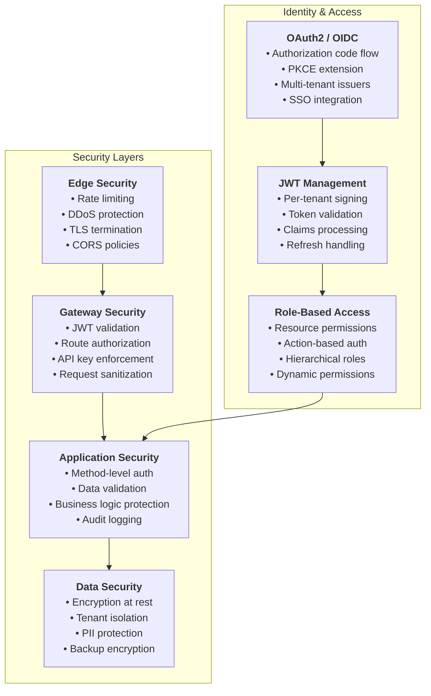
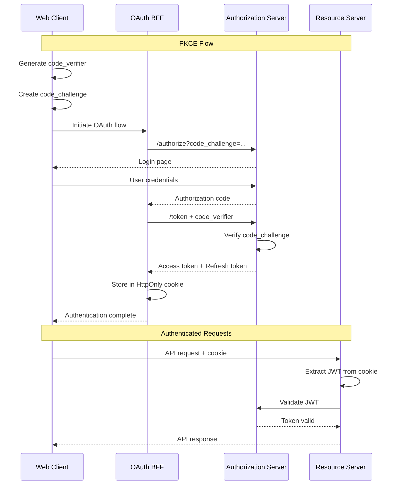

# Security Best Practices

OpenFrame OSS Lib implements enterprise-grade security patterns for multi-tenant MSP platforms. This guide covers authentication, authorization, data protection, and security best practices for developing with and extending the OpenFrame security model.

## Security Architecture Overview

OpenFrame implements a defense-in-depth security strategy:



## Authentication & Authorization

### OAuth2 Implementation

OpenFrame implements OAuth2 with PKCE for secure authentication:

#### Authorization Code Flow with PKCE



#### Multi-Tenant JWT Validation

```java
// Example: Multi-tenant JWT configuration
@Configuration
@EnableWebSecurity
public class SecurityConfig {

    @Bean
    public ReactiveJwtDecoder jwtDecoder() {
        // Multi-issuer JWT decoder with caching
        return new CachingReactiveJwtDecoder(
            new MultiIssuerReactiveJwtDecoder(tenantKeyResolver())
        );
    }

    @Bean
    public TenantKeyResolver tenantKeyResolver() {
        return new DatabaseTenantKeyResolver(tenantRepository);
    }
}

// Example: JWT validation in gateway
@Component
public class JwtAuthenticationFilter implements GlobalFilter {
    
    private final ReactiveJwtDecoder jwtDecoder;
    private final TenantResolver tenantResolver;
    
    @Override
    public Mono<Void> filter(ServerWebExchange exchange, 
                             GatewayFilterChain chain) {
        return extractJwt(exchange)
            .flatMap(jwt -> validateTenantContext(jwt, exchange))
            .flatMap(authContext -> {
                // Add authenticated context to request
                return chain.filter(addAuthContext(exchange, authContext));
            })
            .onErrorResume(JwtValidationException.class, 
                error -> handleAuthError(exchange, error));
    }
}
```

### API Key Authentication

For service-to-service and external API access:

```java
// Example: API Key validation
@Service
@RequiredArgsConstructor
public class ApiKeyValidationService {
    
    private final ApiKeyRepository apiKeyRepository;
    private final RedisTemplate<String, String> redisTemplate;
    
    public Mono<ApiKeyContext> validateApiKey(String keyValue) {
        // Check cache first
        return Mono.fromCallable(() -> 
                redisTemplate.opsForValue().get("apikey:" + keyValue))
            .cast(ApiKeyContext.class)
            .switchIfEmpty(
                // Fallback to database
                apiKeyRepository.findByKeyValue(keyValue)
                    .filter(ApiKey::isActive)
                    .filter(key -> key.getExpiresAt().isAfter(Instant.now()))
                    .map(this::buildContext)
                    .doOnNext(context -> cacheApiKey(keyValue, context))
            );
    }
    
    private void cacheApiKey(String keyValue, ApiKeyContext context) {
        redisTemplate.opsForValue().set(
            "apikey:" + keyValue, 
            context, 
            Duration.ofMinutes(15)
        );
    }
}
```

### Role-Based Access Control (RBAC)

OpenFrame implements fine-grained permissions:

```java
// Example: Method-level security
@RestController
@RequestMapping("/api/devices")
@PreAuthorize("hasRole('USER')")
public class DeviceController {
    
    // Organization admin can manage all devices
    @PostMapping
    @PreAuthorize("hasAuthority('DEVICE:CREATE') and " +
                  "@authorizationService.canAccessOrganization(principal, #request.organizationId)")
    public ResponseEntity<DeviceResponse> createDevice(
            @RequestBody CreateDeviceRequest request,
            AuthPrincipal principal) {
        // Implementation
    }
    
    // Users can only view devices they have access to
    @GetMapping("/{deviceId}")
    @PreAuthorize("@authorizationService.canAccessDevice(principal, #deviceId)")
    public ResponseEntity<DeviceResponse> getDevice(
            @PathVariable String deviceId,
            AuthPrincipal principal) {
        // Implementation
    }
}

// Custom authorization service
@Service
@RequiredArgsConstructor
public class AuthorizationService {
    
    private final DeviceService deviceService;
    private final OrganizationService organizationService;
    
    public boolean canAccessDevice(AuthPrincipal principal, String deviceId) {
        Device device = deviceService.findById(deviceId);
        return canAccessOrganization(principal, device.getOrganizationId());
    }
    
    public boolean canAccessOrganization(AuthPrincipal principal, String orgId) {
        // Check tenant isolation
        if (!principal.getTenantId().equals(findTenantForOrg(orgId))) {
            return false;
        }
        
        // Check user permissions
        return principal.hasPermission("ORGANIZATION:READ") ||
               principal.isMemberOfOrganization(orgId);
    }
}
```

## Data Security & Privacy

### Encryption at Rest

```java
// Example: Field-level encryption for sensitive data
@Document(collection = "users")
public class User {
    
    @Id
    private String id;
    
    private String email; // Not encrypted - needed for queries
    
    @Encrypted
    private String firstName; // Encrypted field
    
    @Encrypted  
    private String lastName;
    
    @Encrypted(algorithm = "AES256")
    private String phoneNumber;
    
    // Automatic tenant isolation
    private String tenantId;
}

// Encryption service implementation
@Service
public class EncryptionService {
    
    private final AESUtil aesUtil;
    private final KeyManagementService keyService;
    
    public String encrypt(String plainText, String tenantId) {
        byte[] key = keyService.getTenantEncryptionKey(tenantId);
        return aesUtil.encrypt(plainText, key);
    }
    
    public String decrypt(String cipherText, String tenantId) {
        byte[] key = keyService.getTenantEncryptionKey(tenantId);
        return aesUtil.decrypt(cipherText, key);
    }
}
```

### Data Masking & PII Protection

```java
// Example: PII data masking for logging and APIs
@Component
public class PIIMaskingService {
    
    private static final Pattern EMAIL_PATTERN = 
        Pattern.compile("([\\w._%+-]+)@([\\w.-]+\\.[A-Z|a-z]{2,})");
    private static final Pattern PHONE_PATTERN = 
        Pattern.compile("\\b\\d{3}-\\d{3}-\\d{4}\\b");
    
    public String maskForLogging(String text) {
        if (text == null) return null;
        
        return text
            .replaceAll(EMAIL_PATTERN.pattern(), "***@$2")
            .replaceAll(PHONE_PATTERN.pattern(), "***-***-****")
            .replaceAll("\\b\\d{4}-\\d{4}-\\d{4}-\\d{4}\\b", "****-****-****-****");
    }
    
    public UserResponse maskUserResponse(User user, AuthPrincipal principal) {
        UserResponse response = userMapper.toResponse(user);
        
        // Only show full details to admins or self
        if (!canViewFullProfile(principal, user)) {
            response.setEmail(maskEmail(user.getEmail()));
            response.setPhoneNumber(null);
        }
        
        return response;
    }
}
```

### Tenant Isolation

OpenFrame enforces strict tenant boundaries:

```java
// Example: Automatic tenant filtering in repositories
@Repository
public interface DeviceRepository extends MongoRepository<Device, String> {
    
    // Tenant context automatically injected
    @Query("{ 'tenantId': ?#{principal.tenantId}, 'organizationId': ?0 }")
    List<Device> findByOrganizationId(String organizationId);
    
    // Custom implementation with tenant validation
    default Device findByIdAndValidateTenant(String id, String tenantId) {
        Device device = findById(id)
            .orElseThrow(() -> new DeviceNotFoundException(id));
            
        if (!device.getTenantId().equals(tenantId)) {
            throw new TenantAccessViolationException(
                "Device " + id + " not accessible to tenant " + tenantId);
        }
        
        return device;
    }
}

// Aspect for automatic tenant validation
@Aspect
@Component
public class TenantValidationAspect {
    
    @Before("execution(* com.openframe..*Repository+.*(..)) && args(entity,..)")
    public void validateTenantOnSave(Object entity) {
        if (entity instanceof TenantAware) {
            TenantAware tenantAware = (TenantAware) entity;
            String currentTenant = SecurityContextHolder.getContext()
                .getAuthentication().getPrincipal().getTenantId();
                
            if (!currentTenant.equals(tenantAware.getTenantId())) {
                throw new TenantAccessViolationException(
                    "Cannot save entity for different tenant");
            }
        }
    }
}
```

## Security Headers & CORS

### Security Headers Configuration

```java
// Example: Comprehensive security headers
@Configuration
public class SecurityHeadersConfig {
    
    @Bean
    public WebSecurityConfigurerAdapter securityConfigurerAdapter() {
        return new WebSecurityConfigurerAdapter() {
            @Override
            protected void configure(HttpSecurity http) throws Exception {
                http
                    .headers(headers -> headers
                        .frameOptions().deny()
                        .contentTypeOptions().and()
                        .httpStrictTransportSecurity(hsts -> hsts
                            .maxAgeInSeconds(31536000)
                            .includeSubdomains(true)
                            .preload(true)
                        )
                        .referrerPolicy(ReferrerPolicy.STRICT_ORIGIN_WHEN_CROSS_ORIGIN)
                        .addHeaderWriter(new StaticHeadersWriter(
                            "X-Content-Type-Options", "nosniff",
                            "X-Frame-Options", "DENY",
                            "X-XSS-Protection", "1; mode=block",
                            "Content-Security-Policy", buildCSP()
                        ))
                    );
            }
        };
    }
    
    private String buildCSP() {
        return "default-src 'self'; " +
               "script-src 'self' 'unsafe-inline'; " +
               "style-src 'self' 'unsafe-inline'; " +
               "img-src 'self' data: https:; " +
               "font-src 'self'; " +
               "connect-src 'self'; " +
               "frame-ancestors 'none';";
    }
}
```

### CORS Configuration

```java
// Example: Tenant-aware CORS configuration
@Configuration
public class CorsConfig {
    
    private final TenantConfigService tenantConfigService;
    
    @Bean
    public CorsConfigurationSource corsConfigurationSource() {
        return new TenantAwareCorsConfigurationSource(tenantConfigService);
    }
}

public class TenantAwareCorsConfigurationSource 
        implements CorsConfigurationSource {
    
    private final TenantConfigService tenantConfigService;
    
    @Override
    public CorsConfiguration getCorsConfiguration(HttpServletRequest request) {
        String tenantId = extractTenantFromRequest(request);
        TenantCorsConfig tenantConfig = tenantConfigService
            .getCorsConfig(tenantId);
            
        CorsConfiguration config = new CorsConfiguration();
        config.setAllowedOrigins(tenantConfig.getAllowedOrigins());
        config.setAllowedMethods(Arrays.asList("GET", "POST", "PUT", "DELETE"));
        config.setAllowedHeaders(Arrays.asList("*"));
        config.setAllowCredentials(true);
        config.setMaxAge(3600L);
        
        return config;
    }
}
```

## Audit Logging & Monitoring

### Security Audit Logging

```java
// Example: Comprehensive audit logging
@EventListener
@Component
@RequiredArgsConstructor
public class SecurityAuditListener {
    
    private final AuditLogService auditLogService;
    
    @EventListener
    public void handleAuthenticationSuccess(AuthenticationSuccessEvent event) {
        AuthPrincipal principal = (AuthPrincipal) event.getAuthentication().getPrincipal();
        
        AuditEvent auditEvent = AuditEvent.builder()
            .eventType(AuditEventType.AUTHENTICATION_SUCCESS)
            .userId(principal.getUserId())
            .tenantId(principal.getTenantId())
            .ipAddress(extractIpAddress(event))
            .userAgent(extractUserAgent(event))
            .timestamp(Instant.now())
            .details(Map.of(
                "authMethod", event.getAuthentication().getClass().getSimpleName(),
                "sessionId", principal.getSessionId()
            ))
            .build();
            
        auditLogService.logEvent(auditEvent);
    }
    
    @EventListener
    public void handleAuthenticationFailure(AuthenticationFailureEvent event) {
        AuditEvent auditEvent = AuditEvent.builder()
            .eventType(AuditEventType.AUTHENTICATION_FAILURE)
            .ipAddress(extractIpAddress(event))
            .userAgent(extractUserAgent(event))
            .timestamp(Instant.now())
            .details(Map.of(
                "reason", event.getException().getMessage(),
                "attemptedUser", event.getAuthentication().getName()
            ))
            .build();
            
        auditLogService.logEvent(auditEvent);
    }
    
    @EventListener 
    public void handleAuthorizationFailure(AuthorizationFailureEvent event) {
        AuditEvent auditEvent = AuditEvent.builder()
            .eventType(AuditEventType.AUTHORIZATION_FAILURE)
            .userId(extractUserId(event))
            .tenantId(extractTenantId(event))
            .resourceId(extractResourceId(event))
            .action(extractAction(event))
            .timestamp(Instant.now())
            .details(Map.of(
                "resource", event.getResource(),
                "requiredPermission", event.getRequiredPermission()
            ))
            .build();
            
        auditLogService.logEvent(auditEvent);
    }
}
```

### Security Monitoring

```java
// Example: Real-time security monitoring
@Component
@RequiredArgsConstructor
public class SecurityMonitoringService {
    
    private final RedisTemplate<String, Object> redisTemplate;
    private final NotificationService notificationService;
    
    @EventListener
    public void monitorFailedAttempts(AuthenticationFailureEvent event) {
        String ipAddress = extractIpAddress(event);
        String key = "failed_attempts:" + ipAddress;
        
        Long attempts = redisTemplate.opsForValue().increment(key, 1);
        redisTemplate.expire(key, Duration.ofMinutes(15));
        
        if (attempts >= 5) {
            // Trigger security alert
            SecurityAlert alert = SecurityAlert.builder()
                .type(SecurityAlertType.BRUTE_FORCE_ATTEMPT)
                .ipAddress(ipAddress)
                .attemptCount(attempts)
                .timeWindow(Duration.ofMinutes(15))
                .build();
                
            notificationService.sendSecurityAlert(alert);
            
            // Consider IP blocking or rate limiting
            blockSuspiciousIp(ipAddress);
        }
    }
    
    @Scheduled(fixedRate = 300000) // Every 5 minutes
    public void detectAnomalousActivity() {
        // Analyze patterns in audit logs
        List<AnomalousActivity> anomalies = analyzeRecentActivity();
        
        anomalies.forEach(anomaly -> {
            SecurityAlert alert = SecurityAlert.builder()
                .type(SecurityAlertType.ANOMALOUS_ACTIVITY)
                .description(anomaly.getDescription())
                .severity(anomaly.getSeverity())
                .affectedUsers(anomaly.getAffectedUsers())
                .build();
                
            notificationService.sendSecurityAlert(alert);
        });
    }
}
```

## Input Validation & Sanitization

### Request Validation

```java
// Example: Comprehensive input validation
@Valid
@RestController
@RequestMapping("/api/organizations")
public class OrganizationController {
    
    @PostMapping
    public ResponseEntity<OrganizationResponse> createOrganization(
            @Valid @RequestBody CreateOrganizationRequest request,
            AuthPrincipal principal) {
        
        // Additional business rule validation
        validateOrganizationCreationRules(request, principal);
        
        Organization organization = organizationService.create(request, principal);
        return ResponseEntity.ok(organizationMapper.toResponse(organization));
    }
}

// Request DTO with comprehensive validation
public class CreateOrganizationRequest {
    
    @NotBlank(message = "Organization name is required")
    @Size(min = 2, max = 100, message = "Name must be between 2 and 100 characters")
    @Pattern(regexp = "^[a-zA-Z0-9\\s\\-_]+$", 
             message = "Name can only contain alphanumeric characters, spaces, hyphens, and underscores")
    private String name;
    
    @Email(message = "Invalid email format")
    @NotBlank(message = "Email is required")
    private String primaryEmail;
    
    @Valid
    private AddressDto address;
    
    @Valid
    private List<@Valid ContactPersonDto> contacts;
    
    // Custom validation
    @ValidDomain
    private String domain;
}

// Custom validator for domain validation
@Constraint(validatedBy = DomainValidator.class)
@Target({ElementType.FIELD})
@Retention(RetentionPolicy.RUNTIME)
public @interface ValidDomain {
    String message() default "Invalid domain format";
    Class<?>[] groups() default {};
    Class<? extends Payload>[] payload() default {};
}

public class DomainValidator implements ConstraintValidator<ValidDomain, String> {
    
    private static final Pattern DOMAIN_PATTERN = 
        Pattern.compile("^[a-zA-Z0-9]([a-zA-Z0-9\\-]{0,61}[a-zA-Z0-9])?\\.[a-zA-Z]{2,}$");
    
    @Override
    public boolean isValid(String domain, ConstraintValidatorContext context) {
        if (domain == null || domain.isBlank()) {
            return false;
        }
        
        return DOMAIN_PATTERN.matcher(domain).matches() &&
               !isBlacklisted(domain) &&
               !containsProfanity(domain);
    }
}
```

### SQL Injection Prevention

```java
// Example: Safe database queries
@Repository
public class CustomDeviceRepositoryImpl implements CustomDeviceRepository {
    
    private final MongoTemplate mongoTemplate;
    
    @Override
    public List<Device> findByDynamicCriteria(DeviceSearchCriteria criteria) {
        Query query = new Query();
        
        // Safe criteria building - no direct string concatenation
        if (criteria.getName() != null) {
            // Use regex with escaped input
            String escapedName = Pattern.quote(criteria.getName());
            query.addCriteria(Criteria.where("name").regex(escapedName, "i"));
        }
        
        if (criteria.getOrganizationIds() != null) {
            // Use parameterized queries
            query.addCriteria(Criteria.where("organizationId")
                .in(criteria.getOrganizationIds()));
        }
        
        if (criteria.getDateRange() != null) {
            query.addCriteria(Criteria.where("lastSeen")
                .gte(criteria.getDateRange().getStart())
                .lte(criteria.getDateRange().getEnd()));
        }
        
        // Always add tenant filtering
        String tenantId = SecurityContextHolder.getContext()
            .getAuthentication().getPrincipal().getTenantId();
        query.addCriteria(Criteria.where("tenantId").is(tenantId));
        
        return mongoTemplate.find(query, Device.class);
    }
}
```

## Secrets Management

### Environment Variables and Secrets

```java
// Example: Secure configuration management
@Configuration
@ConfigurationProperties(prefix = "openframe.security")
@Validated
public class SecurityProperties {
    
    @NotBlank
    @Value("${OPENFRAME_JWT_SECRET:}")
    private String jwtSecret;
    
    @NotBlank
    @Value("${OPENFRAME_ENCRYPTION_KEY:}")
    private String encryptionKey;
    
    @NotNull
    @Value("${OPENFRAME_SESSION_TIMEOUT_MINUTES:60}")
    private Integer sessionTimeoutMinutes;
    
    @Valid
    private OAuth2Properties oauth2 = new OAuth2Properties();
    
    @PostConstruct
    public void validateConfiguration() {
        if (jwtSecret.length() < 32) {
            throw new IllegalStateException(
                "JWT secret must be at least 32 characters long");
        }
        
        if (encryptionKey.length() != 32) {
            throw new IllegalStateException(
                "Encryption key must be exactly 32 characters");
        }
    }
}

// Example: Secure secret rotation
@Service
@RequiredArgsConstructor
public class SecretRotationService {
    
    private final TenantKeyRepository keyRepository;
    private final NotificationService notificationService;
    
    @Scheduled(cron = "0 0 2 * * ?") // Daily at 2 AM
    public void rotateExpiringSigning Keys() {
        List<TenantKey> expiringKeys = keyRepository
            .findKeysExpiringWithin(Duration.ofDays(7));
            
        for (TenantKey key : expiringKeys) {
            rotateSigningKey(key);
        }
    }
    
    private void rotateSigningKey(TenantKey oldKey) {
        // Generate new key pair
        KeyPair newKeyPair = generateRSAKeyPair();
        
        TenantKey newKey = TenantKey.builder()
            .tenantId(oldKey.getTenantId())
            .keyId(UUID.randomUUID().toString())
            .publicKey(encodePublicKey(newKeyPair.getPublic()))
            .privateKey(encodePrivateKey(newKeyPair.getPrivate()))
            .algorithm("RS256")
            .expiresAt(Instant.now().plus(Duration.ofDays(90)))
            .status(KeyStatus.ACTIVE)
            .build();
            
        // Save new key
        keyRepository.save(newKey);
        
        // Mark old key as deprecated (keep for validation)
        oldKey.setStatus(KeyStatus.DEPRECATED);
        oldKey.setDeprecatedAt(Instant.now());
        keyRepository.save(oldKey);
        
        // Notify administrators
        notificationService.notifyKeyRotation(oldKey.getTenantId(), newKey.getKeyId());
    }
}
```

## Security Testing

### Security Test Examples

```java
// Example: Security-focused integration tests
@SpringBootTest
@TestMethodOrder(OrderAnnotation.class)
class SecurityIntegrationTest {
    
    @Test
    @Order(1)
    void shouldRejectUnauthenticatedRequests() {
        given()
            .when()
            .get("/api/devices")
        .then()
            .statusCode(401);
    }
    
    @Test
    @Order(2) 
    void shouldRejectInvalidJWT() {
        given()
            .header("Authorization", "Bearer invalid.jwt.token")
        .when()
            .get("/api/devices")
        .then()
            .statusCode(401);
    }
    
    @Test
    @Order(3)
    void shouldEnforceTenantIsolation() {
        // User from tenant A tries to access tenant B data
        String tenantAToken = generateTokenForTenant("tenant-a");
        String tenantBDeviceId = createDeviceForTenant("tenant-b");
        
        given()
            .header("Authorization", "Bearer " + tenantAToken)
        .when()
            .get("/api/devices/" + tenantBDeviceId)
        .then()
            .statusCode(403)
            .body("message", containsString("access denied"));
    }
    
    @Test
    @Order(4)
    void shouldValidateInputAndPreventInjection() {
        String maliciousInput = "'; DROP TABLE users; --";
        
        given()
            .contentType("application/json")
            .header("Authorization", "Bearer " + validToken)
            .body(Map.of("name", maliciousInput))
        .when()
            .post("/api/organizations")
        .then()
            .statusCode(400)
            .body("violations", hasItem(
                hasEntry("field", "name")));
    }
    
    @Test
    @Order(5)
    void shouldRateLimitAPIRequests() {
        String apiKey = createApiKey();
        
        // Make rapid requests to trigger rate limiting
        for (int i = 0; i < 101; i++) {
            given()
                .header("X-API-Key", apiKey)
            .when()
                .get("/external/api/v1/devices")
            .then()
                .statusCode(i < 100 ? 200 : 429);
        }
    }
}
```

## Common Security Vulnerabilities & Mitigations

### OWASP Top 10 Compliance

| Vulnerability | OpenFrame Mitigation |
|---------------|---------------------|
| **A01: Broken Access Control** | Method-level security, tenant isolation, RBAC |
| **A02: Cryptographic Failures** | TLS, field-level encryption, secure key storage |
| **A03: Injection** | Parameterized queries, input validation, output encoding |
| **A04: Insecure Design** | Threat modeling, security by design, defense in depth |
| **A05: Security Misconfiguration** | Secure defaults, configuration validation, automated checks |
| **A06: Vulnerable Components** | Dependency scanning, regular updates, vulnerability monitoring |
| **A07: Authentication Failures** | Strong authentication, MFA support, session management |
| **A08: Software/Data Integrity** | Code signing, secure CI/CD, integrity verification |
| **A09: Logging/Monitoring Failures** | Comprehensive audit logs, security monitoring, alerting |
| **A10: Server-Side Request Forgery** | URL validation, allow lists, network segmentation |

## Next Steps

Now that you understand OpenFrame security:

1. **[Testing Guide](../testing/README.md)** - Learn security testing approaches
2. **[Contributing Guidelines](../contributing/guidelines.md)** - Security review process
3. **[Local Development](../setup/local-development.md)** - Secure development setup

## Security Resources

- **OWASP Guidelines**: [owasp.org](https://owasp.org/)
- **Spring Security Reference**: [docs.spring.io/spring-security](https://docs.spring.io/spring-security/reference/)
- **JWT Best Practices**: [tools.ietf.org/rfc/rfc8725.txt](https://tools.ietf.org/rfc/rfc8725.txt)

## Community Security

- **Security Questions**: [OpenMSP Community Slack](https://join.slack.com/t/openmsp/shared_invite/zt-36bl7mx0h-3~U2nFH6nqHqoTPXMaHEHA)
- **Vulnerability Reports**: Report security issues through appropriate channels
- **Security Updates**: Stay informed about security patches and updates

---

*Security is everyone's responsibility. When in doubt, choose the more secure approach.*