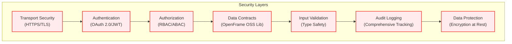

# Security Best Practices

OpenFrame OSS Lib serves as the foundational data contract layer for the OpenFrame platform, making security considerations critical for the entire ecosystem. This guide outlines security best practices for developing, using, and maintaining the library.

## Security Philosophy

OpenFrame OSS Lib follows a **defense-in-depth** approach with security built into the architectural foundations:


```mermaid
flowchart TD
    subgraph "Security Layers"
        Transport["Transport Security<br/>(HTTPS/TLS)"]
        Auth["Authentication<br/>(OAuth 2.0/JWT)"]
        Authz["Authorization<br/>(RBAC/ABAC)"]
        DTOs["Data Contracts<br/>(OpenFrame OSS Lib)"]
        Validation["Input Validation<br/>(Type Safety)"]
        Audit["Audit Logging<br/>(Comprehensive Tracking)"]
        Data["Data Protection<br/>(Encryption at Rest)"]
    end
    
    Transport --> Auth
    Auth --> Authz
    Authz --> DTOs
    DTOs --> Validation
    Validation --> Audit
    Audit --> Data
    
    classDef security fill:#ffebee,stroke:#f44336,stroke-width:2px
    class Transport,Auth,Authz,DTOs,Validation,Audit,Data security
```

## Core Security Principles

### 1. Stateless Data Contracts

OpenFrame OSS Lib DTOs are designed to be **completely stateless** with no embedded security context:

```java
// ✅ Good: Stateless, no security context embedded
@Data
@Builder
public class LogEvent {
    private String id;
    private String summary;
    private String eventType;
    private String organizationId;  // Tenant context only
    private LocalDateTime timestamp;
}

// ❌ Avoid: Embedding security tokens or credentials
@Data 
public class UnsafeLogEvent {
    private String id;
    private String summary;
    private String authToken;      // NEVER embed tokens
    private String apiKey;         // NEVER embed credentials
    private String userPassword;   // NEVER embed passwords
}
```

### 2. Multi-Tenant Data Isolation

All filtering DTOs support **organization-scoped queries** to ensure tenant data isolation:

```java
// Proper tenant isolation in filtering
@Data
@Builder
public class LogFilterCriteria {
    private LocalDate startDate;
    private LocalDate endDate;
    private List<String> organizationIds;  // REQUIRED for multi-tenancy
    private String deviceId;
    
    // Validation ensures organizationIds is never null/empty
    public List<String> getOrganizationIds() {
        return organizationIds != null ? organizationIds : Collections.emptyList();
    }
}
```

### 3. Input Validation Through Type Safety

Leverage Java's type system for input validation:

```java
// Type-safe enums prevent invalid values
public enum LogSeverity {
    INFO, WARN, ERROR, CRITICAL;
    
    // Validation method for external input
    public static LogSeverity fromString(String value) {
        try {
            return LogSeverity.valueOf(value.toUpperCase());
        } catch (IllegalArgumentException e) {
            throw new ValidationException("Invalid severity: " + value);
        }
    }
}

// Usage in DTOs
@Data
@Builder
public class LogEvent {
    private String id;
    private LogSeverity severity;  // Type-safe, validated enum
    private LocalDateTime timestamp;
}
```

## Authentication and Authorization Patterns

### JWT Token Handling

OpenFrame OSS Lib DTOs **never contain authentication tokens**. Authentication is handled at the API Gateway level:

```java
// Correct pattern: Authentication context is separate
@RestController
public class AuditController {
    
    @PostMapping("/audit/logs")
    public CountedGenericQueryResult<LogEvent> getAuditLogs(
        @RequestBody LogFilterCriteria criteria,
        Authentication auth) {  // Spring Security handles auth
        
        // Extract organization context from authenticated user
        String organizationId = SecurityUtils.getCurrentOrganization(auth);
        
        // Enforce organization scoping
        LogFilterCriteria scopedCriteria = criteria.toBuilder()
            .organizationIds(Arrays.asList(organizationId))  // Force tenant isolation
            .build();
            
        return auditService.getFilteredLogs(scopedCriteria);
    }
}
```

### Role-Based Access Control (RBAC)

DTOs support role-based filtering through organization and scope limitations:

```java
// Service layer enforces RBAC
@Service
public class AuditService {
    
    public CountedGenericQueryResult<LogEvent> getFilteredLogs(
        LogFilterCriteria criteria, 
        UserPrincipal user) {
        
        // Enforce role-based access
        LogFilterCriteria enforcedCriteria = enforceRoleBasedAccess(criteria, user);
        
        // Execute query with enforced criteria
        return repository.findFilteredLogs(enforcedCriteria);
    }
    
    private LogFilterCriteria enforceRoleBasedAccess(LogFilterCriteria criteria, UserPrincipal user) {
        return criteria.toBuilder()
            .organizationIds(user.getAccessibleOrganizations())  // Limit to accessible orgs
            .eventTypes(filterByUserRole(criteria.getEventTypes(), user.getRoles()))
            .build();
    }
}
```

## Data Protection and Encryption

### Sensitive Data Handling

OpenFrame OSS Lib DTOs should **never contain sensitive data in plain text**:

```java
// ✅ Good: No sensitive data in DTOs
@Data
@Builder
public class DeviceInfo {
    private String deviceId;
    private String organizationId;
    private String deviceName;
    private String deviceType;
    private LocalDateTime lastSeen;
}

// ❌ Avoid: Sensitive data exposure
@Data
public class UnsafeDeviceInfo {
    private String deviceId;
    private String adminPassword;     // NEVER include passwords
    private String sshPrivateKey;     // NEVER include private keys
    private String databaseUrl;       // NEVER include connection strings
}
```

### Audit Log Security

Audit DTOs must handle potentially sensitive information carefully:

```java
@Data
@Builder
public class LogDetails {
    private String id;
    private String message;           // Pre-sanitized by service layer
    private Map<String, Object> details;  // Filtered map, no sensitive data
    
    // Security: Details map should never contain:
    // - Passwords or credentials
    // - Personal identification numbers  
    // - Credit card or payment information
    // - Authentication tokens
    // - Private keys or certificates
}
```

## Input Validation and Sanitization

### Validation Patterns

Use Bean Validation (JSR-303) annotations for input validation:

```java
@Data
@Builder
public class LogFilterCriteria {
    
    @NotNull(message = "Start date is required")
    @PastOrPresent(message = "Start date cannot be in the future")
    private LocalDate startDate;
    
    @NotNull(message = "End date is required") 
    @Future(message = "End date must be in the future")
    private LocalDate endDate;
    
    @Size(max = 10, message = "Maximum 10 event types allowed")
    @Pattern(regexp = "^[A-Z_]+$", message = "Event types must be uppercase with underscores")
    private List<String> eventTypes;
    
    @Size(min = 1, max = 5, message = "Must specify 1-5 organization IDs")
    @NotEmpty(message = "Organization IDs cannot be empty")
    private List<String> organizationIds;
    
    @AssertTrue(message = "End date must be after start date")
    private boolean isValidDateRange() {
        return endDate == null || startDate == null || endDate.isAfter(startDate);
    }
}
```

### Custom Validation

Implement custom validation for complex business rules:

```java
@Component
public class SecurityValidator {
    
    public void validateLogFilterCriteria(LogFilterCriteria criteria, UserPrincipal user) {
        // Validate organization access
        validateOrganizationAccess(criteria.getOrganizationIds(), user);
        
        // Validate date range limits (prevent excessive queries)
        validateDateRange(criteria.getStartDate(), criteria.getEndDate());
        
        // Validate event type access based on user role
        validateEventTypeAccess(criteria.getEventTypes(), user.getRoles());
    }
    
    private void validateOrganizationAccess(List<String> orgIds, UserPrincipal user) {
        Set<String> accessibleOrgs = user.getAccessibleOrganizations();
        
        for (String orgId : orgIds) {
            if (!accessibleOrgs.contains(orgId)) {
                throw new AccessDeniedException("Access denied to organization: " + orgId);
            }
        }
    }
}
```

## Common Security Vulnerabilities and Mitigations

### 1. Injection Attacks

**Risk**: Malicious input in filter criteria could lead to injection attacks.

**Mitigation**: Use parameterized queries and type-safe DTOs:

```java
// ✅ Safe: Type-safe DTOs prevent injection
@Data
@Builder
public class DeviceFilterCriteria {
    private List<DeviceType> deviceTypes;     // Enum, not string
    private List<DeviceStatus> statuses;      // Enum, not string  
    private LocalDate createdAfter;           // Strongly typed date
}

// Service layer uses parameterized queries
@Repository  
public class DeviceRepository {
    
    public List<Device> findByFilterCriteria(DeviceFilterCriteria criteria) {
        // JPA/Hibernate automatically handles parameterization
        CriteriaBuilder cb = entityManager.getCriteriaBuilder();
        CriteriaQuery<Device> query = cb.createQuery(Device.class);
        // ... safe query construction
    }
}
```

### 2. Data Exposure

**Risk**: Accidentally exposing sensitive data through DTOs.

**Mitigation**: Use `@JsonIgnore` and field-level security:

```java
@Data
@Builder
public class UserAuditEvent {
    private String eventId;
    private String userId;
    private String action;
    
    @JsonIgnore  // Never serialize sensitive fields
    private String internalNotes;
    
    @JsonProperty(access = JsonProperty.Access.WRITE_ONLY)
    private String temporaryData;  // Write-only, never returned
}
```

### 3. Excessive Data Exposure

**Risk**: Returning too much data through pagination.

**Mitigation**: Implement proper pagination limits:

```java
@Component
public class SecurityConfig {
    
    public static final int MAX_PAGE_SIZE = 1000;
    public static final int DEFAULT_PAGE_SIZE = 50;
    public static final int MAX_FILTER_DAYS = 90;
    
    public PageInfo validateAndAdjustPageInfo(PageInfo pageInfo) {
        int size = Math.min(pageInfo.getPageSize(), MAX_PAGE_SIZE);
        
        return PageInfo.builder()
            .pageNumber(Math.max(0, pageInfo.getPageNumber()))
            .pageSize(Math.max(1, size))
            .build();
    }
    
    public LogFilterCriteria enforceSecurityLimits(LogFilterCriteria criteria) {
        LocalDate maxStartDate = LocalDate.now().minusDays(MAX_FILTER_DAYS);
        LocalDate adjustedStartDate = criteria.getStartDate().isBefore(maxStartDate) 
            ? maxStartDate 
            : criteria.getStartDate();
            
        return criteria.toBuilder()
            .startDate(adjustedStartDate)
            .build();
    }
}
```

## Environment Variables and Secrets Management

OpenFrame OSS Lib configuration should **never contain secrets**:

```bash
# ✅ Good: Configuration without secrets
export OPENFRAME_API_BASE_URL=https://api.openframe.ai
export OPENFRAME_LOG_LEVEL=INFO
export OPENFRAME_MAX_PAGE_SIZE=1000

# ❌ Avoid: Secrets in configuration
export OPENFRAME_API_KEY=secret_key_123        # Use secret management
export DATABASE_PASSWORD=admin123              # Use vault systems
export JWT_SECRET=my_secret_key                # Use key management
```

### Secure Configuration Pattern

```java
@Component
@ConfigurationProperties(prefix = "openframe.security")
public class SecurityConfig {
    
    private int maxPageSize = 1000;
    private int maxFilterDays = 90;
    private boolean auditEnabled = true;
    
    // No sensitive configuration here
    // Secrets handled by Spring Cloud Config, Vault, etc.
}
```

## Security Testing and Code Review Guidelines

### Security-Focused Unit Tests

```java
@Test
@DisplayName("Should enforce organization isolation in filter criteria")
void shouldEnforceOrganizationIsolation() {
    // Given
    LogFilterCriteria criteria = LogFilterCriteria.builder()
        .organizationIds(Arrays.asList("org_123", "org_456"))
        .eventTypes(Arrays.asList("AUTHENTICATION"))
        .build();
    
    UserPrincipal user = createUserWithOrganizations(Arrays.asList("org_123"));
    
    // When/Then - should throw exception for unauthorized org access
    assertThrows(AccessDeniedException.class, () -> {
        securityValidator.validateLogFilterCriteria(criteria, user);
    });
}

@Test
@DisplayName("Should prevent excessive date ranges")
void shouldPreventExcessiveDateRanges() {
    // Given - 1 year range (excessive)
    LogFilterCriteria criteria = LogFilterCriteria.builder()
        .startDate(LocalDate.now().minusYears(1))
        .endDate(LocalDate.now())
        .organizationIds(Arrays.asList("org_123"))
        .build();
    
    // When/Then - should be limited to max allowed days
    LogFilterCriteria enforced = securityConfig.enforceSecurityLimits(criteria);
    
    long daysBetween = ChronoUnit.DAYS.between(enforced.getStartDate(), enforced.getEndDate());
    assertThat(daysBetween).isLessThanOrEqualTo(SecurityConfig.MAX_FILTER_DAYS);
}
```

### Code Review Security Checklist

When reviewing DTOs and related code:

- [ ] **No Sensitive Data**: DTOs contain no passwords, tokens, or credentials
- [ ] **Organization Scoping**: All filter criteria include organization context
- [ ] **Input Validation**: Proper validation annotations and custom validation
- [ ] **Type Safety**: Use enums and typed fields instead of free-form strings  
- [ ] **Size Limits**: Pagination and filtering have reasonable upper bounds
- [ ] **Audit Compliance**: Security-relevant actions are auditable
- [ ] **Error Handling**: Error messages don't leak sensitive information
- [ ] **Serialization Security**: `@JsonIgnore` used for sensitive fields

## Audit Logging for Security

### Comprehensive Audit Events

Use OpenFrame's audit DTOs for security monitoring:

```java
@Service
public class SecurityAuditService {
    
    public void logSecurityEvent(SecurityEvent event, UserPrincipal user) {
        LogEvent auditEvent = LogEvent.builder()
            .id(UUID.randomUUID().toString())
            .eventType("SECURITY")
            .severity(mapToLogSeverity(event.getSeverity()))
            .summary(event.getDescription())
            .userId(user.getId())
            .organizationId(user.getOrganizationId())
            .timestamp(LocalDateTime.now())
            .build();
            
        auditRepository.save(auditEvent);
    }
    
    // Security events to audit
    public void logUnauthorizedAccess(String resource, UserPrincipal user) {
        SecurityEvent event = SecurityEvent.builder()
            .type(SecurityEventType.UNAUTHORIZED_ACCESS)
            .severity(SecuritySeverity.HIGH)
            .description("Unauthorized access attempt to: " + resource)
            .build();
            
        logSecurityEvent(event, user);
    }
    
    public void logExcessiveDataRequest(LogFilterCriteria criteria, UserPrincipal user) {
        SecurityEvent event = SecurityEvent.builder()
            .type(SecurityEventType.EXCESSIVE_DATA_REQUEST)
            .severity(SecuritySeverity.MEDIUM)
            .description("Excessive data range requested: " + criteria.getDateRange())
            .build();
            
        logSecurityEvent(event, user);
    }
}
```

## Security Monitoring and Alerting

### Key Security Metrics

Monitor these security-related metrics:

```java
@Component
public class SecurityMetrics {
    
    private final Counter unauthorizedAccessAttempts = Counter.build()
        .name("openframe_unauthorized_access_total")
        .help("Total unauthorized access attempts")
        .labelNames("organization_id", "resource")
        .register();
        
    private final Counter excessiveDataRequests = Counter.build()
        .name("openframe_excessive_data_requests_total") 
        .help("Total excessive data requests")
        .labelNames("organization_id", "user_id")
        .register();
        
    private final Histogram filterQueryDuration = Histogram.build()
        .name("openframe_filter_query_duration_seconds")
        .help("Duration of filter queries")
        .labelNames("organization_id", "filter_type")
        .register();
}
```

### Alerting Rules

Set up alerts for security events:

- **Unauthorized Access**: > 10 attempts per user per hour
- **Excessive Data Requests**: > 5 large range requests per user per day
- **Failed Validation**: > 100 validation failures per organization per hour
- **Unusual Query Patterns**: Queries outside normal business hours

## Compliance Considerations

### Data Protection (GDPR, CCPA)

OpenFrame OSS Lib supports compliance requirements:

```java
@Data
@Builder
public class PersonalDataAuditEvent {
    private String eventId;
    private String dataSubjectId;         // User whose data was accessed
    private String accessorId;            // Who accessed the data
    private String purposeOfProcessing;    // Why data was accessed
    private LocalDateTime timestamp;
    private String organizationId;
    
    // Support for data retention policies
    private LocalDateTime retentionExpiryDate;
    private boolean containsPersonalData;
}
```

### SOC 2 Compliance

Security controls supported by the library:

- **Access Control**: Organization-scoped filtering ensures proper access controls
- **Audit Logging**: Comprehensive audit trail for all data access
- **Data Encryption**: JSON serialization supports field-level encryption
- **Monitoring**: Built-in metrics and logging for security monitoring

## Summary

Security in OpenFrame OSS Lib is achieved through:

1. **Stateless Design**: No embedded security context in DTOs
2. **Multi-Tenant Isolation**: Organization-scoped filtering and validation
3. **Type Safety**: Input validation through Java's type system
4. **Audit Trail**: Comprehensive security event logging
5. **Access Controls**: Role-based filtering and authorization support
6. **Data Protection**: No sensitive data in plain text DTOs

By following these security best practices, you ensure that OpenFrame OSS Lib maintains the highest security standards while providing the flexibility needed for a modern MSP platform.

---

*Security is not optional in MSP platforms. OpenFrame OSS Lib's security-first design ensures that every data contract supports the robust security requirements of enterprise IT service management.*