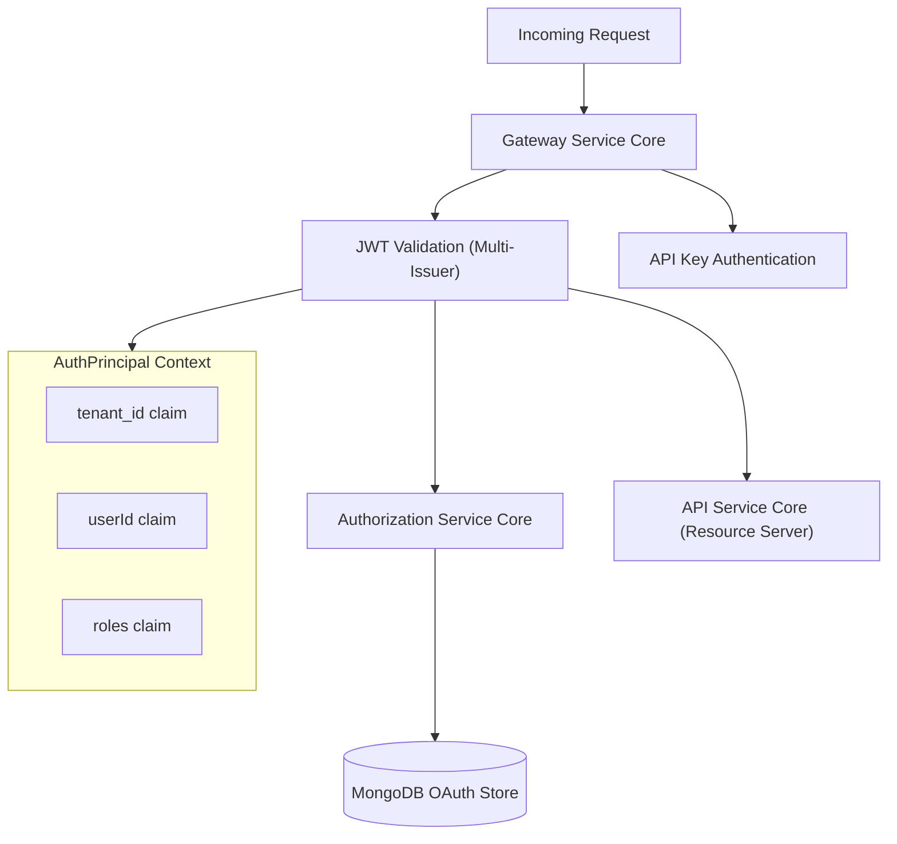
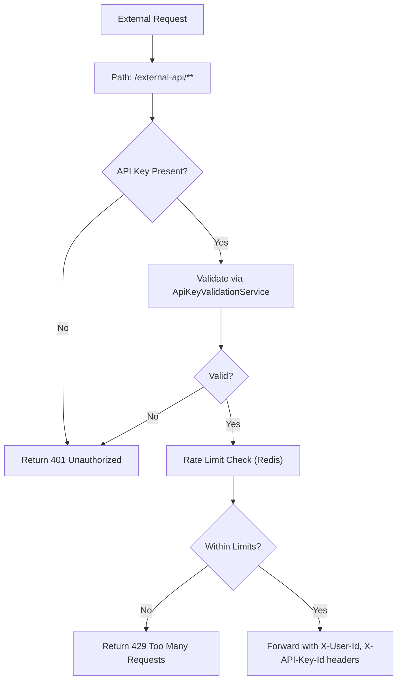

# Security Best Practices

This guide covers the security architecture patterns used throughout OpenFrame OSS Lib, best practices for contributors, and guidance on secrets management.

---

## Authentication and Authorization Architecture

OpenFrame uses a layered security model spanning three modules:


```mermaid
flowchart TD
    Request["Incoming Request"] --> GW["Gateway Service Core"]
    GW --> JWTValidation["JWT Validation (Multi-Issuer)"]
    GW --> APIKeyAuth["API Key Authentication"]

    JWTValidation --> AuthzServer["Authorization Service Core"]
    AuthzServer --> MongoDB[("MongoDB OAuth Store")]

    JWTValidation --> ResourceServer["API Service Core (Resource Server)"]

    subgraph principal["AuthPrincipal Context"]
        TenantId["tenant_id claim"]
        UserId["userId claim"]
        Roles["roles claim"]
    end

    JWTValidation --> principal
```

### JWT Token Structure

All JWT tokens issued by the Authorization Service Core contain:

```text
{
  "sub": "user@example.com",
  "tenant_id": "<tenant-identifier>",
  "userId": "<mongodb-object-id>",
  "roles": ["ADMIN"],
  "iat": 1700000000,
  "exp": 1700003600
}
```

The `tenant_id` claim enforces tenant isolation at the gateway and service levels. **Never trust a tenant ID from a request body or query parameter** — always resolve it from the validated JWT.

---

### Multi-Issuer JWT Validation

The gateway uses `JwtIssuerReactiveAuthenticationManagerResolver` with:

- Per-issuer caching via Caffeine (expire-after-write + refresh-after-write)
- Strict issuer URL validation via `IssuerUrlProvider`
- Authorities combining both `roles` and `scopes` claims

This design ensures that JWT managers are not created per request, avoiding DoS via issuer flooding.

---

### Role-Based Path Authorization

Path security rules enforced in `GatewaySecurityConfig`:

| Path Pattern | Required Role |
|---|---|
| `/api/**` | `ADMIN` |
| `/tools/agent/**` | `AGENT` |
| `/ws/tools/agent/**` | `AGENT` |
| `/tools/**` | `ADMIN` |
| `/clients/**` | `AGENT` |
| `/external-api/**` | API Key (validated separately) |

These are enforced reactively in `SecurityWebFilterChain` — no request reaches the upstream service without passing these checks.

---

### API Key Authentication

External API requests use `X-API-Key` header authentication:


```mermaid
flowchart TD
    ExternalRequest["External Request"] --> PathCheck["Path: /external-api/**"]
    PathCheck --> KeyPresent{"API Key Present?"}
    KeyPresent -->|"No"| Return401["Return 401 Unauthorized"]
    KeyPresent -->|"Yes"| Validate["Validate via ApiKeyValidationService"]
    Validate --> Valid{"Valid?"}
    Valid -->|"No"| Return401
    Valid -->|"Yes"| RateCheck["Rate Limit Check (Redis)"]
    RateCheck --> Allowed{"Within Limits?"}
    Allowed -->|"No"| Return429["Return 429 Too Many Requests"]
    Allowed -->|"Yes"| Forward["Forward with X-User-Id, X-API-Key-Id headers"]
```

API keys are stored hashed in MongoDB and validated on every request. Rate limiting is enforced per API key with minute/hour/day windows using Redis.

---

## Tenant Isolation Patterns

### TenantContext (ThreadLocal)

Tenant context is stored in a `ThreadLocal` and set by `TenantContextFilter` early in the filter chain. All downstream operations inherit this context:

```java
// Accessing tenant in any service
String tenantId = TenantContext.getTenantId();
```

### TenantAwareMongoTemplate

All MongoDB operations go through `TenantAwareMongoTemplate`, which automatically injects `tenantId` into every query:

```java
// You write:
repository.findByMachineId(machineId);

// The template adds:
// { "machineId": "...", "tenantId": "current-tenant-id" }
```

> **Warning:** Never use raw `MongoTemplate` for tenant-scoped data. Always use `TenantAwareMongoTemplate` or `TenantAwareRepository`.

---

## Data Encryption

The `openframe-core-crypto` module provides the platform's encryption service:

```java
@Service
public class EncryptionService {
    String encrypt(String plaintext);
    String decrypt(String ciphertext);
}
```

Use this service for:
- Storing tool credentials (API keys, passwords)
- Encrypting sensitive configuration values
- Persisting OAuth client secrets

**Never store sensitive values as plaintext in MongoDB.**

---

## Input Validation

### Bean Validation (Jakarta)

Use Jakarta Bean Validation annotations on all DTO inputs:

```java
@Data
public class CreateOrganizationRequest {
    @NotBlank
    private String name;

    @ValidEmail
    private String email;

    @TenantDomain
    private String domain;
}
```

Custom validators are provided in `openframe-core`:
- `@ValidEmail` — validates email format and disposable domain policy
- `@TenantDomain` — validates tenant subdomain format

### GraphQL Input Validation

For GraphQL mutations, validate at the data fetcher level using `@InputArgument` and Bean Validation. Errors are translated to `MutationError` payloads before reaching the client.

---

## Common Security Vulnerabilities and Mitigations

| Vulnerability | Mitigation |
|---|---|
| **Tenant data leakage** | `TenantAwareMongoTemplate` injects `tenantId` on all queries |
| **JWT forgery** | All JWTs verified using RSA keys from `TenantKeyService` |
| **Brute-force on API keys** | Per-key rate limiting in Redis; constant-time comparison |
| **CSRF** | Stateless JWTs; no session cookies for API consumers |
| **Stored XSS** | Output encoding at the API layer; no raw HTML persisted |
| **Secret exposure** | Credentials encrypted via `EncryptionService` before MongoDB persist |
| **Injection** | Spring Data MongoDB uses parameterized queries by default |
| **Replay attacks** | Short-lived JWT access tokens + refresh token rotation |
| **Open redirect** | `Redirects` utility class with allowlist validation in authorization flows |

---

## Secrets Management

### What Belongs in Environment Variables

These values **must never** appear in source code or configuration files committed to version control:

- MongoDB connection URIs
- NATS connection credentials
- Kafka bootstrap server credentials
- JWT signing keys
- API keys and client secrets
- Email provider credentials
- Google Firebase (FCM) credentials

### Environment Variable Pattern

Use Spring's externalized configuration. Load secrets from environment variables:

```yaml
spring:
  data:
    mongodb:
      uri: ${MONGODB_URI}
```

```bash
# At runtime — never hardcode these values
export MONGODB_URI="mongodb+srv://..."
```

### GitHub Secrets for CI/CD

Repository secrets for CI/CD are managed via GitHub Actions secrets. Never print secret values in logs:

```yaml
# In GitHub Actions:
env:
  GITHUB_TOKEN: ${{ secrets.GITHUB_TOKEN }}
```

---

## PKI and Key Management

The authorization service uses RSA key pairs for JWT signing:

- Keys are generated via `AuthenticationKeyPairGenerator`
- Stored per-tenant in MongoDB via `TenantKeyService`
- Loaded at startup via `TenantKeyRepository`

> **Never commit RSA private keys to the repository.** Keys should be generated and stored in a secure secrets manager or database with appropriate access controls.

PKCE (Proof Key for Code Exchange) utilities are in `openframe-security-core`:

```java
PKCEUtils.generateCodeVerifier();
PKCEUtils.generateCodeChallenge(codeVerifier);
```

---

## Security Testing and Code Review Guidelines

### Before Submitting a PR

- [ ] No secrets or credentials in code or config files
- [ ] All HTTP inputs are validated via Bean Validation
- [ ] New MongoDB repositories extend `TenantAwareRepository`
- [ ] Sensitive fields are encrypted via `EncryptionService`
- [ ] New API endpoints have role-based authorization rules in `GatewaySecurityConfig`
- [ ] Tests cover both authenticated and unauthenticated scenarios

### Security-Relevant Test Patterns

```java
// Test tenant isolation
@Test
void shouldNotReturnDataFromOtherTenant() {
    // Set up data in tenant A
    // Query as tenant B
    // Assert empty result
}

// Test authentication enforcement
@Test
void shouldReturn401WithoutToken() {
    mockMvc.perform(get("/api/devices"))
        .andExpect(status().isUnauthorized());
}
```

---

## Reporting Security Issues

For security vulnerabilities, **do not open a public GitHub issue**. Contact the maintainers via the **OpenMSP Slack community** with a private message:

https://join.slack.com/t/openmsp/shared_invite/zt-36bl7mx0h-3~U2nFH6nqHqoTPXMaHEHA
