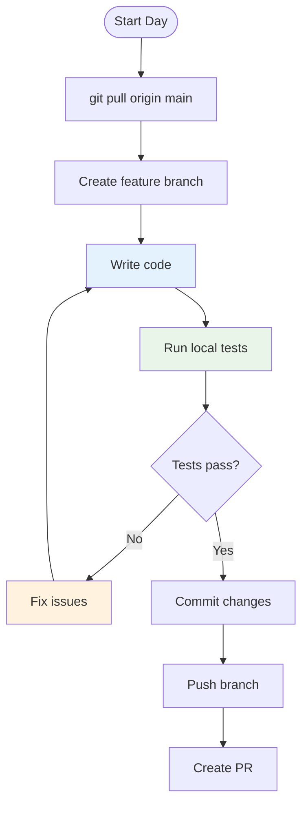

# Local Development Setup

This guide walks you through cloning, building, and running the OpenFrame OSS Library locally for development. Follow these steps to get a fully functional development environment.

## Prerequisites

Before starting, ensure you have completed the [Environment Setup](environment.md):

- ✅ Java JDK 8+ installed
- ✅ Maven 3.6+ or Gradle 6.0+ installed  
- ✅ Git configured with SSH keys
- ✅ IDE configured with Lombok plugin

## Repository Setup

### 1. Clone the Repository

```bash
# Clone the repository
git clone git@github.com:openframe/openframe-oss-lib.git
cd openframe-oss-lib

# Or using HTTPS
git clone https://github.com/openframe/openframe-oss-lib.git
cd openframe-oss-lib
```

### 2. Verify Repository Structure

```bash
# Check the project structure
tree -L 3
```

Expected structure:
```text
openframe-oss-lib/
├── src/
│   └── main/
│       └── java/
│           └── com/openframe/api/dto/
├── docs/
│   ├── getting-started/
│   ├── development/
│   └── reference/
├── pom.xml
├── README.md
└── .gitignore
```

### 3. Configure Git Hooks (Optional)

Set up pre-commit hooks for code quality:

```bash
# Create hooks directory
mkdir -p .git/hooks

# Create pre-commit hook
cat > .git/hooks/pre-commit << 'EOF'
#!/bin/bash
echo "Running pre-commit checks..."

# Run tests
mvn test -q
if [ $? -ne 0 ]; then
    echo "Tests failed. Commit aborted."
    exit 1
fi

# Run checkstyle
mvn checkstyle:check -q
if [ $? -ne 0 ]; then
    echo "Checkstyle violations found. Commit aborted."
    exit 1
fi

echo "Pre-commit checks passed."
EOF

# Make executable
chmod +x .git/hooks/pre-commit
```

## Building the Project

### Using Maven

#### Initial Build

```bash
# Clean and compile
mvn clean compile

# Run tests
mvn test

# Package the library
mvn package
```

#### Development Build Commands

```bash
# Quick compilation (skip tests)
mvn compile -DskipTests

# Full build with all checks
mvn clean verify

# Install to local repository
mvn clean install

# Generate sources and javadoc
mvn clean compile javadoc:javadoc source:jar
```

### Using Gradle (Alternative)

If your project uses Gradle:

```bash
# Build the project
./gradlew build

# Run tests
./gradlew test

# Skip tests
./gradlew build -x test

# Clean build
./gradlew clean build
```

## Running Locally

### 1. Running Tests

```bash
# Run all tests
mvn test

# Run specific test class
mvn test -Dtest=LogEventTest

# Run tests with specific pattern
mvn test -Dtest="*Test"

# Run tests with coverage
mvn test jacoco:report
```

### 2. Interactive Development

Create a simple test class for interactive development:

```java
// Create: src/test/java/com/openframe/api/dto/ManualTest.java
package com.openframe.api.dto;

import com.openframe.api.dto.audit.LogEvent;
import com.openframe.api.dto.audit.LogDetails;
import com.openframe.api.dto.device.DeviceFilterOption;
import java.time.Instant;

public class ManualTest {
    public static void main(String[] args) {
        System.out.println("=== OpenFrame OSS Library Manual Testing ===");
        
        // Test LogEvent creation
        testLogEvent();
        
        // Test LogDetails creation
        testLogDetails();
        
        // Test DeviceFilterOption
        testDeviceFilterOption();
        
        System.out.println("All manual tests completed successfully!");
    }
    
    private static void testLogEvent() {
        LogEvent event = LogEvent.builder()
            .toolEventId("evt_test_001")
            .eventType("MANUAL_TEST")
            .ingestDay("2024-01-15")
            .toolType("DEVELOPMENT")
            .severity("INFO")
            .userId("dev_user")
            .deviceId("dev_machine")
            .hostname("localhost")
            .organizationId("dev_org")
            .organizationName("Development")
            .summary("Manual test event")
            .timestamp(Instant.now())
            .build();
            
        System.out.println("LogEvent created: " + event.getToolEventId());
        System.out.println("  Type: " + event.getEventType());
        System.out.println("  Summary: " + event.getSummary());
    }
    
    private static void testLogDetails() {
        LogDetails details = LogDetails.builder()
            .toolEventId("det_test_001")
            .eventType("MANUAL_TEST")
            .ingestDay("2024-01-15")
            .toolType("DEVELOPMENT")
            .severity("INFO")
            .userId("dev_user")
            .deviceId("dev_machine")
            .hostname("localhost")
            .organizationId("dev_org")
            .organizationName("Development")
            .summary("Manual test details")
            .timestamp(Instant.now())
            .message("Detailed message for manual test")
            .detail("Additional context and metadata")
            .build();
            
        System.out.println("LogDetails created: " + details.getToolEventId());
        System.out.println("  Message: " + details.getMessage());
        System.out.println("  Detail: " + details.getDetail());
    }
    
    private static void testDeviceFilterOption() {
        DeviceFilterOption option = DeviceFilterOption.builder()
            .value("TEST_DEVICE")
            .label("Test Device Type")
            .count(1)
            .build();
            
        System.out.println("DeviceFilterOption created: " + option.getValue());
        System.out.println("  Label: " + option.getLabel());
        System.out.println("  Count: " + option.getCount());
    }
}
```

Run the manual test:

```bash
# Compile and run
mvn compile exec:java -Dexec.mainClass="com.openframe.api.dto.ManualTest"
```

### 3. Hot Reload Development

For faster development cycles, set up file watching:

**Using Maven with spring-boot-devtools (if applicable):**

```bash
# Run in development mode
mvn spring-boot:run

# In another terminal, make changes and recompile
mvn compile
```

**Using Maven with automatic compilation:**

```bash
# Terminal 1: Watch for changes
mvn compile -Ddev.watch=true

# Terminal 2: Run your tests
mvn test -Dtest=ManualTest
```

**Using IDE auto-compilation:**
- In IntelliJ IDEA: Enable "Build project automatically" in Settings
- In Eclipse: Auto-build is enabled by default
- In VS Code: Use "Java: Watch Mode" extension

## Debug Configuration

### IDE Debug Setup

#### IntelliJ IDEA

1. **Create Debug Configuration:**
   - Go to `Run` → `Edit Configurations`
   - Click `+` → `Application`
   - Set Main class: `com.openframe.api.dto.ManualTest`
   - Set Working directory: project root
   - Set JVM options: `-Xmx1G -ea`

2. **Remote Debug Configuration:**
   - Click `+` → `Remote JVM Debug`
   - Set Host: `localhost`
   - Set Port: `5005`

#### Eclipse

1. **Debug Configuration:**
   - Right-click project → `Debug As` → `Java Application`
   - Select main class: `ManualTest`

2. **Remote Debug:**
   - `Debug` → `Debug Configurations` → `Remote Java Application`
   - Set Connection Type: `Standard (Socket Attach)`
   - Host: `localhost`, Port: `5005`

#### VS Code

Create `.vscode/launch.json`:

```json
{
    "version": "0.2.0",
    "configurations": [
        {
            "type": "java",
            "name": "Debug ManualTest",
            "request": "launch",
            "mainClass": "com.openframe.api.dto.ManualTest",
            "projectName": "openframe-oss-lib"
        },
        {
            "type": "java",
            "name": "Attach to Remote",
            "request": "attach",
            "hostName": "localhost",
            "port": 5005
        }
    ]
}
```

### Command Line Debugging

```bash
# Run with debug port open
mvn exec:java -Dexec.mainClass="com.openframe.api.dto.ManualTest" \
  -Dexec.args="-agentlib:jdwp=transport=dt_socket,server=y,suspend=y,address=5005"

# Run tests with debugging
mvn test -Dmaven.surefire.debug="-agentlib:jdwp=transport=dt_socket,server=y,suspend=y,address=5005"
```

## Development Workflow

### Daily Development Cycle



#### Step-by-Step Workflow

```bash
# 1. Start with latest changes
git checkout main
git pull origin main

# 2. Create feature branch
git checkout -b feature/add-new-filter-option

# 3. Make changes and test locally
# ... edit code ...
mvn test

# 4. Commit when ready
git add .
git commit -m "feat: add new device filter option for OS type"

# 5. Push and create PR
git push -u origin feature/add-new-filter-option
# Create PR in GitHub/GitLab
```

### Continuous Development Commands

Keep these commands handy for rapid development:

```bash
# Quick test cycle
alias qt="mvn test -DforkCount=1 -DreuseForks=false"

# Quick compile
alias qc="mvn compile -DskipTests"

# Full build check
alias fb="mvn clean verify"

# Install to local repo
alias install-local="mvn clean install -DskipTests"
```

## Troubleshooting Local Development

### Common Build Issues

#### Issue: "Package does not exist" compilation errors

**Solution:**
```bash
# Clean and rebuild
mvn clean compile

# Check dependencies
mvn dependency:tree

# Force update
mvn clean compile -U
```

#### Issue: Lombok-generated code not found

**Solution:**
```bash
# Verify Lombok in dependencies
mvn dependency:tree | grep lombok

# Rebuild with annotation processing
mvn clean compile -Dcompiler.proc.enabled=true

# Check IDE annotation processing is enabled
```

#### Issue: Tests failing locally

**Solution:**
```bash
# Run tests with verbose output
mvn test -X

# Run specific failing test
mvn test -Dtest=FailingTestClass -X

# Check test resources
ls -la src/test/resources/
```

#### Issue: OutOfMemoryError during build

**Solution:**
```bash
# Increase Maven memory
export MAVEN_OPTS="-Xmx2g -XX:MaxPermSize=512m"

# Or set in .mvn/maven.config
echo "-Xmx2g -XX:MaxPermSize=512m" > .mvn/maven.config
```

### Performance Issues

#### Slow Build Times

**Solution:**
```bash
# Use parallel builds
mvn -T 1C clean compile

# Skip non-essential plugins during development
mvn compile -Dcheckstyle.skip=true -Dspotbugs.skip=true

# Use incremental compilation
mvn compile -Dincremental=true
```

#### IDE Performance

**IntelliJ IDEA optimization:**
```text
# Edit idea.vmoptions
-Xmx4g
-XX:ReservedCodeCacheSize=1024m
-XX:+UseG1GC
```

### Development Database (if applicable)

If the project requires a database for testing:

```bash
# Start test database (Docker example)
docker run -d --name openframe-test-db \
  -p 5432:5432 \
  -e POSTGRES_PASSWORD=testpass \
  -e POSTGRES_DB=openframe_test \
  postgres:13

# Run tests with database
mvn test -Dspring.profiles.active=test
```

## Advanced Development Tips

### Code Generation and Scaffolding

Create templates for common patterns:

```bash
# Create new DTO template script
cat > scripts/create-dto.sh << 'EOF'
#!/bin/bash
if [ $# -ne 2 ]; then
    echo "Usage: $0 <package> <ClassName>"
    exit 1
fi

PACKAGE=$1
CLASS_NAME=$2
PACKAGE_PATH=$(echo $PACKAGE | tr '.' '/')

mkdir -p src/main/java/com/openframe/api/dto/$PACKAGE_PATH

cat > src/main/java/com/openframe/api/dto/$PACKAGE_PATH/${CLASS_NAME}.java << JAVA_EOF
package com.openframe.api.dto.$PACKAGE;

import lombok.AllArgsConstructor;
import lombok.Builder;
import lombok.Data;
import lombok.NoArgsConstructor;

@Data
@Builder
@NoArgsConstructor
@AllArgsConstructor
public class $CLASS_NAME {
    // Add fields here
}
JAVA_EOF

echo "Created DTO: $CLASS_NAME in package $PACKAGE"
EOF

chmod +x scripts/create-dto.sh

# Usage example
./scripts/create-dto.sh device DeviceStatus
```

### Testing Utilities

Create utilities for common testing patterns:

```java
// src/test/java/com/openframe/api/dto/TestDataFactory.java
package com.openframe.api.dto;

import com.openframe.api.dto.audit.LogEvent;
import java.time.Instant;

public class TestDataFactory {
    
    public static LogEvent.LogEventBuilder defaultLogEvent() {
        return LogEvent.builder()
            .toolEventId("test_event_" + System.currentTimeMillis())
            .eventType("TEST_EVENT")
            .ingestDay("2024-01-15")
            .toolType("TEST")
            .severity("INFO")
            .userId("test_user")
            .deviceId("test_device")
            .hostname("test_host")
            .organizationId("test_org")
            .organizationName("Test Organization")
            .summary("Test event summary")
            .timestamp(Instant.now());
    }
}
```

## Next Steps

With your local development environment ready:

1. ✅ **Environment is working** - You can build and test locally
2. 🏗️ **[Explore architecture](../architecture/overview.md)** - Understand how components work together  
3. 🧪 **[Learn testing patterns](../testing/overview.md)** - Write better tests
4. 🤝 **[Read contributing guidelines](../contributing/guidelines.md)** - Follow project standards

---

**Ready to Code?** Your local development environment is now fully configured. Start exploring the codebase and making your first contribution!