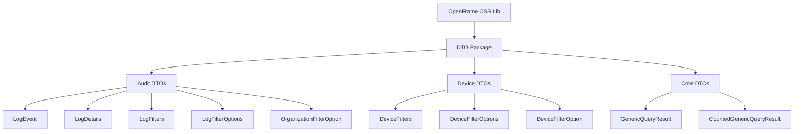

# Local Development Setup

This guide walks you through cloning, building, and running the OpenFrame OSS Library locally for development. By the end, you'll have a fully functional development environment ready for contribution.

## 🎯 Overview

Setting up local development involves:
1. [Cloning the repository](#-repository-setup)
2. [Building the project](#-build-process)
3. [Running tests](#-testing-setup)
4. [IDE integration](#️-ide-integration)
5. [Development workflow](#-development-workflow)

## 📂 Repository Setup

### Clone the Repository

```bash
# Clone the main repository
git clone https://github.com/openframe/openframe-oss-lib.git
cd openframe-oss-lib

# Optional: Clone your fork (if contributing)
git clone https://github.com/YOUR_USERNAME/openframe-oss-lib.git
cd openframe-oss-lib
git remote add upstream https://github.com/openframe/openframe-oss-lib.git
```

### Repository Structure

Once cloned, explore the project structure:

```
openframe-oss-lib/
├── src/
│   ├── main/
│   │   └── java/
│   │       └── com/
│   │           └── openframe/
│   │               └── api/
│   │                   └── dto/
│   │                       ├── audit/          # Audit log DTOs
│   │                       ├── device/         # Device filter DTOs
│   │                       ├── CountedGenericQueryResult.java
│   │                       └── GenericQueryResult.java
│   └── test/
│       └── java/                               # Unit tests
├── docs/                                       # Documentation
├── pom.xml                                     # Maven configuration
├── README.md                                   # Project readme
└── .gitignore                                  # Git ignore rules
```

### Understanding the Codebase



## 🔨 Build Process

### Initial Build

Run these commands to ensure everything works:

```bash
# Clean and compile
mvn clean compile

# Expected output:
# [INFO] Scanning for projects...
# [INFO] 
# [INFO] --< com.openframe:openframe-oss-lib >--
# [INFO] Building OpenFrame OSS Library 1.0.0
# [INFO] --------------------------------[ jar ]---------------------------------
# [INFO] 
# [INFO] --- maven-clean-plugin:3.2.0:clean (default-clean) @ openframe-oss-lib ---
# [INFO] --- maven-resources-plugin:3.3.0:resources (default-resources) @ openframe-oss-lib ---
# [INFO] --- maven-compiler-plugin:3.10.1:compile (default-compile) @ openframe-oss-lib ---
# [INFO] Changes detected - recompiling the module!
# [INFO] Compiling X source files to /path/to/openframe-oss-lib/target/classes
# [INFO] BUILD SUCCESS
```

### Build Commands Reference

| Command | Purpose | When to Use |
|---------|---------|-------------|
| `mvn clean` | Remove build artifacts | Start fresh |
| `mvn compile` | Compile source code | Check syntax |
| `mvn test` | Run unit tests | Verify functionality |
| `mvn package` | Create JAR file | Test packaging |
| `mvn install` | Install to local repository | Use in other projects |
| `mvn clean install` | Full clean build | Complete verification |

### Build Profiles

The project may have different build profiles:

```bash
# Development profile (default)
mvn clean install

# Release profile (if available)
mvn clean install -Prelease

# Skip tests for faster builds (development only)
mvn clean install -DskipTests
```

## 🧪 Testing Setup

### Run All Tests

```bash
# Run complete test suite
mvn test

# Run with verbose output
mvn test -X

# Run specific test class
mvn test -Dtest=LogEventTest

# Run tests with coverage
mvn test jacoco:report
```

### Test Structure

Understanding the test organization:

```
src/test/java/
└── com/
    └── openframe/
        └── api/
            └── dto/
                ├── audit/
                │   ├── LogEventTest.java
                │   ├── LogDetailsTest.java
                │   └── LogFiltersTest.java
                ├── device/
                │   ├── DeviceFiltersTest.java
                │   └── DeviceFilterOptionTest.java
                └── GenericQueryResultTest.java
```

### Writing Your First Test

Create a simple test to verify your setup:

```java
package com.openframe.api.dto.audit;

import org.junit.jupiter.api.Test;
import static org.junit.jupiter.api.Assertions.*;

import java.time.Instant;

class QuickSetupTest {
    
    @Test
    void testLogEventCreation() {
        // Arrange & Act
        LogEvent event = LogEvent.builder()
            .toolEventId("test-event-001")
            .eventType("SETUP_TEST")
            .severity("INFO")
            .timestamp(Instant.now())
            .build();
        
        // Assert
        assertNotNull(event);
        assertEquals("test-event-001", event.getToolEventId());
        assertEquals("SETUP_TEST", event.getEventType());
        assertEquals("INFO", event.getSeverity());
        assertNotNull(event.getTimestamp());
    }
    
    @Test
    void testDeviceFiltersCreation() {
        // Arrange & Act
        DeviceFilters filters = DeviceFilters.builder()
            .statuses(Arrays.asList("ACTIVE"))
            .deviceTypes(Arrays.asList("LAPTOP"))
            .filteredCount(1)
            .build();
        
        // Assert
        assertNotNull(filters);
        assertEquals(Arrays.asList("ACTIVE"), filters.getStatuses());
        assertEquals(1, filters.getFilteredCount());
    }
}
```

Save as `src/test/java/QuickSetupTest.java` and run:

```bash
mvn test -Dtest=QuickSetupTest
```

## 🖥️ IDE Integration

### IntelliJ IDEA

1. **Import Project**
   ```
   File → Open → Select openframe-oss-lib directory → Open as Maven Project
   ```

2. **Configure Project SDK**
   ```
   File → Project Structure → Project → Project SDK: 17
   ```

3. **Enable Auto-Import**
   ```
   File → Settings → Build Tools → Maven → Importing
   ✅ Import Maven projects automatically
   ```

4. **Set Up Run Configurations**

   Create a run configuration for tests:
   ```
   Run → Edit Configurations → + → JUnit
   Name: All Tests
   Test kind: All in package
   Package: com.openframe.api.dto
   ```

### Eclipse

1. **Import Maven Project**
   ```
   File → Import → Existing Maven Projects → Browse to openframe-oss-lib
   ```

2. **Refresh and Build**
   ```
   Right-click project → Maven → Reload Projects
   Project → Clean → Clean all projects
   ```

### VS Code

1. **Open Folder**
   ```
   File → Open Folder → Select openframe-oss-lib
   ```

2. **Configure Java**
   
   VS Code should automatically detect the Java project and configure it.

## 🔄 Development Workflow

### Daily Development Routine

```bash
# 1. Start with latest changes
git pull upstream main

# 2. Create feature branch
git checkout -b feature/your-feature-name

# 3. Make changes and test frequently
mvn clean compile    # Check compilation
mvn test            # Run tests

# 4. Before committing
mvn clean install   # Full verification
```

### Hot Reload Setup

For faster development cycles, use Maven's development mode:

```bash
# Terminal 1: Start continuous compilation
mvn compile -Dcompile.mode=watch

# Terminal 2: Run tests on changes
mvn test -Dtest.mode=watch
```

### Code Quality Checks

Run these before committing:

```bash
# Format code (if formatter configured)
mvn fmt:format

# Check code style
mvn checkstyle:check

# Run static analysis
mvn spotbugs:check

# Generate reports
mvn site
```

## 🛠️ Useful Development Scripts

Create these scripts in the project root for convenience:

### `scripts/dev-setup.sh`

```bash
#!/bin/bash
echo "🔧 Setting up OpenFrame OSS Library for development..."

# Check prerequisites
command -v java >/dev/null 2>&1 || { echo "Java required but not installed. Aborting." >&2; exit 1; }
command -v mvn >/dev/null 2>&1 || { echo "Maven required but not installed. Aborting." >&2; exit 1; }

# Build project
echo "Building project..."
mvn clean compile

# Run tests
echo "Running tests..."
mvn test

# Setup IDE files (if needed)
if [ "$1" == "intellij" ]; then
    echo "Generating IntelliJ files..."
    mvn idea:idea
fi

echo "✅ Development setup complete!"
```

### `scripts/quick-test.sh`

```bash
#!/bin/bash
# Quick test script for development

echo "🧪 Running quick tests..."

# Compile only changed files
mvn compile -q

# Run fast tests
mvn test -q -Dtest="*Test"

echo "✅ Tests complete!"
```

### `scripts/pre-commit.sh`

```bash
#!/bin/bash
# Pre-commit hook for code quality

echo "🔍 Running pre-commit checks..."

# Format code
mvn fmt:format -q

# Run tests
mvn test -q

# Check style
mvn checkstyle:check -q

if [ $? -eq 0 ]; then
    echo "✅ Pre-commit checks passed!"
else
    echo "❌ Pre-commit checks failed!"
    exit 1
fi
```

Make scripts executable:
```bash
chmod +x scripts/*.sh
```

## 🐛 Troubleshooting

### Common Issues

<details>
<summary><strong>Build fails with "package does not exist"</strong></summary>

**Cause**: Lombok not processing annotations

**Solution**:
```bash
# Clean and reinstall dependencies
mvn clean install -U

# Check IDE annotation processing is enabled
```
</details>

<details>
<summary><strong>Tests fail with NoClassDefFoundError</strong></summary>

**Cause**: Classpath issues or dependency conflicts

**Solution**:
```bash
# Clear Maven cache
mvn dependency:purge-local-repository

# Rebuild
mvn clean install
```
</details>

<details>
<summary><strong>IDE doesn't recognize Lombok getters/setters</strong></summary>

**Cause**: Lombok plugin not installed or enabled

**Solution**:
1. Install Lombok plugin
2. Enable annotation processing
3. Restart IDE
4. Rebuild project
</details>

### Performance Issues

If builds are slow:

```bash
# Increase Maven memory
export MAVEN_OPTS="-Xmx2048m -XX:MaxMetaspaceSize=512m"

# Use parallel builds
mvn clean install -T 1C

# Skip documentation generation
mvn clean install -Dmaven.javadoc.skip=true
```

## ✅ Development Checklist

Before you start contributing, ensure:

- [ ] Repository cloned successfully
- [ ] Initial build completes without errors
- [ ] All tests pass
- [ ] IDE recognizes project structure
- [ ] Lombok annotations work in IDE
- [ ] Can create and run new tests
- [ ] Git workflow understood

## 🚀 Next Steps

With your local environment ready:

1. **[Architecture Overview](../architecture/overview.md)** - Understand the system design
2. **[Testing Guide](../testing/overview.md)** - Learn testing patterns
3. **[Contributing Guidelines](../contributing/guidelines.md)** - Follow development standards

---

> **🎉 Local Development Ready!** You now have a fully functional local development environment. Start by exploring the codebase and running a few tests to get familiar with the project structure.