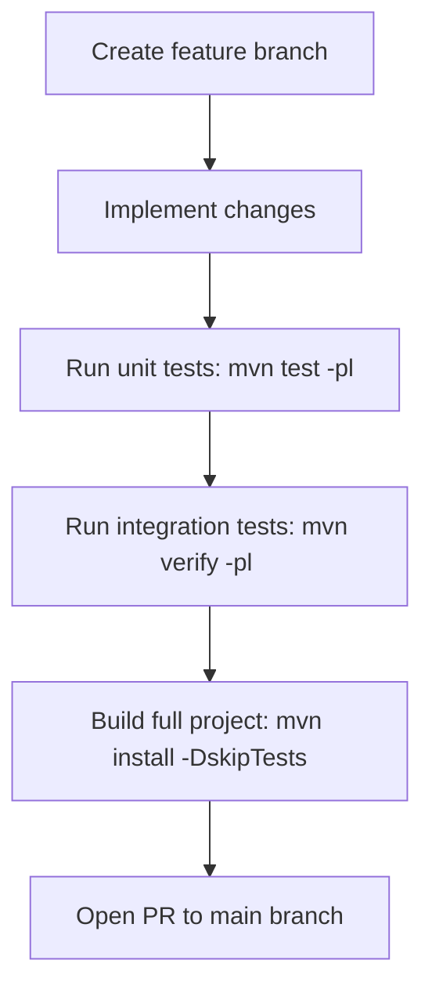

# Local Development Guide

This guide covers everything you need to work with **openframe-oss-lib** locally: cloning, building, iterating, and debugging.

---

## Clone and Initial Setup

```bash
# 1. Clone the repository
git clone https://github.com/flamingo-stack/openframe-oss-lib.git
cd openframe-oss-lib

# 2. Verify Java 21 is active
java -version

# 3. Configure GitHub Packages (if not already done)
# See prerequisites.md for settings.xml configuration

# 4. Build all modules (skip tests for speed)
mvn install -DskipTests
```

---

## Understanding the Multi-Module Build

This is a Maven multi-module project. Key concepts:

- The **root `pom.xml`** is the **parent POM** — it defines shared dependencies, plugin versions, and the module list
- Each module has its own `pom.xml` that inherits from the parent
- **Unified versioning** — all modules share the same version via `${revision}` (currently `5.79.3`)
- The `flatten-maven-plugin` resolves `${revision}` at build time

### Building a Single Module

```bash
# Build only openframe-core and its dependencies
mvn install -pl openframe-core -am -DskipTests

# Build only the security modules
mvn install -pl openframe-security-core,openframe-security-oauth -am -DskipTests
```

The `-am` flag (`--also-make`) ensures upstream dependencies are built first.

---

## Running Tests

### Unit Tests

Unit tests follow the naming conventions `*Test.java` and `*Tests.java`:

```bash
# Run unit tests for a specific module
mvn test -pl openframe-core

# Run all unit tests across the project
mvn test
```

### Integration Tests

Integration tests are named `*IT.java` and require Docker (Testcontainers):

```bash
# Ensure Docker is running first
docker info

# Run integration tests for MongoDB sync module
mvn verify -pl openframe-data-mongo-sync

# Run integration tests for NATS module
mvn verify -pl openframe-data-nats
```

> Integration tests spin up real service containers (MongoDB, NATS) via Testcontainers. They run during the `verify` phase.

### Running a Specific Test

```bash
# Run a specific test class
mvn test -pl openframe-data-mongo-sync -Dtest=NotificationReadStateServiceIT

# Run a specific test method
mvn test -pl openframe-data-mongo-sync -Dtest="NotificationReadStateServiceIT#shouldMarkNotificationAsRead"
```

---

## Development Workflow

### Typical Feature Development Flow


```mermaid
graph TD
    A["Create feature branch"] --> B["Implement changes"]
    B --> C["Run unit tests: mvn test -pl <module>"]
    C --> D["Run integration tests: mvn verify -pl <module>"]
    D --> E["Build full project: mvn install -DskipTests"]
    E --> F["Open PR to main branch"]
```

### Watch Mode / Hot Reload

openframe-oss-lib is a **library**, not a standalone application. There is no hot-reload in the traditional sense. Instead, iterate by:

1. Making code changes in the module
2. Running `mvn install -pl <module> -DskipTests` to install to local `.m2`
3. Your downstream service (which depends on this library) picks up the new version

For faster iteration in the downstream service:

```bash
# Install specific module to local repo quickly
mvn install -pl openframe-security-core -DskipTests -q
```

---

## Debugging

### IntelliJ Remote Debug (for downstream services)

When running a downstream Spring Boot service that uses these library modules, attach the IntelliJ debugger:

1. Run the service with: `mvn spring-boot:run -Dspring-boot.run.jvmArguments="-agentlib:jdwp=transport=dt_socket,server=y,suspend=n,address=5005"`
2. In IntelliJ: **Run → Edit Configurations → Remote JVM Debug**
3. Set host to `localhost`, port to `5005`
4. Click **Debug**

### IntelliJ Test Debugging

Right-click any test class or method → **Debug 'TestName'**. IntelliJ uses Maven's test infrastructure with Lombok annotation processing enabled.

---

## Local Docker-Compose for Integration Tests

A `docker-compose.yml` exists for the MongoDB sync integration test environment:

```bash
# Start MongoDB for manual integration testing
cd openframe-data-mongo-sync/src/test/docker
docker-compose up -d

# Run integration tests against the running container
mvn verify -pl openframe-data-mongo-sync
```

> For most use cases, Testcontainers handles container lifecycle automatically. The docker-compose file is useful for persistent debugging sessions.

---

## Dependency Management

### Adding a New Dependency

1. Add the version property to the root `pom.xml` `<properties>` section (if it's a new dependency)
2. Add the `<dependency>` entry to `<dependencyManagement>` in the root POM
3. Reference the dependency in the module's `pom.xml` **without a version**

Example — adding a new library:

```xml
<!-- Root pom.xml: properties -->
<my.library.version>1.2.3</my.library.version>

<!-- Root pom.xml: dependencyManagement -->
<dependency>
    <groupId>com.example</groupId>
    <artifactId>my-library</artifactId>
    <version>${my.library.version}</version>
</dependency>

<!-- Module pom.xml: dependencies (no version needed) -->
<dependency>
    <groupId>com.example</groupId>
    <artifactId>my-library</artifactId>
</dependency>
```

---

## Common Issues

| Issue | Solution |
|-------|---------|
| `Cannot resolve symbol` (Lombok) | Enable annotation processing in IDE settings |
| Tests fail with `Connection refused` | Start Docker before running integration tests |
| `${revision}` not resolved | Run `mvn flatten:flatten` or upgrade Maven to 3.9+ |
| Slow builds | Use `-DskipTests`, `-T4` (parallel builds), or `-pl module -am` |
| `dependency:resolve` fails | Check `~/.m2/settings.xml` for GitHub Packages credentials |

---

## Useful Development Aliases

Add to your shell profile for convenience:

```bash
# Build specific module quickly
alias mbi='mvn install -DskipTests'
alias mbt='mvn test'
alias mbv='mvn verify'

# Build and install a specific module
function mbm() {
  mvn install -pl "$1" -am -DskipTests
}
```

Usage:

```bash
mbm openframe-security-core
```
