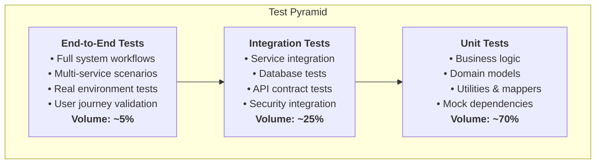

# Testing Overview

OpenFrame OSS Lib implements a comprehensive testing strategy designed for multi-tenant, microservice-oriented systems. This guide covers testing patterns, tools, and best practices for ensuring code quality and system reliability.

## Testing Philosophy

OpenFrame follows a **test pyramid** approach with emphasis on:

- **Fast feedback loops** through comprehensive unit tests
- **Integration confidence** through realistic integration tests  
- **System validation** through targeted end-to-end tests
- **Security assurance** through security-focused testing
- **Performance validation** through load and stress testing



## Test Structure & Organization

### Project Test Layout

Each OpenFrame module follows consistent test organization:

```text
src/
├── main/java/                          # Production code
│   └── com/openframe/module/
├── test/java/                          # Unit & Integration tests
│   └── com/openframe/module/
│       ├── unit/                       # Pure unit tests
│       ├── integration/                # Integration tests
│       ├── security/                   # Security tests
│       └── TestApplication.java        # Test application
└── test/resources/
    ├── application-test.properties     # Test configuration
    ├── test-data/                      # Test fixtures
    └── docker-compose-test.yml         # Test containers
```

### Test Categories

Tests are categorized using JUnit 5 tags:

```java
// Example: Test categorization
@Tag("unit")
class DeviceServiceTest {
    // Pure unit tests with mocked dependencies
}

@Tag("integration")
@SpringBootTest
class DeviceRepositoryIntegrationTest {
    // Tests with real database
}

@Tag("security")
@SpringBootTest
class SecurityIntegrationTest {
    // Security-focused integration tests
}

@Tag("performance")
class DeviceServicePerformanceTest {
    // Performance and load tests
}
```

## Unit Testing

### Testing Business Logic

```java
// Example: Service layer unit test
@ExtendWith(MockitoExtension.class)
@Tag("unit")
class DeviceServiceTest {
    
    @Mock
    private DeviceRepository deviceRepository;
    
    @Mock
    private OrganizationService organizationService;
    
    @Mock
    private ApplicationEventPublisher eventPublisher;
    
    @InjectMocks
    private DeviceService deviceService;
    
    @Test
    @DisplayName("Should create device with valid organization")
    void shouldCreateDeviceWithValidOrganization() {
        // Given
        String tenantId = "tenant-123";
        String orgId = "org-456";
        CreateDeviceRequest request = CreateDeviceRequest.builder()
            .name("Test Device")
            .organizationId(orgId)
            .type(DeviceType.LAPTOP)
            .build();
            
        Organization organization = Organization.builder()
            .id(orgId)
            .tenantId(tenantId)
            .name("Test Org")
            .build();
            
        AuthPrincipal principal = createTestPrincipal(tenantId);
        
        when(organizationService.findById(orgId)).thenReturn(organization);
        when(deviceRepository.save(any(Device.class)))
            .thenAnswer(invocation -> invocation.getArgument(0));
        
        // When
        Device result = deviceService.createDevice(request, principal);
        
        // Then
        assertThat(result)
            .isNotNull()
            .satisfies(device -> {
                assertThat(device.getName()).isEqualTo("Test Device");
                assertThat(device.getTenantId()).isEqualTo(tenantId);
                assertThat(device.getOrganizationId()).isEqualTo(orgId);
                assertThat(device.getType()).isEqualTo(DeviceType.LAPTOP);
                assertThat(device.getStatus()).isEqualTo(DeviceStatus.ACTIVE);
                assertThat(device.getCreatedAt()).isNotNull();
            });
            
        // Verify interactions
        verify(organizationService).findById(orgId);
        verify(deviceRepository).save(any(Device.class));
        verify(eventPublisher).publishEvent(any(DeviceCreatedEvent.class));
    }
    
    @Test
    @DisplayName("Should throw exception for invalid organization")
    void shouldThrowExceptionForInvalidOrganization() {
        // Given
        String tenantId = "tenant-123";
        String invalidOrgId = "invalid-org";
        CreateDeviceRequest request = CreateDeviceRequest.builder()
            .organizationId(invalidOrgId)
            .build();
            
        AuthPrincipal principal = createTestPrincipal(tenantId);
        
        when(organizationService.findById(invalidOrgId))
            .thenThrow(new OrganizationNotFoundException(invalidOrgId));
        
        // When/Then
        assertThatThrownBy(() -> deviceService.createDevice(request, principal))
            .isInstanceOf(OrganizationNotFoundException.class)
            .hasMessage("Organization not found: " + invalidOrgId);
            
        verify(organizationService).findById(invalidOrgId);
        verifyNoInteractions(deviceRepository, eventPublisher);
    }
    
    private AuthPrincipal createTestPrincipal(String tenantId) {
        return AuthPrincipal.builder()
            .userId("user-123")
            .tenantId(tenantId)
            .email("test@example.com")
            .authorities(Set.of("DEVICE:CREATE"))
            .build();
    }
}
```

### Testing Domain Models

```java
// Example: Domain model validation tests
@Tag("unit")
class DeviceTest {
    
    private Validator validator;
    
    @BeforeEach
    void setUp() {
        ValidatorFactory factory = Validation.buildDefaultValidatorFactory();
        validator = factory.getValidator();
    }
    
    @Test
    @DisplayName("Should validate device with all required fields")
    void shouldValidateDeviceWithRequiredFields() {
        // Given
        Device device = Device.builder()
            .name("Valid Device")
            .tenantId("tenant-123")
            .organizationId("org-456")
            .type(DeviceType.LAPTOP)
            .status(DeviceStatus.ACTIVE)
            .createdAt(Instant.now())
            .build();
        
        // When
        Set<ConstraintViolation<Device>> violations = validator.validate(device);
        
        // Then
        assertThat(violations).isEmpty();
    }
    
    @ParameterizedTest
    @DisplayName("Should reject invalid device names")
    @ValueSource(strings = {"", "  ", "a", "very-long-name-that-exceeds-maximum-allowed-length-for-device-names"})
    void shouldRejectInvalidDeviceNames(String invalidName) {
        // Given
        Device device = Device.builder()
            .name(invalidName)
            .tenantId("tenant-123")
            .organizationId("org-456")
            .type(DeviceType.LAPTOP)
            .build();
        
        // When
        Set<ConstraintViolation<Device>> violations = validator.validate(device);
        
        // Then
        assertThat(violations)
            .hasSize(1)
            .extracting(ConstraintViolation::getPropertyPath)
            .extracting(Object::toString)
            .containsExactly("name");
    }
    
    @Test
    @DisplayName("Should update last seen timestamp")
    void shouldUpdateLastSeenTimestamp() {
        // Given
        Device device = Device.builder()
            .name("Test Device")
            .tenantId("tenant-123")
            .organizationId("org-456")
            .type(DeviceType.LAPTOP)
            .status(DeviceStatus.ACTIVE)
            .createdAt(Instant.now().minusSeconds(3600))
            .build();
            
        Instant beforeUpdate = Instant.now();
        
        // When
        device.updateLastSeen();
        
        // Then
        assertThat(device.getLastSeenAt())
            .isNotNull()
            .isAfterOrEqualTo(beforeUpdate);
    }
}
```

### Testing Utilities & Mappers

```java
// Example: Mapper testing
@Tag("unit")  
class DeviceMapperTest {
    
    private DeviceMapper deviceMapper = Mappers.getMapper(DeviceMapper.class);
    
    @Test
    @DisplayName("Should map device to response DTO")
    void shouldMapDeviceToResponse() {
        // Given
        Device device = Device.builder()
            .id("device-123")
            .name("Test Device")
            .tenantId("tenant-123")
            .organizationId("org-456")
            .type(DeviceType.LAPTOP)
            .status(DeviceStatus.ACTIVE)
            .operatingSystem("Windows 11")
            .ipAddress("192.168.1.100")
            .createdAt(Instant.parse("2024-01-01T10:00:00Z"))
            .lastSeenAt(Instant.parse("2024-01-01T15:30:00Z"))
            .build();
        
        // When
        DeviceResponse response = deviceMapper.toResponse(device);
        
        // Then
        assertThat(response)
            .isNotNull()
            .satisfies(r -> {
                assertThat(r.getId()).isEqualTo("device-123");
                assertThat(r.getName()).isEqualTo("Test Device");
                assertThat(r.getOrganizationId()).isEqualTo("org-456");
                assertThat(r.getType()).isEqualTo(DeviceType.LAPTOP);
                assertThat(r.getStatus()).isEqualTo(DeviceStatus.ACTIVE);
                assertThat(r.getOperatingSystem()).isEqualTo("Windows 11");
                assertThat(r.getIpAddress()).isEqualTo("192.168.1.100");
                assertThat(r.getCreatedAt()).isEqualTo("2024-01-01T10:00:00Z");
                assertThat(r.getLastSeenAt()).isEqualTo("2024-01-01T15:30:00Z");
                // Tenant ID should not be exposed in response
                assertThat(r.getTenantId()).isNull();
            });
    }
    
    @Test
    @DisplayName("Should map create request to device entity")
    void shouldMapCreateRequestToDevice() {
        // Given
        CreateDeviceRequest request = CreateDeviceRequest.builder()
            .name("New Device")
            .organizationId("org-789")
            .type(DeviceType.SERVER)
            .operatingSystem("Ubuntu 22.04")
            .build();
            
        String tenantId = "tenant-456";
        
        // When
        Device device = deviceMapper.toEntity(request, tenantId);
        
        // Then
        assertThat(device)
            .isNotNull()
            .satisfies(d -> {
                assertThat(d.getName()).isEqualTo("New Device");
                assertThat(d.getTenantId()).isEqualTo(tenantId);
                assertThat(d.getOrganizationId()).isEqualTo("org-789");
                assertThat(d.getType()).isEqualTo(DeviceType.SERVER);
                assertThat(d.getOperatingSystem()).isEqualTo("Ubuntu 22.04");
                assertThat(d.getStatus()).isEqualTo(DeviceStatus.ACTIVE);
                assertThat(d.getCreatedAt()).isNotNull();
                assertThat(d.getId()).isNull(); // Not set until saved
            });
    }
}
```

## Integration Testing

### Repository Integration Tests

```java
// Example: MongoDB repository integration test
@SpringBootTest
@Tag("integration")
@TestMethodOrder(OrderAnnotation.class)
class DeviceRepositoryIntegrationTest {
    
    @Autowired
    private TestEntityManager entityManager;
    
    @Autowired
    private DeviceRepository deviceRepository;
    
    private String testTenantId;
    private String testOrgId;
    
    @BeforeEach
    void setUp() {
        testTenantId = "test-tenant-" + UUID.randomUUID();
        testOrgId = "test-org-" + UUID.randomUUID();
    }
    
    @Test
    @Order(1)
    @DisplayName("Should save and retrieve device")
    void shouldSaveAndRetrieveDevice() {
        // Given
        Device device = Device.builder()
            .name("Integration Test Device")
            .tenantId(testTenantId)
            .organizationId(testOrgId)
            .type(DeviceType.LAPTOP)
            .status(DeviceStatus.ACTIVE)
            .operatingSystem("Windows 11")
            .createdAt(Instant.now())
            .build();
        
        // When
        Device saved = deviceRepository.save(device);
        Optional<Device> retrieved = deviceRepository.findById(saved.getId());
        
        // Then
        assertThat(retrieved)
            .isPresent()
            .get()
            .satisfies(d -> {
                assertThat(d.getName()).isEqualTo("Integration Test Device");
                assertThat(d.getTenantId()).isEqualTo(testTenantId);
                assertThat(d.getOrganizationId()).isEqualTo(testOrgId);
                assertThat(d.getType()).isEqualTo(DeviceType.LAPTOP);
                assertThat(d.getId()).isNotNull();
                assertThat(d.getCreatedAt()).isNotNull();
            });
    }
    
    @Test
    @Order(2)
    @DisplayName("Should find devices by organization with tenant isolation")
    void shouldFindDevicesByOrganizationWithTenantIsolation() {
        // Given - Create devices for different tenants
        String otherTenantId = "other-tenant-" + UUID.randomUUID();
        
        Device device1 = createTestDevice("Device 1", testTenantId, testOrgId);
        Device device2 = createTestDevice("Device 2", testTenantId, testOrgId);
        Device device3 = createTestDevice("Device 3", otherTenantId, testOrgId);
        
        deviceRepository.saveAll(List.of(device1, device2, device3));
        
        // When - Query with tenant context
        List<Device> devices = deviceRepository.findByOrganizationId(testOrgId);
        
        // Then - Should only return devices for current tenant
        assertThat(devices)
            .hasSize(2)
            .extracting(Device::getTenantId)
            .containsOnly(testTenantId);
    }
    
    @Test
    @Order(3)
    @DisplayName("Should support custom queries with pagination")
    void shouldSupportCustomQueriesWithPagination() {
        // Given
        List<Device> devices = IntStream.range(1, 16)
            .mapToObj(i -> createTestDevice("Device " + i, testTenantId, testOrgId))
            .collect(Collectors.toList());
            
        deviceRepository.saveAll(devices);
        
        // When
        Pageable pageable = PageRequest.of(0, 5, Sort.by("name"));
        Page<Device> page = deviceRepository.findByTenantIdAndStatus(
            testTenantId, DeviceStatus.ACTIVE, pageable);
        
        // Then
        assertThat(page)
            .satisfies(p -> {
                assertThat(p.getContent()).hasSize(5);
                assertThat(p.getTotalElements()).isEqualTo(15);
                assertThat(p.getTotalPages()).isEqualTo(3);
                assertThat(p.getNumber()).isEqualTo(0);
                assertThat(p.getContent())
                    .extracting(Device::getName)
                    .containsExactly("Device 1", "Device 10", "Device 11", 
                                   "Device 12", "Device 13");
            });
    }
    
    private Device createTestDevice(String name, String tenantId, String orgId) {
        return Device.builder()
            .name(name)
            .tenantId(tenantId)
            .organizationId(orgId)
            .type(DeviceType.LAPTOP)
            .status(DeviceStatus.ACTIVE)
            .createdAt(Instant.now())
            .build();
    }
}
```

### Service Integration Tests

```java
// Example: Service integration test with TestContainers
@SpringBootTest
@Tag("integration")
@Testcontainers
class DeviceServiceIntegrationTest {
    
    @Container
    static MongoDBContainer mongodb = new MongoDBContainer("mongo:7")
            .withReuse(true);
    
    @Container
    static GenericContainer<?> redis = new GenericContainer<>("redis:7")
            .withExposedPorts(6379)
            .withReuse(true);
    
    @DynamicPropertySource
    static void setProperties(DynamicPropertyRegistry registry) {
        registry.add("spring.data.mongodb.uri", mongodb::getReplicaSetUrl);
        registry.add("spring.redis.host", redis::getHost);
        registry.add("spring.redis.port", redis::getFirstMappedPort);
    }
    
    @Autowired
    private DeviceService deviceService;
    
    @Autowired
    private OrganizationService organizationService;
    
    @MockBean
    private ApplicationEventPublisher eventPublisher;
    
    private AuthPrincipal testPrincipal;
    private Organization testOrganization;
    
    @BeforeEach
    void setUp() {
        String tenantId = "integration-test-" + UUID.randomUUID();
        
        testPrincipal = AuthPrincipal.builder()
            .userId("user-123")
            .tenantId(tenantId)
            .email("test@example.com")
            .authorities(Set.of("DEVICE:CREATE", "DEVICE:READ"))
            .build();
        
        // Create test organization
        CreateOrganizationRequest orgRequest = CreateOrganizationRequest.builder()
            .name("Test Organization")
            .primaryEmail("org@example.com")
            .build();
            
        testOrganization = organizationService.create(orgRequest, testPrincipal);
    }
    
    @Test
    @DisplayName("Should create device with full integration")
    void shouldCreateDeviceWithFullIntegration() {
        // Given
        CreateDeviceRequest request = CreateDeviceRequest.builder()
            .name("Integration Test Device")
            .organizationId(testOrganization.getId())
            .type(DeviceType.LAPTOP)
            .operatingSystem("Windows 11")
            .build();
        
        // When
        Device created = deviceService.createDevice(request, testPrincipal);
        
        // Then
        assertThat(created)
            .isNotNull()
            .satisfies(device -> {
                assertThat(device.getId()).isNotNull();
                assertThat(device.getName()).isEqualTo("Integration Test Device");
                assertThat(device.getTenantId()).isEqualTo(testPrincipal.getTenantId());
                assertThat(device.getOrganizationId()).isEqualTo(testOrganization.getId());
                assertThat(device.getStatus()).isEqualTo(DeviceStatus.ACTIVE);
            });
        
        // Verify device can be retrieved
        Device retrieved = deviceService.findById(created.getId(), testPrincipal);
        assertThat(retrieved).isEqualTo(created);
        
        // Verify event was published
        verify(eventPublisher).publishEvent(any(DeviceCreatedEvent.class));
    }
    
    @Test
    @DisplayName("Should enforce tenant isolation in service layer")
    void shouldEnforceTenantIsolationInServiceLayer() {
        // Given - Create device for current tenant
        CreateDeviceRequest request = CreateDeviceRequest.builder()
            .name("Tenant Test Device")
            .organizationId(testOrganization.getId())
            .type(DeviceType.LAPTOP)
            .build();
            
        Device device = deviceService.createDevice(request, testPrincipal);
        
        // Create principal for different tenant
        AuthPrincipal otherTenantPrincipal = AuthPrincipal.builder()
            .userId("other-user")
            .tenantId("other-tenant")
            .email("other@example.com")
            .authorities(Set.of("DEVICE:READ"))
            .build();
        
        // When/Then - Other tenant should not access device
        assertThatThrownBy(() -> 
            deviceService.findById(device.getId(), otherTenantPrincipal))
            .isInstanceOf(DeviceNotFoundException.class);
    }
}
```

### API Integration Tests

```java
// Example: REST API integration test
@SpringBootTest(webEnvironment = SpringBootTest.WebEnvironment.RANDOM_PORT)
@Tag("integration")
@TestMethodOrder(OrderAnnotation.class)
class DeviceControllerIntegrationTest {
    
    @Autowired
    private TestRestTemplate restTemplate;
    
    @Autowired
    private JwtService jwtService;
    
    private String authToken;
    private String baseUrl;
    
    @BeforeEach
    void setUp() {
        baseUrl = "http://localhost:" + port + "/api/devices";
        
        // Create test JWT token
        AuthPrincipal principal = createTestPrincipal();
        authToken = jwtService.generateToken(principal);
    }
    
    @Test
    @Order(1)
    @DisplayName("Should create device via REST API")
    void shouldCreateDeviceViaRestAPI() {
        // Given
        CreateDeviceRequest request = CreateDeviceRequest.builder()
            .name("API Test Device")
            .organizationId("org-123")
            .type(DeviceType.LAPTOP)
            .operatingSystem("Windows 11")
            .build();
        
        HttpHeaders headers = new HttpHeaders();
        headers.setBearerAuth(authToken);
        HttpEntity<CreateDeviceRequest> entity = new HttpEntity<>(request, headers);
        
        // When
        ResponseEntity<DeviceResponse> response = restTemplate.exchange(
            baseUrl, HttpMethod.POST, entity, DeviceResponse.class);
        
        // Then
        assertThat(response.getStatusCode()).isEqualTo(HttpStatus.CREATED);
        assertThat(response.getBody())
            .isNotNull()
            .satisfies(device -> {
                assertThat(device.getName()).isEqualTo("API Test Device");
                assertThat(device.getType()).isEqualTo(DeviceType.LAPTOP);
                assertThat(device.getStatus()).isEqualTo(DeviceStatus.ACTIVE);
                assertThat(device.getId()).isNotNull();
            });
    }
    
    @Test
    @Order(2)
    @DisplayName("Should return 401 for unauthenticated requests")
    void shouldReturn401ForUnauthenticatedRequests() {
        // When
        ResponseEntity<String> response = restTemplate.getForEntity(baseUrl, String.class);
        
        // Then
        assertThat(response.getStatusCode()).isEqualTo(HttpStatus.UNAUTHORIZED);
    }
    
    @Test
    @Order(3)
    @DisplayName("Should validate request data")
    void shouldValidateRequestData() {
        // Given - Invalid request
        CreateDeviceRequest invalidRequest = CreateDeviceRequest.builder()
            .name("") // Empty name
            .organizationId(null) // Null organization
            .build();
        
        HttpHeaders headers = new HttpHeaders();
        headers.setBearerAuth(authToken);
        HttpEntity<CreateDeviceRequest> entity = 
            new HttpEntity<>(invalidRequest, headers);
        
        // When
        ResponseEntity<Map> response = restTemplate.exchange(
            baseUrl, HttpMethod.POST, entity, Map.class);
        
        // Then
        assertThat(response.getStatusCode()).isEqualTo(HttpStatus.BAD_REQUEST);
        assertThat(response.getBody())
            .containsKey("violations")
            .extracting("violations")
            .asList()
            .hasSizeGreaterThan(0);
    }
}
```

## Security Testing

### Authentication Tests

```java
// Example: Authentication and authorization tests
@SpringBootTest(webEnvironment = SpringBootTest.WebEnvironment.RANDOM_PORT)
@Tag("security")
class SecurityIntegrationTest {
    
    @Autowired
    private TestRestTemplate restTemplate;
    
    @Test
    @DisplayName("Should reject requests with invalid JWT")
    void shouldRejectRequestsWithInvalidJWT() {
        // Given
        HttpHeaders headers = new HttpHeaders();
        headers.setBearerAuth("invalid.jwt.token");
        HttpEntity<Void> entity = new HttpEntity<>(headers);
        
        // When
        ResponseEntity<String> response = restTemplate.exchange(
            "/api/devices", HttpMethod.GET, entity, String.class);
        
        // Then
        assertThat(response.getStatusCode()).isEqualTo(HttpStatus.UNAUTHORIZED);
    }
    
    @Test
    @DisplayName("Should enforce method-level security")
    void shouldEnforceMethodLevelSecurity() {
        // Given - User without DEVICE:CREATE permission
        String tokenWithoutPermission = createTokenWithoutDeviceCreatePermission();
        
        HttpHeaders headers = new HttpHeaders();
        headers.setBearerAuth(tokenWithoutPermission);
        HttpEntity<CreateDeviceRequest> entity = new HttpEntity<>(
            createValidDeviceRequest(), headers);
        
        // When
        ResponseEntity<String> response = restTemplate.exchange(
            "/api/devices", HttpMethod.POST, entity, String.class);
        
        // Then
        assertThat(response.getStatusCode()).isEqualTo(HttpStatus.FORBIDDEN);
    }
    
    @Test
    @DisplayName("Should prevent SQL injection attempts")
    void shouldPreventSQLInjectionAttempts() {
        // Given
        String maliciousInput = "'; DROP TABLE devices; --";
        String validToken = createValidToken();
        
        HttpHeaders headers = new HttpHeaders();
        headers.setBearerAuth(validToken);
        
        // When - Try to inject SQL through query parameter
        ResponseEntity<String> response = restTemplate.exchange(
            "/api/devices?name=" + maliciousInput, 
            HttpMethod.GET, 
            new HttpEntity<>(headers), 
            String.class);
        
        // Then - Request should be handled safely
        assertThat(response.getStatusCode()).isIn(
            HttpStatus.OK, HttpStatus.BAD_REQUEST);
        // Verify no data corruption occurred
        assertDatabaseIntegrity();
    }
}
```

### Input Validation Tests

```java
// Example: Input validation security tests
@SpringBootTest
@Tag("security")
class InputValidationSecurityTest {
    
    @Autowired
    private DeviceService deviceService;
    
    private AuthPrincipal validPrincipal;
    
    @BeforeEach
    void setUp() {
        validPrincipal = createValidPrincipal();
    }
    
    @ParameterizedTest
    @DisplayName("Should reject XSS attempts in device names")
    @ValueSource(strings = {
        "<script>alert('xss')</script>",
        "javascript:alert('xss')",
        "",
        "data:text/html,<script>alert('xss')</script>"
    })
    void shouldRejectXSSAttemptsInDeviceNames(String maliciousInput) {
        // Given
        CreateDeviceRequest request = CreateDeviceRequest.builder()
            .name(maliciousInput)
            .organizationId("org-123")
            .type(DeviceType.LAPTOP)
            .build();
        
        // When/Then
        assertThatThrownBy(() -> deviceService.createDevice(request, validPrincipal))
            .isInstanceOf(ValidationException.class);
    }
    
    @Test
    @DisplayName("Should sanitize HTML in descriptions")
    void shouldSanitizeHTMLInDescriptions() {
        // Given
        String htmlInput = "<p>Valid content</p><script>alert('bad')</script>";
        CreateDeviceRequest request = CreateDeviceRequest.builder()
            .name("Test Device")
            .description(htmlInput)
            .organizationId("org-123")
            .type(DeviceType.LAPTOP)
            .build();
        
        // When
        Device created = deviceService.createDevice(request, validPrincipal);
        
        // Then
        assertThat(created.getDescription())
            .contains("<p>Valid content</p>")
            .doesNotContain("<script>")
            .doesNotContain("alert");
    }
}
```

## Performance Testing

### Load Testing

```java
// Example: Performance and load testing
@SpringBootTest
@Tag("performance")
class DeviceServicePerformanceTest {
    
    @Autowired
    private DeviceService deviceService;
    
    @Test
    @DisplayName("Should handle concurrent device creation")
    void shouldHandleConcurrentDeviceCreation() throws InterruptedException {
        // Given
        int numberOfThreads = 10;
        int devicesPerThread = 100;
        ExecutorService executor = Executors.newFixedThreadPool(numberOfThreads);
        CountDownLatch latch = new CountDownLatch(numberOfThreads);
        AtomicInteger successCount = new AtomicInteger(0);
        AtomicInteger errorCount = new AtomicInteger(0);
        
        // When
        Instant startTime = Instant.now();
        
        for (int i = 0; i < numberOfThreads; i++) {
            final int threadId = i;
            executor.submit(() -> {
                try {
                    AuthPrincipal principal = createTestPrincipal("tenant-" + threadId);
                    
                    for (int j = 0; j < devicesPerThread; j++) {
                        CreateDeviceRequest request = CreateDeviceRequest.builder()
                            .name("Device-" + threadId + "-" + j)
                            .organizationId("org-" + threadId)
                            .type(DeviceType.LAPTOP)
                            .build();
                        
                        deviceService.createDevice(request, principal);
                        successCount.incrementAndGet();
                    }
                } catch (Exception e) {
                    errorCount.incrementAndGet();
                } finally {
                    latch.countDown();
                }
            });
        }
        
        // Wait for completion
        latch.await(30, TimeUnit.SECONDS);
        executor.shutdown();
        
        Duration duration = Duration.between(startTime, Instant.now());
        
        // Then
        assertThat(successCount.get()).isEqualTo(numberOfThreads * devicesPerThread);
        assertThat(errorCount.get()).isZero();
        assertThat(duration.toSeconds()).isLessThan(30);
        
        double throughput = (double) successCount.get() / duration.toSeconds();
        assertThat(throughput).isGreaterThan(10); // At least 10 devices/second
    }
    
    @Test
    @DisplayName("Should query large datasets efficiently")
    void shouldQueryLargeDatasetsEfficiently() {
        // Given - Create large dataset
        String tenantId = "perf-test-" + UUID.randomUUID();
        AuthPrincipal principal = createTestPrincipal(tenantId);
        
        // Create 10,000 test devices
        List<Device> devices = IntStream.range(0, 10000)
            .mapToObj(i -> createTestDevice("Device " + i, tenantId))
            .collect(Collectors.toList());
            
        deviceRepository.saveAll(devices);
        
        // When - Measure query performance
        Instant startTime = Instant.now();
        
        DeviceFilter filter = DeviceFilter.builder()
            .status(DeviceStatus.ACTIVE)
            .type(DeviceType.LAPTOP)
            .build();
            
        Page<Device> results = deviceService.searchDevices(
            filter, PageRequest.of(0, 100), principal);
        
        Duration queryTime = Duration.between(startTime, Instant.now());
        
        // Then
        assertThat(results.getContent()).isNotEmpty();
        assertThat(queryTime.toMillis()).isLessThan(1000); // Less than 1 second
    }
}
```

## Testing Utilities & Fixtures

### Test Data Builders

```java
// Example: Test data builder pattern
public class DeviceTestDataBuilder {
    
    private String id;
    private String name = "Test Device";
    private String tenantId = "test-tenant";
    private String organizationId = "test-org";
    private DeviceType type = DeviceType.LAPTOP;
    private DeviceStatus status = DeviceStatus.ACTIVE;
    private String operatingSystem = "Windows 11";
    private Instant createdAt = Instant.now();
    private Instant lastSeenAt = Instant.now();
    
    public static DeviceTestDataBuilder aDevice() {
        return new DeviceTestDataBuilder();
    }
    
    public DeviceTestDataBuilder withId(String id) {
        this.id = id;
        return this;
    }
    
    public DeviceTestDataBuilder withName(String name) {
        this.name = name;
        return this;
    }
    
    public DeviceTestDataBuilder withTenant(String tenantId) {
        this.tenantId = tenantId;
        return this;
    }
    
    public DeviceTestDataBuilder withOrganization(String organizationId) {
        this.organizationId = organizationId;
        return this;
    }
    
    public DeviceTestDataBuilder withType(DeviceType type) {
        this.type = type;
        return this;
    }
    
    public DeviceTestDataBuilder withStatus(DeviceStatus status) {
        this.status = status;
        return this;
    }
    
    public DeviceTestDataBuilder offline() {
        this.status = DeviceStatus.OFFLINE;
        this.lastSeenAt = Instant.now().minus(Duration.ofHours(2));
        return this;
    }
    
    public DeviceTestDataBuilder server() {
        this.type = DeviceType.SERVER;
        this.operatingSystem = "Ubuntu 22.04";
        return this;
    }
    
    public Device build() {
        return Device.builder()
            .id(id)
            .name(name)
            .tenantId(tenantId)
            .organizationId(organizationId)
            .type(type)
            .status(status)
            .operatingSystem(operatingSystem)
            .createdAt(createdAt)
            .lastSeenAt(lastSeenAt)
            .build();
    }
}

// Usage in tests:
Device device = aDevice()
    .withName("Production Server")
    .server()
    .withTenant("production-tenant")
    .build();
```

### Custom Test Annotations

```java
// Example: Custom test annotations for common setups
@Target(ElementType.TYPE)
@Retention(RetentionPolicy.RUNTIME)
@SpringBootTest
@Tag("integration")
@Testcontainers
public @interface IntegrationTest {
}

@Target(ElementType.METHOD)  
@Retention(RetentionPolicy.RUNTIME)
@WithMockUser(authorities = {"DEVICE:CREATE", "DEVICE:READ", "DEVICE:UPDATE"})
public @interface WithDevicePermissions {
}

// Usage:
@IntegrationTest
class DeviceServiceIntegrationTest {
    
    @Test
    @WithDevicePermissions
    void shouldCreateDevice() {
        // Test implementation
    }
}
```

## Test Configuration & Profiles

### Test Application Configuration

```java
// Example: Test-specific configuration
@TestConfiguration
public class TestConfig {
    
    @Bean
    @Primary
    public Clock testClock() {
        return Clock.fixed(
            Instant.parse("2024-01-01T12:00:00Z"), 
            ZoneOffset.UTC);
    }
    
    @Bean
    @Primary
    public EmailService mockEmailService() {
        return Mockito.mock(EmailService.class);
    }
    
    @Bean
    @Primary
    public ExternalApiClient mockExternalApiClient() {
        return Mockito.mock(ExternalApiClient.class);
    }
}
```

### Test Properties

```properties
# application-test.properties
spring.profiles.active=test

# Use in-memory databases for faster tests
spring.data.mongodb.uri=mongodb://localhost:27017/openframe_test
spring.redis.host=localhost
spring.redis.port=6379
spring.redis.database=1

# Disable external service calls
openframe.external.services.enabled=false

# Increase logging for test debugging
logging.level.com.openframe=DEBUG
logging.level.org.springframework.security=DEBUG

# Test-specific security settings
openframe.security.jwt.secret=test-secret-key-for-testing-only
openframe.security.session.timeout=PT1H

# Disable rate limiting in tests
openframe.rate-limit.enabled=false
```

## Running Tests

### Maven Test Execution

```bash
# Run all tests
mvn test

# Run specific test categories
mvn test -Dgroups="unit"
mvn test -Dgroups="integration"  
mvn test -Dgroups="security"
mvn test -Dgroups="performance"

# Run tests for specific module
cd openframe-api-service-core
mvn test

# Run tests with coverage
mvn test jacoco:report

# Skip tests during build
mvn clean install -DskipTests

# Run tests in parallel
mvn test -T 4 # Use 4 threads
```

### IDE Test Execution

**IntelliJ IDEA:**
```text
# Run all tests in a class
Right-click class → Run 'ClassName'

# Run specific test method
Click green arrow next to method

# Run by tags
Edit Run Configuration → Test kind: Tags
Tags expression: unit & !slow

# Debug tests
Right-click → Debug 'ClassName'
```

## Continuous Integration

### GitHub Actions Test Pipeline

```yaml
# .github/workflows/test.yml
name: Tests

on:
  push:
    branches: [ main, develop ]
  pull_request:
    branches: [ main ]

jobs:
  test:
    runs-on: ubuntu-latest
    
    services:
      mongodb:
        image: mongo:7
        ports:
          - 27017:27017
      redis:
        image: redis:7
        ports:
          - 6379:6379
    
    steps:
    - uses: actions/checkout@v3
    
    - name: Set up JDK 21
      uses: actions/setup-java@v3
      with:
        java-version: '21'
        distribution: 'temurin'
    
    - name: Cache Maven dependencies
      uses: actions/cache@v3
      with:
        path: ~/.m2
        key: ${{ runner.os }}-m2-${{ hashFiles('**/pom.xml') }}
    
    - name: Run unit tests
      run: mvn test -Dgroups="unit"
      
    - name: Run integration tests
      run: mvn test -Dgroups="integration"
      
    - name: Run security tests
      run: mvn test -Dgroups="security"
    
    - name: Generate test report
      run: mvn jacoco:report
      
    - name: Upload coverage to Codecov
      uses: codecov/codecov-action@v3
```

## Best Practices Summary

### Unit Testing
- ✅ Test business logic in isolation
- ✅ Use descriptive test names with `@DisplayName`
- ✅ Follow Given-When-Then structure
- ✅ Mock external dependencies
- ✅ Use parameterized tests for multiple scenarios
- ✅ Aim for 80%+ code coverage

### Integration Testing  
- ✅ Use TestContainers for realistic database tests
- ✅ Test multi-component interactions
- ✅ Verify tenant isolation
- ✅ Test transaction boundaries
- ✅ Use `@Sql` for database state setup
- ✅ Clean up test data between tests

### Security Testing
- ✅ Test authentication and authorization
- ✅ Verify input validation and sanitization
- ✅ Test for common vulnerabilities (XSS, injection)
- ✅ Validate security headers
- ✅ Test rate limiting and throttling
- ✅ Verify tenant isolation boundaries

### Performance Testing
- ✅ Test under realistic load conditions
- ✅ Measure response times and throughput  
- ✅ Test concurrent operations
- ✅ Profile memory usage
- ✅ Test database query performance
- ✅ Verify caching effectiveness

## Next Steps

Now that you understand OpenFrame testing:

1. **[Contributing Guidelines](../contributing/guidelines.md)** - Learn the contribution process
2. **[Security Best Practices](../security/README.md)** - Understand security patterns
3. **[Local Development](../setup/local-development.md)** - Set up your development environment

## Testing Resources

- **JUnit 5 Documentation**: [junit.org/junit5](https://junit.org/junit5/)
- **TestContainers**: [testcontainers.org](https://www.testcontainers.org/)
- **Spring Boot Testing**: [spring.io/guides/gs/testing-web](https://spring.io/guides/gs/testing-web/)

---

*Testing is not just about finding bugs – it's about building confidence in your code.*