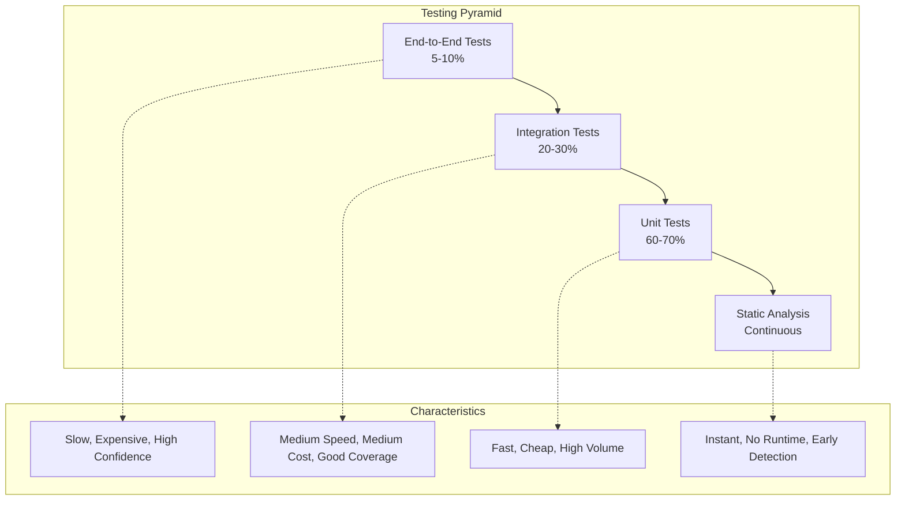

# Testing Overview

OpenFrame OSS Libraries employs comprehensive testing strategies to ensure reliability, security, and maintainability. This guide covers testing approaches, tools, best practices, and how to write effective tests for the platform.

## Testing Philosophy

### Testing Pyramid

OpenFrame follows the testing pyramid principle with emphasis on fast, reliable tests:



### Testing Principles

1. **Fast Feedback Loop** - Tests should run quickly in development
2. **Reliable and Deterministic** - Tests produce consistent results
3. **Independent** - Tests don't depend on each other or external state
4. **Comprehensive Coverage** - Critical paths and edge cases covered
5. **Clear and Maintainable** - Tests serve as documentation

## Testing Stack and Tools

### Core Testing Framework

| Tool | Purpose | Version |
|------|---------|---------|
| **JUnit 5** | Unit testing framework | 5.9+ |
| **Spring Boot Test** | Integration testing | 3.3.0 |
| **Mockito** | Mocking framework | 5.3+ |
| **TestContainers** | Integration with real databases | 1.19+ |
| **WireMock** | HTTP service mocking | 3.0+ |
| **AssertJ** | Fluent assertions | 3.24+ |
| **RestAssured** | API testing | 5.3+ |

### Test Configuration

**Maven Dependencies:**
```xml
<dependencies>
    <!-- Core testing -->
    <dependency>
        <groupId>org.springframework.boot</groupId>
        <artifactId>spring-boot-starter-test</artifactId>
        <scope>test</scope>
    </dependency>
    
    <!-- TestContainers for integration tests -->
    <dependency>
        <groupId>org.testcontainers</groupId>
        <artifactId>junit-jupiter</artifactId>
        <scope>test</scope>
    </dependency>
    <dependency>
        <groupId>org.testcontainers</groupId>
        <artifactId>mongodb</artifactId>
        <scope>test</scope>
    </dependency>
    
    <!-- API testing -->
    <dependency>
        <groupId>io.rest-assured</groupId>
        <artifactId>rest-assured</artifactId>
        <scope>test</scope>
    </dependency>
    
    <!-- GraphQL testing -->
    <dependency>
        <groupId>com.netflix.graphql.dgs</groupId>
        <artifactId>graphql-dgs-spring-boot-starter-test</artifactId>
        <scope>test</scope>
    </dependency>
</dependencies>
```

## Unit Testing

### Service Layer Testing

Test business logic in isolation:

```java
@ExtendWith(MockitoExtension.class)
class OrganizationServiceTest {
    
    @Mock
    private OrganizationRepository repository;
    
    @Mock
    private EventPublisher eventPublisher;
    
    @InjectMocks
    private OrganizationService organizationService;
    
    @Test
    @DisplayName("Should create organization with valid data")
    void shouldCreateOrganizationWithValidData() {
        // Given
        String tenantId = "tenant-123";
        CreateOrganizationRequest request = CreateOrganizationRequest.builder()
            .name("Acme IT Services")
            .contactInformation(ContactInformationDto.builder()
                .email("admin@acmeit.com")
                .phone("+1-555-0123")
                .build())
            .build();
        
        Organization expectedOrg = Organization.builder()
            .id("org-456")
            .tenantId(tenantId)
            .name("Acme IT Services")
            .build();
        
        when(repository.save(any(Organization.class))).thenReturn(expectedOrg);
        
        // When
        Organization result = organizationService.create(request, tenantId);
        
        // Then
        assertThat(result)
            .isNotNull()
            .hasFieldOrPropertyWithValue("name", "Acme IT Services")
            .hasFieldOrPropertyWithValue("tenantId", tenantId);
        
        verify(repository).save(argThat(org -> 
            org.getName().equals("Acme IT Services") &&
            org.getTenantId().equals(tenantId)
        ));
        
        verify(eventPublisher).publishEvent(any(OrganizationCreatedEvent.class));
    }
    
    @Test
    @DisplayName("Should throw exception when organization name is taken")
    void shouldThrowExceptionWhenNameIsTaken() {
        // Given
        String tenantId = "tenant-123";
        CreateOrganizationRequest request = CreateOrganizationRequest.builder()
            .name("Existing Org")
            .build();
        
        when(repository.existsByTenantIdAndName(tenantId, "Existing Org"))
            .thenReturn(true);
        
        // When & Then
        assertThatThrownBy(() -> organizationService.create(request, tenantId))
            .isInstanceOf(OrganizationNameConflictException.class)
            .hasMessage("Organization name 'Existing Org' already exists");
        
        verify(repository, never()).save(any());
        verify(eventPublisher, never()).publishEvent(any());
    }
    
    @Test
    @DisplayName("Should enforce tenant isolation when finding organizations")
    void shouldEnforceTenantIsolationWhenFinding() {
        // Given
        String tenantId = "tenant-123";
        List<Organization> expectedOrgs = List.of(
            Organization.builder().tenantId(tenantId).name("Org 1").build(),
            Organization.builder().tenantId(tenantId).name("Org 2").build()
        );
        
        when(repository.findByTenantId(tenantId)).thenReturn(expectedOrgs);
        
        // When
        List<Organization> result = organizationService.findByTenant(tenantId);
        
        // Then
        assertThat(result)
            .hasSize(2)
            .allSatisfy(org -> assertThat(org.getTenantId()).isEqualTo(tenantId));
        
        verify(repository).findByTenantId(tenantId);
    }
}
```

### Repository Layer Testing

Test data access with `@DataMongoTest`:

```java
@DataMongoTest
@TestPropertySource(properties = {
    "spring.data.mongodb.database=test_openframe",
    "logging.level.org.springframework.data.mongodb.core=DEBUG"
})
class OrganizationRepositoryTest {
    
    @Autowired
    private TestEntityManager entityManager;
    
    @Autowired
    private OrganizationRepository repository;
    
    @Test
    @DisplayName("Should find organizations by tenant ID")
    void shouldFindOrganizationsByTenantId() {
        // Given
        String tenantId = "tenant-123";
        Organization org1 = Organization.builder()
            .tenantId(tenantId)
            .name("Org 1")
            .build();
        Organization org2 = Organization.builder()
            .tenantId(tenantId)
            .name("Org 2")
            .build();
        Organization org3 = Organization.builder()
            .tenantId("other-tenant")
            .name("Other Org")
            .build();
        
        repository.saveAll(List.of(org1, org2, org3));
        
        // When
        List<Organization> result = repository.findByTenantId(tenantId);
        
        // Then
        assertThat(result)
            .hasSize(2)
            .extracting(Organization::getName)
            .containsExactlyInAnyOrder("Org 1", "Org 2");
    }
    
    @Test
    @DisplayName("Should check if organization name exists within tenant")
    void shouldCheckNameExistenceWithinTenant() {
        // Given
        String tenantId = "tenant-123";
        Organization existingOrg = Organization.builder()
            .tenantId(tenantId)
            .name("Existing Org")
            .build();
        repository.save(existingOrg);
        
        // When & Then
        assertThat(repository.existsByTenantIdAndName(tenantId, "Existing Org"))
            .isTrue();
        
        assertThat(repository.existsByTenantIdAndName("other-tenant", "Existing Org"))
            .isFalse();
        
        assertThat(repository.existsByTenantIdAndName(tenantId, "Non-existing Org"))
            .isFalse();
    }
    
    @Test
    @DisplayName("Should find organizations with pagination")
    void shouldFindOrganizationsWithPagination() {
        // Given
        String tenantId = "tenant-123";
        List<Organization> orgs = IntStream.range(0, 15)
            .mapToObj(i -> Organization.builder()
                .tenantId(tenantId)
                .name("Org " + i)
                .build())
            .collect(Collectors.toList());
        
        repository.saveAll(orgs);
        
        // When
        Pageable pageable = PageRequest.of(0, 10);
        Page<Organization> result = repository.findByTenantId(tenantId, pageable);
        
        // Then
        assertThat(result)
            .hasSize(10)
            .satisfies(page -> {
                assertThat(page.getTotalElements()).isEqualTo(15);
                assertThat(page.getTotalPages()).isEqualTo(2);
                assertThat(page.hasNext()).isTrue();
            });
    }
}
```

## Integration Testing

### Controller Integration Tests

Test full request/response cycle:

```java
@SpringBootTest(webEnvironment = SpringBootTest.WebEnvironment.RANDOM_PORT)
@TestPropertySource(properties = "spring.profiles.active=test")
@Testcontainers
class OrganizationControllerIntegrationTest {
    
    @Container
    static MongoDBContainer mongoDBContainer = new MongoDBContainer("mongo:7-jammy")
            .withExposedPorts(27017);
    
    @Container
    static GenericContainer<?> redisContainer = new GenericContainer<>("redis:7-alpine")
            .withExposedPorts(6379);
    
    @DynamicPropertySource
    static void configureProperties(DynamicPropertyRegistry registry) {
        registry.add("spring.data.mongodb.uri", mongoDBContainer::getReplicationSetUrl);
        registry.add("spring.data.redis.host", redisContainer::getHost);
        registry.add("spring.data.redis.port", () -> redisContainer.getMappedPort(6379));
    }
    
    @Autowired
    private TestRestTemplate restTemplate;
    
    @Autowired
    private OrganizationRepository repository;
    
    private String authToken;
    private String tenantId = "test-tenant";
    
    @BeforeEach
    void setup() {
        // Generate test JWT token
        authToken = generateTestToken(tenantId, "test-user", List.of("ADMIN"));
        
        // Clean database
        repository.deleteAll();
    }
    
    @Test
    @DisplayName("Should create organization via REST API")
    void shouldCreateOrganizationViaRestApi() {
        // Given
        CreateOrganizationRequest request = CreateOrganizationRequest.builder()
            .name("Test Organization")
            .contactInformation(ContactInformationDto.builder()
                .email("admin@testorg.com")
                .phone("+1-555-0123")
                .build())
            .build();
        
        HttpHeaders headers = new HttpHeaders();
        headers.setBearerAuth(authToken);
        headers.setContentType(MediaType.APPLICATION_JSON);
        
        HttpEntity<CreateOrganizationRequest> entity = new HttpEntity<>(request, headers);
        
        // When
        ResponseEntity<OrganizationResponse> response = restTemplate.exchange(
            "/api/organizations",
            HttpMethod.POST,
            entity,
            OrganizationResponse.class
        );
        
        // Then
        assertThat(response.getStatusCode()).isEqualTo(HttpStatus.CREATED);
        assertThat(response.getBody())
            .isNotNull()
            .satisfies(org -> {
                assertThat(org.getName()).isEqualTo("Test Organization");
                assertThat(org.getContactInformation().getEmail()).isEqualTo("admin@testorg.com");
                assertThat(org.getId()).isNotNull();
            });
        
        // Verify in database
        Optional<Organization> savedOrg = repository.findById(response.getBody().getId());
        assertThat(savedOrg)
            .isPresent()
            .get()
            .satisfies(org -> {
                assertThat(org.getTenantId()).isEqualTo(tenantId);
                assertThat(org.getName()).isEqualTo("Test Organization");
            });
    }
    
    @Test
    @DisplayName("Should return 401 for requests without authentication")
    void shouldReturn401ForUnauthenticatedRequests() {
        // Given
        CreateOrganizationRequest request = CreateOrganizationRequest.builder()
            .name("Test Org")
            .build();
        
        // When
        ResponseEntity<String> response = restTemplate.postForEntity(
            "/api/organizations",
            request,
            String.class
        );
        
        // Then
        assertThat(response.getStatusCode()).isEqualTo(HttpStatus.UNAUTHORIZED);
    }
    
    @Test
    @DisplayName("Should enforce tenant isolation")
    void shouldEnforceTenantIsolation() {
        // Given - Create organization for tenant 1
        Organization org1 = Organization.builder()
            .tenantId("tenant-1")
            .name("Tenant 1 Org")
            .build();
        repository.save(org1);
        
        // Create auth token for tenant 2
        String tenant2Token = generateTestToken("tenant-2", "user-2", List.of("USER"));
        HttpHeaders headers = new HttpHeaders();
        headers.setBearerAuth(tenant2Token);
        
        // When - Try to access organization from different tenant
        ResponseEntity<String> response = restTemplate.exchange(
            "/api/organizations/" + org1.getId(),
            HttpMethod.GET,
            new HttpEntity<>(headers),
            String.class
        );
        
        // Then
        assertThat(response.getStatusCode()).isEqualTo(HttpStatus.NOT_FOUND);
    }
    
    private String generateTestToken(String tenantId, String userId, List<String> roles) {
        // Implementation would create valid JWT for testing
        return jwtTestUtils.createToken(tenantId, userId, roles);
    }
}
```

### GraphQL Integration Tests

Test GraphQL queries and mutations:

```java
@SpringBootTest
@DgsIntegrationTest
@TestPropertySource(properties = "spring.profiles.active=test")
class OrganizationGraphQLIntegrationTest {
    
    @Autowired
    private DgsQueryExecutor dgsQueryExecutor;
    
    @Autowired
    private OrganizationRepository repository;
    
    @MockBean
    private AuthPrincipal authPrincipal;
    
    @BeforeEach
    void setup() {
        when(authPrincipal.getTenantId()).thenReturn("test-tenant");
        when(authPrincipal.getUserId()).thenReturn("test-user");
        
        repository.deleteAll();
    }
    
    @Test
    @DisplayName("Should query organizations via GraphQL")
    void shouldQueryOrganizationsViaGraphQL() {
        // Given
        String tenantId = "test-tenant";
        List<Organization> organizations = List.of(
            Organization.builder()
                .tenantId(tenantId)
                .name("Org 1")
                .contactInformation(ContactInformation.builder()
                    .email("admin1@org1.com")
                    .build())
                .build(),
            Organization.builder()
                .tenantId(tenantId)
                .name("Org 2")
                .contactInformation(ContactInformation.builder()
                    .email("admin2@org2.com")
                    .build())
                .build()
        );
        repository.saveAll(organizations);
        
        // When
        String query = """
            query GetOrganizations($first: Int) {
                organizations(first: $first) {
                    edges {
                        node {
                            id
                            name
                            contactInformation {
                                email
                            }
                        }
                    }
                    pageInfo {
                        hasNextPage
                        hasPreviousPage
                    }
                }
            }
            """;
        
        Map<String, Object> variables = Map.of("first", 10);
        
        ExecutionResult result = dgsQueryExecutor.execute(query, variables);
        
        // Then
        assertThat(result.getErrors()).isEmpty();
        
        List<Map<String, Object>> edges = JsonPath.read(result.getData(), "$.organizations.edges");
        assertThat(edges).hasSize(2);
        
        List<String> names = JsonPath.read(result.getData(), "$.organizations.edges[*].node.name");
        assertThat(names).containsExactlyInAnyOrder("Org 1", "Org 2");
    }
    
    @Test
    @DisplayName("Should create organization via GraphQL mutation")
    void shouldCreateOrganizationViaGraphQLMutation() {
        // Given
        String mutation = """
            mutation CreateOrganization($input: CreateOrganizationInput!) {
                createOrganization(input: $input) {
                    id
                    name
                    contactInformation {
                        email
                        phone
                    }
                }
            }
            """;
        
        Map<String, Object> variables = Map.of(
            "input", Map.of(
                "name", "GraphQL Test Org",
                "contactInformation", Map.of(
                    "email", "admin@graphqltest.com",
                    "phone", "+1-555-0199"
                )
            )
        );
        
        // When
        ExecutionResult result = dgsQueryExecutor.execute(mutation, variables);
        
        // Then
        assertThat(result.getErrors()).isEmpty();
        
        String orgId = JsonPath.read(result.getData(), "$.createOrganization.id");
        String orgName = JsonPath.read(result.getData(), "$.createOrganization.name");
        String email = JsonPath.read(result.getData(), "$.createOrganization.contactInformation.email");
        
        assertThat(orgId).isNotNull();
        assertThat(orgName).isEqualTo("GraphQL Test Org");
        assertThat(email).isEqualTo("admin@graphqltest.com");
        
        // Verify in database
        Optional<Organization> savedOrg = repository.findById(orgId);
        assertThat(savedOrg).isPresent();
    }
}
```

## Security Testing

### Authentication and Authorization Tests

```java
@SpringBootTest(webEnvironment = SpringBootTest.WebEnvironment.RANDOM_PORT)
@TestPropertySource(properties = "spring.profiles.active=test")
class SecurityIntegrationTest {
    
    @Autowired
    private TestRestTemplate restTemplate;
    
    @Test
    @DisplayName("Should reject requests without valid JWT token")
    void shouldRejectRequestsWithoutValidJWT() {
        // When
        ResponseEntity<String> response = restTemplate.getForEntity(
            "/api/organizations",
            String.class
        );
        
        // Then
        assertThat(response.getStatusCode()).isEqualTo(HttpStatus.UNAUTHORIZED);
    }
    
    @Test
    @DisplayName("Should reject requests with expired JWT token")
    void shouldRejectRequestsWithExpiredJWT() {
        // Given
        String expiredToken = createExpiredJwtToken();
        HttpHeaders headers = new HttpHeaders();
        headers.setBearerAuth(expiredToken);
        
        // When
        ResponseEntity<String> response = restTemplate.exchange(
            "/api/organizations",
            HttpMethod.GET,
            new HttpEntity<>(headers),
            String.class
        );
        
        // Then
        assertThat(response.getStatusCode()).isEqualTo(HttpStatus.UNAUTHORIZED);
    }
    
    @Test
    @DisplayName("Should enforce role-based access control")
    void shouldEnforceRoleBasedAccessControl() {
        // Given
        String userToken = createJwtToken("tenant-1", "user-1", List.of("USER"));
        String adminToken = createJwtToken("tenant-1", "admin-1", List.of("ADMIN"));
        
        // User should be able to read
        HttpHeaders userHeaders = new HttpHeaders();
        userHeaders.setBearerAuth(userToken);
        
        ResponseEntity<String> userReadResponse = restTemplate.exchange(
            "/api/organizations",
            HttpMethod.GET,
            new HttpEntity<>(userHeaders),
            String.class
        );
        assertThat(userReadResponse.getStatusCode()).isEqualTo(HttpStatus.OK);
        
        // User should NOT be able to delete
        ResponseEntity<String> userDeleteResponse = restTemplate.exchange(
            "/api/users/some-user-id",
            HttpMethod.DELETE,
            new HttpEntity<>(userHeaders),
            String.class
        );
        assertThat(userDeleteResponse.getStatusCode()).isEqualTo(HttpStatus.FORBIDDEN);
        
        // Admin should be able to delete
        HttpHeaders adminHeaders = new HttpHeaders();
        adminHeaders.setBearerAuth(adminToken);
        
        ResponseEntity<String> adminDeleteResponse = restTemplate.exchange(
            "/api/users/some-user-id",
            HttpMethod.DELETE,
            new HttpEntity<>(adminHeaders),
            String.class
        );
        assertThat(adminDeleteResponse.getStatusCode()).isIn(
            HttpStatus.NO_CONTENT, HttpStatus.NOT_FOUND
        );
    }
}
```

## Performance Testing

### Load Testing with JUnit

```java
@SpringBootTest(webEnvironment = SpringBootTest.WebEnvironment.RANDOM_PORT)
@TestPropertySource(properties = {
    "spring.profiles.active=test",
    "logging.level.com.openframe=WARN"  // Reduce log noise
})
class PerformanceTest {
    
    @Autowired
    private TestRestTemplate restTemplate;
    
    @Test
    @DisplayName("Should handle concurrent requests efficiently")
    void shouldHandleConcurrentRequestsEfficiently() throws InterruptedException {
        // Given
        int threadCount = 10;
        int requestsPerThread = 20;
        CountDownLatch latch = new CountDownLatch(threadCount);
        ExecutorService executor = Executors.newFixedThreadPool(threadCount);
        
        List<Long> responseTimes = Collections.synchronizedList(new ArrayList<>());
        AtomicInteger successCount = new AtomicInteger();
        AtomicInteger errorCount = new AtomicInteger();
        
        String authToken = createValidJwtToken();
        HttpHeaders headers = new HttpHeaders();
        headers.setBearerAuth(authToken);
        
        // When
        for (int i = 0; i < threadCount; i++) {
            executor.submit(() -> {
                try {
                    for (int j = 0; j < requestsPerThread; j++) {
                        long startTime = System.currentTimeMillis();
                        
                        ResponseEntity<String> response = restTemplate.exchange(
                            "/api/organizations",
                            HttpMethod.GET,
                            new HttpEntity<>(headers),
                            String.class
                        );
                        
                        long responseTime = System.currentTimeMillis() - startTime;
                        responseTimes.add(responseTime);
                        
                        if (response.getStatusCode().is2xxSuccessful()) {
                            successCount.incrementAndGet();
                        } else {
                            errorCount.incrementAndGet();
                        }
                    }
                } finally {
                    latch.countDown();
                }
            });
        }
        
        latch.await(30, TimeUnit.SECONDS);
        executor.shutdown();
        
        // Then
        int totalRequests = threadCount * requestsPerThread;
        double successRate = (double) successCount.get() / totalRequests * 100;
        double avgResponseTime = responseTimes.stream()
            .mapToLong(Long::longValue)
            .average()
            .orElse(0);
        long maxResponseTime = responseTimes.stream()
            .mapToLong(Long::longValue)
            .max()
            .orElse(0);
        
        System.out.printf("Performance Results:%n");
        System.out.printf("  Total Requests: %d%n", totalRequests);
        System.out.printf("  Success Rate: %.2f%%%n", successRate);
        System.out.printf("  Average Response Time: %.2f ms%n", avgResponseTime);
        System.out.printf("  Max Response Time: %d ms%n", maxResponseTime);
        
        // Assertions
        assertThat(successRate).isGreaterThan(95.0);
        assertThat(avgResponseTime).isLessThan(500.0);  // 500ms average
        assertThat(maxResponseTime).isLessThan(2000);   // 2s max
    }
}
```

## Test Data Management

### Test Data Builders

Use the builder pattern for maintainable test data:

```java
public class OrganizationTestDataBuilder {
    
    private String id;
    private String tenantId = "default-tenant";
    private String name = "Test Organization";
    private ContactInformation contactInformation;
    private Address address;
    private Instant createdAt = Instant.now();
    
    public static OrganizationTestDataBuilder anOrganization() {
        return new OrganizationTestDataBuilder();
    }
    
    public OrganizationTestDataBuilder withId(String id) {
        this.id = id;
        return this;
    }
    
    public OrganizationTestDataBuilder withTenantId(String tenantId) {
        this.tenantId = tenantId;
        return this;
    }
    
    public OrganizationTestDataBuilder withName(String name) {
        this.name = name;
        return this;
    }
    
    public OrganizationTestDataBuilder withContactInfo(String email, String phone) {
        this.contactInformation = ContactInformation.builder()
            .email(email)
            .phone(phone)
            .build();
        return this;
    }
    
    public Organization build() {
        return Organization.builder()
            .id(id)
            .tenantId(tenantId)
            .name(name)
            .contactInformation(contactInformation != null ? 
                contactInformation : 
                ContactInformation.builder()
                    .email("test@example.com")
                    .phone("+1-555-0123")
                    .build())
            .address(address)
            .createdAt(createdAt)
            .build();
    }
}

// Usage in tests
@Test
void testOrganizationCreation() {
    Organization org = anOrganization()
        .withTenantId("tenant-123")
        .withName("Custom Org Name")
        .withContactInfo("custom@email.com", "+1-555-9999")
        .build();
    
    // Test with the organization
}
```

### Database Test Configuration

Configure test databases appropriately:

```yaml
# application-test.yml
spring:
  profiles:
    active: test
    
  data:
    mongodb:
      database: test_openframe_${random.uuid}
      
  data:
    redis:
      database: 15  # Use dedicated test database
      
  kafka:
    bootstrap-servers: ${embedded.kafka.brokers:localhost:9092}
    
# Disable external services in tests
openframe:
  external:
    enabled: false
    
logging:
  level:
    com.openframe: DEBUG
    org.testcontainers: INFO
    org.springframework.test: INFO
```

## Test Organization and Best Practices

### Test Structure

Organize tests consistently:

```text
src/test/java/
├── com/openframe/api/
│   ├── controller/
│   │   ├── OrganizationControllerTest.java
│   │   └── UserControllerIntegrationTest.java
│   ├── service/
│   │   ├── OrganizationServiceTest.java
│   │   └── UserServiceTest.java
│   ├── repository/
│   │   └── OrganizationRepositoryTest.java
│   └── integration/
│       ├── SecurityIntegrationTest.java
│       └── GraphQLIntegrationTest.java
└── testdata/
    ├── builders/
    │   ├── OrganizationTestDataBuilder.java
    │   └── UserTestDataBuilder.java
    └── fixtures/
        ├── organizations.json
        └── users.json
```

### Test Naming Conventions

Use descriptive test names:

```java
// ✅ GOOD: Describes what should happen
@Test
@DisplayName("Should create organization when valid data is provided")
void shouldCreateOrganizationWhenValidDataIsProvided() { }

@Test
@DisplayName("Should throw OrganizationNotFoundException when organization does not exist")
void shouldThrowOrganizationNotFoundExceptionWhenOrganizationDoesNotExist() { }

// ❌ BAD: Generic or unclear names
@Test
void testCreateOrganization() { }

@Test
void test1() { }
```

### Assertion Best Practices

Use fluent assertions for clarity:

```java
// ✅ GOOD: Fluent and descriptive
assertThat(result)
    .isNotNull()
    .hasFieldOrPropertyWithValue("name", "Expected Name")
    .extracting(Organization::getContactInformation)
    .satisfies(contact -> {
        assertThat(contact.getEmail()).isEqualTo("test@example.com");
        assertThat(contact.getPhone()).isNotBlank();
    });

// ✅ GOOD: Testing collections
assertThat(organizations)
    .hasSize(3)
    .extracting(Organization::getName)
    .containsExactlyInAnyOrder("Org 1", "Org 2", "Org 3");

// ❌ BAD: Multiple assertions that can be combined
assertNotNull(result);
assertEquals("Expected Name", result.getName());
assertEquals("test@example.com", result.getContactInformation().getEmail());
```

## Running Tests

### Maven Test Execution

```bash
# Run all tests
mvn test

# Run specific test class
mvn test -Dtest=OrganizationServiceTest

# Run specific test method
mvn test -Dtest=OrganizationServiceTest#shouldCreateOrganizationWithValidData

# Run integration tests
mvn verify -P integration-tests

# Run tests with coverage
mvn test jacoco:report

# Run tests in parallel
mvn test -T 4

# Skip tests (for build only)
mvn install -DskipTests
```

### IDE Test Execution

**IntelliJ IDEA:**
- Right-click test class/method → Run
- Use Ctrl+Shift+F10 (Windows) / Cmd+Shift+R (Mac)
- View results in dedicated test runner window

**VS Code:**
- Click play button next to test methods
- Use Java Test Runner extension
- View results in integrated terminal

### Continuous Integration

Configure test execution in CI pipeline:

```yaml
# .github/workflows/test.yml
name: Tests
on: [push, pull_request]

jobs:
  test:
    runs-on: ubuntu-latest
    
    services:
      mongodb:
        image: mongo:7-jammy
        ports:
          - 27017:27017
      redis:
        image: redis:7-alpine
        ports:
          - 6379:6379
    
    steps:
      - uses: actions/checkout@v4
      
      - name: Setup JDK 21
        uses: actions/setup-java@v4
        with:
          java-version: '21'
          distribution: 'temurin'
          
      - name: Cache Maven dependencies
        uses: actions/cache@v4
        with:
          path: ~/.m2/repository
          key: ${{ runner.os }}-maven-${{ hashFiles('**/pom.xml') }}
          
      - name: Run tests
        run: mvn clean verify -P integration-tests
        
      - name: Upload coverage reports
        uses: codecov/codecov-action@v4
        with:
          file: ./target/site/jacoco/jacoco.xml
```

## Test Coverage and Quality

### Coverage Requirements

Maintain high test coverage:

```xml
<!-- In pom.xml -->
<plugin>
    <groupId>org.jacoco</groupId>
    <artifactId>jacoco-maven-plugin</artifactId>
    <configuration>
        <rules>
            <rule>
                <element>BUNDLE</element>
                <limits>
                    <limit>
                        <counter>LINE</counter>
                        <value>COVEREDRATIO</value>
                        <minimum>0.80</minimum> <!-- 80% line coverage -->
                    </limit>
                    <limit>
                        <counter>BRANCH</counter>
                        <value>COVEREDRATIO</value>
                        <minimum>0.75</minimum> <!-- 75% branch coverage -->
                    </limit>
                </limits>
            </rule>
        </rules>
    </configuration>
</plugin>
```

### Test Quality Metrics

Monitor these test quality indicators:

| Metric | Target | Purpose |
|--------|--------|---------|
| **Line Coverage** | 80%+ | Code execution coverage |
| **Branch Coverage** | 75%+ | Decision path coverage |
| **Test Success Rate** | 99%+ | Test reliability |
| **Test Execution Time** | <5 min | Fast feedback |
| **Test Maintainability** | Subjective | Code quality in tests |

## Troubleshooting Common Test Issues

### TestContainer Issues

```bash
# Docker not running
sudo systemctl start docker

# TestContainer image pull failures
docker pull mongo:7-jammy
docker pull redis:7-alpine
```

### Maven Test Issues

```bash
# Clean test state
mvn clean test

# Skip flaky tests temporarily
mvn test -Dtest='!FlakyTest'

# Increase memory for tests
export MAVEN_OPTS="-Xmx2g -XX:MaxMetaspaceSize=512m"
```

### Database State Issues

```java
// Clean database between tests
@BeforeEach
void cleanDatabase() {
    mongoTemplate.getDb().drop();
    redisTemplate.getConnectionFactory().getConnection().flushAll();
}
```

## Next Steps

With comprehensive testing in place:

1. **[Contributing Guidelines](../contributing/guidelines.md)** - Follow testing standards when contributing
2. **[Architecture Overview](../architecture/README.md)** - Understand what to test
3. **[Security Guidelines](../security/README.md)** - Test security implementations

## Getting Help

- **Testing Questions**: Ask in [OpenMSP Slack](https://join.slack.com/t/openmsp/shared_invite/zt-36bl7mx0h-3~U2nFH6nqHqoTPXMaHEHA) `#testing` channel
- **Test Failures**: Check CI logs and test reports
- **Best Practices**: Review existing test implementations in the codebase

---

*Good tests are the foundation of reliable software. By following these guidelines, you contribute to the stability and quality of OpenFrame OSS Libraries.*