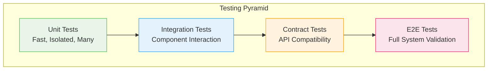

# Testing Overview

OpenFrame OSS Lib maintains high code quality through comprehensive testing strategies. This guide covers the testing structure, how to run tests, write new tests, and meet coverage requirements.

## Testing Philosophy

OpenFrame OSS Lib follows a **test-driven development (TDD) approach** with multiple testing layers:


```mermaid
flowchart TD
    subgraph "Testing Pyramid"
        UnitTests["Unit Tests<br/>Fast, Isolated, Many"]
        IntegrationTests["Integration Tests<br/>Component Interaction"]
        ContractTests["Contract Tests<br/>API Compatibility"]
        EndToEndTests["E2E Tests<br/>Full System Validation"]
    end
    
    UnitTests --> IntegrationTests
    IntegrationTests --> ContractTests
    ContractTests --> EndToEndTests
    
    classDef unit fill:#e8f5e8,stroke:#4caf50
    classDef integration fill:#e3f2fd,stroke:#2196f3
    classDef contract fill:#fff3e0,stroke:#ff9800
    classDef e2e fill:#fce4ec,stroke:#e91e63
    
    class UnitTests unit
    class IntegrationTests integration
    class ContractTests contract
    class EndToEndTests e2e
```

## Test Structure and Organization

### Directory Layout

```text
openframe-oss-lib/
├── openframe-api-lib/
│   └── src/
│       ├── main/java/com/openframe/api/dto/     # Production code
│       └── test/java/                           # Test code
│           ├── com/openframe/api/dto/           # Unit tests
│           │   ├── GenericQueryResultTest.java
│           │   ├── CountedGenericQueryResultTest.java
│           │   ├── audit/
│           │   │   ├── LogEventTest.java
│           │   │   ├── LogDetailsTest.java
│           │   │   ├── LogFilterCriteriaTest.java
│           │   │   └── LogFiltersTest.java
│           │   └── device/
│           │       ├── DeviceFilterCriteriaTest.java
│           │       ├── DeviceFiltersTest.java
│           │       └── DeviceFilterOptionTest.java
│           ├── integration/                     # Integration tests
│           │   ├── JsonSerializationTest.java
│           │   ├── LombokIntegrationTest.java
│           │   └── ValidationIntegrationTest.java
│           └── contracts/                       # Contract tests
│               ├── AuditApiContractTest.java
│               └── DeviceApiContractTest.java
├── test-utils/                                  # Shared test utilities
│   ├── TestDataFactory.java
│   ├── JsonTestUtils.java
│   └── AssertionHelpers.java
└── docs/
    └── testing/
        ├── README.md                           # This document
        ├── unit-testing-guide.md
        ├── integration-testing-guide.md
        └── test-data-management.md
```

### Test Naming Convention

Follow clear, descriptive test naming:

```java
// ✅ Good: Descriptive test names
@Test
@DisplayName("Should build LogEvent with all required fields")
void shouldBuildLogEventWithAllRequiredFields() { }

@Test
@DisplayName("Should throw exception when organizationIds is null")
void shouldThrowExceptionWhenOrganizationIdsIsNull() { }

@Test
@DisplayName("Should serialize to JSON and deserialize correctly")
void shouldSerializeToJsonAndDeserializeCorrectly() { }

// ❌ Avoid: Unclear test names
@Test
void testLogEvent() { }

@Test
void test1() { }
```

## Running Tests

### Basic Test Execution

```bash
# Run all tests
./mvnw test

# Run specific test class
./mvnw test -Dtest=LogEventTest

# Run tests matching pattern
./mvnw test -Dtest="*Filter*Test"

# Run specific test method
./mvnw test -Dtest=LogEventTest#shouldBuildLogEventWithAllRequiredFields

# Run integration tests only
./mvnw test -Dtest="**/*IntegrationTest"
```

### Test Configuration

Configure test execution in `pom.xml`:

```xml
<plugin>
    <groupId>org.apache.maven.plugins</groupId>
    <artifactId>maven-surefire-plugin</artifactId>
    <version>3.0.0</version>
    <configuration>
        <!-- Include/exclude patterns -->
        <includes>
            <include>**/*Test.java</include>
            <include>**/*Tests.java</include>
            <include>**/*TestCase.java</include>
        </includes>
        
        <!-- Test groups -->
        <groups>unit,integration</groups>
        
        <!-- Parallel execution -->
        <parallel>methods</parallel>
        <threadCount>4</threadCount>
        
        <!-- System properties for tests -->
        <systemPropertyVariables>
            <test.environment>local</test.environment>
            <json.pretty.print>true</json.pretty.print>
        </systemPropertyVariables>
    </configuration>
</plugin>
```

### Coverage Reports

Generate and view coverage reports:

```bash
# Run tests with coverage
./mvnw test jacoco:report

# View coverage report
open target/site/jacoco/index.html

# Coverage with specific threshold
./mvnw verify -Djacoco.percentage.minimum=80
```

## Unit Testing

### Standard Unit Test Structure

Every DTO should have comprehensive unit tests:

```java
package com.openframe.api.dto.audit;

import org.junit.jupiter.api.Test;
import org.junit.jupiter.api.DisplayName;
import org.junit.jupiter.api.Nested;
import org.junit.jupiter.params.ParameterizedTest;
import org.junit.jupiter.params.provider.ValueSource;
import org.junit.jupiter.params.provider.EnumSource;

import java.time.LocalDateTime;

import static org.junit.jupiter.api.Assertions.*;
import static org.assertj.core.api.Assertions.*;

class LogEventTest {
    
    @Nested
    @DisplayName("LogEvent Builder Tests")
    class BuilderTests {
        
        @Test
        @DisplayName("Should build LogEvent with all required fields")
        void shouldBuildLogEventWithAllRequiredFields() {
            // Given
            String expectedId = "evt_123";
            String expectedSummary = "User login successful";
            String expectedEventType = "AUTHENTICATION";
            String expectedSeverity = "INFO";
            LocalDateTime expectedTimestamp = LocalDateTime.now();
            String expectedOrganizationId = "org_456";
            
            // When
            LogEvent logEvent = LogEvent.builder()
                .id(expectedId)
                .summary(expectedSummary)
                .eventType(expectedEventType)
                .severity(expectedSeverity)
                .timestamp(expectedTimestamp)
                .organizationId(expectedOrganizationId)
                .build();
                
            // Then
            assertThat(logEvent).isNotNull();
            assertThat(logEvent.getId()).isEqualTo(expectedId);
            assertThat(logEvent.getSummary()).isEqualTo(expectedSummary);
            assertThat(logEvent.getEventType()).isEqualTo(expectedEventType);
            assertThat(logEvent.getSeverity()).isEqualTo(expectedSeverity);
            assertThat(logEvent.getTimestamp()).isEqualTo(expectedTimestamp);
            assertThat(logEvent.getOrganizationId()).isEqualTo(expectedOrganizationId);
        }
        
        @Test
        @DisplayName("Should build LogEvent with minimal required fields")
        void shouldBuildLogEventWithMinimalFields() {
            // When
            LogEvent logEvent = LogEvent.builder()
                .id("minimal_123")
                .summary("Minimal event")
                .build();
                
            // Then
            assertThat(logEvent).isNotNull();
            assertThat(logEvent.getId()).isEqualTo("minimal_123");
            assertThat(logEvent.getSummary()).isEqualTo("Minimal event");
            assertThat(logEvent.getEventType()).isNull();
            assertThat(logEvent.getSeverity()).isNull();
        }
    }
    
    @Nested
    @DisplayName("LogEvent Validation Tests")
    class ValidationTests {
        
        @ParameterizedTest
        @ValueSource(strings = {"", " ", "   "})
        @DisplayName("Should handle empty and whitespace-only strings")
        void shouldHandleEmptyAndWhitespaceStrings(String input) {
            // When/Then - should not throw exceptions
            assertDoesNotThrow(() -> {
                LogEvent logEvent = LogEvent.builder()
                    .id(input)
                    .summary(input)
                    .eventType(input)
                    .build();
                    
                // Verify fields are set as provided (no automatic trimming)
                assertThat(logEvent.getId()).isEqualTo(input);
                assertThat(logEvent.getSummary()).isEqualTo(input);
                assertThat(logEvent.getEventType()).isEqualTo(input);
            });
        }
        
        @Test
        @DisplayName("Should handle null values gracefully")
        void shouldHandleNullValuesGracefully() {
            // When/Then - should not throw exceptions
            assertDoesNotThrow(() -> {
                LogEvent logEvent = LogEvent.builder()
                    .id(null)
                    .summary(null)
                    .eventType(null)
                    .severity(null)
                    .timestamp(null)
                    .build();
                    
                assertThat(logEvent).isNotNull();
                assertThat(logEvent.getId()).isNull();
                assertThat(logEvent.getSummary()).isNull();
            });
        }
    }
    
    @Nested
    @DisplayName("LogEvent Equality and HashCode Tests")
    class EqualityTests {
        
        @Test
        @DisplayName("Should be equal when all fields match")
        void shouldBeEqualWhenAllFieldsMatch() {
            // Given
            LocalDateTime timestamp = LocalDateTime.now();
            
            LogEvent event1 = LogEvent.builder()
                .id("evt_123")
                .summary("Test event")
                .eventType("TEST")
                .timestamp(timestamp)
                .build();
                
            LogEvent event2 = LogEvent.builder()
                .id("evt_123")
                .summary("Test event")
                .eventType("TEST")
                .timestamp(timestamp)
                .build();
                
            // When/Then
            assertThat(event1).isEqualTo(event2);
            assertThat(event1.hashCode()).isEqualTo(event2.hashCode());
        }
        
        @Test
        @DisplayName("Should not be equal when IDs differ")
        void shouldNotBeEqualWhenIdsDiffer() {
            // Given
            LogEvent event1 = LogEvent.builder().id("evt_123").build();
            LogEvent event2 = LogEvent.builder().id("evt_456").build();
            
            // When/Then
            assertThat(event1).isNotEqualTo(event2);
        }
    }
}
```

### Testing Builder Patterns

Test Lombok-generated builders thoroughly:

```java
@Test
@DisplayName("Should chain builder methods correctly")
void shouldChainBuilderMethodsCorrectly() {
    // Given/When - fluent builder pattern
    CountedGenericQueryResult<String> result = CountedGenericQueryResult.<String>builder()
        .items(Arrays.asList("item1", "item2", "item3"))
        .filteredCount(150)
        .pageInfo(PageInfo.builder()
            .pageNumber(1)
            .pageSize(3)
            .totalElements(150)
            .build())
        .build();
        
    // Then - verify builder worked correctly
    assertThat(result.getItems()).hasSize(3);
    assertThat(result.getFilteredCount()).isEqualTo(150);
    assertThat(result.getPageInfo().getTotalElements()).isEqualTo(150);
}

@Test
@DisplayName("Should create new instance from existing with toBuilder")
void shouldCreateNewInstanceFromExistingWithToBuilder() {
    // Given
    LogEvent original = LogEvent.builder()
        .id("evt_123")
        .summary("Original summary")
        .eventType("ORIGINAL")
        .build();
        
    // When - modify using toBuilder
    LogEvent modified = original.toBuilder()
        .summary("Modified summary")
        .eventType("MODIFIED")
        .build();
        
    // Then - original unchanged, new instance created
    assertThat(original.getSummary()).isEqualTo("Original summary");
    assertThat(original.getEventType()).isEqualTo("ORIGINAL");
    
    assertThat(modified.getId()).isEqualTo("evt_123");  // Preserved
    assertThat(modified.getSummary()).isEqualTo("Modified summary");  // Modified
    assertThat(modified.getEventType()).isEqualTo("MODIFIED");  // Modified
}
```

### Test Data Factory Pattern

Create reusable test data factories:

```java
// test-utils/TestDataFactory.java
public class TestDataFactory {
    
    public static LogEvent createValidLogEvent() {
        return LogEvent.builder()
            .id("evt_" + UUID.randomUUID().toString().substring(0, 8))
            .summary("Test audit event")
            .eventType("TEST")
            .severity("INFO")
            .timestamp(LocalDateTime.now())
            .organizationId("org_test")
            .build();
    }
    
    public static LogEvent createLogEventWithType(String eventType) {
        return createValidLogEvent().toBuilder()
            .eventType(eventType)
            .build();
    }
    
    public static LogFilterCriteria createValidFilterCriteria() {
        return LogFilterCriteria.builder()
            .startDate(LocalDate.now().minusDays(7))
            .endDate(LocalDate.now())
            .organizationIds(Arrays.asList("org_test"))
            .eventTypes(Arrays.asList("TEST", "AUTHENTICATION"))
            .build();
    }
    
    public static <T> GenericQueryResult<T> createValidQueryResult(List<T> items) {
        return GenericQueryResult.<T>builder()
            .items(items)
            .pageInfo(PageInfo.builder()
                .pageNumber(0)
                .pageSize(items.size())
                .totalElements(items.size())
                .totalPages(1)
                .build())
            .build();
    }
}
```

## Integration Testing

### JSON Serialization Tests

Test Jackson serialization/deserialization:

```java
package integration;

import com.fasterxml.jackson.databind.ObjectMapper;
import com.fasterxml.jackson.datatype.jsr310.JavaTimeModule;
import com.openframe.api.dto.audit.LogEvent;
import org.junit.jupiter.api.BeforeEach;
import org.junit.jupiter.api.Test;

import java.time.LocalDateTime;

import static org.assertj.core.api.Assertions.*;

class JsonSerializationTest {
    
    private ObjectMapper objectMapper;
    
    @BeforeEach
    void setUp() {
        objectMapper = new ObjectMapper();
        objectMapper.registerModule(new JavaTimeModule());
        objectMapper.disable(SerializationFeature.WRITE_DATES_AS_TIMESTAMPS);
    }
    
    @Test
    @DisplayName("Should serialize LogEvent to JSON correctly")
    void shouldSerializeLogEventToJsonCorrectly() throws Exception {
        // Given
        LocalDateTime timestamp = LocalDateTime.of(2024, 1, 15, 10, 30, 45);
        LogEvent logEvent = LogEvent.builder()
            .id("evt_test_123")
            .summary("Test serialization")
            .eventType("SERIALIZATION_TEST")
            .severity("INFO")
            .timestamp(timestamp)
            .organizationId("org_test")
            .build();
            
        // When
        String json = objectMapper.writeValueAsString(logEvent);
        
        // Then
        assertThat(json).contains("\"id\":\"evt_test_123\"");
        assertThat(json).contains("\"summary\":\"Test serialization\"");
        assertThat(json).contains("\"eventType\":\"SERIALIZATION_TEST\"");
        assertThat(json).contains("\"severity\":\"INFO\"");
        assertThat(json).contains("\"organizationId\":\"org_test\"");
        assertThat(json).contains("\"timestamp\":\"2024-01-15T10:30:45\"");
    }
    
    @Test
    @DisplayName("Should deserialize JSON to LogEvent correctly")
    void shouldDeserializeJsonToLogEventCorrectly() throws Exception {
        // Given
        String json = """
            {
                "id": "evt_test_456",
                "summary": "Test deserialization",
                "eventType": "DESERIALIZATION_TEST",
                "severity": "WARN",
                "timestamp": "2024-01-15T10:30:45",
                "organizationId": "org_test"
            }
            """;
            
        // When
        LogEvent logEvent = objectMapper.readValue(json, LogEvent.class);
        
        // Then
        assertThat(logEvent.getId()).isEqualTo("evt_test_456");
        assertThat(logEvent.getSummary()).isEqualTo("Test deserialization");
        assertThat(logEvent.getEventType()).isEqualTo("DESERIALIZATION_TEST");
        assertThat(logEvent.getSeverity()).isEqualTo("WARN");
        assertThat(logEvent.getOrganizationId()).isEqualTo("org_test");
        assertThat(logEvent.getTimestamp()).isEqualTo(LocalDateTime.of(2024, 1, 15, 10, 30, 45));
    }
    
    @Test
    @DisplayName("Should handle missing optional fields during deserialization")
    void shouldHandleMissingOptionalFieldsDuringDeserialization() throws Exception {
        // Given - JSON with only required fields
        String json = """
            {
                "id": "evt_minimal",
                "summary": "Minimal event"
            }
            """;
            
        // When
        LogEvent logEvent = objectMapper.readValue(json, LogEvent.class);
        
        // Then
        assertThat(logEvent.getId()).isEqualTo("evt_minimal");
        assertThat(logEvent.getSummary()).isEqualTo("Minimal event");
        assertThat(logEvent.getEventType()).isNull();
        assertThat(logEvent.getSeverity()).isNull();
        assertThat(logEvent.getTimestamp()).isNull();
    }
}
```

### Lombok Integration Tests

Test that Lombok annotations work correctly:

```java
package integration;

import com.openframe.api.dto.CountedGenericQueryResult;
import com.openframe.api.dto.GenericQueryResult;
import org.junit.jupiter.api.Test;

import java.lang.reflect.Method;
import java.util.Arrays;

import static org.assertj.core.api.Assertions.*;

class LombokIntegrationTest {
    
    @Test
    @DisplayName("Should generate getter methods for all fields")
    void shouldGenerateGetterMethodsForAllFields() {
        // Given
        Class<LogEvent> clazz = LogEvent.class;
        
        // When/Then - verify Lombok generated getters
        assertThat(clazz).hasDeclaredMethods(
            "getId", "getSummary", "getEventType", 
            "getSeverity", "getTimestamp", "getOrganizationId"
        );
    }
    
    @Test
    @DisplayName("Should generate setter methods for all fields")
    void shouldGenerateSetterMethodsForAllFields() {
        // Given
        Class<LogEvent> clazz = LogEvent.class;
        
        // When/Then - verify Lombok generated setters
        assertThat(clazz).hasDeclaredMethods(
            "setId", "setSummary", "setEventType",
            "setSeverity", "setTimestamp", "setOrganizationId"
        );
    }
    
    @Test
    @DisplayName("Should generate builder pattern methods")
    void shouldGenerateBuilderPatternMethods() {
        // Given
        Class<LogEvent> clazz = LogEvent.class;
        
        // When/Then - verify Lombok generated builder methods
        assertThat(clazz).hasDeclaredMethods("builder");
        
        // Verify builder class exists
        Class<?>[] innerClasses = clazz.getDeclaredClasses();
        boolean hasBuilderClass = Arrays.stream(innerClasses)
            .anyMatch(c -> c.getSimpleName().contains("Builder"));
        assertThat(hasBuilderClass).isTrue();
    }
    
    @Test
    @DisplayName("Should generate toString method")
    void shouldGenerateToStringMethod() throws Exception {
        // Given
        LogEvent logEvent = LogEvent.builder()
            .id("evt_test")
            .summary("Test toString")
            .build();
            
        // When
        String toString = logEvent.toString();
        
        // Then - verify Lombok generated toString includes field values
        assertThat(toString).contains("LogEvent(");
        assertThat(toString).contains("id=evt_test");
        assertThat(toString).contains("summary=Test toString");
    }
    
    @Test
    @DisplayName("Should generate equals and hashCode methods")
    void shouldGenerateEqualsAndHashCodeMethods() {
        // Given
        LogEvent event1 = LogEvent.builder().id("evt_123").summary("Test").build();
        LogEvent event2 = LogEvent.builder().id("evt_123").summary("Test").build();
        LogEvent event3 = LogEvent.builder().id("evt_456").summary("Different").build();
        
        // When/Then - verify Lombok generated equals
        assertThat(event1).isEqualTo(event2);
        assertThat(event1).isNotEqualTo(event3);
        
        // Verify hashCode consistency
        assertThat(event1.hashCode()).isEqualTo(event2.hashCode());
        assertThat(event1.hashCode()).isNotEqualTo(event3.hashCode());
    }
}
```

## Coverage Requirements

### Coverage Targets

OpenFrame OSS Lib maintains strict coverage requirements:

| Coverage Type | Minimum Requirement | Target |
|---------------|---------------------|--------|
| **Line Coverage** | 85% | 95% |
| **Branch Coverage** | 80% | 90% |
| **Method Coverage** | 90% | 100% |
| **Class Coverage** | 90% | 100% |

### JaCoCo Configuration

Configure coverage in `pom.xml`:

```xml
<plugin>
    <groupId>org.jacoco</groupId>
    <artifactId>jacoco-maven-plugin</artifactId>
    <version>0.8.8</version>
    <executions>
        <execution>
            <goals>
                <goal>prepare-agent</goal>
            </goals>
        </execution>
        <execution>
            <id>report</id>
            <phase>test</phase>
            <goals>
                <goal>report</goal>
            </goals>
        </execution>
        <execution>
            <id>check</id>
            <goals>
                <goal>check</goal>
            </goals>
            <configuration>
                <rules>
                    <rule>
                        <element>BUNDLE</element>
                        <limits>
                            <limit>
                                <counter>LINE</counter>
                                <value>COVEREDRATIO</value>
                                <minimum>0.85</minimum>
                            </limit>
                            <limit>
                                <counter>BRANCH</counter>
                                <value>COVEREDRATIO</value>
                                <minimum>0.80</minimum>
                            </limit>
                        </limits>
                    </rule>
                </rules>
            </configuration>
        </execution>
    </executions>
</plugin>
```

### Coverage Exclusions

Exclude generated code and utility classes:

```xml
<configuration>
    <excludes>
        <exclude>**/*Builder.class</exclude>
        <exclude>**/*$$serializer.class</exclude>
        <exclude>**/package-info.class</exclude>
    </excludes>
</configuration>
```

## Writing New Tests

### Test Class Template

Use this template for new test classes:

```java
package com.openframe.api.dto.your.package;

import org.junit.jupiter.api.Test;
import org.junit.jupiter.api.DisplayName;
import org.junit.jupiter.api.Nested;
import org.junit.jupiter.api.BeforeEach;
import org.junit.jupiter.params.ParameterizedTest;
import org.junit.jupiter.params.provider.ValueSource;

import static org.junit.jupiter.api.Assertions.*;
import static org.assertj.core.api.Assertions.*;

@DisplayName("YourDTO Tests")
class YourDTOTest {
    
    private YourDTO validDTO;
    
    @BeforeEach
    void setUp() {
        validDTO = TestDataFactory.createValidYourDTO();
    }
    
    @Nested
    @DisplayName("Builder Pattern Tests")
    class BuilderTests {
        
        @Test
        @DisplayName("Should build DTO with all required fields")
        void shouldBuildDTOWithAllRequiredFields() {
            // Test builder functionality
        }
        
        @Test
        @DisplayName("Should use toBuilder to create modified copy")
        void shouldUseToBuilderToCreateModifiedCopy() {
            // Test toBuilder functionality
        }
    }
    
    @Nested
    @DisplayName("Validation Tests")
    class ValidationTests {
        
        @ParameterizedTest
        @ValueSource(strings = {"", " ", "   "})
        @DisplayName("Should handle empty string inputs")
        void shouldHandleEmptyStringInputs(String input) {
            // Test validation logic
        }
        
        @Test
        @DisplayName("Should handle null values gracefully")
        void shouldHandleNullValuesGracefully() {
            // Test null handling
        }
    }
    
    @Nested
    @DisplayName("Serialization Tests")
    class SerializationTests {
        
        @Test
        @DisplayName("Should serialize to JSON correctly")
        void shouldSerializeToJsonCorrectly() {
            // Test JSON serialization
        }
        
        @Test
        @DisplayName("Should deserialize from JSON correctly") 
        void shouldDeserializeFromJsonCorrectly() {
            // Test JSON deserialization
        }
    }
}
```

### Test Coverage Strategy

Ensure comprehensive coverage:

1. **Happy Path Testing**: Test normal operation with valid inputs
2. **Edge Case Testing**: Test boundary conditions and edge cases
3. **Error Handling**: Test exception scenarios and error conditions
4. **Null Safety**: Test all nullable fields and parameters
5. **Serialization**: Test JSON serialization and deserialization
6. **Builder Pattern**: Test all builder methods and combinations

## Continuous Integration

### GitHub Actions Configuration

Test execution in CI/CD:

```yaml
# .github/workflows/test.yml
name: Tests

on: [push, pull_request]

jobs:
  test:
    runs-on: ubuntu-latest
    
    steps:
    - uses: actions/checkout@v3
    
    - name: Set up JDK 11
      uses: actions/setup-java@v3
      with:
        java-version: '11'
        distribution: 'temurin'
        
    - name: Cache Maven dependencies
      uses: actions/cache@v3
      with:
        path: ~/.m2
        key: ${{ runner.os }}-m2-${{ hashFiles('**/pom.xml') }}
        
    - name: Run tests
      run: ./mvnw clean test
      
    - name: Generate coverage report
      run: ./mvnw jacoco:report
      
    - name: Upload coverage to Codecov
      uses: codecov/codecov-action@v3
      with:
        files: target/site/jacoco/jacoco.xml
        
    - name: Check coverage thresholds
      run: ./mvnw jacoco:check
```

## Test Performance and Optimization

### Fast Test Execution

Optimize test performance:

```bash
# Parallel test execution
./mvnw test -T 1C

# Run only fast tests during development
./mvnw test -Dgroups="unit,fast"

# Skip slow integration tests
./mvnw test -DexcludeGroups="integration,slow"
```

### Test Categorization

Use JUnit 5 tags to categorize tests:

```java
@Tag("unit")
@Tag("fast")
class LogEventTest {
    // Unit tests
}

@Tag("integration") 
@Tag("slow")
class JsonSerializationTest {
    // Integration tests
}
```

## Summary

OpenFrame OSS Lib maintains high quality through:

- **Comprehensive Unit Tests**: Every DTO has thorough test coverage
- **Integration Testing**: JSON serialization and Lombok integration verified
- **Coverage Requirements**: Strict minimum coverage thresholds enforced
- **Test Organization**: Clear structure with descriptive naming conventions
- **Continuous Integration**: Automated testing on every commit and PR

Following these testing practices ensures that OpenFrame OSS Lib remains reliable, maintainable, and ready for production use across the entire OpenFrame platform.

---

*Quality code starts with quality tests. OpenFrame OSS Lib's comprehensive testing strategy ensures that every DTO works correctly and integrates seamlessly with the broader platform ecosystem.*