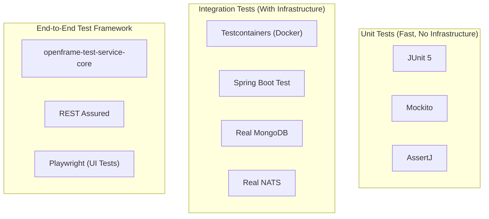

# Testing Overview

`openframe-oss-lib` uses a comprehensive testing strategy with unit tests, integration tests, and end-to-end test utilities. This document explains the test structure, how to run tests, and how to write new tests.

---

## Test Strategy


```mermaid
graph TD
    subgraph UnitTests["Unit Tests (Fast, No Infrastructure)"]
        JUnit["JUnit 5"]
        Mockito["Mockito"]
        AssertJ["AssertJ"]
    end

    subgraph IntegrationTests["Integration Tests (With Infrastructure)"]
        Testcontainers["Testcontainers (Docker)"]
        SpringTest["Spring Boot Test"]
        MongoDB["Real MongoDB"]
        NATS["Real NATS"]
    end

    subgraph E2ETests["End-to-End Test Framework"]
        TestCore["openframe-test-service-core"]
        RestAssured["REST Assured"]
        Playwright["Playwright (UI Tests)"]
    end
```

---

## Test Structure by Module

Most modules follow this convention:

```text
src/
├── main/
│   └── java/
│       └── com/openframe/...
└── test/
    └── java/
        └── com/openframe/
            ├── unit/          # Unit tests (fast, mocked)
            ├── integration/   # Integration tests (require Docker)
            └── support/       # Test utilities and fixtures
```

### Naming Conventions

| Test Type | File Suffix | Example |
|-----------|------------|---------|
| Unit Test | `*Test.java` | `CommandDispatchServiceTest` |
| Integration Test | `*IT.java` | `NotificationServiceIT` |
| UI Test | `*UITest.java` | `DeviceRemoteTest` |

The Maven Surefire plugin is configured to pick up all patterns:

- `**/Test*.java`
- `**/*Test.java`
- `**/*Tests.java`
- `**/*TestCase.java`
- `**/*IT.java`

---

## Running Tests

### Run All Unit Tests

```bash
mvn test
```

Unit tests run without Docker or external services. They should complete in seconds.

### Run Unit Tests for a Specific Module

```bash
# API service core unit tests
mvn test -pl openframe-api-service-core

# Data-mongo-sync unit tests
mvn test -pl openframe-data-mongo-sync
```

### Run Integration Tests

Integration tests use **Testcontainers** to automatically pull and start Docker containers:

```bash
# Run all tests including integration tests
mvn verify

# Run integration tests for a specific module
mvn verify -pl openframe-data-mongo-sync

# Run integration tests for NATS module
mvn verify -pl openframe-data-nats
```

> **Prerequisite:** Docker must be running. Testcontainers pulls images automatically on first run.

### Run a Specific Test Class

```bash
mvn test -pl openframe-api-service-core \
  -Dtest=CommandDispatchServiceTest

# Run a specific test method
mvn test -pl openframe-api-service-core \
  -Dtest=CommandDispatchServiceTest#shouldDispatchCommand
```

### Skip Tests

```bash
# Skip test execution (but still compile tests)
mvn install -DskipTests

# Skip test compilation entirely
mvn install -Dmaven.test.skip=true
```

---

## Integration Test Infrastructure

### Testcontainers

Integration tests use `@Testcontainers` with module-specific base classes:

```java
// Example: MongoDB integration test base class pattern
// (from openframe-data-mongo-sync)
@SpringBootTest
@Testcontainers
public abstract class BaseMongoIntegrationTest {
    @Container
    static MongoDBContainer mongoDBContainer = new MongoDBContainer("mongo:7");

    @DynamicPropertySource
    static void mongoProperties(DynamicPropertyRegistry registry) {
        registry.add("spring.data.mongodb.uri", 
                     mongoDBContainer::getReplicaSetUrl);
    }
}
```

### NATS Integration Tests

NATS integration tests use a similar pattern:

```java
// Example: NATS integration test base class pattern
// (from openframe-data-nats)
@SpringBootTest
@Testcontainers
public abstract class BaseIntegrationTest {
    @Container
    static GenericContainer<?> natsContainer = 
        new GenericContainer<>("nats:2-alpine")
            .withCommand("-js");
}
```

---

## Writing Unit Tests

### Test Structure (Arrange-Act-Assert)

```java
@ExtendWith(MockitoExtension.class)
class CommandDispatchServiceTest {

    @Mock
    private CommandNatsPublisher natsPublisher;

    @Mock
    private MachineRepository machineRepository;

    @InjectMocks
    private CommandDispatchService commandDispatchService;

    @Test
    void shouldDispatchCommandToAgent() {
        // Arrange
        var machine = aMachine().withMachineId("machine-123").build();
        var input = new RunCommandInput("machine-123", "echo hello");
        when(machineRepository.findByMachineId("machine-123"))
            .thenReturn(Optional.of(machine));

        // Act
        var result = commandDispatchService.dispatch(input);

        // Assert
        assertThat(result.isSuccess()).isTrue();
        verify(natsPublisher).publish(any(CommandMessage.class));
    }
}
```

### Key Testing Libraries

| Library | Use Case |
|---------|---------|
| **JUnit 5** (`junit-jupiter`) | Test framework, lifecycle, parameterized tests |
| **Mockito** | Mock external dependencies |
| **AssertJ** | Fluent, readable assertions |
| **Spring Boot Test** | Full application context loading for integration tests |
| **Testcontainers** | Real infrastructure in Docker for integration tests |
| **REST Assured** | HTTP API testing with fluent DSL |

---

## Writing Integration Tests

### MongoDB Integration Test Pattern

```java
@SpringBootTest(classes = IntegrationTestApplication.class)
@Testcontainers
class NotificationServiceIT extends BaseMongoIntegrationTest {

    @Autowired
    private NotificationService notificationService;

    @Autowired
    private NotificationRepository notificationRepository;

    @Test
    void shouldCreateAndFetchNotification() {
        // Arrange
        var notification = NotificationFixtures.aNotification();

        // Act
        notificationService.create(notification);
        var found = notificationRepository.findById(notification.getId());

        // Assert
        assertThat(found).isPresent();
        assertThat(found.get().getTitle()).isEqualTo(notification.getTitle());
    }
}
```

### Test Fixtures

The `support` packages in each module provide fixture builders. For example, the `NotificationFixtures` class in `openframe-data-nats`:

```java
// Fixture usage pattern
var notification = NotificationFixtures.aNotification()
    .withTitle("Test Notification")
    .withSeverity(NotificationSeverity.INFO)
    .build();
```

---

## End-to-End Test Framework

The `openframe-test-service-core` module provides a complete E2E test framework.

### Available Test APIs

| Class | Purpose |
|-------|---------|
| `AuthApi` | Authentication flows (login, registration, token refresh) |
| `DeviceApi` | Device management (list, filter, update status) |
| `OrganizationApi` | Organization CRUD |
| `UserApi` | User management and invitations |
| `TicketApi` | Ticket lifecycle (create, update, notes, attachments) |
| `KnowledgeBaseApi` | Knowledge base articles and folders |
| `ScriptApi` | Script management (create, update, run) |
| `LogsApi` | Audit log queries |

### E2E Test Example

```java
class DevicesTest extends BaseTest {

    @Test
    void shouldReturnDevicesForTenant() {
        // Authenticate
        AuthParts auth = authFlow.login();

        // Call the devices API
        var response = deviceApi.listDevices(auth);

        // Assert
        assertThat(response.statusCode()).isEqualTo(200);
        assertThat(response.body().jsonPath().getList("data")).isNotEmpty();
    }
}
```

### UI Test Framework

For UI tests, the framework uses **Playwright** via `openframe-test-service-core`:

```java
class DeviceRemoteTest extends BaseUITest {

    @Test
    void shouldOpenRemoteShellForDevice() {
        UILoginFlow login = new UILoginFlow(page);
        login.login();

        DevicesPage devices = new DevicesPage(page);
        devices.openFirstDevice();

        RemoteShellPage shell = new RemoteShellPage(page);
        assertThat(shell.isVisible()).isTrue();
    }
}
```

---

## Coverage Requirements

While there is no enforced coverage threshold in this library, follow these guidelines:

| Test Type | Recommended Coverage |
|-----------|---------------------|
| Unit tests | ≥ 80% for service and utility classes |
| Integration tests | All repository methods with real infrastructure |
| E2E tests | All critical user flows (auth, device, ticket, org) |

Focus coverage on:
- Business logic in `*Service` classes
- Repository query methods
- Mapper/converter classes
- Security-sensitive code (authentication, authorization)

---

## CI/CD Test Execution

Tests are run in CI in two phases:

1. **Unit tests** — `mvn test` (no Docker required, fast)
2. **Integration tests** — `mvn verify` (requires Docker, slower)

Separate PR checks may exist for each phase. Check the CI pipeline configuration in your deployment environment for exact commands.
