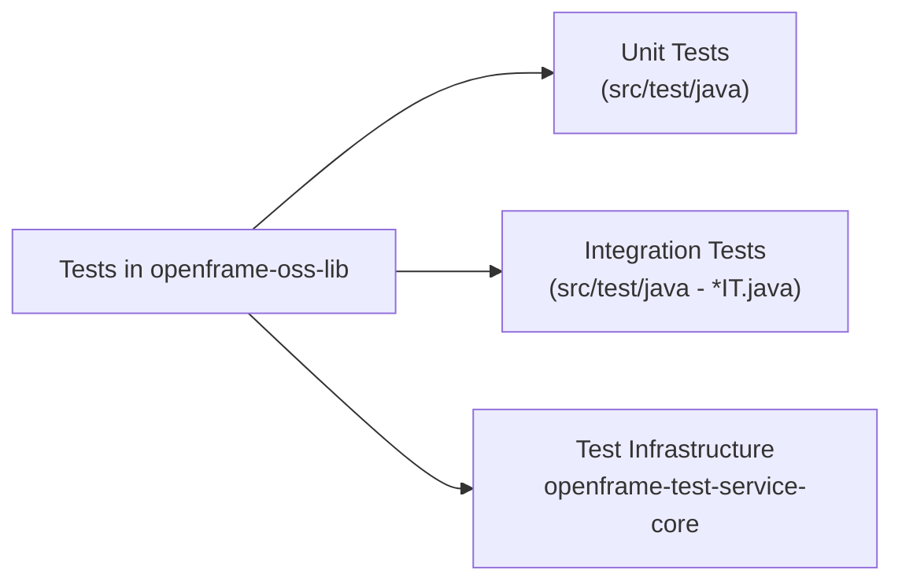

# Testing Overview

`openframe-oss-lib` has a comprehensive testing strategy covering unit tests, integration tests with Testcontainers, and end-to-end test infrastructure. This guide explains the test structure, how to run tests, and how to write new tests.

---

## Test Structure

Tests are organized into two main categories across all modules:


```mermaid
graph LR
    Tests["Tests in openframe-oss-lib"]
    Unit["Unit Tests\n(src/test/java)"]
    Integration["Integration Tests\n(src/test/java - *IT.java)"]
    Infra["Test Infrastructure\nopenframe-test-service-core"]

    Tests --> Unit
    Tests --> Integration
    Tests --> Infra
```

### Unit Tests

- Located in `src/test/java/` following the pattern `*Test.java`
- No infrastructure dependencies (no Docker, no database)
- Fast execution (milliseconds)
- Configured via Maven Surefire plugin

### Integration Tests

- Located in `src/test/java/` following the pattern `*IT.java`
- Use **Testcontainers** for real infrastructure (MongoDB, Redis, NATS)
- Slower execution (seconds to minutes)
- Configured via Maven Failsafe plugin
- Run with `mvn verify`

### Test Infrastructure Module

The `openframe-test-service-core` module provides a shared test harness for end-to-end API testing:

| Component | Purpose |
|-----------|---------|
| `AuthFlow`, `AuthFlowOSS`, `AuthFlowSAAS` | Complete auth flow helpers |
| `AuthHelper`, `RequestSpecHelper` | Authentication and REST test setup |
| `*Api` classes (`DeviceApi`, `TicketApi`, etc.) | Typed API client helpers |
| `*Generator` classes | Test data factories |
| `*Page` classes | Page Object Model for UI tests |
| `MongoDB`, `Redis` | Test infrastructure containers |

---

## Running Tests

### Run Unit Tests Only

```bash
# Run all unit tests across all modules
mvn test

# Run unit tests for a specific module
mvn test -pl openframe-core
mvn test -pl openframe-exception
mvn test -pl openframe-data-pinot
mvn test -pl openframe-api-service-core
```

### Run Integration Tests

```bash
# Run integration tests for a specific module (requires Docker)
mvn verify -pl openframe-data-mongo-sync
mvn verify -pl openframe-data-nats
mvn verify -pl openframe-api-service-core

# Run all integration tests
mvn verify
```

### Run a Specific Test

```bash
# Run a single test class
mvn test -pl openframe-data-pinot -Dtest=PinotQueryBuilderTest

# Run a specific test method
mvn test -pl openframe-api-service-core \
  -Dtest=CommandDispatchServiceTest#testDispatch

# Run tests matching a pattern
mvn test -pl openframe-data-mongo-sync -Dtest="Notification*"
```

### Skip Tests

```bash
# Skip all tests during build
mvn install -DskipTests

# Skip only integration tests
mvn install -Dfailsafe.skip=true

# Skip only unit tests
mvn install -Dsurefire.skip=true
```

---

## Test Configuration

### Maven Surefire (Unit Tests)

The parent POM configures Surefire to include:

```xml
<includes>
    <include>**/Test*.java</include>
    <include>**/*Test.java</include>
    <include>**/*Tests.java</include>
    <include>**/*TestCase.java</include>
    <include>**/*IT.java</include>
</includes>
```

### Testcontainers

Integration tests use Testcontainers to start real infrastructure automatically. Base classes handle container lifecycle:

```java
// Example: BaseMongoIntegrationTest (openframe-data-mongo-sync)
// Provides: @Testcontainers, MongoDB container, Spring context
public abstract class BaseMongoIntegrationTest {
    // MongoDB container started once per test class
    // Spring Boot test context shared for speed
}
```

**Speed Up Integration Tests:**

```bash
# Enable container reuse across test runs
echo "testcontainers.reuse.enable=true" >> ~/.testcontainers.properties
```

---

## Writing New Tests

### Unit Test Example

```java
import org.junit.jupiter.api.Test;
import static org.assertj.core.api.Assertions.assertThat;

class SlugUtilTest {

    @Test
    void shouldConvertNameToSlug() {
        // Given
        String name = "My MSP Organization";

        // When
        String slug = SlugUtil.toSlug(name);

        // Then
        assertThat(slug).isEqualTo("my-msp-organization");
    }
}
```

### Integration Test Example (MongoDB)

```java
import org.springframework.boot.test.context.SpringBootTest;
import org.testcontainers.junit.jupiter.Testcontainers;

@SpringBootTest
@Testcontainers
class OrganizationRepositoryIT extends BaseMongoIntegrationTest {

    @Autowired
    private OrganizationRepository organizationRepository;

    @Test
    void shouldSaveAndRetrieveOrganization() {
        // Given
        Organization org = new Organization();
        org.setTenantId("oss");
        org.setName("Test MSP");

        // When
        Organization saved = organizationRepository.save(org);

        // Then
        assertThat(saved.getId()).isNotNull();
        assertThat(organizationRepository.findById(saved.getId()))
            .isPresent()
            .hasValueSatisfying(o -> assertThat(o.getName()).isEqualTo("Test MSP"));
    }
}
```

### GraphQL Integration Test Example

```java
// From openframe-api-service-core integration tests
// Uses NotificationDataFetcherIT pattern:
@SpringBootTest
class MyDataFetcherIT extends BaseMongoIntegrationTest {

    @Autowired
    private DgsQueryExecutor dgsQueryExecutor;

    @Test
    void shouldFetchDevices() {
        String query = """
            query {
              devices(first: 10) {
                edges {
                  node { id hostname }
                }
              }
            }
            """;

        // Execute with mock authentication context
        var result = dgsQueryExecutor.executeAndExtractJsonPath(
            query, "$.data.devices.edges[*].node.hostname"
        );

        assertThat(result).isNotNull();
    }
}
```

---

## Test Data Generators

The `openframe-test-service-core` module provides ready-to-use data generators:

```java
// Generate test data for API tests
OrganizationGenerator.createRequest()  // → CreateOrganizationRequest
TicketGenerator.createInput()          // → CreateTicketInput
DeviceGenerator.machine()              // → Machine document
AuthGenerator.credentials()            // → test credentials
```

---

## Notification Integration Tests

The notification system has dedicated performance and integration tests:

| Test | Purpose |
|------|---------|
| `NotificationLoadTestIT` | Load testing notification reads |
| `NotificationReadStateIndexUsageIT` | Validates index usage |
| `CustomNotificationRepositoryPaginationIT` | Cursor pagination correctness |
| `NotificationReadStateServiceIT` | Read/unread state management |

These tests also serve as **performance benchmarks** using `PerfResultRecorder` and `MeasurementStats`.

---

## Frontend Tests (openframe-frontend-core)

```bash
cd openframe-frontend-core

# Run all unit tests
npm run test

# Run tests in watch mode
npm run test -- --watch

# Run with coverage
npm run test -- --coverage
```

Frontend tests use **Vitest** with the configuration in `vitest.config.ts`.

---

## Coverage Requirements

While formal coverage thresholds are not enforced by default, follow these guidelines:

| Type | Target Coverage |
|------|----------------|
| Domain services | 80%+ unit test coverage |
| Utility classes | 90%+ unit test coverage |
| Repository custom implementations | Integration test coverage |
| Controllers / DataFetchers | Integration test coverage |

---

## CI Test Execution

Tests run automatically in CI. The Surefire configuration includes `*IT.java` in unit test scanning, but integration tests that require Testcontainers run in the `verify` phase via Failsafe.

For questions about test failures or patterns, join the [OpenMSP Slack community](https://www.openmsp.ai/).
