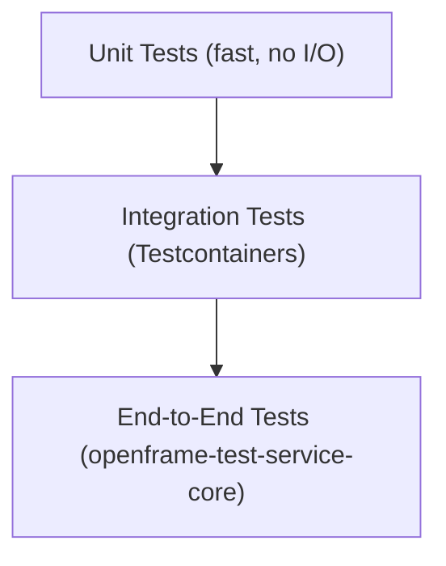

# Testing Overview

OpenFrame OSS Lib has a comprehensive multi-layer testing strategy. This document describes how tests are organized, how to run them, and guidelines for writing new tests.

---

## Test Strategy

The testing pyramid for this project:


```mermaid
graph TD
    Unit["Unit Tests (fast, no I/O)"]
    Integration["Integration Tests (Testcontainers)"]
    End2End["End-to-End Tests (openframe-test-service-core)"]

    Unit --> Integration
    Integration --> End2End
```

| Layer | Tool | Speed | Description |
|---|---|---|---|
| **Unit** | JUnit 5 + Mockito | Fast | Business logic in isolation |
| **Integration** | Testcontainers + JUnit 5 | Medium | Real MongoDB, NATS, Redis |
| **End-to-End** | `openframe-test-service-core` | Slow | Full platform API testing |

---

## Test File Organization

Each module follows Maven's standard test layout:

```text
openframe-api-service-core/
└── src/
    ├── main/java/com/openframe/api/        ← Production code
    └── test/java/com/openframe/api/
        ├── datafetcher/                    ← Unit tests for DGS fetchers
        │   └── ScriptDataFetcherTest.java
        ├── dataloader/
        │   └── ScriptDataLoaderTest.java
        ├── integration/                    ← Integration tests
        │   ├── BaseMongoIntegrationTest.java
        │   └── datafetcher/
        │       └── NotificationDataFetcherIT.java
        ├── mapper/
        │   └── GraphQLLogMapperTest.java
        └── service/
            └── rmm/
                └── ScriptServiceTest.java
```

### Naming Conventions

| Pattern | Type |
|---|---|
| `*Test.java` | Unit test |
| `*Tests.java` | Unit test (Spring convention) |
| `*TestCase.java` | JUnit 3-style (legacy) |
| `*IT.java` | Integration test (runs in `verify` phase) |

The `maven-surefire-plugin` is configured in the parent POM to include all these patterns automatically.

---

## Running Tests

### All Tests in a Module

```bash
mvn test -pl openframe-api-service-core
```

### A Specific Test Class

```bash
mvn test -pl openframe-api-service-core -Dtest=ScriptDataFetcherTest
```

### A Specific Test Method

```bash
mvn test -pl openframe-api-service-core -Dtest="ScriptDataFetcherTest#shouldReturnScriptsForTenant"
```

### Integration Tests (Requires Docker)

Integration tests are bound to the `verify` Maven phase:

```bash
# Must have Docker running
mvn verify -pl openframe-data-mongo-sync
```

### Run All Tests Including Integration

```bash
mvn verify
```

### Skip Tests

```bash
mvn clean install -DskipTests
```

---

## Testcontainers Usage

Integration tests use [Testcontainers](https://www.testcontainers.org/) to spin up real infrastructure. Tests typically extend a base class that manages container lifecycle:

```java
// Example from openframe-data-mongo-sync
@SpringBootTest
@Testcontainers
public abstract class BaseMongoIntegrationTest {

    @Container
    static MongoDBContainer mongoDBContainer = new MongoDBContainer("mongo:6");

    @DynamicPropertySource
    static void setProperties(DynamicPropertyRegistry registry) {
        registry.add("spring.data.mongodb.uri", mongoDBContainer::getReplicaSetUrl);
    }
}
```

Tests that extend `BaseMongoIntegrationTest` have a real MongoDB instance available without any manual setup.

Similarly, NATS integration tests use:

```java
@Container
static GenericContainer<?> natsContainer = new GenericContainer<>("nats:2")
    .withExposedPorts(4222);
```

> **Requirement:** Docker must be running before executing integration tests. Tests will fail with `ContainerLaunchException` if Docker is unavailable.

---

## Unit Test Patterns

### Mocking with Mockito

The standard pattern for unit tests uses `@ExtendWith(MockitoExtension.class)`:

```java
@ExtendWith(MockitoExtension.class)
class ScriptServiceTest {

    @Mock
    private ScriptRepository scriptRepository;

    @InjectMocks
    private ScriptService scriptService;

    @Test
    void shouldReturnScriptById() {
        // Arrange
        Script script = Script.builder().id("test-id").name("My Script").build();
        when(scriptRepository.findById("test-id")).thenReturn(Optional.of(script));

        // Act
        Script result = scriptService.findById("test-id");

        // Assert
        assertThat(result.getName()).isEqualTo("My Script");
    }
}
```

### Testing DGS Data Fetchers

GraphQL data fetchers use `DgsQueryExecutor` for integration-style unit tests:

```java
@SpringBootTest(classes = GraphQlIntegrationTestApplication.class)
class ScriptDataFetcherTest {

    @Autowired
    private DgsQueryExecutor dgsQueryExecutor;

    @Test
    void shouldReturnScripts() {
        String query = "{ scripts { edges { node { id name } } } }";
        List<String> scriptNames = dgsQueryExecutor.executeAndExtractJsonPath(
            query, "$.data.scripts.edges[*].node.name"
        );
        assertThat(scriptNames).isNotEmpty();
    }
}
```

### Testing NATS Publishers/Listeners

```java
@ExtendWith(MockitoExtension.class)
class CommandNatsPublisherTest {

    @Mock
    private NatsMessagePublisher natsPublisher;

    @InjectMocks
    private CommandNatsPublisher commandNatsPublisher;

    @Test
    void shouldPublishCommandMessage() {
        CommandMessage msg = CommandMessage.builder()
            .machineId("machine-1")
            .command("ls -la")
            .build();

        commandNatsPublisher.publish(msg);

        verify(natsPublisher).publish(eq("machine.machine-1.command"), any());
    }
}
```

---

## Writing New Tests

### Guidelines

1. **One assertion concept per test** — each test should verify one behavior
2. **Use descriptive names** — `shouldReturnEmptyListWhenNoScriptsExist` over `test1`
3. **Follow AAA pattern** — Arrange, Act, Assert
4. **Mock external dependencies** — don't let unit tests call real databases or services
5. **Use `@Builder` for test data** — Lombok builders make test fixtures readable
6. **Test negative paths** — null inputs, not-found scenarios, permission failures

### Test Data Generators

The `openframe-test-service-core` module provides pre-built data generators:

```java
// Example generators available
ScriptGenerator.createScript();
OrganizationGenerator.createOrganization();
DeviceGenerator.createMachine();
InvitationGenerator.createInvitation();
```

These are useful for end-to-end and integration test setup.

---

## Test Coverage

There is no enforced minimum coverage threshold via plugin, but contributors are expected to:

- Write unit tests for all new service methods
- Write integration tests for new repository queries
- Write tests for all edge cases in DTOs/mappers

### Check Coverage Locally

Run with the JaCoCo plugin (if configured in your service):

```bash
mvn test jacoco:report -pl openframe-api-service-core
# Report at: openframe-api-service-core/target/site/jacoco/index.html
```

---

## Integration Test Best Practices

- **Use `@DirtiesContext` sparingly** — it slows the test suite by restarting the Spring context
- **Share Testcontainers instances** — use `static` containers to avoid spinning up new containers per test class
- **Use `@Transactional` for cleanup** — where applicable, roll back database changes after each test
- **Test with realistic data** — use production-like MongoDB documents to catch real-world issues

---

## CI Test Execution

Tests run in GitHub Actions CI via Maven. The CI configuration is in `.github/workflows/`. Integration tests require Docker-in-Docker support, which is available on GitHub-hosted runners.

For details on the full CI pipeline, see the [openframe-oss-tenant CI documentation](https://github.com/flamingo-stack/openframe-oss-tenant).
