# Testing Guide

OpenFrame OSS Lib employs a comprehensive testing strategy that includes unit tests, integration tests, security tests, and end-to-end API testing. This guide covers testing patterns, tools, and best practices for ensuring code quality and system reliability.

## Testing Strategy Overview

OpenFrame uses a **multi-layered testing approach** that validates functionality at different levels of the architecture:

```mermaid
flowchart TD
    subgraph "Test Pyramid"
        E2E["🔺 End-to-End Tests<br/>(API Integration)"]
        Integration["🔷 Integration Tests<br/>(Service + Database)"]
        Unit["🔻 Unit Tests<br/>(Individual Components)"]
    end

    subgraph "Test Types"
        Security["🔒 Security Tests"]
        Performance["⚡ Performance Tests"]
        Contract["📋 Contract Tests"]
        Mutation["🧬 Mutation Tests"]
    end

    subgraph "Test Infrastructure"
        TestContainers["🐳 TestContainers"]
        MockServices["🎭 Mock Services"]
        TestData["📊 Test Data Generators"]
        Fixtures["🗂️ Test Fixtures"]
    end

    Unit --> Integration
    Integration --> E2E
    
    Security --> Unit
    Performance --> Integration
    Contract --> E2E
    
    TestContainers --> Integration
    MockServices --> Unit
    TestData --> Integration
    Fixtures --> E2E
```



## Testing Architecture

### Test Module Structure

The `openframe-test-service-core` module provides comprehensive testing infrastructure:

```text
openframe-test-service-core/
├── src/main/java/com/openframe/test/
│   ├── api/                    # API client abstractions
│   │   ├── AuthApi.java        # Authentication flows
│   │   ├── DeviceApi.java      # Device management APIs
│   │   └── OrganizationApi.java # Organization APIs
│   ├── config/                 # Test configuration
│   │   ├── ApiConfig.java      # API client configuration
│   │   └── MongoConfig.java    # Database test config
│   ├── data/                   # Test data management
│   │   ├── generator/          # Data generators
│   │   └── dto/               # Test DTOs
│   └── tests/                  # Actual test implementations
│       ├── AuthTokensTest.java
│       ├── DevicesTest.java
│       └── OrganizationsTest.java
```

### Test Categories

#### 1. Unit Tests

**Purpose**: Test individual components in isolation  
**Scope**: Single classes, methods, or functions  
**Tools**: JUnit 5, Mockito, AssertJ  

```java
@ExtendWith(MockitoExtension.class)
class OrganizationServiceTest {
    
    @Mock
    private OrganizationRepository organizationRepository;
    
    @Mock
    private EventPublisher eventPublisher;
    
    @InjectMocks
    private OrganizationService organizationService;
    
    @Test
    @DisplayName("Should create organization with valid data")
    void shouldCreateOrganizationWithValidData() {
        // Given
        String tenantId = "tenant-123";
        CreateOrganizationRequest request = CreateOrganizationRequest.builder()
            .name("Test Organization")
            .contactEmail("test@example.com")
            .build();
            
        Organization savedOrg = Organization.builder()
            .id("org-123")
            .tenantId(tenantId)
            .name("Test Organization")
            .build();
            
        when(organizationRepository.save(any(Organization.class)))
            .thenReturn(savedOrg);
    
        // When
        OrganizationResponse response = organizationService.create(request, tenantId);
    
        // Then
        assertThat(response.getId()).isEqualTo("org-123");
        assertThat(response.getName()).isEqualTo("Test Organization");
        
        verify(organizationRepository).save(argThat(org -> 
            org.getTenantId().equals(tenantId) &&
            org.getName().equals("Test Organization")
        ));
        
        verify(eventPublisher).publishEvent(any(OrganizationCreatedEvent.class));
    }
    
    @Test
    @DisplayName("Should throw exception when organization not found")
    void shouldThrowExceptionWhenOrganizationNotFound() {
        // Given
        String tenantId = "tenant-123";
        String orgId = "non-existent";
        
        when(organizationRepository.findById(orgId))
            .thenReturn(Optional.empty());
    
        // When & Then
        assertThatThrownBy(() -> 
            organizationService.findById(orgId, tenantId)
        ).isInstanceOf(OrganizationNotFoundException.class)
         .hasMessage("Organization not found: " + orgId);
    }
}
```

#### 2. Integration Tests

**Purpose**: Test component interactions with real dependencies  
**Scope**: Service + Repository + Database layers  
**Tools**: Spring Boot Test, TestContainers, Embedded Redis  

```java
@SpringBootTest
@TestPropertySource(properties = {
    "spring.profiles.active=test",
    "spring.data.mongodb.database=openframe-test"
})
@DirtiesContext(classMode = DirtiesContext.ClassMode.AFTER_EACH_TEST_METHOD)
class DeviceIntegrationTest {
    
    @Autowired
    private DeviceService deviceService;
    
    @Autowired
    private DeviceRepository deviceRepository;
    
    @Autowired
    private TestRestTemplate restTemplate;
    
    private String tenantId;
    private String userId;
    private AuthPrincipal authPrincipal;
    
    @BeforeEach
    void setUp() {
        tenantId = "test-tenant-" + UUID.randomUUID();
        userId = "test-user-" + UUID.randomUUID();
        
        authPrincipal = AuthPrincipal.builder()
            .userId(userId)
            .tenantId(tenantId)
            .email("test@example.com")
            .roles(Set.of("USER"))
            .build();
    }
    
    @Test
    @DisplayName("Should create and retrieve device")
    void shouldCreateAndRetrieveDevice() {
        // Given
        CreateDeviceRequest request = CreateDeviceRequest.builder()
            .name("Test Device")
            .type(DeviceType.LAPTOP)
            .machineId("machine-123")
            .build();
    
        // When
        DeviceResponse created = deviceService.create(request, tenantId);
        Optional<Device> retrieved = deviceRepository.findById(created.getId());
    
        // Then
        assertThat(retrieved).isPresent();
        assertThat(retrieved.get().getName()).isEqualTo("Test Device");
        assertThat(retrieved.get().getTenantId()).isEqualTo(tenantId);
        assertThat(retrieved.get().getType()).isEqualTo(DeviceType.LAPTOP);
    }
    
    @Test
    @DisplayName("Should enforce tenant isolation")
    void shouldEnforceTenantIsolation() {
        // Given - Create device for tenant A
        String tenantA = "tenant-a";
        String tenantB = "tenant-b";
        
        Device deviceForTenantA = Device.builder()
            .id("device-123")
            .tenantId(tenantA)
            .name("Tenant A Device")
            .build();
            
        deviceRepository.save(deviceForTenantA);
    
        // When - Try to access from tenant B context
        Page<Device> devicesForTenantB = deviceService.getDevices(
            tenantB, 
            DeviceFilter.builder().build(), 
            PageRequest.of(0, 10)
        );
    
        // Then - Should not see tenant A's device
        assertThat(devicesForTenantB.getContent()).isEmpty();
        assertThat(devicesForTenantB.getTotalElements()).isZero();
    }
}
```

#### 3. API Integration Tests

**Purpose**: Test complete API workflows end-to-end  
**Scope**: Full request/response cycle through all layers  
**Tools**: RestAssured, Custom API clients  

```java
@SpringBootTest(webEnvironment = SpringBootTest.WebEnvironment.RANDOM_PORT)
class DevicesApiIntegrationTest extends BaseAuthorizedTest {
    
    private DeviceApi deviceApi;
    
    @BeforeEach
    void setUp() {
        deviceApi = new DeviceApi(requestSpec);
    }
    
    @Test
    @DisplayName("Should create device via REST API")
    void shouldCreateDeviceViaRestApi() {
        // Given
        CreateOrganizationRequest orgRequest = OrganizationGenerator
            .generateCreateRequest();
        Organization organization = organizationApi.create(orgRequest);
        
        CreateDeviceRequest deviceRequest = DeviceGenerator
            .generateCreateRequest()
            .organizationId(organization.getId());
    
        // When
        DeviceResponse device = deviceApi.create(deviceRequest);
    
        // Then
        assertThat(device.getId()).isNotBlank();
        assertThat(device.getName()).isEqualTo(deviceRequest.getName());
        assertThat(device.getOrganizationId()).isEqualTo(organization.getId());
        
        // Verify device can be retrieved
        DeviceResponse retrieved = deviceApi.getById(device.getId());
        assertThat(retrieved.getId()).isEqualTo(device.getId());
    }
    
    @Test
    @DisplayName("Should support GraphQL device queries")
    void shouldSupportGraphQLDeviceQueries() {
        // Given - Create test devices
        List<Device> testDevices = DeviceGenerator.generateDevices(5)
            .stream()
            .map(deviceApi::create)
            .collect(toList());
    
        // When - Query via GraphQL
        String query = """
            query GetDevices($first: Int!) {
              devices(first: $first) {
                edges {
                  node {
                    id
                    name
                    type
                    status
                  }
                }
                pageInfo {
                  hasNextPage
                  endCursor
                }
              }
            }
            """;
            
        Map<String, Object> variables = Map.of("first", 3);
        GraphQLResponse response = graphQLApi.query(query, variables);
    
        // Then
        assertThat(response.isSuccessful()).isTrue();
        
        List<Map<String, Object>> edges = response.get("data.devices.edges");
        assertThat(edges).hasSize(3);
        
        Map<String, Object> pageInfo = response.get("data.devices.pageInfo");
        assertThat(pageInfo.get("hasNextPage")).isEqualTo(true);
        assertThat(pageInfo.get("endCursor")).isNotNull();
    }
    
    @Test
    @DisplayName("Should handle cursor-based pagination")
    void shouldHandleCursorBasedPagination() {
        // Given - Create more devices than page size
        List<Device> allDevices = DeviceGenerator.generateDevices(10)
            .stream()
            .map(deviceApi::create)
            .collect(toList());
    
        // When - Get first page
        DeviceConnection firstPage = deviceApi.getDevices(
            DeviceFilter.builder().build(),
            CursorPaginationInput.builder().first(4).build()
        );
    
        // Then - Verify first page structure
        assertThat(firstPage.getEdges()).hasSize(4);
        assertThat(firstPage.getPageInfo().getHasNextPage()).isTrue();
        
        // When - Get second page using cursor
        DeviceConnection secondPage = deviceApi.getDevices(
            DeviceFilter.builder().build(),
            CursorPaginationInput.builder()
                .first(4)
                .after(firstPage.getPageInfo().getEndCursor())
                .build()
        );
    
        // Then - Verify pagination continuity
        assertThat(secondPage.getEdges()).hasSize(4);
        assertThat(secondPage.getPageInfo().getHasPreviousPage()).isTrue();
        
        // Verify no overlap between pages
        Set<String> firstPageIds = firstPage.getEdges().stream()
            .map(edge -> edge.getNode().getId())
            .collect(toSet());
        Set<String> secondPageIds = secondPage.getEdges().stream()
            .map(edge -> edge.getNode().getId())
            .collect(toSet());
            
        assertThat(firstPageIds).doesNotContain(secondPageIds.toArray(String[]::new));
    }
}
```

## Security Testing

### Authentication and Authorization Tests

```java
@SpringBootTest(webEnvironment = SpringBootTest.WebEnvironment.RANDOM_PORT)
class SecurityIntegrationTest {
    
    @Autowired
    private TestRestTemplate restTemplate;
    
    @Test
    @DisplayName("Should reject requests without authentication")
    void shouldRejectUnauthenticatedRequests() {
        ResponseEntity<ErrorResponse> response = restTemplate.getForEntity(
            "/api/devices", ErrorResponse.class);
            
        assertThat(response.getStatusCode()).isEqualTo(HttpStatus.UNAUTHORIZED);
        assertThat(response.getBody().getMessage()).contains("Authentication required");
    }
    
    @Test
    @DisplayName("Should reject invalid JWT tokens")
    void shouldRejectInvalidJwtTokens() {
        HttpHeaders headers = new HttpHeaders();
        headers.setBearerAuth("invalid.jwt.token");
        HttpEntity<String> entity = new HttpEntity<>(headers);
        
        ResponseEntity<ErrorResponse> response = restTemplate.exchange(
            "/api/devices", HttpMethod.GET, entity, ErrorResponse.class);
            
        assertThat(response.getStatusCode()).isEqualTo(HttpStatus.UNAUTHORIZED);
    }
    
    @Test
    @DisplayName("Should enforce role-based access control")
    void shouldEnforceRoleBasedAccessControl() {
        // Given - User with READ_ONLY role
        String readOnlyToken = generateTokenWithRoles(Set.of("READ_ONLY"));
        
        HttpHeaders headers = new HttpHeaders();
        headers.setBearerAuth(readOnlyToken);
        headers.setContentType(MediaType.APPLICATION_JSON);
        
        CreateDeviceRequest request = DeviceGenerator.generateCreateRequest();
        HttpEntity<CreateDeviceRequest> entity = new HttpEntity<>(request, headers);
        
        // When - Try to create device (requires WRITE permission)
        ResponseEntity<ErrorResponse> response = restTemplate.exchange(
            "/api/devices", HttpMethod.POST, entity, ErrorResponse.class);
        
        // Then - Should be forbidden
        assertThat(response.getStatusCode()).isEqualTo(HttpStatus.FORBIDDEN);
        assertThat(response.getBody().getMessage()).contains("Insufficient privileges");
    }
    
    @Test
    @DisplayName("Should prevent cross-tenant data access")
    void shouldPreventCrossTenantDataAccess() {
        // Given - Create device for tenant A
        String tenantA = "tenant-a";
        String tenantB = "tenant-b";
        
        String tokenA = generateTokenForTenant(tenantA);
        String tokenB = generateTokenForTenant(tenantB);
        
        // Create device with tenant A token
        HttpHeaders headersA = new HttpHeaders();
        headersA.setBearerAuth(tokenA);
        headersA.setContentType(MediaType.APPLICATION_JSON);
        
        CreateDeviceRequest request = DeviceGenerator.generateCreateRequest();
        HttpEntity<CreateDeviceRequest> createEntity = new HttpEntity<>(request, headersA);
        
        ResponseEntity<DeviceResponse> createResponse = restTemplate.exchange(
            "/api/devices", HttpMethod.POST, createEntity, DeviceResponse.class);
        
        String deviceId = createResponse.getBody().getId();
        
        // When - Try to access device with tenant B token
        HttpHeaders headersB = new HttpHeaders();
        headersB.setBearerAuth(tokenB);
        HttpEntity<String> getEntity = new HttpEntity<>(headersB);
        
        ResponseEntity<ErrorResponse> getResponse = restTemplate.exchange(
            "/api/devices/" + deviceId, HttpMethod.GET, getEntity, ErrorResponse.class);
        
        // Then - Should not find device (404, not 403 to avoid information disclosure)
        assertThat(getResponse.getStatusCode()).isEqualTo(HttpStatus.NOT_FOUND);
    }
}
```

### API Rate Limiting Tests

```java
@SpringBootTest(webEnvironment = SpringBootTest.WebEnvironment.RANDOM_PORT)
class RateLimitingTest {
    
    @Autowired
    private TestRestTemplate restTemplate;
    
    @Test
    @DisplayName("Should enforce API key rate limits")
    void shouldEnforceApiKeyRateLimits() {
        String apiKey = generateTestApiKey(RateLimitTier.BASIC); // 100 requests/minute
        
        HttpHeaders headers = new HttpHeaders();
        headers.set("X-API-Key", apiKey);
        HttpEntity<String> entity = new HttpEntity<>(headers);
        
        // Make requests up to the limit
        for (int i = 0; i < 100; i++) {
            ResponseEntity<String> response = restTemplate.exchange(
                "/api/v1/devices", HttpMethod.GET, entity, String.class);
            assertThat(response.getStatusCode()).isEqualTo(HttpStatus.OK);
        }
        
        // Next request should be rate limited
        ResponseEntity<ErrorResponse> limitedResponse = restTemplate.exchange(
            "/api/v1/devices", HttpMethod.GET, entity, ErrorResponse.class);
            
        assertThat(limitedResponse.getStatusCode()).isEqualTo(HttpStatus.TOO_MANY_REQUESTS);
        assertThat(limitedResponse.getHeaders().getFirst("X-RateLimit-Limit")).isEqualTo("100");
        assertThat(limitedResponse.getHeaders().getFirst("X-RateLimit-Remaining")).isEqualTo("0");
        assertThat(limitedResponse.getHeaders().getFirst("Retry-After")).isNotBlank();
    }
}
```

## Performance Testing

### Load Testing with JUnit 5

```java
@SpringBootTest(webEnvironment = SpringBootTest.WebEnvironment.RANDOM_PORT)
@TestMethodOrder(OrderAnnotation.class)
class PerformanceTest {
    
    @Autowired
    private DeviceApi deviceApi;
    
    @Test
    @Order(1)
    @DisplayName("Should handle concurrent device creation")
    void shouldHandleConcurrentDeviceCreation() throws InterruptedException {
        int threadCount = 10;
        int devicesPerThread = 5;
        CountDownLatch latch = new CountDownLatch(threadCount);
        List<Future<List<DeviceResponse>>> futures = new ArrayList<>();
        
        ExecutorService executor = Executors.newFixedThreadPool(threadCount);
        
        // Submit concurrent device creation tasks
        for (int i = 0; i < threadCount; i++) {
            Future<List<DeviceResponse>> future = executor.submit(() -> {
                List<DeviceResponse> createdDevices = new ArrayList<>();
                try {
                    for (int j = 0; j < devicesPerThread; j++) {
                        CreateDeviceRequest request = DeviceGenerator
                            .generateCreateRequest()
                            .name("Concurrent Device " + Thread.currentThread().getId() + "-" + j);
                        
                        DeviceResponse device = deviceApi.create(request);
                        createdDevices.add(device);
                        
                        // Small delay to simulate real usage
                        Thread.sleep(100);
                    }
                } finally {
                    latch.countDown();
                }
                return createdDevices;
            });
            futures.add(future);
        }
        
        // Wait for all threads to complete
        boolean completed = latch.await(30, TimeUnit.SECONDS);
        assertThat(completed).isTrue();
        
        // Verify all devices were created successfully
        int totalDevicesCreated = futures.stream()
            .map(future -> {
                try {
                    return future.get().size();
                } catch (Exception e) {
                    return 0;
                }
            })
            .mapToInt(Integer::intValue)
            .sum();
            
        assertThat(totalDevicesCreated).isEqualTo(threadCount * devicesPerThread);
        
        executor.shutdown();
    }
    
    @Test
    @Order(2)
    @DisplayName("Should maintain response times under load")
    void shouldMaintainResponseTimesUnderLoad() {
        int requestCount = 100;
        List<Long> responseTimes = new ArrayList<>();
        
        for (int i = 0; i < requestCount; i++) {
            long startTime = System.currentTimeMillis();
            
            deviceApi.getDevices(
                DeviceFilter.builder().build(),
                CursorPaginationInput.builder().first(10).build()
            );
            
            long responseTime = System.currentTimeMillis() - startTime;
            responseTimes.add(responseTime);
        }
        
        // Calculate statistics
        double avgResponseTime = responseTimes.stream()
            .mapToLong(Long::longValue)
            .average()
            .orElse(0.0);
            
        long maxResponseTime = responseTimes.stream()
            .mapToLong(Long::longValue)
            .max()
            .orElse(0L);
            
        // Assert performance expectations
        assertThat(avgResponseTime).isLessThan(500.0); // Average < 500ms
        assertThat(maxResponseTime).isLessThan(2000L); // Max < 2 seconds
        
        // 95th percentile should be reasonable
        responseTimes.sort(Long::compareTo);
        long p95ResponseTime = responseTimes.get((int) (requestCount * 0.95));
        assertThat(p95ResponseTime).isLessThan(1000L); // 95th percentile < 1 second
    }
}
```

## Test Data Management

### Test Data Generators

```java
public class DeviceGenerator {
    private static final Random random = new Random();
    private static final List<String> DEVICE_NAMES = List.of(
        "MacBook Pro", "Dell Laptop", "HP Workstation", "Surface Pro",
        "ThinkPad X1", "iMac", "Gaming PC", "Server-01"
    );
    
    public static CreateDeviceRequest generateCreateRequest() {
        return CreateDeviceRequest.builder()
            .name(randomDeviceName())
            .type(randomDeviceType())
            .machineId(generateMachineId())
            .operatingSystem(randomOperatingSystem())
            .ipAddress(generateRandomIpAddress())
            .macAddress(generateRandomMacAddress())
            .build();
    }
    
    public static List<CreateDeviceRequest> generateCreateRequests(int count) {
        return IntStream.range(0, count)
            .mapToObj(i -> generateCreateRequest())
            .collect(toList());
    }
    
    public static Device generateDevice() {
        return Device.builder()
            .id(UUID.randomUUID().toString())
            .tenantId("test-tenant-" + random.nextInt(1000))
            .name(randomDeviceName())
            .type(randomDeviceType())
            .status(randomDeviceStatus())
            .machineId(generateMachineId())
            .createdAt(Instant.now().minusSeconds(random.nextInt(86400)))
            .updatedAt(Instant.now())
            .build();
    }
    
    private static String randomDeviceName() {
        return DEVICE_NAMES.get(random.nextInt(DEVICE_NAMES.size()));
    }
    
    private static DeviceType randomDeviceType() {
        DeviceType[] types = DeviceType.values();
        return types[random.nextInt(types.length)];
    }
    
    private static String generateMachineId() {
        return "machine-" + UUID.randomUUID().toString().substring(0, 8);
    }
    
    private static String generateRandomIpAddress() {
        return String.format("%d.%d.%d.%d",
            random.nextInt(255), random.nextInt(255),
            random.nextInt(255), random.nextInt(255));
    }
    
    private static String generateRandomMacAddress() {
        byte[] mac = new byte[6];
        random.nextBytes(mac);
        return Arrays.stream(mac)
            .map(b -> String.format("%02x", b))
            .collect(Collectors.joining(":"));
    }
}
```

### Test Database Management

```java
@Component
@RequiredArgsConstructor
public class TestDatabaseManager {
    private final MongoTemplate mongoTemplate;
    private final RedisTemplate<String, Object> redisTemplate;
    
    public void clearAllTestData() {
        clearMongoTestData();
        clearRedisTestData();
    }
    
    private void clearMongoTestData() {
        // Clear test collections
        mongoTemplate.getCollectionNames().stream()
            .filter(name -> !name.startsWith("system."))
            .forEach(collectionName -> {
                mongoTemplate.getCollection(collectionName).deleteMany(new Document());
            });
    }
    
    private void clearRedisTestData() {
        // Clear test keys (preserve system keys)
        Set<String> keys = redisTemplate.keys("test:*");
        if (keys != null && !keys.isEmpty()) {
            redisTemplate.delete(keys);
        }
    }
    
    public void seedTestData() {
        seedTenants();
        seedUsers();
        seedOrganizations();
        seedDevices();
    }
    
    private void seedTenants() {
        List<Tenant> tenants = TenantGenerator.generateTenants(3);
        tenants.forEach(tenant -> mongoTemplate.save(tenant));
    }
    
    private void seedUsers() {
        List<User> users = UserGenerator.generateUsers(10);
        users.forEach(user -> mongoTemplate.save(user));
    }
    
    // Additional seeding methods...
}
```

## Test Configuration

### Base Test Classes

```java
@SpringBootTest(webEnvironment = SpringBootTest.WebEnvironment.RANDOM_PORT)
@TestPropertySource(properties = {
    "spring.profiles.active=test",
    "spring.data.mongodb.database=openframe-test",
    "logging.level.org.springframework.web=DEBUG",
    "openframe.security.jwt.secret-key=test-jwt-secret-key"
})
@DirtiesContext(classMode = DirtiesContext.ClassMode.AFTER_CLASS)
public abstract class BaseIntegrationTest {
    
    @Autowired
    protected TestRestTemplate restTemplate;
    
    @Autowired
    protected TestDatabaseManager testDatabaseManager;
    
    @BeforeEach
    void baseSetUp() {
        testDatabaseManager.clearAllTestData();
    }
    
    @AfterEach
    void baseTearDown() {
        testDatabaseManager.clearAllTestData();
    }
    
    protected String generateValidJwtToken(AuthPrincipal principal) {
        // JWT generation utility for tests
        return jwtService.generateToken(principal);
    }
    
    protected ResponseEntity<String> performAuthenticatedRequest(
            String url, HttpMethod method, Object body, AuthPrincipal principal) {
        
        HttpHeaders headers = new HttpHeaders();
        headers.setBearerAuth(generateValidJwtToken(principal));
        headers.setContentType(MediaType.APPLICATION_JSON);
        
        HttpEntity<Object> entity = new HttpEntity<>(body, headers);
        return restTemplate.exchange(url, method, entity, String.class);
    }
}
```

```java
public abstract class BaseAuthorizedTest extends BaseIntegrationTest {
    
    protected RequestSpecification requestSpec;
    protected AuthPrincipal testPrincipal;
    protected String testTenantId;
    
    @BeforeEach
    void setUpAuthorization() {
        testTenantId = "test-tenant-" + UUID.randomUUID();
        testPrincipal = AuthPrincipal.builder()
            .userId("test-user-" + UUID.randomUUID())
            .tenantId(testTenantId)
            .email("test@example.com")
            .roles(Set.of("USER"))
            .build();
            
        String token = generateValidJwtToken(testPrincipal);
        
        requestSpec = new RequestSpecBuilder()
            .setBaseUri("http://localhost")
            .setPort(port)
            .setContentType(ContentType.JSON)
            .setAccept(ContentType.JSON)
            .addHeader("Authorization", "Bearer " + token)
            .build();
    }
}
```

### Test Profiles

#### `application-test.yml`

```yaml
spring:
  profiles:
    active: test
    
  data:
    mongodb:
      database: openframe-test-${random.uuid}
      
  redis:
    host: localhost
    port: 6379
    database: 15  # Use separate Redis DB for tests
    
  kafka:
    bootstrap-servers: ${embedded.kafka.brokers:localhost:9092}
    consumer:
      group-id: openframe-test-group
      auto-offset-reset: earliest
      
logging:
  level:
    com.openframe: DEBUG
    org.springframework.data.mongodb.core: DEBUG
    org.springframework.security: DEBUG
    
openframe:
  security:
    jwt:
      secret-key: test-jwt-secret-key-for-testing-only
    encryption:
      secret-key: test-encryption-key-32-characters
      
  testing:
    cleanup-after-tests: true
    generate-test-data: true
    
management:
  endpoints:
    web:
      exposure:
        include: health,info,metrics
```

## Continuous Integration Testing

### Test Execution Strategy

```yaml
# .github/workflows/test.yml
name: Test Suite

on:
  push:
    branches: [ main, develop ]
  pull_request:
    branches: [ main ]

jobs:
  test:
    runs-on: ubuntu-latest
    
    services:
      mongodb:
        image: mongo:7
        ports:
          - 27017:27017
        env:
          MONGO_INITDB_DATABASE: openframe-test
          
      redis:
        image: redis:7-alpine
        ports:
          - 6379:6379
          
    steps:
    - uses: actions/checkout@v3
    
    - name: Set up JDK 21
      uses: actions/setup-java@v3
      with:
        java-version: '21'
        distribution: 'temurin'
        
    - name: Cache Maven packages
      uses: actions/cache@v3
      with:
        path: ~/.m2
        key: ${{ runner.os }}-m2-${{ hashFiles('**/pom.xml') }}
        
    - name: Run Unit Tests
      run: mvn test -Dtest=*Test -DfailIfNoTests=false
      
    - name: Run Integration Tests
      run: mvn test -Dtest=*IntegrationTest -DfailIfNoTests=false
      env:
        MONGODB_URI: mongodb://localhost:27017/openframe-test
        REDIS_URL: redis://localhost:6379
        
    - name: Generate Test Reports
      run: mvn jacoco:report
      
    - name: Upload Coverage to Codecov
      uses: codecov/codecov-action@v3
      with:
        file: ./target/site/jacoco/jacoco.xml
```

## Test Quality Metrics

### Coverage Requirements

```xml
<!-- pom.xml - JaCoCo configuration -->
<plugin>
    <groupId>org.jacoco</groupId>
    <artifactId>jacoco-maven-plugin</artifactId>
    <version>0.8.8</version>
    <executions>
        <execution>
            <goals>
                <goal>prepare-agent</goal>
            </goals>
        </execution>
        <execution>
            <id>report</id>
            <phase>test</phase>
            <goals>
                <goal>report</goal>
            </goals>
        </execution>
        <execution>
            <id>check</id>
            <goals>
                <goal>check</goal>
            </goals>
            <configuration>
                <rules>
                    <rule>
                        <element>BUNDLE</element>
                        <limits>
                            <limit>
                                <counter>LINE</counter>
                                <value>COVEREDRATIO</value>
                                <minimum>0.80</minimum>
                            </limit>
                        </limits>
                    </rule>
                </rules>
            </configuration>
        </execution>
    </executions>
</plugin>
```

### Test Categories and Coverage Goals

| Test Type | Coverage Goal | Purpose |
|-----------|---------------|---------|
| **Unit Tests** | 85%+ line coverage | Individual component validation |
| **Integration Tests** | 70%+ service coverage | Component interaction validation |
| **API Tests** | 90%+ endpoint coverage | End-to-end workflow validation |
| **Security Tests** | 100% auth/authz paths | Security vulnerability prevention |
| **Performance Tests** | Critical paths only | Performance regression prevention |

## Best Practices

### Testing Guidelines

#### ✅ Do's

- **Write tests first** (TDD) for complex business logic
- **Use descriptive test names** that explain the scenario
- **Follow the AAA pattern** (Arrange, Act, Assert)
- **Test edge cases** and error conditions
- **Use test data builders** for consistent test data
- **Mock external dependencies** in unit tests
- **Use real dependencies** in integration tests
- **Clean up test data** after each test
- **Verify security constraints** in every test scenario

#### ❌ Don'ts

- Don't write tests that depend on external services
- Don't hardcode sensitive data in test code
- Don't skip cleanup of test databases
- Don't mix unit and integration test concerns
- Don't ignore flaky tests - fix them immediately
- Don't test implementation details, test behavior
- Don't use production data in tests

### Common Anti-Patterns to Avoid

```java
// ❌ DON'T: Test implementation details
@Test
void shouldCallRepositorySaveMethod() {
    service.create(request);
    verify(repository).save(any());
}

// ✅ DO: Test behavior and outcomes
@Test
void shouldCreateDeviceWithValidData() {
    DeviceResponse result = service.create(request);
    assertThat(result.getId()).isNotBlank();
    assertThat(result.getName()).isEqualTo(request.getName());
}

// ❌ DON'T: Ignore tenant isolation in tests
@Test
void shouldGetAllDevices() {
    List<Device> devices = deviceService.getAllDevices(); // Wrong!
}

// ✅ DO: Always test with tenant context
@Test
void shouldGetDevicesForTenant() {
    List<Device> devices = deviceService.getDevicesForTenant(tenantId);
}
```

---

**Next Steps:**
- **[Contributing Guidelines](../contributing/guidelines.md)** - Development workflow and standards
- **[Security Guide](../security/README.md)** - Security testing patterns
- **[Architecture Guide](../architecture/README.md)** - Understanding component relationships

This comprehensive testing guide ensures that OpenFrame OSS Lib maintains high quality, security, and reliability standards across all development activities.