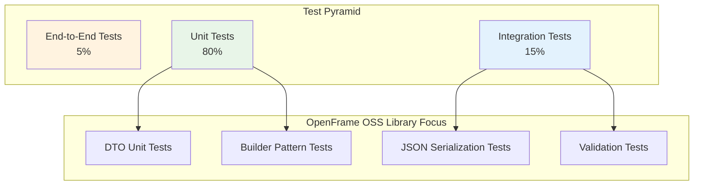

# Testing Overview

This guide covers the testing strategy, tools, and best practices for the OpenFrame OSS Library. Our comprehensive testing approach ensures reliability, maintainability, and confidence in the library's functionality.

## Testing Strategy

### Test Pyramid



### Testing Levels

| Test Level | Purpose | Coverage Target | Tools |
|------------|---------|----------------|--------|
| **Unit Tests** | Individual component testing | 80%+ line coverage | JUnit 5, AssertJ, Mockito |
| **Integration Tests** | Component interaction testing | 70%+ integration paths | TestContainers, Spring Test |
| **Serialization Tests** | JSON marshaling/unmarshaling | 100% DTO coverage | Jackson, JSONassert |
| **Property Tests** | Edge cases and data validation | Critical validation paths | JUnit 5 Parameterized |

## Test Structure and Organization

### Project Test Structure

```text
src/test/java/com/openframe/api/dto/
├── unit/
│   ├── audit/
│   │   ├── LogEventTest.java
│   │   ├── LogDetailsTest.java
│   │   └── LogFiltersTest.java
│   ├── device/
│   │   ├── DeviceFilterOptionTest.java
│   │   └── DeviceFiltersTest.java
│   └── GenericQueryResultTest.java
├── integration/
│   ├── SerializationIntegrationTest.java
│   └── FilterCompositionTest.java
├── utils/
│   ├── TestDataFactory.java
│   ├── JsonTestUtils.java
│   └── AssertionHelpers.java
└── fixtures/
    ├── json/
    │   ├── log-event-samples.json
    │   └── device-filter-samples.json
    └── data/
        └── test-datasets.sql
```

### Test Naming Conventions

**Class Naming:**
- Unit Tests: `{ClassName}Test.java`
- Integration Tests: `{Feature}IntegrationTest.java`
- Test Utilities: `{Purpose}TestUtils.java`

**Method Naming:**
```java
// Pattern: test{What}_{When}_{Then}
@Test
void testLogEventBuilder_withValidData_createsCorrectInstance() { }

@Test
void testDeviceFilters_withNullStatus_throwsException() { }

@Test
void testJsonSerialization_withCompleteLogEvent_preservesAllFields() { }
```

## Running Tests

### Command Line Execution

```bash
# Run all tests
mvn test

# Run specific test class
mvn test -Dtest=LogEventTest

# Run tests matching pattern
mvn test -Dtest="*SerializationTest"

# Run with coverage report
mvn test jacoco:report

# Run integration tests only
mvn test -Dtest="*IntegrationTest"

# Skip tests during build
mvn compile -DskipTests=true
```

### IDE Configuration

#### IntelliJ IDEA

1. **Configure Test Runner:**
   - Go to `Settings` → `Build, Execution, Deployment` → `Build Tools` → `Maven` → `Runner`
   - Check "Use project settings"
   - Set JVM options: `-XX:MaxPermSize=256m -Xmx1024m`

2. **Test Configuration Templates:**
   - `Run` → `Edit Configurations` → `Templates` → `JUnit`
   - Set VM options: `-ea -Dfile.encoding=UTF-8`
   - Set working directory: `$MODULE_WORKING_DIR$`

#### Eclipse

1. **Test Configuration:**
   - Right-click project → `Properties` → `Java Build Path` → `Libraries`
   - Add JUnit 5 library
   - Configure test source folders

### Continuous Integration

**GitHub Actions Configuration:**

```yaml
# .github/workflows/test.yml
name: Test Suite

on:
  push:
    branches: [ main, develop ]
  pull_request:
    branches: [ main ]

jobs:
  test:
    runs-on: ubuntu-latest
    
    strategy:
      matrix:
        java: [8, 11, 17]
    
    steps:
    - uses: actions/checkout@v3
    
    - name: Set up JDK ${{ matrix.java }}
      uses: actions/setup-java@v3
      with:
        java-version: ${{ matrix.java }}
        distribution: 'temurin'
    
    - name: Cache Maven dependencies
      uses: actions/cache@v3
      with:
        path: ~/.m2
        key: ${{ runner.os }}-m2-${{ hashFiles('**/pom.xml') }}
    
    - name: Run tests
      run: mvn test
    
    - name: Generate coverage report
      run: mvn jacoco:report
    
    - name: Upload coverage to Codecov
      uses: codecov/codecov-action@v3
      with:
        file: target/site/jacoco/jacoco.xml
```

## Writing Effective Tests

### Unit Testing Best Practices

#### 1. DTO Builder Testing

```java
package com.openframe.api.dto.unit.audit;

import com.openframe.api.dto.audit.LogEvent;
import org.junit.jupiter.api.Test;
import org.junit.jupiter.api.DisplayName;
import org.junit.jupiter.params.ParameterizedTest;
import org.junit.jupiter.params.provider.NullAndEmptySource;
import org.junit.jupiter.params.provider.ValueSource;

import java.time.Instant;

import static org.assertj.core.api.Assertions.*;

class LogEventTest {
    
    @Test
    @DisplayName("Builder should create LogEvent with all required fields")
    void testBuilder_withValidData_createsCorrectInstance() {
        // Given
        String expectedId = "evt_12345";
        String expectedType = "USER_LOGIN";
        Instant expectedTimestamp = Instant.now();
        
        // When
        LogEvent event = LogEvent.builder()
            .toolEventId(expectedId)
            .eventType(expectedType)
            .ingestDay("2024-01-15")
            .toolType("AUTHENTICATION")
            .severity("INFO")
            .userId("user_123")
            .deviceId("device_456")
            .hostname("app-server-01")
            .organizationId("org_123")
            .organizationName("Acme Corp")
            .summary("User login successful")
            .timestamp(expectedTimestamp)
            .build();
        
        // Then
        assertThat(event).isNotNull();
        assertThat(event.getToolEventId()).isEqualTo(expectedId);
        assertThat(event.getEventType()).isEqualTo(expectedType);
        assertThat(event.getTimestamp()).isEqualTo(expectedTimestamp);
    }
    
    @Test
    @DisplayName("Builder should handle null values correctly")
    void testBuilder_withNullValues_createsInstanceWithNulls() {
        // When
        LogEvent event = LogEvent.builder()
            .toolEventId("evt_123")
            .eventType(null) // Explicitly test null handling
            .build();
        
        // Then
        assertThat(event.getToolEventId()).isEqualTo("evt_123");
        assertThat(event.getEventType()).isNull();
    }
    
    @ParameterizedTest
    @ValueSource(strings = {"INFO", "WARN", "ERROR", "CRITICAL"})
    @DisplayName("Should accept valid severity levels")
    void testBuilder_withValidSeverities_acceptsValues(String severity) {
        // When
        LogEvent event = LogEvent.builder()
            .toolEventId("evt_123")
            .severity(severity)
            .build();
        
        // Then
        assertThat(event.getSeverity()).isEqualTo(severity);
    }
}
```

#### 2. Generic Query Result Testing

```java
package com.openframe.api.dto.unit;

import com.openframe.api.dto.GenericQueryResult;
import com.openframe.api.dto.CountedGenericQueryResult;
import com.openframe.api.dto.shared.CursorPageInfo;
import com.openframe.api.dto.audit.LogEvent;
import com.openframe.api.dto.utils.TestDataFactory;
import org.junit.jupiter.api.Test;
import org.junit.jupiter.api.Nested;

import java.util.Arrays;
import java.util.List;

import static org.assertj.core.api.Assertions.*;

class GenericQueryResultTest {
    
    @Nested
    @DisplayName("GenericQueryResult Tests")
    class GenericQueryResultTests {
        
        @Test
        @DisplayName("Should create result with items and page info")
        void testBuilder_withItemsAndPageInfo_createsValidResult() {
            // Given
            List<LogEvent> events = Arrays.asList(
                TestDataFactory.defaultLogEvent().build(),
                TestDataFactory.defaultLogEvent().toolEventId("evt_456").build()
            );
            
            CursorPageInfo pageInfo = CursorPageInfo.builder()
                .hasNextPage(false)
                .hasPreviousPage(false)
                .startCursor("cursor_start")
                .endCursor("cursor_end")
                .build();
            
            // When
            GenericQueryResult<LogEvent> result = GenericQueryResult.<LogEvent>builder()
                .items(events)
                .pageInfo(pageInfo)
                .build();
            
            // Then
            assertThat(result.getItems()).hasSize(2);
            assertThat(result.getPageInfo()).isEqualTo(pageInfo);
            assertThat(result.getPageInfo().isHasNextPage()).isFalse();
        }
    }
    
    @Nested
    @DisplayName("CountedGenericQueryResult Tests")
    class CountedGenericQueryResultTests {
        
        @Test
        @DisplayName("Should extend GenericQueryResult with count")
        void testCountedResult_withFilteredCount_includesCount() {
            // Given
            List<String> items = Arrays.asList("item1", "item2");
            Integer expectedCount = 150;
            
            // When
            CountedGenericQueryResult<String> result = 
                CountedGenericQueryResult.<String>builder()
                    .items(items)
                    .filteredCount(expectedCount)
                    .build();
            
            // Then
            assertThat(result.getItems()).containsExactly("item1", "item2");
            assertThat(result.getFilteredCount()).isEqualTo(expectedCount);
        }
    }
}
```

### Integration Testing

#### JSON Serialization Testing

```java
package com.openframe.api.dto.integration;

import com.fasterxml.jackson.databind.ObjectMapper;
import com.fasterxml.jackson.datatype.jsr310.JavaTimeModule;
import com.openframe.api.dto.audit.LogEvent;
import com.openframe.api.dto.audit.LogDetails;
import com.openframe.api.dto.utils.TestDataFactory;
import com.openframe.api.dto.utils.JsonTestUtils;
import org.junit.jupiter.api.BeforeEach;
import org.junit.jupiter.api.Test;
import org.skyscreamer.jsonassert.JSONAssert;

import static org.assertj.core.api.Assertions.*;

class SerializationIntegrationTest {
    
    private ObjectMapper objectMapper;
    
    @BeforeEach
    void setUp() {
        objectMapper = new ObjectMapper();
        objectMapper.registerModule(new JavaTimeModule());
        objectMapper.configure(
            com.fasterxml.jackson.databind.SerializationFeature.WRITE_DATES_AS_TIMESTAMPS, 
            false
        );
    }
    
    @Test
    void testLogEventSerialization_roundTrip_preservesAllData() throws Exception {
        // Given
        LogEvent originalEvent = TestDataFactory.defaultLogEvent()
            .toolEventId("evt_serialize_test")
            .eventType("SERIALIZATION_TEST")
            .build();
        
        // When - Serialize to JSON
        String json = objectMapper.writeValueAsString(originalEvent);
        
        // Then - Verify JSON structure
        assertThat(json).isNotBlank();
        JsonTestUtils.assertJsonContainsField(json, "toolEventId", "evt_serialize_test");
        JsonTestUtils.assertJsonContainsField(json, "eventType", "SERIALIZATION_TEST");
        
        // When - Deserialize back to object
        LogEvent deserializedEvent = objectMapper.readValue(json, LogEvent.class);
        
        // Then - Verify round-trip integrity
        assertThat(deserializedEvent).isEqualTo(originalEvent);
        assertThat(deserializedEvent.getToolEventId())
            .isEqualTo(originalEvent.getToolEventId());
        assertThat(deserializedEvent.getTimestamp())
            .isEqualTo(originalEvent.getTimestamp());
    }
    
    @Test
    void testLogDetailsExtendedSerialization() throws Exception {
        // Given
        LogDetails originalDetails = TestDataFactory.defaultLogDetails()
            .message("Extended log message with details")
            .detail("Additional context: session=abc123, ip=192.168.1.1")
            .build();
        
        // When
        String json = objectMapper.writeValueAsString(originalDetails);
        LogDetails deserialized = objectMapper.readValue(json, LogDetails.class);
        
        // Then
        assertThat(deserialized.getMessage()).isEqualTo(originalDetails.getMessage());
        assertThat(deserialized.getDetail()).isEqualTo(originalDetails.getDetail());
        
        // Verify inheritance fields are preserved
        assertThat(deserialized.getToolEventId())
            .isEqualTo(originalDetails.getToolEventId());
    }
    
    @Test
    void testJsonSchemaCompliance() throws Exception {
        // Given
        LogEvent event = TestDataFactory.defaultLogEvent().build();
        String actualJson = objectMapper.writeValueAsString(event);
        
        // Expected JSON structure
        String expectedStructure = JsonTestUtils.loadJsonFixture("log-event-expected.json");
        
        // Then - Compare JSON structures (ignoring dynamic values)
        JSONAssert.assertEquals(expectedStructure, actualJson, false);
    }
}
```

### Test Utilities and Helpers

#### Test Data Factory

```java
package com.openframe.api.dto.utils;

import com.openframe.api.dto.audit.LogEvent;
import com.openframe.api.dto.audit.LogDetails;
import com.openframe.api.dto.device.DeviceFilterOption;
import com.openframe.api.dto.shared.CursorPageInfo;

import java.time.Instant;
import java.util.concurrent.atomic.AtomicLong;

public class TestDataFactory {
    
    private static final AtomicLong COUNTER = new AtomicLong(1);
    
    public static LogEvent.LogEventBuilder defaultLogEvent() {
        long id = COUNTER.getAndIncrement();
        return LogEvent.builder()
            .toolEventId("test_evt_" + id)
            .eventType("TEST_EVENT")
            .ingestDay("2024-01-15")
            .toolType("TEST_TOOL")
            .severity("INFO")
            .userId("test_user_" + id)
            .deviceId("test_device_" + id)
            .hostname("test-host-" + id + ".example.com")
            .organizationId("test_org_" + id)
            .organizationName("Test Organization " + id)
            .summary("Test event summary " + id)
            .timestamp(Instant.now());
    }
    
    public static LogDetails.LogDetailsBuilder defaultLogDetails() {
        long id = COUNTER.getAndIncrement();
        return LogDetails.builder()
            .toolEventId("test_det_" + id)
            .eventType("TEST_EVENT")
            .ingestDay("2024-01-15")
            .toolType("TEST_TOOL")
            .severity("INFO")
            .userId("test_user_" + id)
            .deviceId("test_device_" + id)
            .hostname("test-host-" + id + ".example.com")
            .organizationId("test_org_" + id)
            .organizationName("Test Organization " + id)
            .summary("Test event summary " + id)
            .timestamp(Instant.now())
            .message("Test log details message " + id)
            .detail("Test detail information " + id);
    }
    
    public static DeviceFilterOption.DeviceFilterOptionBuilder defaultDeviceFilterOption() {
        long id = COUNTER.getAndIncrement();
        return DeviceFilterOption.builder()
            .value("TEST_VALUE_" + id)
            .label("Test Label " + id)
            .count((int) (id % 100));
    }
    
    public static CursorPageInfo.CursorPageInfoBuilder defaultPageInfo() {
        return CursorPageInfo.builder()
            .hasNextPage(false)
            .hasPreviousPage(false)
            .startCursor("start_cursor_test")
            .endCursor("end_cursor_test");
    }
    
    // Factory methods for common test scenarios
    public static LogEvent createLoginEvent(String userId, String organizationId) {
        return defaultLogEvent()
            .eventType("USER_LOGIN")
            .toolType("AUTHENTICATION")
            .userId(userId)
            .organizationId(organizationId)
            .summary("User login event")
            .build();
    }
    
    public static LogEvent createErrorEvent(String severity, String message) {
        return defaultLogEvent()
            .eventType("ERROR_EVENT")
            .severity(severity)
            .summary(message)
            .build();
    }
}
```

#### JSON Test Utilities

```java
package com.openframe.api.dto.utils;

import com.fasterxml.jackson.databind.JsonNode;
import com.fasterxml.jackson.databind.ObjectMapper;

import java.io.IOException;
import java.io.InputStream;
import java.nio.charset.StandardCharsets;

import static org.assertj.core.api.Assertions.*;

public class JsonTestUtils {
    
    private static final ObjectMapper OBJECT_MAPPER = new ObjectMapper();
    
    public static void assertJsonContainsField(String json, String fieldName, Object expectedValue) {
        try {
            JsonNode node = OBJECT_MAPPER.readTree(json);
            assertThat(node.has(fieldName))
                .as("JSON should contain field: " + fieldName)
                .isTrue();
            
            if (expectedValue instanceof String) {
                assertThat(node.get(fieldName).asText()).isEqualTo(expectedValue);
            } else if (expectedValue instanceof Integer) {
                assertThat(node.get(fieldName).asInt()).isEqualTo(expectedValue);
            } else if (expectedValue instanceof Boolean) {
                assertThat(node.get(fieldName).asBoolean()).isEqualTo(expectedValue);
            }
        } catch (IOException e) {
            fail("Failed to parse JSON: " + json, e);
        }
    }
    
    public static String loadJsonFixture(String filename) {
        try (InputStream is = JsonTestUtils.class.getResourceAsStream("/fixtures/json/" + filename)) {
            assertThat(is).as("Fixture file should exist: " + filename).isNotNull();
            return new String(is.readAllBytes(), StandardCharsets.UTF_8);
        } catch (IOException e) {
            fail("Failed to load JSON fixture: " + filename, e);
            return null;
        }
    }
    
    public static void assertJsonStructureMatches(String actualJson, String expectedJson) {
        try {
            JsonNode actual = OBJECT_MAPPER.readTree(actualJson);
            JsonNode expected = OBJECT_MAPPER.readTree(expectedJson);
            
            assertThat(actual.fieldNames())
                .as("JSON should have matching field structure")
                .containsExactlyInAnyOrderElementsOf(
                    () -> expected.fieldNames()
                );
        } catch (IOException e) {
            fail("Failed to compare JSON structures", e);
        }
    }
}
```

## Coverage Requirements

### Coverage Targets

| Component Type | Minimum Coverage | Target Coverage | Critical Path Coverage |
|----------------|------------------|-----------------|----------------------|
| **DTOs** | 80% | 90% | 100% |
| **Builders** | 85% | 95% | 100% |
| **Filters** | 80% | 90% | 95% |
| **Query Results** | 85% | 95% | 100% |
| **Utilities** | 70% | 80% | 90% |

### Coverage Configuration

**Maven Jacoco Plugin:**

```xml
<plugin>
    <groupId>org.jacoco</groupId>
    <artifactId>jacoco-maven-plugin</artifactId>
    <version>0.8.8</version>
    <executions>
        <execution>
            <goals>
                <goal>prepare-agent</goal>
            </goals>
        </execution>
        <execution>
            <id>report</id>
            <phase>test</phase>
            <goals>
                <goal>report</goal>
            </goals>
        </execution>
        <execution>
            <id>check</id>
            <goals>
                <goal>check</goal>
            </goals>
            <configuration>
                <rules>
                    <rule>
                        <element>PACKAGE</element>
                        <limits>
                            <limit>
                                <counter>LINE</counter>
                                <value>COVEREDRATIO</value>
                                <minimum>0.80</minimum>
                            </limit>
                        </limits>
                    </rule>
                </rules>
            </configuration>
        </execution>
    </executions>
</plugin>
```

### Excluding Coverage

```java
// Use custom annotation for coverage exclusion
@ExcludeFromJacocoGeneratedReport
public String toString() {
    // Lombok-generated code that doesn't need coverage
    return super.toString();
}
```

## Quality Gates and Best Practices

### Pre-commit Hooks

```bash
#!/bin/bash
# .git/hooks/pre-commit

echo "Running pre-commit quality checks..."

# Run fast test suite
echo "Running fast tests..."
mvn test -Dtest="*Test" -DforkCount=1
if [ $? -ne 0 ]; then
    echo "❌ Fast tests failed"
    exit 1
fi

# Check code style
echo "Checking code style..."
mvn checkstyle:check
if [ $? -ne 0 ]; then
    echo "❌ Code style violations found"
    exit 1
fi

# Verify coverage
echo "Checking test coverage..."
mvn jacoco:check
if [ $? -ne 0 ]; then
    echo "❌ Coverage requirements not met"
    exit 1
fi

echo "✅ All quality checks passed"
```

### Test Best Practices

1. **Test Naming**: Use descriptive names that explain the test scenario
2. **AAA Pattern**: Arrange, Act, Assert structure for clarity
3. **Single Responsibility**: Each test should verify one specific behavior
4. **Data Independence**: Tests should not depend on external data
5. **Fast Execution**: Unit tests should run quickly (< 1s each)
6. **Deterministic**: Tests should produce consistent results
7. **Readable**: Tests serve as documentation for expected behavior

### Common Testing Anti-patterns to Avoid

❌ **Don't:**
```java
@Test
void testEverything() {
    // Testing multiple unrelated things
    LogEvent event = LogEvent.builder().build();
    assertThat(event).isNotNull();
    
    DeviceFilters filters = DeviceFilters.builder().build();
    assertThat(filters).isNotNull();
    
    // Too much in one test
}
```

✅ **Do:**
```java
@Test
void testLogEventBuilder_withMinimalData_createsValidInstance() {
    LogEvent event = LogEvent.builder()
        .toolEventId("evt_123")
        .build();
    
    assertThat(event.getToolEventId()).isEqualTo("evt_123");
}

@Test
void testDeviceFiltersBuilder_withDefaultValues_createsEmptyFilters() {
    DeviceFilters filters = DeviceFilters.builder().build();
    
    assertThat(filters.getStatus()).isNull();
    assertThat(filters.getFilteredDevicesCount()).isNull();
}
```

## Continuous Integration Integration

### Pipeline Configuration

```yaml
# Complete test pipeline
stages:
  - compile
  - unit-test
  - integration-test
  - coverage-report
  - quality-gate

unit-test:
  stage: unit-test
  script:
    - mvn test -Dtest="*Test"
  artifacts:
    reports:
      junit: target/surefire-reports/TEST-*.xml

integration-test:
  stage: integration-test
  script:
    - mvn test -Dtest="*IntegrationTest"
  artifacts:
    reports:
      junit: target/surefire-reports/TEST-*.xml

coverage-report:
  stage: coverage-report
  script:
    - mvn jacoco:report
    - mvn jacoco:check
  artifacts:
    reports:
      coverage_report:
        coverage_format: jacoco
        path: target/site/jacoco/jacoco.xml
```

---

## Summary

The OpenFrame OSS Library testing strategy ensures:

1. **Comprehensive Coverage**: Unit, integration, and serialization tests
2. **Quality Gates**: Automated coverage and style checking
3. **Fast Feedback**: Quick test execution in development cycles
4. **Maintainability**: Clear test structure and utilities
5. **Documentation**: Tests serve as usage examples

**Next Steps**: Implement testing for your contributions following these patterns and explore the [Contributing Guidelines](../contributing/guidelines.md) for code review requirements.