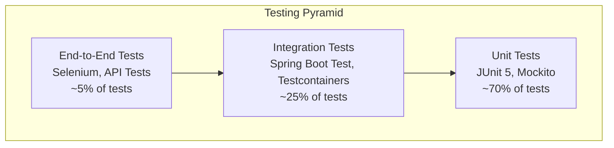

# Testing Overview

Comprehensive testing is essential for maintaining the quality and reliability of OpenFrame OSS Library. This guide covers testing strategies, best practices, and tools used throughout the development process.

## Testing Philosophy

OpenFrame follows a **test-driven development (TDD)** approach with comprehensive test coverage across all layers of the application.

### Testing Pyramid



### Testing Principles

| Principle | Description | Implementation |
|-----------|-------------|----------------|
| **Fast Feedback** | Tests run quickly to enable rapid development | Unit tests complete in <1s, full suite <5min |
| **Reliable** | Tests are deterministic and stable | Proper mocking, isolated test environments |
| **Maintainable** | Tests are easy to understand and modify | Clear naming, good structure, minimal duplication |
| **Comprehensive** | All critical paths are covered | 80%+ code coverage, edge case testing |
| **Realistic** | Tests reflect real-world usage | Integration tests with real databases |

## Testing Framework and Tools

### Core Testing Stack

| Tool | Purpose | Usage |
|------|---------|--------|
| **JUnit 5** | Unit testing framework | All unit tests |
| **Mockito** | Mocking framework | Mock dependencies in unit tests |
| **Spring Boot Test** | Integration testing | Service and repository layer tests |
| **Testcontainers** | Database testing | Integration tests with real databases |
| **WireMock** | HTTP mocking | Mock external API calls |
| **AssertJ** | Assertion library | Fluent assertions in all tests |

### Additional Testing Tools

| Tool | Purpose | When to Use |
|------|---------|-------------|
| **TestBench** | UI testing | End-to-end web UI tests |
| **REST Assured** | API testing | Integration tests for REST endpoints |
| **JSONPath** | JSON assertions | Validate JSON response structure |
| **Awaitility** | Async testing | Test asynchronous operations |

## Unit Testing

Unit tests focus on testing individual components in isolation with mocked dependencies.

### Unit Test Structure

```java
@ExtendWith(MockitoExtension.class)
class DeviceServiceImplTest {
    
    @Mock
    private DeviceRepository deviceRepository;
    
    @Mock
    private DeviceMapper deviceMapper;
    
    @Mock
    private EventService eventService;
    
    @InjectMocks
    private DeviceServiceImpl deviceService;
    
    @Test
    @DisplayName("Should return devices when valid filter is provided")
    void shouldReturnDevicesWhenValidFilterProvided() {
        // Given
        DeviceFilterInput filter = DeviceFilterInput.builder()
            .types(List.of("DESKTOP", "LAPTOP"))
            .pagination(CursorPaginationInput.builder().first(10).build())
            .build();
            
        Device device1 = Device.builder()
            .id("device-1")
            .type(DeviceType.DESKTOP)
            .status("ACTIVE")
            .build();
            
        DeviceResponse response1 = DeviceResponse.builder()
            .id("device-1")
            .type("DESKTOP")
            .status("ACTIVE")
            .build();
        
        GenericQueryResult<Device> repositoryResult = GenericQueryResult.<Device>builder()
            .items(List.of(device1))
            .pageInfo(CursorPageInfo.builder()
                .hasNextPage(false)
                .hasPreviousPage(false)
                .build())
            .build();
            
        // When
        when(deviceMapper.toQueryFilter(filter)).thenReturn(new DeviceQueryFilter());
        when(deviceRepository.findWithFilter(any())).thenReturn(repositoryResult);
        when(deviceMapper.toResponseDTO(device1)).thenReturn(response1);
        
        GenericQueryResult<DeviceResponse> result = deviceService.searchDevices(filter);
        
        // Then
        assertThat(result.getItems()).hasSize(1);
        assertThat(result.getItems().get(0).getId()).isEqualTo("device-1");
        assertThat(result.getItems().get(0).getType()).isEqualTo("DESKTOP");
        
        verify(eventService).logDeviceQuery(filter, 1);
        verify(deviceRepository).findWithFilter(any(DeviceQueryFilter.class));
    }
}
```

### Unit Testing Best Practices

#### Test Naming Convention

```java
// Pattern: should[ExpectedBehavior]When[Condition]
@Test
void shouldThrowExceptionWhenDeviceNotFound() { }

@Test  
void shouldReturnEmptyListWhenNoDevicesMatchFilter() { }

@Test
void shouldUpdateDeviceStatusWhenValidStatusProvided() { }
```

#### Test Data Builders

Use the builder pattern for test data creation:

```java
public class DeviceTestDataBuilder {
    
    public static Device.DeviceBuilder aDevice() {
        return Device.builder()
            .id("device-001")
            .machineId("machine-001")
            .serialNumber("SN123456789")
            .model("Dell OptiPlex 7090")
            .osVersion("Windows 11 Pro")
            .status("ACTIVE")
            .type(DeviceType.DESKTOP)
            .lastCheckin(Instant.now())
            .createdAt(Instant.now())
            .updatedAt(Instant.now());
    }
    
    public static Device activeDesktopDevice() {
        return aDevice()
            .type(DeviceType.DESKTOP)
            .status("ACTIVE")
            .build();
    }
    
    public static Device offlineLaptopDevice() {
        return aDevice()
            .type(DeviceType.LAPTOP)
            .status("OFFLINE")
            .model("MacBook Pro M2")
            .osVersion("macOS 14.0")
            .build();
    }
}
```

#### Parameterized Tests

Test multiple scenarios efficiently:

```java
@ParameterizedTest
@CsvSource({
    "DESKTOP, true",
    "LAPTOP, true", 
    "SERVER, true",
    "INVALID, false"
})
@DisplayName("Should validate device types correctly")
void shouldValidateDeviceTypesCorrectly(String deviceType, boolean expectedValid) {
    // Test logic
    boolean isValid = DeviceType.isValid(deviceType);
    assertThat(isValid).isEqualTo(expectedValid);
}

@ParameterizedTest
@ValueSource(strings = {"", " ", "null"})
@DisplayName("Should reject invalid serial numbers") 
void shouldRejectInvalidSerialNumbers(String serialNumber) {
    // Test logic
    assertThatThrownBy(() -> deviceService.createDevice(serialNumber))
        .isInstanceOf(ValidationException.class);
}
```

## Integration Testing

Integration tests verify that components work together correctly, including database interactions.

### Spring Boot Test Configuration

```java
@SpringBootTest(webEnvironment = SpringBootTest.WebEnvironment.RANDOM_PORT)
@Testcontainers
@ActiveProfiles("test")
class DeviceRepositoryIntegrationTest {
    
    @Container
    static MongoDBContainer mongoDBContainer = new MongoDBContainer("mongo:7.0")
            .withExposedPorts(27017);
            
    @Container
    static GenericContainer<?> redisContainer = new GenericContainer<>("redis:7-alpine")
            .withExposedPorts(6379);
    
    @DynamicPropertySource
    static void configureProperties(DynamicPropertyRegistry registry) {
        registry.add("spring.data.mongodb.uri", mongoDBContainer::getReplicaSetUrl);
        registry.add("spring.redis.host", redisContainer::getHost);
        registry.add("spring.redis.port", redisContainer::getFirstMappedPort);
    }
    
    @Autowired
    private DeviceRepository deviceRepository;
    
    @Autowired
    private MongoTemplate mongoTemplate;
    
    @BeforeEach
    void setUp() {
        mongoTemplate.getCollection("devices").deleteMany(new Document());
    }
    
    @Test
    @DisplayName("Should persist and retrieve device correctly")
    void shouldPersistAndRetrieveDeviceCorrectly() {
        // Given
        Device device = DeviceTestDataBuilder.activeDesktopDevice();
        
        // When
        Device savedDevice = deviceRepository.save(device);
        Optional<Device> retrievedDevice = deviceRepository.findById(savedDevice.getId());
        
        // Then
        assertThat(retrievedDevice).isPresent();
        assertThat(retrievedDevice.get().getSerialNumber()).isEqualTo(device.getSerialNumber());
        assertThat(retrievedDevice.get().getType()).isEqualTo(device.getType());
    }
}
```

### Repository Testing

Test MongoDB queries and aggregations:

```java
@DataMongoTest
class DeviceRepositoryTest {
    
    @Autowired
    private TestEntityManager entityManager;
    
    @Autowired
    private DeviceRepository deviceRepository;
    
    @Test
    @DisplayName("Should find devices by organization ID")
    void shouldFindDevicesByOrganizationId() {
        // Given
        Device device1 = DeviceTestDataBuilder.aDevice()
            .organizationId("org-1")
            .build();
        Device device2 = DeviceTestDataBuilder.aDevice()
            .organizationId("org-2")
            .build();
            
        deviceRepository.saveAll(List.of(device1, device2));
        
        // When
        List<Device> org1Devices = deviceRepository.findByOrganizationId("org-1");
        
        // Then
        assertThat(org1Devices).hasSize(1);
        assertThat(org1Devices.get(0).getOrganizationId()).isEqualTo("org-1");
    }
    
    @Test
    @DisplayName("Should support cursor pagination") 
    void shouldSupportCursorPagination() {
        // Given - Create 15 devices
        List<Device> devices = IntStream.range(1, 16)
            .mapToObj(i -> DeviceTestDataBuilder.aDevice()
                .id("device-" + String.format("%03d", i))
                .serialNumber("SN" + String.format("%03d", i))
                .build())
            .collect(Collectors.toList());
            
        deviceRepository.saveAll(devices);
        
        // When - Get first page
        CursorPaginationInput pagination = CursorPaginationInput.builder()
            .first(5)
            .build();
            
        GenericQueryResult<Device> firstPage = deviceRepository
            .findWithPagination(pagination);
        
        // Then
        assertThat(firstPage.getItems()).hasSize(5);
        assertThat(firstPage.getPageInfo().isHasNextPage()).isTrue();
        assertThat(firstPage.getPageInfo().isHasPreviousPage()).isFalse();
        
        // When - Get second page
        CursorPaginationInput nextPagePagination = CursorPaginationInput.builder()
            .first(5)
            .after(firstPage.getPageInfo().getEndCursor())
            .build();
            
        GenericQueryResult<Device> secondPage = deviceRepository
            .findWithPagination(nextPagePagination);
        
        // Then
        assertThat(secondPage.getItems()).hasSize(5);
        assertThat(secondPage.getPageInfo().isHasPreviousPage()).isTrue();
    }
}
```

### Service Layer Integration Testing

Test service layer with real database interactions:

```java
@SpringBootTest
@ActiveProfiles("test")
@Transactional
class DeviceServiceIntegrationTest {
    
    @Autowired
    private DeviceService deviceService;
    
    @Autowired
    private DeviceRepository deviceRepository;
    
    @Test
    @DisplayName("Should create device and log event")
    void shouldCreateDeviceAndLogEvent() {
        // Given
        CreateDeviceRequest request = CreateDeviceRequest.builder()
            .machineId("machine-001")
            .serialNumber("SN123456789")
            .model("Dell OptiPlex 7090")
            .type("DESKTOP")
            .status("ACTIVE")
            .build();
        
        // When
        DeviceResponse response = deviceService.createDevice(request);
        
        // Then
        assertThat(response.getId()).isNotNull();
        assertThat(response.getSerialNumber()).isEqualTo("SN123456789");
        
        // Verify device was persisted
        Optional<Device> savedDevice = deviceRepository.findById(response.getId());
        assertThat(savedDevice).isPresent();
        
        // Verify event was logged
        // (Would need EventService mock or event verification)
    }
}
```

## Web Layer Testing

Test REST controllers and API endpoints.

### Controller Testing with MockMvc

```java
@WebMvcTest(DeviceController.class)
class DeviceControllerTest {
    
    @Autowired
    private MockMvc mockMvc;
    
    @MockBean
    private DeviceService deviceService;
    
    @Autowired
    private ObjectMapper objectMapper;
    
    @Test
    @DisplayName("Should return devices when valid search request")
    void shouldReturnDevicesWhenValidSearchRequest() throws Exception {
        // Given
        DeviceFilterInput filter = DeviceFilterInput.builder()
            .types(List.of("DESKTOP"))
            .pagination(CursorPaginationInput.builder().first(10).build())
            .build();
        
        DeviceResponse device = DeviceResponse.builder()
            .id("device-001")
            .serialNumber("SN123456789")
            .type("DESKTOP")
            .status("ACTIVE")
            .build();
        
        GenericQueryResult<DeviceResponse> result = GenericQueryResult.<DeviceResponse>builder()
            .items(List.of(device))
            .pageInfo(CursorPageInfo.builder()
                .hasNextPage(false)
                .hasPreviousPage(false)
                .build())
            .build();
        
        when(deviceService.searchDevices(any(DeviceFilterInput.class)))
            .thenReturn(result);
        
        // When & Then
        mockMvc.perform(post("/api/devices/search")
                .contentType(MediaType.APPLICATION_JSON)
                .content(objectMapper.writeValueAsString(filter)))
                .andExpect(status().isOk())
                .andExpect(jsonPath("$.items").isArray())
                .andExpected(jsonPath("$.items", hasSize(1)))
                .andExpected(jsonPath("$.items[0].id").value("device-001"))
                .andExpected(jsonPath("$.items[0].type").value("DESKTOP"))
                .andExpected(jsonPath("$.pageInfo.hasNextPage").value(false));
    }
    
    @Test
    @DisplayName("Should return 400 when invalid request body")
    void shouldReturn400WhenInvalidRequestBody() throws Exception {
        // Given - Invalid request with null pagination
        String invalidJson = """
            {
                "types": ["DESKTOP"],
                "pagination": null
            }
            """;
        
        // When & Then
        mockMvc.perform(post("/api/devices/search")
                .contentType(MediaType.APPLICATION_JSON)
                .content(invalidJson))
                .andExpect(status().isBadRequest())
                .andExpect(jsonPath("$.code").value("VALIDATION_ERROR"));
    }
}
```

### Full Integration API Testing

```java
@SpringBootTest(webEnvironment = SpringBootTest.WebEnvironment.RANDOM_PORT)
@Testcontainers
@ActiveProfiles("test")
class DeviceControllerIntegrationTest {
    
    @Autowired
    private TestRestTemplate restTemplate;
    
    @LocalServerPort
    private int port;
    
    @Container
    static MongoDBContainer mongoDBContainer = new MongoDBContainer("mongo:7.0");
    
    @DynamicPropertySource
    static void configureProperties(DynamicPropertyRegistry registry) {
        registry.add("spring.data.mongodb.uri", mongoDBContainer::getReplicaSetUrl);
    }
    
    @Test
    @DisplayName("Should create and retrieve device via API")
    void shouldCreateAndRetrieveDeviceViaAPI() {
        // Given
        CreateDeviceRequest request = CreateDeviceRequest.builder()
            .machineId("machine-api-test")
            .serialNumber("API123456789")
            .model("Dell OptiPlex 7090")
            .type("DESKTOP")
            .status("ACTIVE")
            .build();
        
        // When - Create device
        ResponseEntity<DeviceResponse> createResponse = restTemplate.postForEntity(
            "http://localhost:" + port + "/api/devices",
            request,
            DeviceResponse.class
        );
        
        // Then
        assertThat(createResponse.getStatusCode()).isEqualTo(HttpStatus.CREATED);
        assertThat(createResponse.getBody().getId()).isNotNull();
        
        // When - Retrieve device
        ResponseEntity<DeviceResponse> getResponse = restTemplate.getForEntity(
            "http://localhost:" + port + "/api/devices/" + createResponse.getBody().getId(),
            DeviceResponse.class
        );
        
        // Then
        assertThat(getResponse.getStatusCode()).isEqualTo(HttpStatus.OK);
        assertThat(getResponse.getBody().getSerialNumber()).isEqualTo("API123456789");
    }
}
```

## External Integration Testing

Test integrations with external systems using mocks and test containers.

### WireMock for External API Testing

```java
@SpringBootTest
@ActiveProfiles("test")
class FleetMdmIntegrationTest {
    
    @RegisterExtension
    static WireMockExtension wireMock = WireMockExtension.newInstance()
        .options(wireMockConfig().port(8089))
        .build();
    
    @Autowired
    private FleetMdmService fleetMdmService;
    
    @Test
    @DisplayName("Should sync devices from Fleet MDM")
    void shouldSyncDevicesFromFleetMdm() {
        // Given - Mock Fleet MDM API response
        wireMock.stubFor(get(urlEqualTo("/api/v1/fleet/hosts"))
            .willReturn(aResponse()
                .withStatus(200)
                .withHeader("Content-Type", "application/json")
                .withBody("""
                    {
                        "hosts": [
                            {
                                "id": 123,
                                "hostname": "desktop-001",
                                "os_version": "Windows 11",
                                "hardware_serial": "SN123456789"
                            }
                        ]
                    }
                    """)));
        
        // When
        List<Device> syncedDevices = fleetMdmService.syncDevices("connection-123");
        
        // Then
        assertThat(syncedDevices).hasSize(1);
        assertThat(syncedDevices.get(0).getSerialNumber()).isEqualTo("SN123456789");
        
        // Verify API was called
        wireMock.verify(getRequestedFor(urlEqualTo("/api/v1/fleet/hosts")));
    }
}
```

## Test Configuration and Setup

### Test Application Properties

**`application-test.yml`:**

```yaml
spring:
  profiles:
    active: test
    
  # Test database configuration
  data:
    mongodb:
      auto-index-creation: true
  
  # Test Redis configuration
  redis:
    database: 1  # Use different database for tests
    timeout: 1s
  
  # Disable security for tests
  security:
    enabled: false
  
  # Test-specific JPA settings
  jpa:
    hibernate:
      ddl-auto: create-drop
    show-sql: false

# Logging configuration for tests
logging:
  level:
    com.openframe: DEBUG
    org.springframework.test: INFO
    org.testcontainers: INFO
  pattern:
    console: "%clr(%d{HH:mm:ss.SSS}){blue} %clr(%-5level) %clr([%thread]){magenta} %clr(%logger{20}){cyan} - %msg%n"

# OpenFrame test configuration
openframe:
  security:
    enabled: false
    jwt:
      secret: test-secret-key
  features:
    audit-logging: false  # Disable for faster tests
    metrics-collection: false

# Management endpoints for testing
management:
  endpoints:
    web:
      exposure:
        include: health,metrics
```

### Test Database Management

```java
@TestConfiguration
public class TestDatabaseConfiguration {
    
    @Bean
    @Primary
    public MongoTemplate testMongoTemplate() {
        return new MongoTemplate(MongoClients.create("mongodb://localhost:27017"), "openframe-test");
    }
    
    @EventListener
    public void handleContextRefresh(ContextRefreshedEvent event) {
        // Clean up test data before each test class
        MongoTemplate mongoTemplate = event.getApplicationContext()
            .getBean(MongoTemplate.class);
        mongoTemplate.getCollectionNames().forEach(mongoTemplate::dropCollection);
    }
}
```

## Test Data Management

### Test Data Builders

```java
public class TestDataFactory {
    
    public static Organization createTestOrganization() {
        return Organization.builder()
            .id("test-org-" + UUID.randomUUID().toString())
            .name("Test Organization")
            .domain("testorg.com")
            .contactInformation(ContactInformation.builder()
                .email("admin@testorg.com")
                .phone("+1-555-123-4567")
                .build())
            .build();
    }
    
    public static Device createTestDevice(String organizationId) {
        return Device.builder()
            .id("test-device-" + UUID.randomUUID().toString())
            .organizationId(organizationId)
            .machineId("test-machine-" + UUID.randomUUID().toString())
            .serialNumber("TEST" + System.currentTimeMillis())
            .model("Test Device")
            .osVersion("Test OS 1.0")
            .type(DeviceType.DESKTOP)
            .status("ACTIVE")
            .lastCheckin(Instant.now())
            .build();
    }
}
```

### Database State Management

```java
@Component
@Profile("test")
public class DatabaseTestHelper {
    
    @Autowired
    private MongoTemplate mongoTemplate;
    
    public void clearAllCollections() {
        mongoTemplate.getCollectionNames().forEach(collectionName -> {
            if (!collectionName.startsWith("system.")) {
                mongoTemplate.remove(new Query(), collectionName);
            }
        });
    }
    
    public void seedTestData() {
        // Create test organizations
        Organization testOrg = TestDataFactory.createTestOrganization();
        mongoTemplate.save(testOrg);
        
        // Create test devices
        Device testDevice = TestDataFactory.createTestDevice(testOrg.getId());
        mongoTemplate.save(testDevice);
    }
    
    public long getDocumentCount(String collection) {
        return mongoTemplate.getCollection(collection).countDocuments();
    }
}
```

## Performance Testing

### Load Testing with JUnit

```java
@Test
@DisplayName("Should handle concurrent device creation")
void shouldHandleConcurrentDeviceCreation() throws InterruptedException {
    // Given
    int numberOfThreads = 10;
    int devicesPerThread = 100;
    CountDownLatch latch = new CountDownLatch(numberOfThreads);
    List<Future<Integer>> futures = new ArrayList<>();
    
    ExecutorService executor = Executors.newFixedThreadPool(numberOfThreads);
    
    // When - Create devices concurrently
    for (int i = 0; i < numberOfThreads; i++) {
        final int threadId = i;
        Future<Integer> future = executor.submit(() -> {
            try {
                int created = 0;
                for (int j = 0; j < devicesPerThread; j++) {
                    CreateDeviceRequest request = CreateDeviceRequest.builder()
                        .machineId("machine-" + threadId + "-" + j)
                        .serialNumber("SN" + threadId + "-" + j)
                        .model("Test Device")
                        .type("DESKTOP")
                        .status("ACTIVE")
                        .build();
                    
                    deviceService.createDevice(request);
                    created++;
                }
                return created;
            } finally {
                latch.countDown();
            }
        });
        futures.add(future);
    }
    
    // Wait for all threads to complete
    latch.await(30, TimeUnit.SECONDS);
    
    // Then
    int totalCreated = futures.stream()
        .mapToInt(future -> {
            try {
                return future.get();
            } catch (Exception e) {
                return 0;
            }
        })
        .sum();
    
    assertThat(totalCreated).isEqualTo(numberOfThreads * devicesPerThread);
    
    executor.shutdown();
}
```

## Test Execution and Reporting

### Running Tests

#### Command Line Test Execution

```bash
# Run all tests
./gradlew test

# Run specific test class
./gradlew test --tests "DeviceServiceImplTest"

# Run specific test method
./gradlew test --tests "DeviceServiceImplTest.shouldReturnDevicesWhenValidFilterProvided"

# Run integration tests only
./gradlew integrationTest

# Run tests with coverage
./gradlew test jacocoTestReport

# Run tests in parallel
./gradlew test --parallel --max-workers=4

# Run tests with detailed output
./gradlew test --info
```

#### Test Categories

```java
// Fast unit tests
@Tag("unit")
@Test
void shouldValidateDeviceType() { }

// Slow integration tests  
@Tag("integration")
@Test
void shouldPersistToDatabase() { }

// External integration tests
@Tag("external")
@Test
void shouldConnectToFleetMdm() { }
```

```bash
# Run only unit tests
./gradlew test -Dgroups="unit"

# Run only integration tests
./gradlew test -Dgroups="integration"

# Exclude external tests
./gradlew test -DexcludedGroups="external"
```

### Test Coverage

#### JaCoCo Configuration

**`build.gradle`:**

```gradle
plugins {
    id 'jacoco'
}

jacocoTestReport {
    reports {
        xml.enabled true
        csv.enabled false
        html.destination file("${buildDir}/jacocoHtml")
    }
    
    afterEvaluate {
        classDirectories.setFrom(files(classDirectories.files.collect {
            fileTree(dir: it, exclude: [
                '**/dto/**',  // Exclude DTOs
                '**/config/**',  // Exclude configuration classes
                '**/*Application.*'  // Exclude main application class
            ])
        }))
    }
}

jacocoTestCoverageVerification {
    violationRules {
        rule {
            limit {
                minimum = 0.8  // 80% minimum coverage
            }
        }
    }
}

test {
    finalizedBy jacocoTestReport
}
```

#### Coverage Verification

```bash
# Generate coverage report
./gradlew test jacocoTestReport

# Verify coverage thresholds
./gradlew jacocoTestCoverageVerification

# Open HTML coverage report
open build/jacocoHtml/index.html
```

## Continuous Integration Testing

### GitHub Actions Configuration

**`.github/workflows/tests.yml`:**

```yaml
name: Tests

on:
  push:
    branches: [ main, develop ]
  pull_request:
    branches: [ main ]

jobs:
  unit-tests:
    runs-on: ubuntu-latest
    
    steps:
    - uses: actions/checkout@v3
    
    - name: Set up JDK 17
      uses: actions/setup-java@v3
      with:
        java-version: '17'
        distribution: 'temurin'
    
    - name: Cache Gradle packages
      uses: actions/cache@v3
      with:
        path: |
          ~/.gradle/caches
          ~/.gradle/wrapper
        key: ${{ runner.os }}-gradle-${{ hashFiles('**/*.gradle*', '**/gradle-wrapper.properties') }}
    
    - name: Run unit tests
      run: ./gradlew test --tests "*Test" --exclude-task integrationTest
    
    - name: Generate coverage report
      run: ./gradlew jacocoTestReport
    
    - name: Upload coverage to Codecov
      uses: codecov/codecov-action@v3
      with:
        file: ./build/reports/jacoco/test/jacocoTestReport.xml

  integration-tests:
    runs-on: ubuntu-latest
    
    services:
      mongodb:
        image: mongo:7.0
        ports:
          - 27017:27017
      redis:
        image: redis:7-alpine
        ports:
          - 6379:6379
    
    steps:
    - uses: actions/checkout@v3
    
    - name: Set up JDK 17
      uses: actions/setup-java@v3
      with:
        java-version: '17'
        distribution: 'temurin'
    
    - name: Run integration tests
      run: ./gradlew integrationTest
      env:
        MONGODB_URI: mongodb://localhost:27017/openframe-test
        REDIS_URL: redis://localhost:6379/1
```

## Testing Best Practices

### Test Organization

1. **Clear Test Structure** - Arrange, Act, Assert pattern
2. **Descriptive Names** - Test names describe behavior
3. **Single Responsibility** - One test, one behavior
4. **Independent Tests** - Tests don't depend on each other
5. **Fast Execution** - Optimize for speed

### Mocking Guidelines

```java
// ✅ Good: Mock external dependencies
@Mock
private ExternalApiClient externalApiClient;

// ✅ Good: Mock complex collaborators
@Mock  
private DeviceRepository deviceRepository;

// ❌ Avoid: Mocking value objects
// Don't mock DTOs, entities, or simple data structures

// ❌ Avoid: Over-mocking
// Don't mock everything - test real interactions when possible
```

### Test Data Management

```java
// ✅ Good: Use builders for test data
Device device = DeviceTestDataBuilder.aDevice()
    .withType(DeviceType.LAPTOP)
    .withStatus("ACTIVE")
    .build();

// ✅ Good: Create meaningful test data
Device expiredDevice = DeviceTestDataBuilder.aDevice()
    .withLastCheckin(Instant.now().minus(30, ChronoUnit.DAYS))
    .build();

// ❌ Avoid: Hard-coded magic values
Device device = new Device();
device.setId("123");  // What does "123" represent?
device.setStatus("A");  // What does "A" mean?
```

## Troubleshooting Tests

### Common Issues

| Issue | Symptoms | Solution |
|-------|----------|----------|
| **Flaky Tests** | Tests pass/fail randomly | Fix timing issues, improve test isolation |
| **Slow Tests** | Tests take too long | Mock external dependencies, optimize database queries |
| **Test Pollution** | Tests affect each other | Use `@Transactional` or proper cleanup |
| **Memory Leaks** | Tests run out of memory | Clean up resources, use test slices |

### Debugging Test Failures

```java
// Enable detailed logging for failing tests
@Test
@EnabledIf("#{systemProperties['test.debug'] == 'true'}")
void debuggingTest() {
    // Test implementation with detailed logging
    log.debug("Test state: {}", testState);
}
```

```bash
# Run with debug output
./gradlew test --info --debug-jvm -Dtest.debug=true

# Run single test with debugging
./gradlew test --tests "DeviceServiceTest.shouldCreateDevice" --debug-jvm
```

## Next Steps

With comprehensive testing in place:

1. **[Contributing Guidelines](../contributing/guidelines.md)** - Learn how to contribute
2. **[Local Development](../setup/local-development.md)** - Set up development environment
3. **[Architecture Overview](../architecture/overview.md)** - Understand system design

## Resources

- 📖 **[JUnit 5 Documentation](https://junit.org/junit5/docs/current/user-guide/)**
- 📖 **[Spring Boot Testing](https://spring.io/guides/gs/testing-web/)**
- 📖 **[Testcontainers Documentation](https://www.testcontainers.org/)**
- 📖 **[Mockito Documentation](https://javadoc.io/doc/org.mockito/mockito-core/latest/org/mockito/Mockito.html)**

Remember: **Good tests are the foundation of reliable software**. Invest time in writing comprehensive, maintainable tests that give you confidence in your code! 🧪