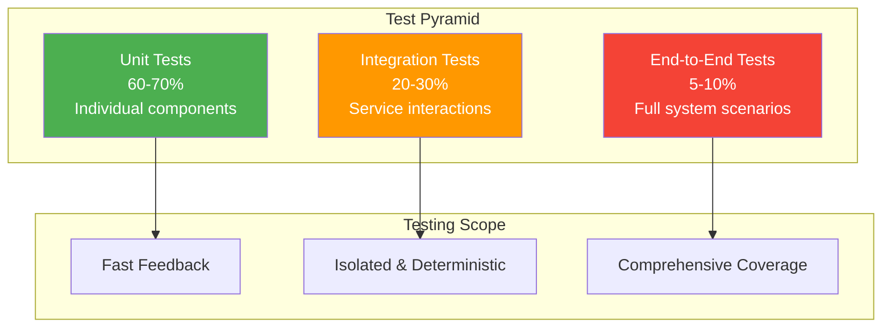
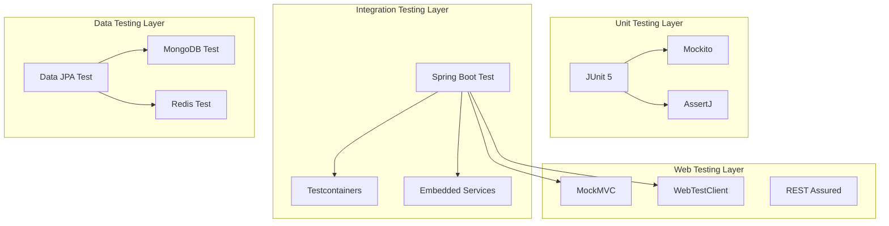

# Testing Overview

OpenFrame OSS Library follows comprehensive testing practices to ensure reliability, maintainability, and quality across all modules. This guide covers testing strategies, frameworks, patterns, and best practices used throughout the codebase.

## Testing Philosophy

### Test Pyramid

OpenFrame follows the test pyramid approach for balanced and efficient testing:



### Testing Principles

1. **Test Early & Often** - Write tests as you develop
2. **Fast Feedback** - Unit tests should run in milliseconds
3. **Deterministic** - Tests should be predictable and repeatable
4. **Isolated** - Tests should not depend on each other
5. **Readable** - Tests should be clear and self-documenting

## Testing Framework Stack

### Core Testing Dependencies

```xml
<dependencies>
    <!-- JUnit 5 - Main testing framework -->
    <dependency>
        <groupId>org.junit.jupiter</groupId>
        <artifactId>junit-jupiter</artifactId>
        <scope>test</scope>
    </dependency>
    
    <!-- Spring Boot Test - Integration testing -->
    <dependency>
        <groupId>org.springframework.boot</groupId>
        <artifactId>spring-boot-starter-test</artifactId>
        <scope>test</scope>
    </dependency>
    
    <!-- Testcontainers - Database testing -->
    <dependency>
        <groupId>org.testcontainers</groupId>
        <artifactId>junit-jupiter</artifactId>
        <scope>test</scope>
    </dependency>
    <dependency>
        <groupId>org.testcontainers</groupId>
        <artifactId>mongodb</artifactId>
        <scope>test</scope>
    </dependency>
    
    <!-- Mockito - Mocking framework -->
    <dependency>
        <groupId>org.mockito</groupId>
        <artifactId>mockito-core</artifactId>
        <scope>test</scope>
    </dependency>
    
    <!-- AssertJ - Fluent assertions -->
    <dependency>
        <groupId>org.assertj</groupId>
        <artifactId>assertj-core</artifactId>
        <scope>test</scope>
    </dependency>
    
    <!-- WireMock - HTTP service mocking -->
    <dependency>
        <groupId>com.github.tomakehurst</groupId>
        <artifactId>wiremock-jre8</artifactId>
        <scope>test</scope>
    </dependency>
</dependencies>
```

### Testing Architecture



## Unit Testing Patterns

### Service Layer Testing

```java
@ExtendWith(MockitoExtension.class)
class OrganizationServiceTest {

    @Mock
    private OrganizationRepository organizationRepository;
    
    @Mock
    private EventPublisher eventPublisher;
    
    @InjectMocks
    private OrganizationService organizationService;
    
    @Test
    void shouldCreateOrganizationSuccessfully() {
        // Given
        CreateOrganizationRequest request = CreateOrganizationRequest.builder()
            .name("Test MSP")
            .domain("test-msp.com")
            .email("admin@test-msp.com")
            .build();
            
        Organization expectedOrg = Organization.builder()
            .id("org123")
            .name("Test MSP")
            .domain("test-msp.com")
            .status(OrganizationStatus.ACTIVE)
            .createdAt(Instant.now())
            .build();
            
        when(organizationRepository.save(any(Organization.class)))
            .thenReturn(expectedOrg);
        
        // When
        Organization result = organizationService.createOrganization(request);
        
        // Then
        assertThat(result)
            .isNotNull()
            .satisfies(org -> {
                assertThat(org.getName()).isEqualTo("Test MSP");
                assertThat(org.getDomain()).isEqualTo("test-msp.com");
                assertThat(org.getStatus()).isEqualTo(OrganizationStatus.ACTIVE);
            });
        
        verify(organizationRepository).save(any(Organization.class));
        verify(eventPublisher).publish(any(OrganizationCreatedEvent.class));
    }
    
    @Test
    void shouldThrowExceptionWhenDomainAlreadyExists() {
        // Given
        CreateOrganizationRequest request = CreateOrganizationRequest.builder()
            .name("Test MSP")
            .domain("existing-domain.com")
            .build();
            
        when(organizationRepository.findByDomain("existing-domain.com"))
            .thenReturn(Optional.of(new Organization()));
        
        // When & Then
        assertThatThrownBy(() -> organizationService.createOrganization(request))
            .isInstanceOf(DomainAlreadyExistsException.class)
            .hasMessage("Organization with domain 'existing-domain.com' already exists");
            
        verify(organizationRepository, never()).save(any());
        verify(eventPublisher, never()).publish(any());
    }
}
```

### Repository Testing Pattern

```java
@DataMongoTest
@Testcontainers
class OrganizationRepositoryTest {

    @Container
    static MongoDBContainer mongoDBContainer = new MongoDBContainer("mongo:7")
            .withReuse(true);

    @Autowired
    private OrganizationRepository organizationRepository;
    
    @DynamicPropertySource
    static void configureProperties(DynamicPropertyRegistry registry) {
        registry.add("spring.data.mongodb.uri", mongoDBContainer::getReplicaSetUrl);
    }
    
    @Test
    void shouldFindOrganizationByDomain() {
        // Given
        Organization org = Organization.builder()
            .name("Test Organization")
            .domain("test.com")
            .status(OrganizationStatus.ACTIVE)
            .createdAt(Instant.now())
            .build();
            
        organizationRepository.save(org);
        
        // When
        Optional<Organization> found = organizationRepository.findByDomain("test.com");
        
        // Then
        assertThat(found)
            .isPresent()
            .get()
            .satisfies(foundOrg -> {
                assertThat(foundOrg.getName()).isEqualTo("Test Organization");
                assertThat(foundOrg.getDomain()).isEqualTo("test.com");
                assertThat(foundOrg.getStatus()).isEqualTo(OrganizationStatus.ACTIVE);
            });
    }
    
    @Test
    void shouldReturnEmptyWhenDomainNotFound() {
        // When
        Optional<Organization> found = organizationRepository.findByDomain("nonexistent.com");
        
        // Then
        assertThat(found).isEmpty();
    }
    
    @Test
    void shouldFindActiveOrganizationsWithPremiumPlan() {
        // Given
        Organization activeOrg = createOrganization("Active Org", "active.com", 
            OrganizationStatus.ACTIVE, TenantPlan.PREMIUM);
        Organization inactiveOrg = createOrganization("Inactive Org", "inactive.com", 
            OrganizationStatus.SUSPENDED, TenantPlan.PREMIUM);
        Organization basicOrg = createOrganization("Basic Org", "basic.com", 
            OrganizationStatus.ACTIVE, TenantPlan.BASIC);
            
        organizationRepository.saveAll(List.of(activeOrg, inactiveOrg, basicOrg));
        
        // When
        List<Organization> found = organizationRepository
            .findByStatusAndPlan(OrganizationStatus.ACTIVE, TenantPlan.PREMIUM);
        
        // Then
        assertThat(found)
            .hasSize(1)
            .extracting(Organization::getName)
            .containsExactly("Active Org");
    }
    
    private Organization createOrganization(String name, String domain, 
                                          OrganizationStatus status, TenantPlan plan) {
        return Organization.builder()
            .name(name)
            .domain(domain)
            .status(status)
            .plan(plan)
            .createdAt(Instant.now())
            .build();
    }
}
```

## Integration Testing

### Web Layer Integration Testing

```java
@SpringBootTest(webEnvironment = SpringBootTest.WebEnvironment.RANDOM_PORT)
@AutoConfigureMockMvc
@Testcontainers
class OrganizationControllerIntegrationTest {

    @Container
    static MongoDBContainer mongoDBContainer = new MongoDBContainer("mongo:7")
            .withReuse(true);
            
    @Container 
    static GenericContainer<?> redisContainer = new GenericContainer<>("redis:7-alpine")
            .withExposedPorts(6379)
            .withReuse(true);

    @Autowired
    private MockMvc mockMvc;
    
    @Autowired
    private OrganizationRepository organizationRepository;
    
    @DynamicPropertySource
    static void configureProperties(DynamicPropertyRegistry registry) {
        registry.add("spring.data.mongodb.uri", mongoDBContainer::getReplicaSetUrl);
        registry.add("spring.data.redis.host", redisContainer::getHost);
        registry.add("spring.data.redis.port", redisContainer::getFirstMappedPort);
    }
    
    @BeforeEach
    void setUp() {
        organizationRepository.deleteAll();
    }
    
    @Test
    @WithMockUser(authorities = "ADMIN")
    void shouldCreateOrganizationViaAPI() throws Exception {
        // Given
        CreateOrganizationRequest request = CreateOrganizationRequest.builder()
            .name("API Test MSP")
            .domain("api-test.com")
            .email("admin@api-test.com")
            .phone("+1-555-0123")
            .build();
        
        // When & Then
        mockMvc.perform(post("/api/v1/organizations")
                .contentType(MediaType.APPLICATION_JSON)
                .content(asJsonString(request)))
                .andExpect(status().isCreated())
                .andExpected(jsonPath("$.name").value("API Test MSP"))
                .andExpected(jsonPath("$.domain").value("api-test.com"))
                .andExpected(jsonPath("$.contactInformation.email").value("admin@api-test.com"))
                .andExpected(jsonPath("$.id").exists())
                .andExpected(jsonPath("$.createdAt").exists());
        
        // Verify database state
        Optional<Organization> savedOrg = organizationRepository.findByDomain("api-test.com");
        assertThat(savedOrg).isPresent();
    }
    
    @Test
    @WithMockUser(authorities = "USER")
    void shouldGetOrganizationById() throws Exception {
        // Given
        Organization org = Organization.builder()
            .name("Test Organization")
            .domain("test.com")
            .status(OrganizationStatus.ACTIVE)
            .createdAt(Instant.now())
            .build();
            
        Organization saved = organizationRepository.save(org);
        
        // When & Then
        mockMvc.perform(get("/api/v1/organizations/{id}", saved.getId()))
                .andExpect(status().isOk())
                .andExpected(jsonPath("$.id").value(saved.getId()))
                .andExpected(jsonPath("$.name").value("Test Organization"))
                .andExpected(jsonPath("$.domain").value("test.com"));
    }
    
    @Test  
    @WithMockUser(authorities = "USER")
    void shouldReturn404WhenOrganizationNotFound() throws Exception {
        // When & Then
        mockMvc.perform(get("/api/v1/organizations/{id}", "nonexistent"))
                .andExpect(status().isNotFound());
    }
    
    private String asJsonString(Object obj) {
        try {
            return new ObjectMapper().writeValueAsString(obj);
        } catch (Exception e) {
            throw new RuntimeException(e);
        }
    }
}
```

### GraphQL Integration Testing

```java
@SpringBootTest
@AutoConfigureTestDatabase(replace = AutoConfigureTestDatabase.Replace.NONE)
@Testcontainers
class OrganizationGraphQLIntegrationTest {

    @Container
    static MongoDBContainer mongoDBContainer = new MongoDBContainer("mongo:7")
            .withReuse(true);

    @Autowired
    private GraphQlTester graphQlTester;
    
    @Autowired
    private OrganizationRepository organizationRepository;
    
    @DynamicPropertySource
    static void configureProperties(DynamicPropertyRegistry registry) {
        registry.add("spring.data.mongodb.uri", mongoDBContainer::getReplicaSetUrl);
    }
    
    @Test
    void shouldQueryOrganizationWithDevices() {
        // Given
        Organization org = createTestOrganization();
        Device device = createTestDevice(org.getId());
        
        organizationRepository.save(org);
        
        // When & Then
        graphQlTester
                .document("""
                    query GetOrganization($id: ID!) {
                        organization(id: $id) {
                            id
                            name
                            domain
                            devices {
                                edges {
                                    node {
                                        id
                                        hostname
                                        deviceType
                                        status
                                    }
                                }
                            }
                        }
                    }
                """)
                .variable("id", org.getId())
                .execute()
                .path("organization")
                .entity(Organization.class)
                .satisfies(result -> {
                    assertThat(result.getName()).isEqualTo(org.getName());
                    assertThat(result.getDomain()).isEqualTo(org.getDomain());
                });
    }
}
```

## External Service Testing

### WireMock for HTTP Services

```java
@SpringBootTest
@TestMethodOrder(OrderAnnotation.class)
class FleetDMServiceIntegrationTest {

    @RegisterExtension
    static WireMockExtension wireMock = WireMockExtension.newInstance()
            .options(wireMockConfig().port(8089))
            .build();
    
    @Autowired
    private FleetDMService fleetDMService;
    
    @Test
    @Order(1)
    void shouldSearchHostsSuccessfully() {
        // Given
        wireMock.stubFor(post(urlEqualTo("/api/v1/fleet/hosts/search"))
                .withHeader("Authorization", containing("Bearer"))
                .willReturn(aResponse()
                        .withStatus(200)
                        .withHeader("Content-Type", "application/json")
                        .withBody("""
                            {
                                "hosts": [
                                    {
                                        "id": 1,
                                        "hostname": "test-host",
                                        "status": "online",
                                        "platform": "ubuntu"
                                    }
                                ]
                            }
                        """)));
        
        // When
        HostSearchResponse response = fleetDMService.searchHosts(
            HostSearchRequest.builder()
                .query("hostname:test-host")
                .build()
        );
        
        // Then
        assertThat(response.getHosts())
            .hasSize(1)
            .first()
            .satisfies(host -> {
                assertThat(host.getHostname()).isEqualTo("test-host");
                assertThat(host.getStatus()).isEqualTo("online");
                assertThat(host.getPlatform()).isEqualTo("ubuntu");
            });
            
        // Verify request was made
        wireMock.verify(postRequestedFor(urlEqualTo("/api/v1/fleet/hosts/search"))
                .withHeader("Authorization", containing("Bearer"))
                .withRequestBody(containing("hostname:test-host")));
    }
    
    @Test
    @Order(2)
    void shouldHandleFleetDMErrorResponse() {
        // Given
        wireMock.stubFor(post(urlEqualTo("/api/v1/fleet/hosts/search"))
                .willReturn(aResponse()
                        .withStatus(400)
                        .withBody("""
                            {
                                "error": "Invalid query syntax"
                            }
                        """)));
        
        // When & Then
        assertThatThrownBy(() -> fleetDMService.searchHosts(
                HostSearchRequest.builder()
                    .query("invalid query")
                    .build()
            ))
            .isInstanceOf(FleetDMApiException.class)
            .hasMessage("Invalid query syntax");
    }
}
```

### Kafka Testing

```java
@SpringBootTest
@EmbeddedKafka(partitions = 1, topics = {"organization-events", "device-events"})
class EventPublishingIntegrationTest {

    @Autowired
    private EventPublisher eventPublisher;
    
    @Autowired
    private EmbeddedKafkaBroker embeddedKafka;
    
    @Test
    void shouldPublishOrganizationCreatedEvent() {
        // Given
        Map<String, Object> consumerProps = KafkaTestUtils.consumerProps("test-group", "true", embeddedKafka);
        DefaultKafkaConsumerFactory<String, String> consumerFactory = 
            new DefaultKafkaConsumerFactory<>(consumerProps);
        KafkaConsumer<String, String> consumer = consumerFactory.createConsumer();
        consumer.subscribe(Collections.singletonList("organization-events"));
        
        Organization org = Organization.builder()
            .id("org123")
            .name("Test Org")
            .domain("test.com")
            .build();
            
        OrganizationCreatedEvent event = new OrganizationCreatedEvent(org);
        
        // When
        eventPublisher.publish(event);
        
        // Then
        ConsumerRecord<String, String> record = KafkaTestUtils.getSingleRecord(consumer, "organization-events");
        assertThat(record).isNotNull();
        assertThat(record.key()).isEqualTo("org123");
        assertThat(record.value()).contains("Test Org");
        assertThat(record.value()).contains("ORGANIZATION_CREATED");
        
        consumer.close();
    }
}
```

## Performance Testing

### Load Testing with Gatling

```scala
// src/test/scala/com/openframe/performance/OrganizationLoadTest.scala
import io.gatling.core.Predef._
import io.gatling.http.Predef._
import scala.concurrent.duration._

class OrganizationLoadTest extends Simulation {

    val httpProtocol = http
        .baseUrl("http://localhost:8080")
        .acceptHeader("application/json")
        .contentTypeHeader("application/json")

    val createOrgScenario = scenario("Create Organizations")
        .exec(
            http("Create Organization")
                .post("/api/v1/organizations")
                .body(StringBody("""
                    {
                        "name": "Load Test Org ${__counter()}",
                        "domain": "load-test-${__counter()}.com",
                        "email": "admin@load-test-${__counter()}.com"
                    }
                """))
                .check(status.is(201))
                .check(jsonPath("$.id").saveAs("orgId"))
        )
        .pause(1)
        
    val getOrgScenario = scenario("Get Organization")
        .exec(
            http("Get Organization")
                .get("/api/v1/organizations/${orgId}")
                .check(status.is(200))
                .check(jsonPath("$.name").exists)
        )

    setUp(
        createOrgScenario.inject(rampUsers(50) during (30 seconds)),
        getOrgScenario.inject(rampUsers(100) during (60 seconds))
    ).protocols(httpProtocol)
     .assertions(
         global.responseTime.max.lt(1000),
         global.successfulRequests.percent.gt(95)
     )
}
```

### Memory and Resource Testing

```java
@SpringBootTest
@Testcontainers
class ResourceUsageTest {

    @Container
    static MongoDBContainer mongoDBContainer = new MongoDBContainer("mongo:7")
            .withReuse(true);

    @Autowired
    private OrganizationService organizationService;
    
    @Test
    @Timeout(value = 30, unit = TimeUnit.SECONDS)
    void shouldHandleLargeNumberOfOrganizations() {
        // Given
        int organizationCount = 10000;
        
        // Monitor memory usage
        Runtime runtime = Runtime.getRuntime();
        long initialMemory = runtime.totalMemory() - runtime.freeMemory();
        
        // When
        List<Organization> organizations = IntStream.range(0, organizationCount)
            .parallel()
            .mapToObj(i -> createTestOrganization("Org " + i, "org" + i + ".com"))
            .map(organizationService::createOrganization)
            .collect(Collectors.toList());
        
        // Then
        assertThat(organizations).hasSize(organizationCount);
        
        long finalMemory = runtime.totalMemory() - runtime.freeMemory();
        long memoryUsed = finalMemory - initialMemory;
        
        // Assert memory usage is reasonable (less than 500MB for 10k orgs)
        assertThat(memoryUsed).isLessThan(500 * 1024 * 1024);
    }
}
```

## Test Data Management

### Test Data Builders

```java
public class OrganizationTestDataBuilder {
    
    private String name = "Default Organization";
    private String domain = "default.com";
    private String email = "admin@default.com";
    private OrganizationStatus status = OrganizationStatus.ACTIVE;
    private TenantPlan plan = TenantPlan.BASIC;
    private Instant createdAt = Instant.now();
    
    public static OrganizationTestDataBuilder anOrganization() {
        return new OrganizationTestDataBuilder();
    }
    
    public OrganizationTestDataBuilder withName(String name) {
        this.name = name;
        return this;
    }
    
    public OrganizationTestDataBuilder withDomain(String domain) {
        this.domain = domain;
        return this;
    }
    
    public OrganizationTestDataBuilder withStatus(OrganizationStatus status) {
        this.status = status;
        return this;
    }
    
    public OrganizationTestDataBuilder withPlan(TenantPlan plan) {
        this.plan = plan;
        return this;
    }
    
    public OrganizationTestDataBuilder premium() {
        return withPlan(TenantPlan.PREMIUM);
    }
    
    public OrganizationTestDataBuilder suspended() {
        return withStatus(OrganizationStatus.SUSPENDED);
    }
    
    public CreateOrganizationRequest buildRequest() {
        return CreateOrganizationRequest.builder()
            .name(name)
            .domain(domain)
            .email(email)
            .build();
    }
    
    public Organization build() {
        return Organization.builder()
            .name(name)
            .domain(domain)
            .status(status)
            .plan(plan)
            .createdAt(createdAt)
            .contactInformation(ContactInformation.builder()
                .email(email)
                .build())
            .build();
    }
}

// Usage in tests
@Test
void shouldCreatePremiumOrganization() {
    // Given
    CreateOrganizationRequest request = anOrganization()
        .withName("Premium MSP")
        .withDomain("premium.com")
        .premium()
        .buildRequest();
    
    // When & Then
    Organization result = organizationService.createOrganization(request);
    assertThat(result.getPlan()).isEqualTo(TenantPlan.PREMIUM);
}
```

### Database Fixtures

```java
@Component
@TestProfile
public class TestDataFixtures {
    
    @Autowired
    private OrganizationRepository organizationRepository;
    
    @Autowired
    private DeviceRepository deviceRepository;
    
    public Organization createBasicOrganization() {
        return organizationRepository.save(
            anOrganization()
                .withName("Basic Test Org")
                .withDomain("basic-test.com")
                .build()
        );
    }
    
    public Organization createPremiumOrganizationWithDevices() {
        Organization org = organizationRepository.save(
            anOrganization()
                .withName("Premium Test Org")
                .withDomain("premium-test.com")
                .premium()
                .build()
        );
        
        List<Device> devices = List.of(
            createDevice(org.getId(), "web-server", DeviceType.SERVER),
            createDevice(org.getId(), "db-server", DeviceType.SERVER),
            createDevice(org.getId(), "admin-laptop", DeviceType.LAPTOP)
        );
        
        deviceRepository.saveAll(devices);
        
        return org;
    }
    
    private Device createDevice(String orgId, String hostname, DeviceType type) {
        return Device.builder()
            .organizationId(orgId)
            .hostname(hostname)
            .deviceType(type)
            .status(DeviceStatus.ONLINE)
            .ipAddress("192.168.1." + ThreadLocalRandom.current().nextInt(1, 255))
            .createdAt(Instant.now())
            .lastSeenAt(Instant.now())
            .build();
    }
}
```

## Code Coverage

### JaCoCo Configuration

```xml
<plugin>
    <groupId>org.jacoco</groupId>
    <artifactId>jacoco-maven-plugin</artifactId>
    <version>0.8.8</version>
    <executions>
        <execution>
            <goals>
                <goal>prepare-agent</goal>
            </goals>
        </execution>
        <execution>
            <id>report</id>
            <phase>test</phase>
            <goals>
                <goal>report</goal>
            </goals>
        </execution>
        <execution>
            <id>check</id>
            <goals>
                <goal>check</goal>
            </goals>
            <configuration>
                <rules>
                    <rule>
                        <element>PACKAGE</element>
                        <limits>
                            <limit>
                                <counter>LINE</counter>
                                <value>COVEREDRATIO</value>
                                <minimum>0.80</minimum>
                            </limit>
                        </limits>
                    </rule>
                </rules>
            </configuration>
        </execution>
    </executions>
</plugin>
```

### Coverage Reports

```bash
# Generate coverage report
mvn clean test jacoco:report

# View coverage report
open target/site/jacoco/index.html

# Check coverage requirements
mvn jacoco:check
```

## Running Tests

### Maven Test Execution

```bash
# Run all tests
mvn test

# Run specific test class
mvn test -Dtest=OrganizationServiceTest

# Run specific test method
mvn test -Dtest=OrganizationServiceTest#shouldCreateOrganizationSuccessfully

# Run tests with specific profile
mvn test -Dspring.profiles.active=test

# Skip tests (not recommended)
mvn install -DskipTests

# Run only unit tests (exclude integration tests)
mvn test -Dtest="!*IntegrationTest"

# Run only integration tests
mvn test -Dtest="*IntegrationTest"

# Run tests with coverage
mvn clean test jacoco:report
```

### IDE Test Execution

**IntelliJ IDEA:**
- Right-click test class/method → Run
- Use keyboard shortcut: `Ctrl+Shift+F10` (Windows/Linux) or `Cmd+Shift+R` (Mac)
- Run with coverage: `Ctrl+Shift+F10` with Coverage

**VS Code:**
- Use Test Explorer extension
- Click play button next to test methods
- Command palette: "Java: Run Tests"

## Continuous Integration

### GitHub Actions Test Workflow

```yaml
# .github/workflows/test.yml
name: Test Suite

on:
  push:
    branches: [ main, develop ]
  pull_request:
    branches: [ main ]

jobs:
  test:
    runs-on: ubuntu-latest
    
    services:
      mongodb:
        image: mongo:7
        env:
          MONGO_INITDB_ROOT_USERNAME: admin
          MONGO_INITDB_ROOT_PASSWORD: password123
        ports:
          - 27017:27017
          
      redis:
        image: redis:7-alpine
        ports:
          - 6379:6379

    steps:
    - uses: actions/checkout@v3
    
    - name: Set up JDK 21
      uses: actions/setup-java@v3
      with:
        java-version: '21'
        distribution: 'temurin'
        
    - name: Cache Maven packages
      uses: actions/cache@v3
      with:
        path: ~/.m2
        key: ${{ runner.os }}-m2-${{ hashFiles('**/pom.xml') }}
        restore-keys: ${{ runner.os }}-m2
        
    - name: Run tests
      run: mvn clean test -B
      
    - name: Generate coverage report
      run: mvn jacoco:report
      
    - name: Upload coverage to Codecov
      uses: codecov/codecov-action@v3
      with:
        file: target/site/jacoco/jacoco.xml
        
    - name: Publish test results
      uses: EnricoMi/publish-unit-test-result-action@v2
      if: always()
      with:
        files: target/surefire-reports/*.xml
```

## Best Practices

### Test Organization

1. **Package Structure**: Mirror main source package structure
2. **Naming Conventions**: 
   - Unit tests: `ClassNameTest`
   - Integration tests: `ClassNameIntegrationTest`
   - End-to-end tests: `FeatureNameE2ETest`

### Writing Effective Tests

1. **AAA Pattern**: Arrange, Act, Assert
2. **Single Assertion Principle**: One logical assertion per test
3. **Descriptive Names**: Test names should describe behavior
4. **Independent Tests**: Tests should not depend on each other
5. **Fast Execution**: Unit tests should run quickly

### Test Data Management

1. **Use Builders**: Create flexible test data with builder pattern
2. **Minimal Data**: Create only necessary test data
3. **Clean State**: Reset state between tests
4. **Realistic Data**: Use realistic but anonymized test data

### Mocking Guidelines

1. **Mock External Dependencies**: Mock services, repositories, external APIs
2. **Don't Mock Value Objects**: Mock behavior, not data
3. **Verify Interactions**: Verify important method calls
4. **Use Argument Matchers**: For flexible parameter matching

## Next Steps

✅ **Testing Foundation Ready?** Continue to [Contributing Guidelines](../contributing/guidelines.md) to learn how to contribute effectively to the project.

Understanding these testing patterns and practices will help you:
- Write reliable and maintainable tests
- Contribute quality code to OpenFrame
- Debug issues effectively
- Build confidence in your changes

---

Testing is crucial for OpenFrame's reliability and your confidence as a developer. These patterns and practices ensure we maintain high code quality while enabling rapid development! 🧪