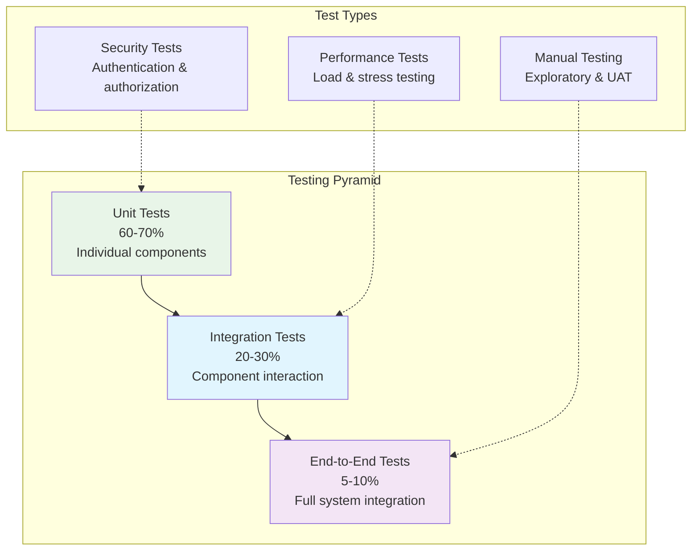

# Testing Overview

Comprehensive testing is fundamental to maintaining OpenFrame OSS Library's reliability and enabling confident development. This guide covers the testing philosophy, structure, tools, and practices used throughout the project.

## 🎯 Testing Philosophy

OpenFrame follows a **test-driven development (TDD)** approach with emphasis on:

- **Reliability**: High confidence in code changes through comprehensive test coverage
- **Maintainability**: Tests serve as living documentation of system behavior
- **Performance**: Tests validate performance characteristics and prevent regressions
- **Security**: Testing security patterns and validation rules

### Testing Pyramid



## 📁 Test Structure and Organization

### Directory Structure

```text
openframe-oss-lib/
├── openframe-api-lib/
│   └── src/
│       └── test/java/com/openframe/api/
│           ├── dto/                     # DTO validation tests
│           │   ├── device/
│           │   ├── event/
│           │   └── organization/
│           ├── service/                 # Service interface tests
│           └── validation/              # Custom validation tests
├── openframe-api-service-core/
│   └── src/
│       └── test/java/com/openframe/api/
│           ├── controller/              # Controller integration tests
│           ├── service/                 # Service implementation tests
│           ├── integration/             # Full integration tests
│           └── testconfig/              # Test configurations
├── openframe-data-mongo/
│   └── src/
│       └── test/java/com/openframe/data/
│           ├── repository/              # Repository tests
│           ├── document/                # Entity tests
│           └── integration/             # Database integration tests
└── test-resources/
    ├── test-data/                       # Sample test data
    ├── test-containers/                 # Docker test configurations
    └── fixtures/                       # Test fixtures and utilities
```

### Test Categories

| Category | Purpose | Location | Tools |
|----------|---------|----------|--------|
| **Unit Tests** | Test individual methods/classes | `src/test/java/**/*Test.java` | JUnit 5, Mockito |
| **Integration Tests** | Test component interactions | `src/test/java/**/integration/` | Spring Boot Test, TestContainers |
| **Repository Tests** | Test data layer operations | `src/test/java/**/repository/` | Spring Data Test, MongoDB Test |
| **Controller Tests** | Test API endpoints | `src/test/java/**/controller/` | MockMvc, WebTestClient |
| **Performance Tests** | Test system performance | `src/test/java/**/performance/` | JMH, custom utilities |

## 🧪 Unit Testing

### Testing Framework Stack

```xml
<!-- Core testing dependencies -->
<dependencies>
    <!-- JUnit 5 -->
    <dependency>
        <groupId>org.junit.jupiter</groupId>
        <artifactId>junit-jupiter</artifactId>
        <scope>test</scope>
    </dependency>
    
    <!-- Mockito for mocking -->
    <dependency>
        <groupId>org.mockito</groupId>
        <artifactId>mockito-core</artifactId>
        <scope>test</scope>
    </dependency>
    
    <!-- AssertJ for fluent assertions -->
    <dependency>
        <groupId>org.assertj</groupId>
        <artifactId>assertj-core</artifactId>
        <scope>test</scope>
    </dependency>
    
    <!-- Spring Boot Test -->
    <dependency>
        <groupId>org.springframework.boot</groupId>
        <artifactId>spring-boot-starter-test</artifactId>
        <scope>test</scope>
    </dependency>
</dependencies>
```

### Unit Test Examples

**Testing DTOs and Validation**
```java
@DisplayName("CursorPaginationInput Tests")
class CursorPaginationInputTest {
    
    private Validator validator;
    
    @BeforeEach
    void setUp() {
        ValidatorFactory factory = Validation.buildDefaultValidatorFactory();
        validator = factory.getValidator();
    }
    
    @Test
    @DisplayName("Should validate successful with valid input")
    void shouldValidateSuccessfullyWithValidInput() {
        // Given
        CursorPaginationInput pagination = CursorPaginationInput.builder()
            .limit(25)
            .cursor("valid-cursor-token")
            .build();
        
        // When
        Set<ConstraintViolation<CursorPaginationInput>> violations = validator.validate(pagination);
        
        // Then
        assertThat(violations).isEmpty();
        assertThat(pagination.getLimit()).isEqualTo(25);
        assertThat(pagination.getCursor()).isEqualTo("valid-cursor-token");
    }
    
    @ParameterizedTest
    @ValueSource(ints = {0, -1, 101, 200})
    @DisplayName("Should reject invalid limit values")
    void shouldRejectInvalidLimitValues(int invalidLimit) {
        // Given
        CursorPaginationInput pagination = CursorPaginationInput.builder()
            .limit(invalidLimit)
            .cursor("valid-cursor")
            .build();
        
        // When
        Set<ConstraintViolation<CursorPaginationInput>> violations = validator.validate(pagination);
        
        // Then
        assertThat(violations)
            .hasSize(1)
            .extracting(ConstraintViolation::getMessage)
            .containsAnyOf(
                "Limit must be at least 1",
                "Limit cannot exceed 100"
            );
    }
}
```

**Testing Service Layer**
```java
@ExtendWith(MockitoExtension.class)
@DisplayName("DeviceService Implementation Tests")
class DeviceServiceImplTest {
    
    @Mock
    private DeviceRepository deviceRepository;
    
    @Mock
    private DeviceMapper deviceMapper;
    
    @Mock
    private OrganizationService organizationService;
    
    @InjectMocks
    private DeviceServiceImpl deviceService;
    
    @Test
    @DisplayName("Should find devices with filters successfully")
    void shouldFindDevicesWithFiltersSuccessfully() {
        // Given
        DeviceFilterInput filterInput = createValidDeviceFilterInput();
        Page<DeviceDocument> mockPage = createMockDevicePage();
        List<Device> expectedDevices = createExpectedDevices();
        
        when(deviceMapper.toQueryFilter(filterInput)).thenReturn(new DeviceQueryFilter());
        when(deviceRepository.findDevicesWithFilters(any())).thenReturn(mockPage);
        when(deviceMapper.toDeviceList(mockPage.getContent())).thenReturn(expectedDevices);
        
        // When
        CountedGenericQueryResult<Device> result = deviceService.findDevices(filterInput);
        
        // Then
        assertThat(result).isNotNull();
        assertThat(result.getItems()).hasSize(2);
        assertThat(result.getTotalCount()).isEqualTo(10L);
        assertThat(result.getPageInfo().getHasNextPage()).isTrue();
        
        verify(deviceRepository).findDevicesWithFilters(any());
        verify(deviceMapper).toDeviceList(mockPage.getContent());
    }
    
    @Test
    @DisplayName("Should throw exception for null filter input")
    void shouldThrowExceptionForNullFilterInput() {
        // When & Then
        assertThatThrownBy(() -> deviceService.findDevices(null))
            .isInstanceOf(IllegalArgumentException.class)
            .hasMessage("Device filter input cannot be null");
        
        verifyNoInteractions(deviceRepository);
    }
    
    private DeviceFilterInput createValidDeviceFilterInput() {
        return DeviceFilterInput.builder()
            .pagination(CursorPaginationInput.builder()
                .limit(10)
                .build())
            .filters(DeviceFilters.builder().build())
            .build();
    }
}
```

## 🔗 Integration Testing

Integration tests verify that components work correctly together, especially focusing on database operations and API interactions.

### Repository Integration Tests

```java
@DataMongoTest
@DisplayName("Device Repository Integration Tests")
class DeviceRepositoryIntegrationTest {
    
    @Autowired
    private TestEntityManager entityManager;
    
    @Autowired
    private DeviceRepository deviceRepository;
    
    @Test
    @DisplayName("Should find devices by organization ID")
    void shouldFindDevicesByOrganizationId() {
        // Given
        String orgId = "test-org-123";
        Device device1 = createTestDevice("device-1", orgId);
        Device device2 = createTestDevice("device-2", orgId);
        Device deviceOtherOrg = createTestDevice("device-3", "other-org");
        
        entityManager.persistAndFlush(device1);
        entityManager.persistAndFlush(device2);
        entityManager.persistAndFlush(deviceOtherOrg);
        
        Pageable pageable = PageRequest.of(0, 10);
        
        // When
        Page<Device> result = deviceRepository.findByOrganizationId(orgId, pageable);
        
        // Then
        assertThat(result.getContent()).hasSize(2);
        assertThat(result.getContent())
            .extracting(Device::getOrganizationId)
            .containsOnly(orgId);
    }
    
    @Test
    @DisplayName("Should find devices by status and type")
    void shouldFindDevicesByStatusAndType() {
        // Given
        Device onlineDesktop = createTestDevice("desktop-1", DeviceStatus.ONLINE, DeviceType.DESKTOP);
        Device onlineServer = createTestDevice("server-1", DeviceStatus.ONLINE, DeviceType.SERVER);
        Device offlineDesktop = createTestDevice("desktop-2", DeviceStatus.OFFLINE, DeviceType.DESKTOP);
        
        entityManager.persistAndFlush(onlineDesktop);
        entityManager.persistAndFlush(onlineServer);
        entityManager.persistAndFlush(offlineDesktop);
        
        // When
        List<Device> result = deviceRepository.findByStatusAndDeviceType(
            DeviceStatus.ONLINE, DeviceType.DESKTOP);
        
        // Then
        assertThat(result)
            .hasSize(1)
            .first()
            .satisfies(device -> {
                assertThat(device.getStatus()).isEqualTo(DeviceStatus.ONLINE);
                assertThat(device.getDeviceType()).isEqualTo(DeviceType.DESKTOP);
            });
    }
    
    private Device createTestDevice(String name, String organizationId) {
        return Device.builder()
            .name(name)
            .organizationId(organizationId)
            .status(DeviceStatus.ONLINE)
            .deviceType(DeviceType.DESKTOP)
            .createdAt(LocalDateTime.now())
            .updatedAt(LocalDateTime.now())
            .build();
    }
}
```

### API Integration Tests

```java
@SpringBootTest(webEnvironment = SpringBootTest.WebEnvironment.RANDOM_PORT)
@Testcontainers
@DisplayName("Device API Integration Tests")
class DeviceControllerIntegrationTest {
    
    @Container
    static MongoDBContainer mongoDBContainer = new MongoDBContainer("mongo:7")
            .withExposedPorts(27017);
    
    @Autowired
    private TestRestTemplate restTemplate;
    
    @Autowired
    private DeviceRepository deviceRepository;
    
    @DynamicPropertySource
    static void configureProperties(DynamicPropertyRegistry registry) {
        registry.add("spring.data.mongodb.uri", mongoDBContainer::getReplicaSetUrl);
    }
    
    @Test
    @DisplayName("Should get devices with pagination")
    void shouldGetDevicesWithPagination() {
        // Given
        String orgId = "test-org";
        createTestDevices(orgId, 25); // Create 25 test devices
        
        String url = "/api/devices?limit=10&organizationId=" + orgId;
        
        // When
        ResponseEntity<DevicesResponse> response = restTemplate.getForEntity(url, DevicesResponse.class);
        
        // Then
        assertThat(response.getStatusCode()).isEqualTo(HttpStatus.OK);
        assertThat(response.getBody()).isNotNull();
        
        DevicesResponse devicesResponse = response.getBody();
        assertThat(devicesResponse.getItems()).hasSize(10);
        assertThat(devicesResponse.getTotalCount()).isEqualTo(25);
        assertThat(devicesResponse.getPageInfo().getHasNextPage()).isTrue();
        assertThat(devicesResponse.getPageInfo().getNextCursor()).isNotNull();
    }
    
    @Test
    @DisplayName("Should create device successfully")
    void shouldCreateDeviceSuccessfully() {
        // Given
        CreateDeviceRequest request = CreateDeviceRequest.builder()
            .name("Test Device")
            .deviceType(DeviceType.DESKTOP)
            .organizationId("test-org")
            .build();
        
        HttpHeaders headers = new HttpHeaders();
        headers.setContentType(MediaType.APPLICATION_JSON);
        HttpEntity<CreateDeviceRequest> entity = new HttpEntity<>(request, headers);
        
        // When
        ResponseEntity<DeviceResponse> response = restTemplate.postForEntity(
            "/api/devices", entity, DeviceResponse.class);
        
        // Then
        assertThat(response.getStatusCode()).isEqualTo(HttpStatus.CREATED);
        assertThat(response.getBody()).isNotNull();
        
        DeviceResponse deviceResponse = response.getBody();
        assertThat(deviceResponse.getName()).isEqualTo("Test Device");
        assertThat(deviceResponse.getDeviceType()).isEqualTo(DeviceType.DESKTOP);
        
        // Verify device was persisted
        Optional<Device> persistedDevice = deviceRepository.findById(deviceResponse.getId());
        assertThat(persistedDevice).isPresent();
    }
    
    private void createTestDevices(String organizationId, int count) {
        List<Device> devices = IntStream.range(0, count)
            .mapToObj(i -> Device.builder()
                .name("Test Device " + i)
                .organizationId(organizationId)
                .status(DeviceStatus.ONLINE)
                .deviceType(DeviceType.DESKTOP)
                .createdAt(LocalDateTime.now())
                .updatedAt(LocalDateTime.now())
                .build())
            .collect(Collectors.toList());
        
        deviceRepository.saveAll(devices);
    }
}
```

## 🧩 Testing Utilities and Fixtures

### Test Data Builders

```java
@UtilityClass
public class DeviceTestDataBuilder {
    
    public Device.DeviceBuilder defaultDevice() {
        return Device.builder()
            .name("Test Device")
            .organizationId("test-org-123")
            .status(DeviceStatus.ONLINE)
            .deviceType(DeviceType.DESKTOP)
            .tags(Arrays.asList("test", "development"))
            .createdAt(LocalDateTime.now())
            .updatedAt(LocalDateTime.now());
    }
    
    public Device onlineDesktop(String name, String organizationId) {
        return defaultDevice()
            .name(name)
            .organizationId(organizationId)
            .deviceType(DeviceType.DESKTOP)
            .status(DeviceStatus.ONLINE)
            .build();
    }
    
    public Device offlineServer(String name, String organizationId) {
        return defaultDevice()
            .name(name)
            .organizationId(organizationId)
            .deviceType(DeviceType.SERVER)
            .status(DeviceStatus.OFFLINE)
            .build();
    }
    
    public List<Device> createDevices(String organizationId, int count) {
        return IntStream.range(0, count)
            .mapToObj(i -> defaultDevice()
                .name("Device " + i)
                .organizationId(organizationId)
                .build())
            .collect(Collectors.toList());
    }
}
```

### Test Configuration

```java
@TestConfiguration
public class TestConfig {
    
    @Bean
    @Primary
    public Clock testClock() {
        return Clock.fixed(Instant.parse("2024-01-15T10:00:00Z"), ZoneOffset.UTC);
    }
    
    @Bean
    @Primary
    public PasswordEncoder testPasswordEncoder() {
        return new BCryptPasswordEncoder(4); // Faster for tests
    }
    
    @EventListener
    public void handleContextRefresh(ContextRefreshedEvent event) {
        // Clear test data or perform setup
    }
}
```

## 📊 Running Tests

### Maven Test Commands

```bash
# Run all tests
mvn test

# Run tests for specific module
mvn test -pl openframe-api-lib

# Run only unit tests (exclude integration tests)
mvn test -Dtest.profile=unit

# Run only integration tests  
mvn test -Dtest.profile=integration

# Run tests with coverage report
mvn test jacoco:report

# Run tests in parallel (faster execution)
mvn test -Dmaven.test.parallel=true

# Run specific test class
mvn test -Dtest=DeviceServiceImplTest

# Run specific test method
mvn test -Dtest=DeviceServiceImplTest#shouldFindDevicesWithFiltersSuccessfully

# Skip tests (for quick builds)
mvn install -DskipTests

# Run tests with debug output
mvn test -X
```

### Test Profiles

Configure different test profiles in `application-test.yml`:

```yaml
# Test profile configuration
spring:
  profiles:
    active: test
    
  datasource:
    url: jdbc:h2:mem:testdb
    driver-class-name: org.h2.Driver
    
  data:
    mongodb:
      uri: mongodb://localhost:27017/openframe-test
      
  jpa:
    hibernate:
      ddl-auto: create-drop
      
  cache:
    type: simple  # Use simple cache for tests

# Logging for tests
logging:
  level:
    com.openframe: DEBUG
    org.springframework.test: INFO
    
# Test-specific configurations  
openframe:
  test:
    data-initialization: true
    mock-external-services: true
```

## 📈 Test Coverage and Quality

### Coverage Requirements

| Component | Target Coverage | Minimum Coverage |
|-----------|----------------|------------------|
| **Service Layer** | 90% | 80% |
| **Repository Layer** | 85% | 75% |
| **Controller Layer** | 80% | 70% |
| **DTO Validation** | 95% | 90% |
| **Utility Classes** | 95% | 85% |

### Coverage Configuration

```xml
<!-- JaCoCo plugin configuration -->
<plugin>
    <groupId>org.jacoco</groupId>
    <artifactId>jacoco-maven-plugin</artifactId>
    <version>0.8.8</version>
    <executions>
        <execution>
            <goals>
                <goal>prepare-agent</goal>
            </goals>
        </execution>
        <execution>
            <id>report</id>
            <phase>test</phase>
            <goals>
                <goal>report</goal>
            </goals>
        </execution>
        <execution>
            <id>check</id>
            <goals>
                <goal>check</goal>
            </goals>
            <configuration>
                <rules>
                    <rule>
                        <element>PACKAGE</element>
                        <limits>
                            <limit>
                                <counter>LINE</counter>
                                <value>COVEREDRATIO</value>
                                <minimum>0.80</minimum>
                            </limit>
                        </limits>
                    </rule>
                </rules>
            </configuration>
        </execution>
    </executions>
</plugin>
```

### Generate Coverage Reports

```bash
# Generate coverage report
mvn clean test jacoco:report

# View coverage report
open target/site/jacoco/index.html

# Generate coverage for all modules
mvn clean test jacoco:report jacoco:report-aggregate

# Check coverage thresholds
mvn jacoco:check
```

## 🔧 Test Configuration and Best Practices

### TestContainers Setup

```java
@Testcontainers
public class BaseIntegrationTest {
    
    @Container
    static MongoDBContainer mongoDBContainer = new MongoDBContainer("mongo:7")
            .withExposedPorts(27017)
            .withReuse(true);  // Reuse container across tests
    
    @Container 
    static GenericContainer<?> redisContainer = new GenericContainer<>("redis:7-alpine")
            .withExposedPorts(6379)
            .withReuse(true);
    
    @DynamicPropertySource
    static void configureProperties(DynamicPropertyRegistry registry) {
        registry.add("spring.data.mongodb.uri", mongoDBContainer::getReplicaSetUrl);
        registry.add("spring.redis.host", redisContainer::getHost);
        registry.add("spring.redis.port", () -> redisContainer.getMappedPort(6379));
    }
}
```

### Testing Best Practices

1. **Test Naming Conventions**
   ```java
   // Use descriptive test names
   @Test
   @DisplayName("Should return empty result when no devices match filters")
   void shouldReturnEmptyResultWhenNoDevicesMatchFilters() { }
   
   // Use Given-When-Then structure
   @Test
   void shouldCalculateCorrectPagination() {
       // Given
       DeviceFilterInput input = createFilterInput();
       
       // When  
       CountedGenericQueryResult<Device> result = service.findDevices(input);
       
       // Then
       assertThat(result.getPageInfo()).isNotNull();
   }
   ```

2. **Test Data Management**
   ```java
   @BeforeEach
   void setUp() {
       // Clean database before each test
       deviceRepository.deleteAll();
   }
   
   @AfterEach  
   void tearDown() {
       // Clean up test data
       deviceRepository.deleteAll();
   }
   ```

3. **Assertion Best Practices**
   ```java
   // Use AssertJ for fluent assertions
   assertThat(result.getItems())
       .hasSize(5)
       .extracting(Device::getStatus)
       .containsOnly(DeviceStatus.ONLINE);
   
   // Verify complex objects
   assertThat(device)
       .satisfies(d -> {
           assertThat(d.getName()).isEqualTo("Expected Name");
           assertThat(d.getStatus()).isEqualTo(DeviceStatus.ONLINE);
           assertThat(d.getTags()).containsExactly("tag1", "tag2");
       });
   ```

## ⚡ Performance Testing

### Benchmark Tests with JMH

```java
@BenchmarkMode(Mode.AverageTime)
@OutputTimeUnit(TimeUnit.MICROSECONDS)
@State(Scope.Benchmark)
public class PaginationBenchmark {
    
    private DeviceService deviceService;
    private DeviceFilterInput filterInput;
    
    @Setup
    public void setup() {
        // Initialize service and test data
        filterInput = DeviceFilterInput.builder()
            .pagination(CursorPaginationInput.builder()
                .limit(100)
                .build())
            .build();
    }
    
    @Benchmark
    public CountedGenericQueryResult<Device> benchmarkDeviceQuery() {
        return deviceService.findDevices(filterInput);
    }
    
    @Benchmark
    public CountedGenericQueryResult<Device> benchmarkDeviceQueryWithFilters() {
        DeviceFilterInput filterWithTags = filterInput.toBuilder()
            .filters(DeviceFilters.builder()
                .tags(Arrays.asList("production", "server"))
                .build())
            .build();
        
        return deviceService.findDevices(filterWithTags);
    }
}
```

### Load Testing

```java
@Test
@Timeout(value = 5, unit = TimeUnit.SECONDS)
void shouldHandleConcurrentRequests() throws InterruptedException {
    int threadCount = 10;
    int requestsPerThread = 100;
    ExecutorService executor = Executors.newFixedThreadPool(threadCount);
    CountDownLatch latch = new CountDownLatch(threadCount);
    AtomicInteger successCount = new AtomicInteger(0);
    AtomicInteger errorCount = new AtomicInteger(0);
    
    for (int i = 0; i < threadCount; i++) {
        executor.submit(() -> {
            try {
                for (int j = 0; j < requestsPerThread; j++) {
                    try {
                        CountedGenericQueryResult<Device> result = deviceService.findDevices(
                            createValidDeviceFilterInput());
                        if (result != null) {
                            successCount.incrementAndGet();
                        }
                    } catch (Exception e) {
                        errorCount.incrementAndGet();
                    }
                }
            } finally {
                latch.countDown();
            }
        });
    }
    
    latch.await();
    executor.shutdown();
    
    int totalRequests = threadCount * requestsPerThread;
    assertThat(successCount.get()).isEqualTo(totalRequests);
    assertThat(errorCount.get()).isZero();
}
```

## 🚨 Troubleshooting Tests

### Common Issues and Solutions

**Test Container Startup Issues**
```bash
# Check Docker daemon
docker ps

# Clean up test containers
docker container prune -f

# Restart Docker if needed
# macOS: Docker Desktop -> Restart
# Linux: sudo systemctl restart docker
```

**Database Test Issues**
```bash
# Clear test database
mongo openframe-test --eval "db.dropDatabase()"

# Reset test data
mvn clean test -Dtest.reset.database=true
```

**Memory Issues During Tests**
```bash
# Increase memory for tests
export MAVEN_OPTS="-Xmx2g -XX:MaxMetaspaceSize=512m"

# Run tests with memory profiling
mvn test -Dmaven.test.jvmargs="-Xmx2g -XX:+PrintGCDetails"
```

**Flaky Tests**
```java
// Use @RepeatedTest for flaky tests
@RepeatedTest(10)
void shouldBeStable() {
    // Test that should pass consistently
}

// Add proper wait conditions
@Test  
void shouldWaitForAsyncOperation() {
    // Trigger async operation
    service.processAsync();
    
    // Wait for completion with timeout
    await().atMost(5, SECONDS).until(() -> {
        return service.isComplete();
    });
}
```

## 📋 Testing Checklist

Before submitting code, ensure:

- [ ] **All new code has tests** (minimum coverage requirements met)
- [ ] **Tests follow naming conventions** and have clear descriptions
- [ ] **Integration tests cover happy and error paths**
- [ ] **Performance tests validate critical operations**
- [ ] **Test data is properly cleaned up**
- [ ] **Tests are deterministic** (no flaky tests)
- [ ] **Coverage report shows green** for all modified modules

## 🎯 Next Steps

Now that you understand the testing approach:

1. **[Run the Test Suite](../setup/local-development.md#step-6-run-tests)** - Execute tests locally
2. **[Write Your First Test](../contributing/guidelines.md#writing-tests)** - Contribute new test coverage
3. **[Review Testing Patterns](#testing-best-practices)** - Apply these patterns in your code

## 📚 Additional Resources

- **JUnit 5 User Guide**: [junit.org/junit5/docs/current/user-guide/](https://junit.org/junit5/docs/current/user-guide/)
- **AssertJ Documentation**: [assertj.github.io/doc/](https://assertj.github.io/doc/)
- **TestContainers**: [testcontainers.org/](https://www.testcontainers.org/)
- **Spring Boot Testing**: [docs.spring.io/spring-boot/docs/current/reference/html/boot-features-testing.html](https://docs.spring.io/spring-boot/docs/current/reference/html/boot-features-testing.html)

---

**Testing is not just about finding bugs—it's about building confidence in your code and enabling fearless refactoring.** Happy testing! 🧪