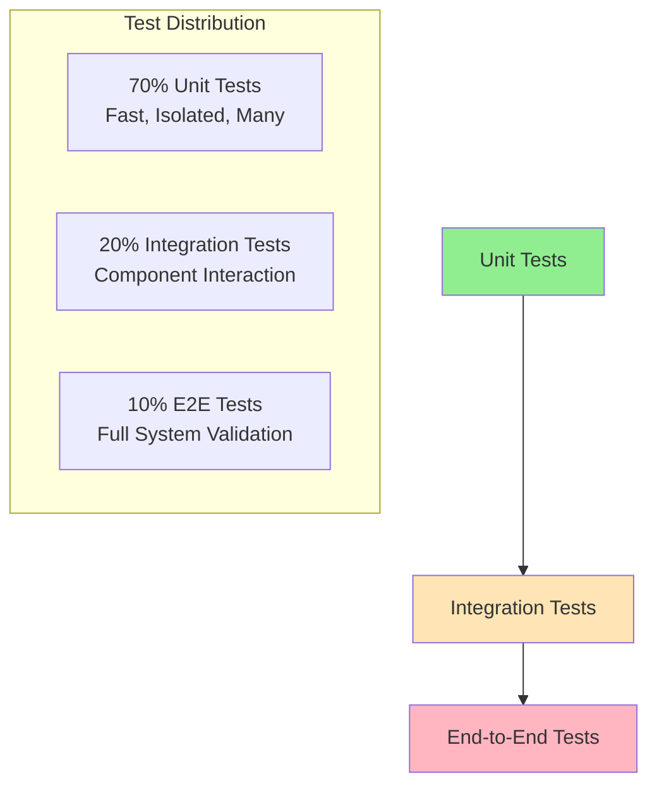

# Testing Overview

This guide provides comprehensive coverage of the testing strategy, practices, and tools used in the OpenFrame OSS Library. Effective testing ensures reliability, maintainability, and confidence in the codebase.

## 🎯 Testing Philosophy

The OpenFrame OSS Library follows these testing principles:

- **Test-Driven Development (TDD)**: Write tests first, then implementation
- **Comprehensive Coverage**: Aim for 90%+ code coverage
- **Fast Feedback**: Tests should run quickly and fail fast
- **Readable Tests**: Tests serve as living documentation
- **Isolated Tests**: Each test should be independent
- **Behavior Testing**: Focus on what the code should do, not how

## 🧪 Testing Strategy

### Testing Pyramid

The library follows the standard testing pyramid approach:



### Test Categories

| Test Type | Purpose | Tools | Coverage |
|-----------|---------|-------|----------|
| **Unit Tests** | Individual class/method testing | JUnit 5, AssertJ | 70% |
| **Integration Tests** | Component interaction testing | Spring Test, TestContainers | 20% |
| **Contract Tests** | API compatibility testing | Pact, WireMock | 10% |

## 📁 Test Organization

### Directory Structure

```
src/test/java/
└── com/
    └── openframe/
        └── api/
            └── dto/
                ├── audit/                          # Audit domain tests
                │   ├── LogEventTest.java
                │   ├── LogDetailsTest.java
                │   ├── LogFiltersTest.java
                │   ├── LogFilterOptionsTest.java
                │   └── OrganizationFilterOptionTest.java
                ├── device/                         # Device domain tests  
                │   ├── DeviceFiltersTest.java
                │   ├── DeviceFilterOptionsTest.java
                │   └── DeviceFilterOptionTest.java
                ├── shared/                         # Shared component tests
                │   └── CursorPageInfoTest.java
                ├── CountedGenericQueryResultTest.java
                ├── GenericQueryResultTest.java
                └── testutil/                       # Test utilities
                    ├── TestDataFactory.java
                    ├── TestAssertions.java
                    └── MockBuilder.java
```

### Naming Conventions

| Pattern | Usage | Example |
|---------|-------|---------|
| `ClassNameTest` | Unit tests for a class | `LogEventTest` |
| `ClassNameIntegrationTest` | Integration tests | `DeviceFiltersIntegrationTest` |
| `ClassNameBehaviorTest` | Behavior-focused tests | `LogFiltersBehaviorTest` |
| `TestDataFactory` | Test data creation | `LogEventTestDataFactory` |

## ⚙️ Testing Framework Setup

### Dependencies

The project uses these testing dependencies:

```xml
<dependencies>
    <!-- Core testing framework -->
    <dependency>
        <groupId>org.junit.jupiter</groupId>
        <artifactId>junit-jupiter</artifactId>
        <version>5.9.2</version>
        <scope>test</scope>
    </dependency>
    
    <!-- Fluent assertions -->
    <dependency>
        <groupId>org.assertj</groupId>
        <artifactId>assertj-core</artifactId>
        <version>3.24.2</version>
        <scope>test</scope>
    </dependency>
    
    <!-- Mocking framework -->
    <dependency>
        <groupId>org.mockito</groupId>
        <artifactId>mockito-core</artifactId>
        <version>5.1.1</version>
        <scope>test</scope>
    </dependency>
    
    <!-- Test data generation -->
    <dependency>
        <groupId>net.datafaker</groupId>
        <artifactId>datafaker</artifactId>
        <version>1.8.1</version>
        <scope>test</scope>
    </dependency>
</dependencies>
```

### Maven Configuration

```xml
<build>
    <plugins>
        <!-- Surefire for unit tests -->
        <plugin>
            <groupId>org.apache.maven.plugins</groupId>
            <artifactId>maven-surefire-plugin</artifactId>
            <version>3.0.0-M9</version>
            <configuration>
                <includes>
                    <include>**/*Test.java</include>
                </includes>
            </configuration>
        </plugin>
        
        <!-- Failsafe for integration tests -->
        <plugin>
            <groupId>org.apache.maven.plugins</groupId>
            <artifactId>maven-failsafe-plugin</artifactId>
            <version>3.0.0-M9</version>
            <configuration>
                <includes>
                    <include>**/*IntegrationTest.java</include>
                </includes>
            </configuration>
        </plugin>
        
        <!-- JaCoCo for coverage -->
        <plugin>
            <groupId>org.jacoco</groupId>
            <artifactId>jacoco-maven-plugin</artifactId>
            <version>0.8.8</version>
            <executions>
                <execution>
                    <goals>
                        <goal>prepare-agent</goal>
                    </goals>
                </execution>
                <execution>
                    <id>report</id>
                    <phase>test</phase>
                    <goals>
                        <goal>report</goal>
                    </goals>
                </execution>
            </executions>
        </plugin>
    </plugins>
</build>
```

## 📝 Writing Effective Tests

### Unit Test Template

Here's the standard template for unit tests:

```java
package com.openframe.api.dto.audit;

import org.junit.jupiter.api.Test;
import org.junit.jupiter.api.DisplayName;
import org.junit.jupiter.api.BeforeEach;
import org.junit.jupiter.api.Nested;
import static org.assertj.core.api.Assertions.*;

import java.time.Instant;

@DisplayName("LogEvent")
class LogEventTest {
    
    @Nested
    @DisplayName("Builder Pattern")
    class BuilderPatternTests {
        
        @Test
        @DisplayName("should create valid LogEvent with required fields")
        void shouldCreateValidLogEventWithRequiredFields() {
            // Given
            String toolEventId = "evt-12345";
            String eventType = "USER_LOGIN";
            Instant timestamp = Instant.now();
            
            // When
            LogEvent event = LogEvent.builder()
                .toolEventId(toolEventId)
                .eventType(eventType)
                .timestamp(timestamp)
                .build();
            
            // Then
            assertThat(event).isNotNull();
            assertThat(event.getToolEventId()).isEqualTo(toolEventId);
            assertThat(event.getEventType()).isEqualTo(eventType);
            assertThat(event.getTimestamp()).isEqualTo(timestamp);
        }
        
        @Test
        @DisplayName("should handle optional fields correctly")
        void shouldHandleOptionalFieldsCorrectly() {
            // Given & When
            LogEvent event = LogEvent.builder()
                .toolEventId("evt-12345")
                .eventType("USER_LOGIN")
                .build();
            
            // Then
            assertThat(event.getSeverity()).isNull();
            assertThat(event.getUserId()).isNull();
            assertThat(event.getSummary()).isNull();
        }
    }
    
    @Nested
    @DisplayName("Validation")
    class ValidationTests {
        
        @Test
        @DisplayName("should accept valid severity levels")
        void shouldAcceptValidSeverityLevels() {
            // Test valid severity values
            String[] validSeverities = {"INFO", "WARN", "ERROR", "CRITICAL"};
            
            for (String severity : validSeverities) {
                LogEvent event = LogEvent.builder()
                    .toolEventId("evt-test")
                    .eventType("TEST")
                    .severity(severity)
                    .build();
                    
                assertThat(event.getSeverity()).isEqualTo(severity);
            }
        }
    }
    
    @Nested
    @DisplayName("Edge Cases")
    class EdgeCaseTests {
        
        @Test
        @DisplayName("should handle empty strings appropriately")
        void shouldHandleEmptyStringsAppropriately() {
            // Given & When
            LogEvent event = LogEvent.builder()
                .toolEventId("")
                .eventType("")
                .summary("")
                .build();
            
            // Then
            assertThat(event.getToolEventId()).isEmpty();
            assertThat(event.getEventType()).isEmpty();
            assertThat(event.getSummary()).isEmpty();
        }
    }
}
```

### Test Data Factory Pattern

Create reusable test data factories:

```java
package com.openframe.api.dto.testutil;

import com.openframe.api.dto.audit.LogEvent;
import com.openframe.api.dto.device.DeviceFilters;
import net.datafaker.Faker;

import java.time.Instant;
import java.util.Arrays;
import java.util.List;

public class TestDataFactory {
    private static final Faker faker = new Faker();
    
    public static LogEvent.LogEventBuilder defaultLogEvent() {
        return LogEvent.builder()
            .toolEventId("evt-" + faker.number().randomNumber())
            .eventType("USER_ACTION")
            .severity("INFO")
            .userId("user-" + faker.number().randomNumber())
            .deviceId("device-" + faker.number().randomNumber())
            .hostname(faker.internet().domainName())
            .organizationId("org-" + faker.number().randomNumber())
            .organizationName(faker.company().name())
            .toolType("WEB_APPLICATION")
            .summary(faker.lorem().sentence())
            .timestamp(Instant.now())
            .ingestDay("2024-01-15");
    }
    
    public static LogEvent loginEvent() {
        return defaultLogEvent()
            .eventType("USER_LOGIN")
            .severity("INFO")
            .summary("User successfully logged in")
            .build();
    }
    
    public static LogEvent securityAlertEvent() {
        return defaultLogEvent()
            .eventType("SECURITY_ALERT")
            .severity("HIGH")
            .summary("Suspicious activity detected")
            .build();
    }
    
    public static DeviceFilters.DeviceFiltersBuilder defaultDeviceFilters() {
        return DeviceFilters.builder()
            .statuses(Arrays.asList("ACTIVE", "PENDING"))
            .deviceTypes(Arrays.asList("LAPTOP", "MOBILE"))
            .osTypes(Arrays.asList("WINDOWS", "MACOS"))
            .filteredCount(faker.number().numberBetween(1, 100));
    }
    
    public static DeviceFilters activeDeviceFilters() {
        return defaultDeviceFilters()
            .statuses(Arrays.asList("ACTIVE"))
            .build();
    }
}
```

### Custom Assertions

Create domain-specific assertions:

```java
package com.openframe.api.dto.testutil;

import com.openframe.api.dto.audit.LogEvent;
import org.assertj.core.api.AbstractAssert;

public class LogEventAssert extends AbstractAssert<LogEventAssert, LogEvent> {
    
    public LogEventAssert(LogEvent logEvent) {
        super(logEvent, LogEventAssert.class);
    }
    
    public static LogEventAssert assertThat(LogEvent logEvent) {
        return new LogEventAssert(logEvent);
    }
    
    public LogEventAssert hasEventType(String expectedEventType) {
        isNotNull();
        if (!Objects.equals(actual.getEventType(), expectedEventType)) {
            failWithMessage("Expected event type <%s> but was <%s>", 
                expectedEventType, actual.getEventType());
        }
        return this;
    }
    
    public LogEventAssert hasSeverity(String expectedSeverity) {
        isNotNull();
        if (!Objects.equals(actual.getSeverity(), expectedSeverity)) {
            failWithMessage("Expected severity <%s> but was <%s>", 
                expectedSeverity, actual.getSeverity());
        }
        return this;
    }
    
    public LogEventAssert isSecurityEvent() {
        isNotNull();
        if (!actual.getEventType().contains("SECURITY")) {
            failWithMessage("Expected security event but was <%s>", actual.getEventType());
        }
        return this;
    }
    
    public LogEventAssert belongsToOrganization(String expectedOrgName) {
        isNotNull();
        if (!Objects.equals(actual.getOrganizationName(), expectedOrgName)) {
            failWithMessage("Expected organization <%s> but was <%s>", 
                expectedOrgName, actual.getOrganizationName());
        }
        return this;
    }
}
```

Usage:
```java
@Test
void shouldCreateSecurityEvent() {
    // Given & When
    LogEvent event = TestDataFactory.securityAlertEvent();
    
    // Then
    LogEventAssert.assertThat(event)
        .isSecurityEvent()
        .hasSeverity("HIGH")
        .belongsToOrganization("Acme Corp");
}
```

## 🏃‍♂️ Running Tests

### Command Line Options

```bash
# Run all tests
mvn test

# Run specific test class
mvn test -Dtest=LogEventTest

# Run specific test method
mvn test -Dtest=LogEventTest#shouldCreateValidLogEvent

# Run tests with specific pattern
mvn test -Dtest="*EventTest"

# Run tests with coverage
mvn test jacoco:report

# Skip tests (for faster builds)
mvn compile -DskipTests

# Run only fast tests (custom profile)
mvn test -Dgroups="fast"

# Run integration tests
mvn failsafe:integration-test
```

### IDE Integration

#### IntelliJ IDEA

1. **Run Tests**: Right-click test class/method → Run
2. **Debug Tests**: Right-click → Debug
3. **Run with Coverage**: Run → Run with Coverage
4. **Continuous Testing**: Enable auto-test mode

#### Eclipse

1. **JUnit Integration**: Right-click → Run As → JUnit Test
2. **Coverage**: Right-click → Coverage As → JUnit Test

#### VS Code

1. **Java Test Runner**: Use Test Explorer
2. **Run/Debug**: CodeLens integration in test files

## 📊 Test Coverage

### Coverage Goals

| Component | Target Coverage | Measurement |
|-----------|-----------------|-------------|
| **DTO Classes** | 95% | Line + Branch |
| **Builder Methods** | 90% | Line |
| **Validation Logic** | 100% | Branch |
| **Utility Classes** | 95% | Line + Branch |

### Generating Coverage Reports

```bash
# Generate coverage report
mvn test jacoco:report

# View report
open target/site/jacoco/index.html

# Coverage with specific threshold
mvn test jacoco:check -Djacoco.haltOnFailure=true
```

### Coverage Configuration

```xml
<plugin>
    <groupId>org.jacoco</groupId>
    <artifactId>jacoco-maven-plugin</artifactId>
    <executions>
        <execution>
            <id>check</id>
            <goals>
                <goal>check</goal>
            </goals>
            <configuration>
                <rules>
                    <rule>
                        <element>CLASS</element>
                        <limits>
                            <limit>
                                <counter>LINE</counter>
                                <value>COVEREDRATIO</value>
                                <minimum>0.90</minimum>
                            </limit>
                            <limit>
                                <counter>BRANCH</counter>
                                <value>COVEREDRATIO</value>
                                <minimum>0.85</minimum>
                            </limit>
                        </limits>
                    </rule>
                </rules>
            </configuration>
        </execution>
    </executions>
</plugin>
```

## 🔧 Testing Best Practices

### Do's and Don'ts

| ✅ Do | ❌ Don't |
|-------|----------|
| Write descriptive test names | Use generic test names |
| Test one behavior per test | Test multiple behaviors |
| Use Given-When-Then structure | Mix setup with assertions |
| Create test data factories | Hardcode test data |
| Assert on behavior | Assert on implementation |
| Keep tests independent | Create test dependencies |
| Use meaningful assertions | Use assertTrue for everything |

### Test Naming Convention

```java
// ✅ Good: Descriptive, behavior-focused
@Test
@DisplayName("should create LogEvent with all required fields when using builder")
void shouldCreateLogEventWithRequiredFieldsWhenUsingBuilder() { ... }

// ❌ Bad: Generic, unclear purpose  
@Test
void testLogEvent() { ... }

// ✅ Good: Method name describes behavior
@Test
void shouldThrowExceptionWhenEventTypeIsNull() { ... }

// ❌ Bad: Focuses on implementation
@Test
void testBuilderValidation() { ... }
```

### AAA Pattern (Arrange-Act-Assert)

```java
@Test
void shouldFilterDevicesByStatus() {
    // Arrange (Given)
    List<String> activeStatuses = Arrays.asList("ACTIVE", "ONLINE");
    DeviceFilters filters = DeviceFilters.builder()
        .statuses(activeStatuses)
        .build();
    
    // Act (When)
    List<String> resultStatuses = filters.getStatuses();
    
    // Assert (Then)
    assertThat(resultStatuses)
        .hasSize(2)
        .containsExactly("ACTIVE", "ONLINE");
}
```

## 🚀 Advanced Testing Techniques

### Property-Based Testing

```java
@Test
void logEventShouldPreserveAllFields() {
    // Generate random test data
    Arbitrary<String> eventIds = Arbitraries.strings().alpha().ofLength(10);
    Arbitrary<String> eventTypes = Arbitraries.of("LOGIN", "LOGOUT", "ERROR");
    
    eventIds.flatMap(id -> 
        eventTypes.map(type -> LogEvent.builder()
            .toolEventId(id)
            .eventType(type)
            .build()
        )
    ).forAll(event -> {
        // Property: Event should preserve input data
        return event.getToolEventId().length() == 10 &&
               Arrays.asList("LOGIN", "LOGOUT", "ERROR").contains(event.getEventType());
    });
}
```

### Parameterized Tests

```java
@ParameterizedTest
@DisplayName("should accept valid severity levels")
@ValueSource(strings = {"INFO", "WARN", "ERROR", "CRITICAL"})
void shouldAcceptValidSeverityLevels(String severity) {
    LogEvent event = LogEvent.builder()
        .toolEventId("test-event")
        .eventType("TEST")
        .severity(severity)
        .build();
        
    assertThat(event.getSeverity()).isEqualTo(severity);
}

@ParameterizedTest
@DisplayName("should create different event types")
@CsvSource({
    "LOGIN, INFO, User login attempt",
    "LOGOUT, INFO, User logout",
    "ERROR, HIGH, System error occurred",
    "SECURITY_ALERT, CRITICAL, Security breach detected"
})
void shouldCreateDifferentEventTypes(String eventType, String severity, String summary) {
    LogEvent event = LogEvent.builder()
        .toolEventId("test-event")
        .eventType(eventType)
        .severity(severity)
        .summary(summary)
        .build();
        
    assertThat(event.getEventType()).isEqualTo(eventType);
    assertThat(event.getSeverity()).isEqualTo(severity);
    assertThat(event.getSummary()).isEqualTo(summary);
}
```

## 📋 Test Checklist

Before committing code, ensure:

- [ ] All new code has corresponding tests
- [ ] Tests follow naming conventions
- [ ] Coverage targets are met
- [ ] Tests are independent and repeatable
- [ ] Edge cases are covered
- [ ] Test data factories are used
- [ ] Assertions are meaningful and specific
- [ ] Tests run quickly (< 1 second each)
- [ ] Integration tests verify component interactions

## 🚀 Next Steps

To master testing in the OpenFrame OSS Library:

1. **Practice**: Write tests for existing untested code
2. **Explore**: Study existing test examples in the codebase
3. **Experiment**: Try property-based and parameterized testing
4. **Contribute**: Help improve test coverage and quality

---

> **🧪 Testing Excellence**: Well-tested code is reliable code. The investment in comprehensive testing pays dividends in maintenance, refactoring, and feature development confidence.