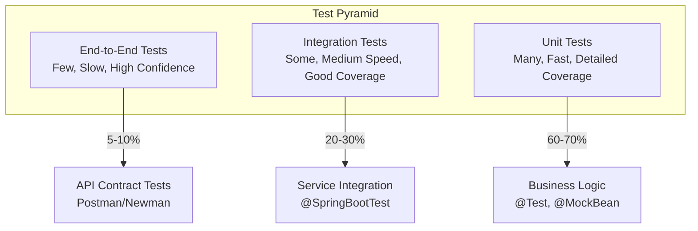

# Testing Overview

OpenFrame OSS Library follows a comprehensive testing strategy to ensure code quality, reliability, and maintainability. This guide covers our testing approach, tools, and best practices for building robust applications.

## Testing Strategy

### Test Pyramid



### Testing Levels & Coverage

| Test Level | Coverage Target | Speed | Confidence | Tools |
|------------|----------------|-------|------------|-------|
| **Unit Tests** | 80%+ line coverage | Fast (<1s) | High for logic | JUnit 5, Mockito |
| **Integration Tests** | 70%+ service paths | Medium (5-30s) | High for flows | TestContainers, @SpringBootTest |
| **API Tests** | 90%+ endpoints | Slow (30s+) | High for contracts | RestAssured, WireMock |
| **End-to-End** | Critical user journeys | Very Slow (minutes) | Highest | Selenium, Playwright |

## Unit Testing

### JUnit 5 & Mockito Setup

**Maven Dependencies:**
```xml
<dependencies>
    <!-- Spring Boot Test Starter -->
    <dependency>
        <groupId>org.springframework.boot</groupId>
        <artifactId>spring-boot-starter-test</artifactId>
        <scope>test</scope>
    </dependency>
    
    <!-- TestContainers for Integration Tests -->
    <dependency>
        <groupId>org.testcontainers</groupId>
        <artifactId>testcontainers-bom</artifactId>
        <version>1.19.3</version>
        <type>pom</type>
        <scope>import</scope>
    </dependency>
    
    <!-- Mockito for Mocking -->
    <dependency>
        <groupId>org.mockito</groupId>
        <artifactId>mockito-core</artifactId>
        <scope>test</scope>
    </dependency>
</dependencies>
```

### Unit Test Examples

#### Service Layer Testing

```java
@ExtendWith(MockitoExtension.class)
class DeviceServiceTest {
    
    @Mock
    private DeviceRepository deviceRepository;
    
    @Mock
    private EventService eventService;
    
    @InjectMocks
    private DeviceService deviceService;
    
    @Test
    @DisplayName("Should create device and publish event")
    void shouldCreateDeviceAndPublishEvent() {
        // Given
        String organizationId = "org-123";
        Device device = createTestDevice(organizationId);
        Device savedDevice = createTestDevice(organizationId);
        savedDevice.setId("device-123");
        
        when(deviceRepository.save(any(Device.class)))
            .thenReturn(savedDevice);
        
        // When
        Device result = deviceService.createDevice(device);
        
        // Then
        assertThat(result).isNotNull();
        assertThat(result.getId()).isEqualTo("device-123");
        
        verify(deviceRepository).save(device);
        verify(eventService).publishEvent(
            eq(EventType.DEVICE_CREATED),
            eq(savedDevice.getId()),
            any(Map.class)
        );
    }
    
    @Test
    @DisplayName("Should throw exception when device not found")
    void shouldThrowExceptionWhenDeviceNotFound() {
        // Given
        String deviceId = "non-existent";
        when(deviceRepository.findById(deviceId))
            .thenReturn(Optional.empty());
        
        // When & Then
        assertThrows(DeviceNotFoundException.class, () -> 
            deviceService.getDevice(deviceId)
        );
    }
    
    @Test
    @DisplayName("Should validate device before saving")
    void shouldValidateDeviceBeforeSaving() {
        // Given
        Device invalidDevice = new Device();
        // Missing required fields
        
        // When & Then
        assertThrows(ValidationException.class, () -> 
            deviceService.createDevice(invalidDevice)
        );
        
        verify(deviceRepository, never()).save(any());
    }
    
    private Device createTestDevice(String organizationId) {
        Device device = new Device();
        device.setMachineId("test-machine-001");
        device.setOrganizationId(organizationId);
        device.setSerialNumber("TEST123456");
        device.setModel("Test Device Model");
        device.setType(DeviceType.DESKTOP);
        device.setStatus(DeviceStatus.ACTIVE);
        return device;
    }
}
```

#### Repository Layer Testing

```java
@DataMongoTest
@TestPropertySource(properties = {
    "spring.data.mongodb.database=test_db"
})
class DeviceRepositoryTest {
    
    @Autowired
    private TestEntityManager entityManager;
    
    @Autowired
    private DeviceRepository deviceRepository;
    
    @BeforeEach
    void setUp() {
        // Clean database before each test
        deviceRepository.deleteAll();
    }
    
    @Test
    @DisplayName("Should find devices by organization ID")
    void shouldFindDevicesByOrganizationId() {
        // Given
        String orgId = "org-123";
        Device device1 = createTestDevice(orgId, "device-1");
        Device device2 = createTestDevice(orgId, "device-2");
        Device otherOrgDevice = createTestDevice("org-456", "device-3");
        
        deviceRepository.saveAll(List.of(device1, device2, otherOrgDevice));
        
        // When
        List<Device> result = deviceRepository.findByOrganizationId(orgId);
        
        // Then
        assertThat(result).hasSize(2);
        assertThat(result).extracting(Device::getOrganizationId)
                         .allMatch(id -> id.equals(orgId));
    }
    
    @Test
    @DisplayName("Should find active devices only")
    void shouldFindActiveDevicesOnly() {
        // Given
        String orgId = "org-123";
        Device activeDevice = createTestDevice(orgId, "active");
        activeDevice.setStatus(DeviceStatus.ACTIVE);
        
        Device offlineDevice = createTestDevice(orgId, "offline");
        offlineDevice.setStatus(DeviceStatus.OFFLINE);
        
        deviceRepository.saveAll(List.of(activeDevice, offlineDevice));
        
        // When
        List<Device> result = deviceRepository.findByOrganizationIdAndStatus(
            orgId, DeviceStatus.ACTIVE
        );
        
        // Then
        assertThat(result).hasSize(1);
        assertThat(result.get(0).getStatus()).isEqualTo(DeviceStatus.ACTIVE);
    }
    
    @Test
    @DisplayName("Should implement cursor pagination correctly")
    void shouldImplementCursorPaginationCorrectly() {
        // Given - Create 5 devices
        String orgId = "org-123";
        List<Device> devices = IntStream.range(1, 6)
            .mapToObj(i -> createTestDevice(orgId, "device-" + i))
            .collect(Collectors.toList());
        
        deviceRepository.saveAll(devices);
        
        // When - Get first page
        Pageable pageable = PageRequest.of(0, 2, Sort.by("id"));
        Page<Device> firstPage = deviceRepository.findByOrganizationId(orgId, pageable);
        
        // Then
        assertThat(firstPage.getContent()).hasSize(2);
        assertThat(firstPage.hasNext()).isTrue();
        assertThat(firstPage.getTotalElements()).isEqualTo(5);
    }
}
```

#### DTO and Mapper Testing

```java
class DeviceMapperTest {
    
    private DeviceMapper mapper = DeviceMapper.INSTANCE;
    
    @Test
    @DisplayName("Should map device entity to response DTO")
    void shouldMapDeviceEntityToResponseDto() {
        // Given
        Device device = createTestDevice();
        device.setId("device-123");
        device.setLastCheckin(Instant.now());
        
        // When
        DeviceResponse response = mapper.toResponse(device);
        
        // Then
        assertThat(response).isNotNull();
        assertThat(response.getId()).isEqualTo(device.getId());
        assertThat(response.getMachineId()).isEqualTo(device.getMachineId());
        assertThat(response.getSerialNumber()).isEqualTo(device.getSerialNumber());
        assertThat(response.getStatus()).isEqualTo(device.getStatus().name());
        assertThat(response.getLastCheckin()).isEqualTo(device.getLastCheckin());
    }
    
    @Test
    @DisplayName("Should map create request to device entity")
    void shouldMapCreateRequestToDeviceEntity() {
        // Given
        CreateDeviceRequest request = new CreateDeviceRequest();
        request.setMachineId("test-machine");
        request.setSerialNumber("SN123456");
        request.setModel("Test Model");
        request.setType("DESKTOP");
        
        // When
        Device device = mapper.fromCreateRequest(request);
        
        // Then
        assertThat(device).isNotNull();
        assertThat(device.getMachineId()).isEqualTo(request.getMachineId());
        assertThat(device.getSerialNumber()).isEqualTo(request.getSerialNumber());
        assertThat(device.getModel()).isEqualTo(request.getModel());
        assertThat(device.getType()).isEqualTo(DeviceType.DESKTOP);
    }
    
    @Test
    @DisplayName("Should handle null values gracefully")
    void shouldHandleNullValuesGracefully() {
        // When
        DeviceResponse response = mapper.toResponse(null);
        
        // Then
        assertThat(response).isNull();
    }
}
```

## Integration Testing

### Spring Boot Test Configuration

```java
@SpringBootTest(webEnvironment = SpringBootTest.WebEnvironment.RANDOM_PORT)
@TestPropertySource(locations = "classpath:application-integration.yml")
@Testcontainers
class DeviceIntegrationTest {
    
    @Container
    static MongoDBContainer mongoDBContainer = new MongoDBContainer("mongo:7.0")
            .withDatabaseName("integration_test_db");
    
    @Container
    static GenericContainer<?> redisContainer = new GenericContainer<>("redis:7.0")
            .withExposedPorts(6379);
    
    @Autowired
    private TestRestTemplate restTemplate;
    
    @Autowired
    private DeviceRepository deviceRepository;
    
    @LocalServerPort
    private int port;
    
    private String baseUrl;
    
    @DynamicPropertySource
    static void configureProperties(DynamicPropertyRegistry registry) {
        registry.add("spring.data.mongodb.uri", mongoDBContainer::getReplicaSetUrl);
        registry.add("spring.data.redis.host", redisContainer::getHost);
        registry.add("spring.data.redis.port", redisContainer::getFirstMappedPort);
    }
    
    @BeforeEach
    void setUp() {
        baseUrl = "http://localhost:" + port + "/api";
        deviceRepository.deleteAll();
    }
    
    @Test
    @DisplayName("Should create device through API")
    void shouldCreateDeviceThroughApi() {
        // Given
        CreateDeviceRequest request = new CreateDeviceRequest();
        request.setMachineId("integration-test-machine");
        request.setSerialNumber("INT123456");
        request.setModel("Integration Test Device");
        request.setType("LAPTOP");
        
        HttpHeaders headers = new HttpHeaders();
        headers.setContentType(MediaType.APPLICATION_JSON);
        headers.setBearerAuth(createTestJwtToken());
        
        HttpEntity<CreateDeviceRequest> entity = new HttpEntity<>(request, headers);
        
        // When
        ResponseEntity<DeviceResponse> response = restTemplate.postForEntity(
            baseUrl + "/devices",
            entity,
            DeviceResponse.class
        );
        
        // Then
        assertThat(response.getStatusCode()).isEqualTo(HttpStatus.CREATED);
        assertThat(response.getBody()).isNotNull();
        assertThat(response.getBody().getMachineId()).isEqualTo(request.getMachineId());
        
        // Verify device was saved in database
        Optional<Device> savedDevice = deviceRepository.findByMachineId(request.getMachineId());
        assertThat(savedDevice).isPresent();
    }
    
    @Test
    @DisplayName("Should return 404 for non-existent device")
    void shouldReturn404ForNonExistentDevice() {
        // Given
        String deviceId = "non-existent-device";
        
        HttpHeaders headers = new HttpHeaders();
        headers.setBearerAuth(createTestJwtToken());
        HttpEntity<Void> entity = new HttpEntity<>(headers);
        
        // When
        ResponseEntity<ErrorResponse> response = restTemplate.exchange(
            baseUrl + "/devices/" + deviceId,
            HttpMethod.GET,
            entity,
            ErrorResponse.class
        );
        
        // Then
        assertThat(response.getStatusCode()).isEqualTo(HttpStatus.NOT_FOUND);
        assertThat(response.getBody()).isNotNull();
        assertThat(response.getBody().getError().getCode()).isEqualTo("DEVICE_NOT_FOUND");
    }
    
    @Test
    @DisplayName("Should implement pagination correctly")
    void shouldImplementPaginationCorrectly() {
        // Given - Create multiple devices
        String orgId = "test-org-123";
        List<Device> devices = IntStream.range(1, 26) // 25 devices
            .mapToObj(i -> createTestDevice(orgId, "device-" + String.format("%02d", i)))
            .collect(Collectors.toList());
        
        deviceRepository.saveAll(devices);
        
        HttpHeaders headers = new HttpHeaders();
        headers.setBearerAuth(createTestJwtToken(orgId));
        HttpEntity<Void> entity = new HttpEntity<>(headers);
        
        // When - Get first page
        ResponseEntity<DevicePageResponse> response = restTemplate.exchange(
            baseUrl + "/devices?limit=10",
            HttpMethod.GET,
            entity,
            DevicePageResponse.class
        );
        
        // Then
        assertThat(response.getStatusCode()).isEqualTo(HttpStatus.OK);
        assertThat(response.getBody()).isNotNull();
        assertThat(response.getBody().getData()).hasSize(10);
        assertThat(response.getBody().getPagination().getHasNext()).isTrue();
        assertThat(response.getBody().getMeta().getTotal()).isEqualTo(25);
    }
    
    private String createTestJwtToken() {
        return createTestJwtToken("test-org-123");
    }
    
    private String createTestJwtToken(String organizationId) {
        // Create test JWT token for integration tests
        return jwtTestHelper.createToken(organizationId, "test-user", List.of("ADMIN"));
    }
}
```

### Database Integration Testing

#### TestContainers Configuration

```java
@TestConfiguration
public class TestContainerConfiguration {
    
    @Bean
    @Primary
    public MongoDBContainer mongoDBContainer() {
        MongoDBContainer container = new MongoDBContainer("mongo:7.0")
            .withDatabaseName("openframe_test")
            .withUsername("test")
            .withPassword("test");
        
        container.start();
        return container;
    }
    
    @Bean
    @Primary  
    public GenericContainer<?> redisContainer() {
        GenericContainer<?> container = new GenericContainer<>("redis:7.0-alpine")
            .withExposedPorts(6379);
            
        container.start();
        return container;
    }
}
```

#### Custom Test Slices

```java
@Target(ElementType.TYPE)
@Retention(RetentionPolicy.RUNTIME)
@SpringBootTest
@AutoConfigureTestDatabase(replace = AutoConfigureTestDatabase.Replace.NONE)
@Testcontainers
public @interface OpenFrameIntegrationTest {
}

@Target(ElementType.TYPE)
@Retention(RetentionPolicy.RUNTIME)
@DataMongoTest
@Import(TestContainerConfiguration.class)
public @interface OpenFrameRepositoryTest {
}
```

## API Testing

### REST Assured Configuration

```java
@SpringBootTest(webEnvironment = SpringBootTest.WebEnvironment.RANDOM_PORT)
@TestMethodOrder(OrderAnnotation.class)
class DeviceApiTest {
    
    @LocalServerPort
    private int port;
    
    private RequestSpecification requestSpec;
    
    @BeforeEach
    void setUp() {
        RestAssured.port = port;
        RestAssured.enableLoggingOfRequestAndResponseIfValidationFails();
        
        requestSpec = new RequestSpecBuilder()
            .setContentType(ContentType.JSON)
            .setAccept(ContentType.JSON)
            .addHeader("Authorization", "Bearer " + createTestToken())
            .build();
    }
    
    @Test
    @Order(1)
    @DisplayName("API: Create Device - Success")
    void createDevice_Success() {
        CreateDeviceRequest request = new CreateDeviceRequest();
        request.setMachineId("api-test-machine");
        request.setSerialNumber("API123456");
        request.setModel("API Test Device");
        request.setType("DESKTOP");
        
        given()
            .spec(requestSpec)
            .body(request)
        .when()
            .post("/api/devices")
        .then()
            .statusCode(HttpStatus.CREATED.value())
            .body("success", equalTo(true))
            .body("data.machineId", equalTo(request.getMachineId()))
            .body("data.serialNumber", equalTo(request.getSerialNumber()))
            .body("data.type", equalTo(request.getType()))
            .body("data.id", notNullValue())
            .body("data.createdAt", notNullValue());
    }
    
    @Test
    @Order(2)
    @DisplayName("API: Get Device - Success")
    void getDevice_Success() {
        // First create a device
        String deviceId = createTestDevice();
        
        given()
            .spec(requestSpec)
        .when()
            .get("/api/devices/{id}", deviceId)
        .then()
            .statusCode(HttpStatus.OK.value())
            .body("success", equalTo(true))
            .body("data.id", equalTo(deviceId))
            .body("data.machineId", notNullValue())
            .body("data.status", notNullValue());
    }
    
    @Test
    @DisplayName("API: Get Device - Not Found")
    void getDevice_NotFound() {
        given()
            .spec(requestSpec)
        .when()
            .get("/api/devices/{id}", "non-existent-id")
        .then()
            .statusCode(HttpStatus.NOT_FOUND.value())
            .body("success", equalTo(false))
            .body("error.code", equalTo("DEVICE_NOT_FOUND"))
            .body("error.message", containsString("not found"));
    }
    
    @Test
    @DisplayName("API: List Devices - Pagination")
    void listDevices_Pagination() {
        // Create multiple devices
        for (int i = 1; i <= 15; i++) {
            createTestDevice("test-device-" + i);
        }
        
        given()
            .spec(requestSpec)
            .queryParam("limit", 10)
        .when()
            .get("/api/devices")
        .then()
            .statusCode(HttpStatus.OK.value())
            .body("success", equalTo(true))
            .body("data.size()", equalTo(10))
            .body("pagination.hasNext", equalTo(true))
            .body("pagination.cursor", notNullValue())
            .body("meta.total", greaterThanOrEqualTo(15));
    }
    
    @Test
    @DisplayName("API: Update Device Status")
    void updateDeviceStatus() {
        String deviceId = createTestDevice();
        
        UpdateDeviceStatusRequest request = new UpdateDeviceStatusRequest();
        request.setStatus("OFFLINE");
        
        given()
            .spec(requestSpec)
            .body(request)
        .when()
            .patch("/api/devices/{id}/status", deviceId)
        .then()
            .statusCode(HttpStatus.OK.value())
            .body("success", equalTo(true))
            .body("data.status", equalTo("OFFLINE"));
    }
    
    @Test
    @DisplayName("API: Validation Errors")
    void createDevice_ValidationErrors() {
        CreateDeviceRequest request = new CreateDeviceRequest();
        // Missing required fields
        
        given()
            .spec(requestSpec)
            .body(request)
        .when()
            .post("/api/devices")
        .then()
            .statusCode(HttpStatus.BAD_REQUEST.value())
            .body("success", equalTo(false))
            .body("error.code", equalTo("VALIDATION_ERROR"))
            .body("error.details", not(empty()));
    }
    
    private String createTestDevice() {
        return createTestDevice("test-machine-" + UUID.randomUUID());
    }
    
    private String createTestDevice(String machineId) {
        CreateDeviceRequest request = new CreateDeviceRequest();
        request.setMachineId(machineId);
        request.setSerialNumber("TEST" + System.currentTimeMillis());
        request.setModel("Test Device");
        request.setType("DESKTOP");
        
        return given()
            .spec(requestSpec)
            .body(request)
        .when()
            .post("/api/devices")
        .then()
            .statusCode(HttpStatus.CREATED.value())
            .extract()
            .path("data.id");
    }
}
```

## Test Data Management

### Test Data Builders

```java
public class DeviceTestDataBuilder {
    
    private Device device;
    
    public DeviceTestDataBuilder() {
        this.device = new Device();
        // Set sensible defaults
        this.device.setMachineId("test-machine-" + UUID.randomUUID());
        this.device.setSerialNumber("TEST" + System.currentTimeMillis());
        this.device.setModel("Test Device Model");
        this.device.setType(DeviceType.DESKTOP);
        this.device.setStatus(DeviceStatus.ACTIVE);
        this.device.setOrganizationId("test-org-123");
        this.device.setLastCheckin(Instant.now());
    }
    
    public static DeviceTestDataBuilder aDevice() {
        return new DeviceTestDataBuilder();
    }
    
    public DeviceTestDataBuilder withMachineId(String machineId) {
        this.device.setMachineId(machineId);
        return this;
    }
    
    public DeviceTestDataBuilder withOrganizationId(String organizationId) {
        this.device.setOrganizationId(organizationId);
        return this;
    }
    
    public DeviceTestDataBuilder withType(DeviceType type) {
        this.device.setType(type);
        return this;
    }
    
    public DeviceTestDataBuilder withStatus(DeviceStatus status) {
        this.device.setStatus(status);
        return this;
    }
    
    public DeviceTestDataBuilder offline() {
        this.device.setStatus(DeviceStatus.OFFLINE);
        this.device.setLastCheckin(Instant.now().minus(1, ChronoUnit.HOURS));
        return this;
    }
    
    public DeviceTestDataBuilder laptop() {
        this.device.setType(DeviceType.LAPTOP);
        this.device.setModel("Test Laptop Model");
        return this;
    }
    
    public Device build() {
        return this.device;
    }
    
    // Usage example:
    // Device device = aDevice()
    //     .withOrganizationId("org-123")
    //     .laptop()
    //     .offline()
    //     .build();
}
```

### Test Fixtures

```java
@Component
@TestProfile
public class TestDataFixtures {
    
    @Autowired
    private DeviceRepository deviceRepository;
    
    @Autowired
    private OrganizationRepository organizationRepository;
    
    public Organization createTestOrganization() {
        return createTestOrganization("Test Organization");
    }
    
    public Organization createTestOrganization(String name) {
        Organization org = new Organization();
        org.setName(name);
        org.setSlug(SlugUtil.generateSlug(name));
        org.setContactInformation(createContactInfo());
        return organizationRepository.save(org);
    }
    
    public Device createTestDevice(String organizationId) {
        return DeviceTestDataBuilder.aDevice()
            .withOrganizationId(organizationId)
            .build();
    }
    
    public List<Device> createMultipleDevices(String organizationId, int count) {
        return IntStream.range(0, count)
            .mapToObj(i -> createTestDevice(organizationId))
            .map(deviceRepository::save)
            .collect(Collectors.toList());
    }
    
    public void cleanupTestData() {
        deviceRepository.deleteAll();
        organizationRepository.deleteAll();
    }
    
    private ContactInformation createContactInfo() {
        ContactInformation contact = new ContactInformation();
        contact.setEmail("test@example.com");
        contact.setPhone("+1-555-TEST");
        return contact;
    }
}
```

## Running Tests

### Maven Commands

```bash
# Run all tests
./mvnw test

# Run unit tests only
./mvnw test -Dtest.profile=unit

# Run integration tests only
./mvnw test -Dtest.profile=integration

# Run specific test class
./mvnw test -Dtest=DeviceServiceTest

# Run tests with coverage
./mvnw test jacoco:report

# Run tests in parallel
./mvnw test -DforkCount=4 -DreuseForks=true

# Skip tests during build
./mvnw clean install -DskipTests

# Run tests with specific profile
./mvnw test -Dspring.profiles.active=test
```

### IDE Configuration

**IntelliJ IDEA Test Configuration:**
```text
Run/Debug Configurations > JUnit
- Test kind: All in package
- Package: com.openframe
- VM options: -Xmx1024m -Dspring.profiles.active=test
- Environment variables: 
  TESTCONTAINERS_REUSE_ENABLE=true
  TESTCONTAINERS_RYUK_DISABLED=true
```

## Coverage and Quality

### JaCoCo Coverage Configuration

```xml
<plugin>
    <groupId>org.jacoco</groupId>
    <artifactId>jacoco-maven-plugin</artifactId>
    <version>0.8.8</version>
    <executions>
        <execution>
            <goals>
                <goal>prepare-agent</goal>
            </goals>
        </execution>
        <execution>
            <id>report</id>
            <phase>test</phase>
            <goals>
                <goal>report</goal>
            </goals>
        </execution>
        <execution>
            <id>check</id>
            <goals>
                <goal>check</goal>
            </goals>
            <configuration>
                <rules>
                    <rule>
                        <element>BUNDLE</element>
                        <limits>
                            <limit>
                                <counter>LINE</counter>
                                <value>COVEREDRATIO</value>
                                <minimum>0.80</minimum>
                            </limit>
                        </limits>
                    </rule>
                </rules>
            </configuration>
        </execution>
    </executions>
</plugin>
```

### SonarQube Integration

```xml
<properties>
    <sonar.coverage.jacoco.xmlReportPaths>
        target/site/jacoco/jacoco.xml
    </sonar.coverage.jacoco.xmlReportPaths>
    <sonar.exclusions>
        **/dto/**,
        **/config/**,
        **/Application.java
    </sonar.exclusions>
</properties>
```

## Testing Best Practices

### 1. Test Naming Conventions

```java
// Good: Descriptive test names
@Test
@DisplayName("Should throw DeviceNotFoundException when device does not exist")
void shouldThrowDeviceNotFoundExceptionWhenDeviceDoesNotExist() {
    // Test implementation
}

// Alternative: BDD style
@Test
void givenNonExistentDeviceId_whenGetDevice_thenThrowDeviceNotFoundException() {
    // Test implementation
}
```

### 2. Arrange-Act-Assert Pattern

```java
@Test
void shouldCreateDeviceSuccessfully() {
    // Arrange
    CreateDeviceRequest request = new CreateDeviceRequest();
    request.setMachineId("test-machine");
    request.setSerialNumber("TEST123");
    
    when(deviceRepository.save(any(Device.class)))
        .thenReturn(createSavedDevice());
    
    // Act
    Device result = deviceService.createDevice(request);
    
    // Assert
    assertThat(result).isNotNull();
    assertThat(result.getMachineId()).isEqualTo("test-machine");
    verify(deviceRepository).save(any(Device.class));
}
```

### 3. Test Data Isolation

```java
@TestMethodOrder(OrderAnnotation.class)
class DeviceIntegrationTest {
    
    @BeforeEach
    void setUp() {
        // Clean state before each test
        deviceRepository.deleteAll();
    }
    
    @AfterEach
    void tearDown() {
        // Clean up after each test if needed
        deviceRepository.deleteAll();
    }
}
```

### 4. Mock vs Integration Testing

```java
// Unit test - Mock external dependencies
@ExtendWith(MockitoExtension.class)
class DeviceServiceTest {
    @Mock private DeviceRepository deviceRepository;
    @Mock private EventService eventService;
    // Test service logic in isolation
}

// Integration test - Test real interactions
@SpringBootTest
@Testcontainers
class DeviceIntegrationTest {
    @Autowired private DeviceService deviceService;
    // Test with real database and dependencies
}
```

## Common Testing Patterns

### Testing Async Operations

```java
@Test
void shouldProcessAsyncEvent() throws InterruptedException {
    // Given
    CountDownLatch latch = new CountDownLatch(1);
    CompletableFuture<Void> future = eventProcessor.processEventAsync(event);
    
    // When
    future.whenComplete((result, throwable) -> {
        latch.countDown();
    });
    
    // Then
    assertThat(latch.await(5, TimeUnit.SECONDS)).isTrue();
    verify(eventRepository).save(any(Event.class));
}
```

### Testing Security

```java
@Test
@WithMockUser(authorities = "DEVICE_READ")
void shouldAllowDeviceReadWithCorrectAuthority() {
    // Test passes with proper authority
}

@Test
@WithMockUser(authorities = "OTHER_PERMISSION")
void shouldDenyDeviceReadWithIncorrectAuthority() {
    // Should throw AccessDeniedException
    assertThrows(AccessDeniedException.class, () -> 
        deviceController.getDevice("device-123"));
}
```

### Testing Pagination

```java
@Test
void shouldReturnCorrectPaginationMetadata() {
    // Given
    createMultipleTestDevices(25);
    CursorPaginationInput pagination = new CursorPaginationInput(10, null);
    
    // When
    PageResponse<Device> result = deviceService.getDevices(pagination);
    
    // Then
    assertThat(result.getData()).hasSize(10);
    assertThat(result.getPagination().getHasNext()).isTrue();
    assertThat(result.getPagination().getCursor()).isNotNull();
    assertThat(result.getMeta().getTotal()).isEqualTo(25);
}
```

## Continuous Integration

### GitHub Actions Workflow

```yaml
# .github/workflows/test.yml
name: Tests

on:
  push:
    branches: [ main, develop ]
  pull_request:
    branches: [ main ]

jobs:
  test:
    runs-on: ubuntu-latest
    
    services:
      mongodb:
        image: mongo:7.0
        ports:
          - 27017:27017
      redis:
        image: redis:7.0
        ports:
          - 6379:6379

    steps:
    - uses: actions/checkout@v3
    
    - name: Set up JDK 21
      uses: actions/setup-java@v3
      with:
        java-version: '21'
        distribution: 'temurin'
    
    - name: Cache Maven packages
      uses: actions/cache@v3
      with:
        path: ~/.m2
        key: ${{ runner.os }}-m2-${{ hashFiles('**/pom.xml') }}
    
    - name: Run unit tests
      run: ./mvnw test -Dtest.profile=unit
    
    - name: Run integration tests
      run: ./mvnw test -Dtest.profile=integration
      env:
        MONGODB_URI: mongodb://localhost:27017/test_db
        REDIS_HOST: localhost
        REDIS_PORT: 6379
    
    - name: Generate test report
      run: ./mvnw jacoco:report
    
    - name: Upload coverage to Codecov
      uses: codecov/codecov-action@v3
      with:
        file: ./target/site/jacoco/jacoco.xml
```

## Next Steps

Now that you understand our testing approach:

1. **[Contributing Guidelines](../contributing/guidelines.md)** - Learn how to contribute tests
2. **[Code Quality Standards](./code-quality.md)** - Understand quality requirements
3. **[Architecture Overview](../architecture/overview.md)** - See how testing fits into overall architecture

## Resources

- 📚 **Testing Documentation**: [Spring Boot Testing](https://spring.io/guides/gs/testing-web/)
- 💬 **Community**: [OpenMSP Slack](https://join.slack.com/t/openmsp/shared_invite/zt-36bl7mx0h-3~U2nFH6nqHqoTPXMaHEHA)
- 🚀 **Platform**: [OpenFrame.ai](https://openframe.ai)

Build confidence in your code with comprehensive testing! 🧪