# First Steps

Now that you have the OpenFrame OSS Library up and running, let's explore the key features and common patterns you'll use in real-world applications.

## Your First 5 Steps After Installation

### 1. Understanding the Module Structure

The library is organized into two main modules:

```mermaid
flowchart LR
    subgraph module1[module_1: Core DTOs]
        LogEvent[LogEvent]
        LogDetails[LogDetails]
        LogFilters[LogFilters]
        DeviceFilterOptions[DeviceFilterOptions]
        OrgFilter[OrganizationFilterOption]
    end
    
    subgraph module2[module_2: Query & Filters]
        GenericQuery[GenericQueryResult]
        CountedQuery[CountedGenericQueryResult]
        DeviceFilters[DeviceFilters]
        DeviceOption[DeviceFilterOption]
        LogFilterOpts[LogFilterOptions]
    end
    
    module1 -->|Used by| module2
    
    style module1 fill:#e3f2fd
    style module2 fill:#f3e5f5
```



**Start here**: Familiarize yourself with these core components before building complex applications.

### 2. Create Your First Audit Trail

Learn to capture comprehensive audit events:

```java
import com.openframe.api.dto.audit.LogEvent;
import com.openframe.api.dto.audit.LogDetails;
import java.time.Instant;

public class AuditTrailExample {
    
    public void createComprehensiveAuditTrail() {
        // Step 1: Create a basic log event
        LogEvent loginEvent = LogEvent.builder()
            .toolEventId("evt_" + System.currentTimeMillis())
            .eventType("USER_LOGIN")
            .ingestDay("2024-01-15")
            .toolType("AUTHENTICATION")
            .severity("INFO")
            .userId("user_12345")
            .deviceId("device_67890")
            .hostname("web-app-01.acme.com")
            .organizationId("org_acme_123")
            .organizationName("Acme Corporation")
            .summary("User authentication successful")
            .timestamp(Instant.now())
            .build();
            
        // Step 2: Add detailed information
        LogDetails loginDetails = LogDetails.builder()
            .toolEventId(loginEvent.getToolEventId())
            .eventType(loginEvent.getEventType())
            .ingestDay(loginEvent.getIngestDay())
            .toolType(loginEvent.getToolType())
            .severity(loginEvent.getSeverity())
            .userId(loginEvent.getUserId())
            .deviceId(loginEvent.getDeviceId())
            .hostname(loginEvent.getHostname())
            .organizationId(loginEvent.getOrganizationId())
            .organizationName(loginEvent.getOrganizationName())
            .summary(loginEvent.getSummary())
            .timestamp(loginEvent.getTimestamp())
            // Additional detail fields
            .message("User jane.doe@acme.com successfully authenticated via SSO")
            .detail("Method: SAML, Provider: Okta, IP: 203.0.113.42, " +
                   "User-Agent: Mozilla/5.0 (compatible browser), " +
                   "Session: sess_abc123xyz")
            .build();
            
        System.out.println("Audit trail created for event: " + 
                         loginDetails.getToolEventId());
    }
}
```

### 3. Implement Device Management Queries

Set up filtering and querying for device management:

```java
import com.openframe.api.dto.device.*;
import java.util.Arrays;
import java.util.List;

public class DeviceManagementExample {
    
    public void setupDeviceFiltering() {
        // Create device filter options
        List<DeviceFilterOption> statusOptions = Arrays.asList(
            DeviceFilterOption.builder()
                .value("ACTIVE")
                .label("Active")
                .count(245)
                .build(),
            DeviceFilterOption.builder()
                .value("INACTIVE")
                .label("Inactive")
                .count(18)
                .build(),
            DeviceFilterOption.builder()
                .value("MAINTENANCE")
                .label("Under Maintenance")
                .count(5)
                .build()
        );
        
        List<DeviceFilterOption> typeOptions = Arrays.asList(
            DeviceFilterOption.builder()
                .value("LAPTOP")
                .label("Laptops")
                .count(150)
                .build(),
            DeviceFilterOption.builder()
                .value("DESKTOP")
                .label("Desktops")
                .count(95)
                .build(),
            DeviceFilterOption.builder()
                .value("MOBILE")
                .label("Mobile Devices")
                .count(23)
                .build()
        );
        
        // Create comprehensive device filters
        DeviceFilters deviceFilters = DeviceFilters.builder()
            .status(statusOptions)
            .type(typeOptions)
            .filteredDevicesCount(268)
            .build();
            
        System.out.println("Device management ready with " + 
                         deviceFilters.getFilteredDevicesCount() + " devices");
    }
}
```

### 4. Build Paginated Query Results

Implement proper pagination for your API responses:

```java
import com.openframe.api.dto.GenericQueryResult;
import com.openframe.api.dto.CountedGenericQueryResult;
import com.openframe.api.dto.shared.CursorPageInfo;
import java.util.List;

public class PaginationExample {
    
    public <T> GenericQueryResult<T> createPaginatedResult(
            List<T> items, 
            String startCursor, 
            String endCursor, 
            boolean hasNext) {
        
        CursorPageInfo pageInfo = CursorPageInfo.builder()
            .hasNextPage(hasNext)
            .hasPreviousPage(startCursor != null)
            .startCursor(startCursor)
            .endCursor(endCursor)
            .build();
            
        return GenericQueryResult.<T>builder()
            .items(items)
            .pageInfo(pageInfo)
            .build();
    }
    
    public <T> CountedGenericQueryResult<T> createCountedResult(
            List<T> items,
            String startCursor,
            String endCursor,
            boolean hasNext,
            Integer totalCount) {
        
        CursorPageInfo pageInfo = CursorPageInfo.builder()
            .hasNextPage(hasNext)
            .hasPreviousPage(startCursor != null)
            .startCursor(startCursor)
            .endCursor(endCursor)
            .build();
            
        return CountedGenericQueryResult.<T>builder()
            .items(items)
            .pageInfo(pageInfo)
            .filteredCount(totalCount)
            .build();
    }
}
```

### 5. Configure Advanced Filtering

Set up complex filtering scenarios:

```java
import com.openframe.api.dto.audit.*;
import java.time.LocalDate;
import java.util.Arrays;

public class AdvancedFilteringExample {
    
    public void createAdvancedLogFilters() {
        // Create organization filter options
        OrganizationFilterOption orgOption = OrganizationFilterOption.builder()
            .organizationId("org_acme_123")
            .organizationName("Acme Corporation")
            .build();
            
        // Create comprehensive log filters
        LogFilters logFilters = LogFilters.builder()
            .toolTypes(Arrays.asList("AUTHENTICATION", "AUTHORIZATION", "DATA_ACCESS"))
            .eventTypes(Arrays.asList("USER_LOGIN", "USER_LOGOUT", "PERMISSION_GRANT"))
            .severities(Arrays.asList("INFO", "WARN", "ERROR"))
            .organizations(Arrays.asList(orgOption))
            .build();
            
        // Create time-based filter options
        LogFilterOptions filterOptions = LogFilterOptions.builder()
            .startDate(LocalDate.of(2024, 1, 1))
            .endDate(LocalDate.of(2024, 1, 31))
            .toolTypes(Arrays.asList("AUTHENTICATION", "DATA_ACCESS"))
            .eventTypes(Arrays.asList("USER_LOGIN", "FILE_ACCESS"))
            .severities(Arrays.asList("INFO", "WARN", "ERROR", "CRITICAL"))
            .organizations(Arrays.asList("org_acme_123", "org_partner_456"))
            .deviceId("device_67890")
            .build();
            
        System.out.println("Advanced filtering configured for audit logs");
    }
}
```

## Common Configuration Patterns

### Pattern 1: Event Severity Mapping

```java
public enum EventSeverity {
    INFO("INFO", 1),
    WARN("WARN", 2), 
    ERROR("ERROR", 3),
    CRITICAL("CRITICAL", 4);
    
    private final String value;
    private final int level;
    
    EventSeverity(String value, int level) {
        this.value = value;
        this.level = level;
    }
    
    public String getValue() { return value; }
    public int getLevel() { return level; }
}
```

### Pattern 2: Event Type Categories

```java
public class EventTypeCategories {
    public static final String AUTHENTICATION = "AUTHENTICATION";
    public static final String AUTHORIZATION = "AUTHORIZATION"; 
    public static final String DATA_ACCESS = "DATA_ACCESS";
    public static final String SYSTEM_ADMIN = "SYSTEM_ADMIN";
    public static final String USER_MANAGEMENT = "USER_MANAGEMENT";
    
    public static final String[] SECURITY_EVENTS = {
        AUTHENTICATION, AUTHORIZATION
    };
    
    public static final String[] DATA_EVENTS = {
        DATA_ACCESS
    };
}
```

### Pattern 3: Organization Context Helper

```java
public class OrganizationContext {
    private final String organizationId;
    private final String organizationName;
    
    public OrganizationContext(String id, String name) {
        this.organizationId = id;
        this.organizationName = name;
    }
    
    public OrganizationFilterOption toFilterOption() {
        return OrganizationFilterOption.builder()
            .organizationId(organizationId)
            .organizationName(organizationName)
            .build();
    }
    
    public void enrichLogEvent(LogEvent.LogEventBuilder builder) {
        builder.organizationId(organizationId)
               .organizationName(organizationName);
    }
}
```

## Key Features to Explore

| Feature | Description | When to Use |
|---------|-------------|-------------|
| **Log Events** | Basic audit trail entries | All audit logging scenarios |
| **Log Details** | Extended audit information | Complex events needing context |
| **Device Filters** | Device inventory queries | Device management systems |
| **Generic Results** | Type-safe pagination | API response formatting |
| **Counted Results** | Results with total counts | UI pagination requirements |

## Integration Best Practices

### 1. **Consistent Event IDs**
```java
// Use consistent ID generation
String eventId = "evt_" + UUID.randomUUID().toString();
```

### 2. **Standardized Timestamps**
```java
// Always use UTC timestamps
Instant timestamp = Instant.now();
```

### 3. **Meaningful Summaries**
```java
// Create human-readable summaries
String summary = String.format("User %s performed %s on %s", 
    username, action, resource);
```

### 4. **Structured Detail Information**
```java
// Use structured detail strings
String detail = String.format("Method: %s, IP: %s, Session: %s", 
    method, ipAddress, sessionId);
```

## Where to Get Help

| Resource | Purpose | Link |
|----------|---------|------|
| **API Documentation** | Complete reference | `docs/reference/architecture/` |
| **Development Guide** | Setup and contribution | `docs/development/` |
| **Architecture Overview** | System design details | `docs/development/architecture/overview.md` |
| **Source Code Examples** | Real implementation patterns | GitHub repository |

## Next Steps in Your Journey

### Immediate Next Steps (Today)
1. ✅ **Implement basic audit logging** in your application
2. ✅ **Set up device filtering** for your use case  
3. ✅ **Create paginated query responses**

### Short Term Goals (This Week)
1. 📚 **Read the [Architecture Overview](../development/architecture/overview.md)**
2. 🔧 **Set up [Local Development](../development/setup/local-development.md)**
3. 🧪 **Explore [Testing Patterns](../development/testing/overview.md)**

### Long Term Goals (This Month)
1. 🚀 **Integrate with OpenFrame platform services**
2. 📈 **Implement comprehensive audit trails**
3. 🤝 **Consider [Contributing](../development/contributing/guidelines.md)**

---

**🎯 You're Ready!** You now have the foundation to build robust audit logging and device management features with the OpenFrame OSS Library. Choose your next learning path based on your immediate needs.