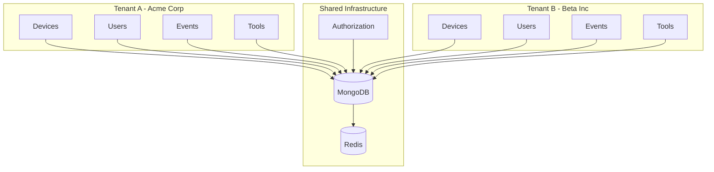
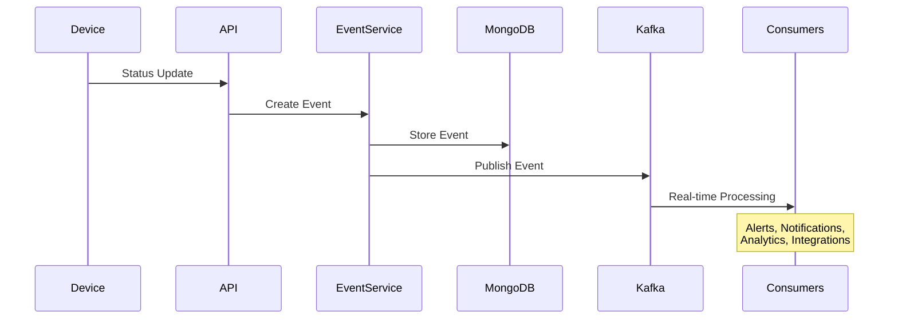

# First Steps with OpenFrame OSS Library

Now that you have OpenFrame running, let's explore the key features and concepts that make it powerful. This guide walks you through the first 5 essential things to do after installation.

## Step 1: Understand the Core Concepts

### Multi-Tenant Architecture

OpenFrame is built for multi-tenancy from the ground up:



### Core Domain Objects

| Object | Purpose | Key Properties |
|--------|---------|----------------|
| **Device** | Represents physical/virtual machines | `serialNumber`, `type`, `status`, `health` |
| **Organization** | Tenant container for devices and users | `name`, `domain`, `contactInfo` |
| **Event** | Audit trail and activity logging | `type`, `severity`, `timestamp`, `metadata` |
| **Tool** | External integrations (RMM, MDM) | `type`, `credentials`, `connectionStatus` |
| **User** | Identity and access management | `email`, `role`, `organizations` |

## Step 2: Explore Data Transfer Objects (DTOs)

OpenFrame uses a sophisticated DTO pattern for API consistency.

### Understanding the DTO Pattern

```java
// Input DTOs - For API requests
public class DeviceFilterInput {
    private List<String> types;           // Filter by device types
    private List<String> statuses;        // Filter by statuses
    private String organizationId;        // Filter by organization
    private CursorPaginationInput pagination; // Pagination parameters
}

// Response DTOs - For API responses  
public class DeviceResponse {
    private String id;
    private String serialNumber;
    private String model;
    private DeviceType type;
    private String status;
    private Instant lastCheckin;
}

// Query Result DTOs - For paginated results
public class GenericQueryResult<T> {
    private List<T> items;           // The actual data
    private CursorPageInfo pageInfo; // Pagination metadata
}
```

### Try the DTO Pattern

```bash
# Create a device with input DTO
curl -X POST http://localhost:8080/api/devices \
  -H "Content-Type: application/json" \
  -d '{
    "machineId": "test-machine",
    "serialNumber": "TEST123456",
    "model": "Test Device",
    "type": "DESKTOP",
    "status": "ACTIVE"
  }'

# Query with filter DTO
curl -X POST http://localhost:8080/api/devices/search \
  -H "Content-Type: application/json" \
  -d '{
    "types": ["DESKTOP", "LAPTOP"],
    "statuses": ["ACTIVE"], 
    "pagination": {
      "first": 10
    }
  }'
```

## Step 3: Master Cursor-Based Pagination

OpenFrame uses cursor-based pagination for consistent performance at scale.

### Why Cursor Pagination?

| Traditional Offset | Cursor-Based |
|-------------------|--------------|
| ❌ Performance degrades with large offsets | ✅ Consistent performance |
| ❌ Data duplication during concurrent updates | ✅ Stable result sets |
| ❌ Not suitable for real-time data | ✅ Perfect for real-time data |

### Pagination Example

```bash
# First page request
curl -X POST http://localhost:8080/api/devices/search \
  -H "Content-Type: application/json" \
  -d '{
    "pagination": {
      "first": 5
    }
  }'
```

Response shows pagination metadata:
```json
{
  "items": [...],
  "pageInfo": {
    "hasNextPage": true,
    "hasPreviousPage": false,
    "startCursor": "cursor_abc123",
    "endCursor": "cursor_def456"
  }
}
```

```bash
# Next page request using endCursor
curl -X POST http://localhost:8080/api/devices/search \
  -H "Content-Type: application/json" \
  -d '{
    "pagination": {
      "first": 5,
      "after": "cursor_def456"
    }
  }'
```

### Pagination Best Practices

```java
// Always check for more pages
public void fetchAllDevices() {
    String cursor = null;
    boolean hasMore = true;
    
    while (hasMore) {
        DeviceFilterInput input = DeviceFilterInput.builder()
            .pagination(CursorPaginationInput.builder()
                .first(50)  // Page size
                .after(cursor)  // Start after this cursor
                .build())
            .build();
        
        GenericQueryResult<DeviceResponse> result = deviceService.searchDevices(input);
        
        // Process the current page
        processDevices(result.getItems());
        
        // Update for next iteration
        hasMore = result.getPageInfo().isHasNextPage();
        cursor = result.getPageInfo().getEndCursor();
    }
}
```

## Step 4: Configure Organizations and Multi-Tenancy

### Create Your First Organization

```bash
# Create an organization
curl -X POST http://localhost:8080/api/organizations \
  -H "Content-Type: application/json" \
  -d '{
    "name": "My Company",
    "domain": "mycompany.com",
    "contactInformation": {
      "email": "admin@mycompany.com",
      "phone": "+1-555-123-4567"
    },
    "address": {
      "street": "123 Business St",
      "city": "San Francisco",
      "state": "CA",
      "postalCode": "94105",
      "country": "USA"
    },
    "contactPerson": {
      "firstName": "John",
      "lastName": "Doe", 
      "email": "john.doe@mycompany.com",
      "role": "IT Administrator"
    }
  }'
```

### Link Devices to Organizations

```bash
# Update a device to belong to an organization
curl -X PUT http://localhost:8080/api/devices/device-001 \
  -H "Content-Type: application/json" \
  -d '{
    "organizationId": "org-123",
    "machineId": "machine-001",
    "serialNumber": "SN123456",
    "model": "Dell OptiPlex 7090",
    "type": "DESKTOP",
    "status": "ACTIVE"
  }'
```

### Query by Organization

```bash
# Get all devices for an organization
curl -X POST http://localhost:8080/api/devices/search \
  -H "Content-Type: application/json" \
  -d '{
    "organizationId": "org-123",
    "pagination": {"first": 20}
  }'
```

## Step 5: Enable Event Tracking and Audit Logs

### Understanding Events

OpenFrame tracks two types of events:

1. **Core Events** - System-generated events (device status changes, user actions)
2. **External Events** - Events from integrated tools (RMM alerts, security events)

### Create Your First Event

```bash
# Log a device status change event
curl -X POST http://localhost:8080/api/events \
  -H "Content-Type: application/json" \
  -d '{
    "type": "DEVICE_STATUS_CHANGED",
    "severity": "INFO",
    "source": "device-management-api",
    "deviceId": "device-001",
    "organizationId": "org-123",
    "metadata": {
      "previousStatus": "OFFLINE",
      "newStatus": "ACTIVE",
      "reason": "Device came back online"
    },
    "timestamp": "2024-01-20T10:30:00Z"
  }'
```

### Query Events with Filters

```bash
# Get events for a specific device
curl -X POST http://localhost:8080/api/events/search \
  -H "Content-Type: application/json" \
  -d '{
    "deviceIds": ["device-001"],
    "types": ["DEVICE_STATUS_CHANGED"],
    "severities": ["INFO", "WARNING"],
    "timeRange": {
      "start": "2024-01-20T00:00:00Z",
      "end": "2024-01-20T23:59:59Z"
    },
    "pagination": {"first": 50}
  }'
```

### Event Processing Pipeline



## Advanced Features to Explore

### 1. Health Monitoring

```bash
# Check application health
curl http://localhost:8080/actuator/health

# Detailed health information
curl http://localhost:8080/actuator/health/mongo
curl http://localhost:8080/actuator/health/redis
```

### 2. Metrics and Monitoring

```bash
# Application metrics
curl http://localhost:8080/actuator/metrics

# Specific metrics
curl http://localhost:8080/actuator/metrics/jvm.memory.used
curl http://localhost:8080/actuator/metrics/http.server.requests
```

### 3. Configuration Properties

```bash
# View configuration
curl http://localhost:8080/actuator/configprops

# Environment information
curl http://localhost:8080/actuator/env
```

### 4. API Documentation

Visit `http://localhost:8080/swagger-ui.html` to explore:

- 📖 **Interactive API Documentation**
- 🧪 **Try API endpoints directly**
- 📋 **Request/response schemas**
- 🔍 **Search and filter capabilities**

## Configuration Examples

### Application Configuration

Create `config/application-dev.yml`:

```yaml
spring:
  profiles:
    active: dev
  data:
    mongodb:
      uri: mongodb://localhost:27017/openframe-dev
      auto-index-creation: true
  redis:
    host: localhost
    port: 6379
    database: 0

server:
  port: 8080

logging:
  level:
    com.openframe: DEBUG
    org.springframework.data.mongodb: DEBUG

management:
  endpoints:
    web:
      exposure:
        include: health,metrics,info,env
  endpoint:
    health:
      show-details: always

openframe:
  pagination:
    default-page-size: 20
    max-page-size: 100
  security:
    enabled: false  # Disable for development
```

### Environment Variables

```bash
# Create .env file for development
cat > .env << EOF
SPRING_PROFILES_ACTIVE=dev
MONGODB_URI=mongodb://localhost:27017/openframe-dev
REDIS_URL=redis://localhost:6379/0
SERVER_PORT=8080
LOGGING_LEVEL_ROOT=INFO
LOGGING_LEVEL_OPENFRAME=DEBUG
EOF

# Load environment
source .env
```

## Common Operations Reference

### Device Management

```bash
# List all devices
curl http://localhost:8080/api/devices

# Get specific device
curl http://localhost:8080/api/devices/{deviceId}

# Update device status
curl -X PATCH http://localhost:8080/api/devices/{deviceId}/status \
  -H "Content-Type: application/json" \
  -d '{"status": "MAINTENANCE"}'

# Delete device
curl -X DELETE http://localhost:8080/api/devices/{deviceId}
```

### Organization Management

```bash
# List organizations
curl http://localhost:8080/api/organizations

# Get organization details
curl http://localhost:8080/api/organizations/{orgId}

# Update organization
curl -X PUT http://localhost:8080/api/organizations/{orgId} \
  -H "Content-Type: application/json" \
  -d '{...organization data...}'
```

### Event Management

```bash
# Recent events
curl http://localhost:8080/api/events?recent=true

# Events by severity
curl "http://localhost:8080/api/events?severity=ERROR&severity=WARNING"

# Event details
curl http://localhost:8080/api/events/{eventId}
```

## Next Steps

🎉 **Great job!** You now understand the core concepts and have hands-on experience with:

- ✅ Multi-tenant architecture
- ✅ DTO patterns and API structure  
- ✅ Cursor-based pagination
- ✅ Organization management
- ✅ Event tracking and audit logs

### Continue Your Journey

1. **[Development Environment Setup](../development/setup/environment.md)** - Full development setup
2. **[Architecture Deep Dive](../development/architecture/overview.md)** - Understand the system design  
3. **[Local Development Guide](../development/setup/local-development.md)** - Contributing and customization
4. **[Testing Overview](../development/testing/overview.md)** - Testing strategies and tools

### Build Something Cool

Now that you understand the basics, try building:

- 📊 **Custom Dashboard** - Device health monitoring
- 🔔 **Alert System** - Real-time notifications  
- 🔗 **Tool Integration** - Connect your RMM/MDM tools
- 📈 **Analytics Engine** - Event data analysis

## Need Help?

- 📖 **Documentation**: Comprehensive guides and references
- 💬 **Community**: GitHub Discussions for questions
- 🐛 **Issues**: GitHub Issues for bugs and features
- 📧 **Support**: Enterprise support available

You're now equipped to build powerful device management solutions with OpenFrame OSS Library!