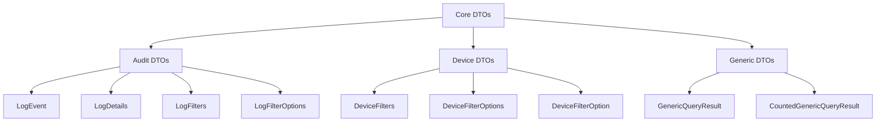

# First Steps

Welcome to your journey with the OpenFrame OSS Library! After completing the quick start, this guide will walk you through the essential next steps to become proficient with the library's core features.

## 🗺️ Your Learning Path

Here are the first 5 things you should do after installation:

1. [Explore Core DTOs](#1-explore-core-dtos)
2. [Master the Builder Pattern](#2-master-the-builder-pattern)
3. [Understand Filtering Capabilities](#3-understand-filtering-capabilities)
4. [Work with Query Results](#4-work-with-query-results)
5. [Configure Your Project](#5-configure-your-project)

---

## 1. 🧱 Explore Core DTOs

The library provides two main categories of Data Transfer Objects. Understanding these is crucial for effective usage.

### Audit Log DTOs

```java
import com.openframe.api.dto.audit.*;

// LogEvent - The main audit log entry
LogEvent event = LogEvent.builder()
    .toolEventId("evt-2024-001")
    .eventType("USER_ACTION")
    .severity("INFO")
    .userId("user123")
    .organizationName("Your Organization")
    .summary("User performed an action")
    .timestamp(Instant.now())
    .build();

// LogDetails - Extended log information
LogDetails details = LogDetails.builder()
    .toolEventId("evt-2024-001")
    .eventType("SYSTEM_ERROR")
    .severity("HIGH")
    .timestamp(Instant.now())
    .message("Detailed error information")
    .build();
```

### Device Management DTOs

```java
import com.openframe.api.dto.device.*;

// DeviceFilterOption - Single filter option
DeviceFilterOption option = DeviceFilterOption.builder()
    .value("LAPTOP")
    .label("Laptop Devices")
    .count(45)
    .build();

// DeviceFilters - Complete filtering setup
DeviceFilters filters = DeviceFilters.builder()
    .statuses(Arrays.asList("ACTIVE", "INACTIVE"))
    .deviceTypes(Arrays.asList("LAPTOP", "MOBILE"))
    .osTypes(Arrays.asList("WINDOWS", "MACOS"))
    .filteredCount(120)
    .build();
```

### DTO Hierarchy Overview



---

## 2. ⚡ Master the Builder Pattern

The library extensively uses Lombok's builder pattern. Here's how to use it effectively:

### Basic Builder Usage

```java
// ✅ Recommended: Use builders for clean, readable code
LogEvent event = LogEvent.builder()
    .toolEventId("evt-001")
    .eventType("LOGIN")
    .severity("INFO")
    .build();

// ❌ Avoid: Constructor with many parameters
// LogEvent event = new LogEvent("evt-001", "LOGIN", "INFO", null, null, ...);
```

### Chaining and Conditional Building

```java
public LogEvent createAuditEvent(String userId, String action, boolean isError) {
    LogEvent.LogEventBuilder builder = LogEvent.builder()
        .toolEventId("evt-" + System.currentTimeMillis())
        .eventType(action)
        .userId(userId)
        .timestamp(Instant.now());
    
    // Conditional properties
    if (isError) {
        builder.severity("ERROR")
               .summary("An error occurred during " + action);
    } else {
        builder.severity("INFO")
               .summary("Successfully completed " + action);
    }
    
    return builder.build();
}
```

### Builder Best Practices

| ✅ Do | ❌ Don't |
|-------|-----------|
| Use descriptive field names | Use abbreviations |
| Set required fields first | Mix builders with setters |
| Chain related fields together | Create overly complex chains |
| Use conditional building for optional fields | Ignore null safety |

---

## 3. 🔍 Understand Filtering Capabilities

Filtering is a core strength of the library. Master these patterns for powerful data queries.

### Device Filtering Examples

```java
// Simple status filtering
DeviceFilters basicFilters = DeviceFilters.builder()
    .statuses(Arrays.asList("ACTIVE"))
    .build();

// Complex multi-criteria filtering
DeviceFilters advancedFilters = DeviceFilters.builder()
    .statuses(Arrays.asList("ACTIVE", "PENDING"))
    .deviceTypes(Arrays.asList("LAPTOP", "DESKTOP"))
    .osTypes(Arrays.asList("WINDOWS_10", "WINDOWS_11"))
    .organizationIds(Arrays.asList("org-123", "org-456"))
    .tags(Arrays.asList(
        DeviceFilterOption.builder().value("PROD").label("Production").build(),
        DeviceFilterOption.builder().value("DEV").label("Development").build()
    ))
    .filteredCount(75)
    .build();
```

### Audit Log Filtering

```java
// Event type filtering
LogFilters eventFilters = LogFilters.builder()
    .eventTypes(Arrays.asList("LOGIN", "LOGOUT", "PASSWORD_CHANGE"))
    .severities(Arrays.asList("INFO", "WARN"))
    .build();

// Organization-based filtering
LogFilters orgFilters = LogFilters.builder()
    .organizations(Arrays.asList(
        OrganizationFilterOption.builder()
            .id("org-123")
            .name("Engineering Team")
            .build(),
        OrganizationFilterOption.builder()
            .id("org-456")
            .name("Marketing Team")
            .build()
    ))
    .build();
```

### Dynamic Filter Building

```java
public DeviceFilters buildDynamicFilters(String userRole, List<String> allowedOrgs) {
    DeviceFilters.DeviceFiltersBuilder builder = DeviceFilters.builder();
    
    // Role-based filtering
    switch (userRole) {
        case "ADMIN":
            builder.statuses(Arrays.asList("ACTIVE", "INACTIVE", "PENDING"));
            break;
        case "USER":
            builder.statuses(Arrays.asList("ACTIVE"));
            break;
        case "VIEWER":
            builder.statuses(Arrays.asList("ACTIVE"))
                   .deviceTypes(Arrays.asList("MOBILE", "TABLET"));
            break;
    }
    
    // Organization-based access control
    if (allowedOrgs != null && !allowedOrgs.isEmpty()) {
        builder.organizationIds(allowedOrgs);
    }
    
    return builder.build();
}
```

---

## 4. 📊 Work with Query Results

Understanding how to handle query results is essential for data processing.

### Basic Query Results

```java
// Simple generic result
List<LogEvent> events = Arrays.asList(/* your events */);
GenericQueryResult<LogEvent> result = GenericQueryResult.<LogEvent>builder()
    .items(events)
    .build();

// Process results
result.getItems().forEach(event -> {
    System.out.println("Event: " + event.getEventType() + 
                      " at " + event.getTimestamp());
});
```

### Counted Query Results

```java
// Result with filtering information
CountedGenericQueryResult<LogEvent> countedResult = 
    CountedGenericQueryResult.<LogEvent>builder()
        .items(events)
        .filteredCount(events.size())
        .build();

// Display filtering statistics
System.out.println("Showing " + countedResult.getItems().size() + 
                  " of " + countedResult.getFilteredCount() + " total results");
```

### Pagination Handling

```java
public class ResultProcessor {
    
    public void processPagedResults(GenericQueryResult<LogEvent> result) {
        // Process current page items
        List<LogEvent> currentPage = result.getItems();
        currentPage.forEach(this::processEvent);
        
        // Check pagination info (when available)
        if (result.getPageInfo() != null) {
            // Handle cursor-based pagination
            System.out.println("Page info available for navigation");
        }
    }
    
    private void processEvent(LogEvent event) {
        System.out.println("Processing: " + event.getToolEventId());
    }
}
```

---

## 5. ⚙️ Configure Your Project

Set up your project for optimal development experience with the library.

### Maven Configuration

```xml
<properties>
    <maven.compiler.source>17</maven.compiler.source>
    <maven.compiler.target>17</maven.compiler.target>
    <project.build.sourceEncoding>UTF-8</project.build.sourceEncoding>
    <lombok.version>1.18.24</lombok.version>
</properties>

<dependencies>
    <!-- OpenFrame OSS Library -->
    <dependency>
        <groupId>com.openframe</groupId>
        <artifactId>openframe-oss-lib</artifactId>
        <version>1.0.0</version>
    </dependency>
    
    <!-- Lombok for reduced boilerplate -->
    <dependency>
        <groupId>org.projectlombok</groupId>
        <artifactId>lombok</artifactId>
        <version>${lombok.version}</version>
        <scope>provided</scope>
    </dependency>
    
    <!-- Testing dependencies -->
    <dependency>
        <groupId>org.junit.jupiter</groupId>
        <artifactId>junit-jupiter</artifactId>
        <version>5.9.0</version>
        <scope>test</scope>
    </dependency>
</dependencies>
```

### IDE Configuration Checklist

- [ ] **Lombok plugin installed** and enabled
- [ ] **Annotation processing enabled** in compiler settings
- [ ] **Code style configured** to match project conventions
- [ ] **Auto-import optimized** for OpenFrame packages
- [ ] **Live templates created** for common patterns

### Common Import Statements

Add these to your import templates:

```java
// Core DTOs
import com.openframe.api.dto.GenericQueryResult;
import com.openframe.api.dto.CountedGenericQueryResult;

// Audit DTOs
import com.openframe.api.dto.audit.LogEvent;
import com.openframe.api.dto.audit.LogDetails;
import com.openframe.api.dto.audit.LogFilters;
import com.openframe.api.dto.audit.LogFilterOptions;
import com.openframe.api.dto.audit.OrganizationFilterOption;

// Device DTOs
import com.openframe.api.dto.device.DeviceFilters;
import com.openframe.api.dto.device.DeviceFilterOptions;
import com.openframe.api.dto.device.DeviceFilterOption;

// Standard Java
import java.time.Instant;
import java.util.Arrays;
import java.util.List;
```

---

## 🎯 Next Steps and Best Practices

### Immediate Next Steps

1. **Create a sample project** using the patterns learned here
2. **Experiment with different filter combinations**
3. **Practice building complex query scenarios**
4. **Review the architecture documentation**

### Best Practices Summary

| Practice | Description |
|----------|-------------|
| **Use Builders** | Always prefer builder pattern over constructors |
| **Validate Input** | Check for null values and valid data |
| **Meaningful IDs** | Use descriptive prefixes for event IDs |
| **Appropriate Severity** | Choose correct severity levels for events |
| **Filter Efficiently** | Apply filters to reduce data processing |

### Where to Get Help

| Resource | When to Use |
|----------|-------------|
| **[Architecture Overview](../development/architecture/overview.md)** | Understanding system design |
| **[Development Guide](../development/setup/local-development.md)** | Setting up for contributions |
| **[Testing Documentation](../development/testing/overview.md)** | Writing tests |
| **[API Reference](../reference/architecture/overview.md)** | Detailed class documentation |

---

## 🚀 Ready for More?

You're now equipped with the fundamental knowledge to effectively use the OpenFrame OSS Library! Here's what to explore next:

- **Advanced filtering patterns** in real-world scenarios
- **Integration with existing systems** and APIs  
- **Performance optimization** for large datasets
- **Contributing to the library** with new features

> **💡 Pro Tip**: Start building a small project that uses audit logging and device filtering. This hands-on practice will solidify your understanding and reveal additional patterns and best practices.