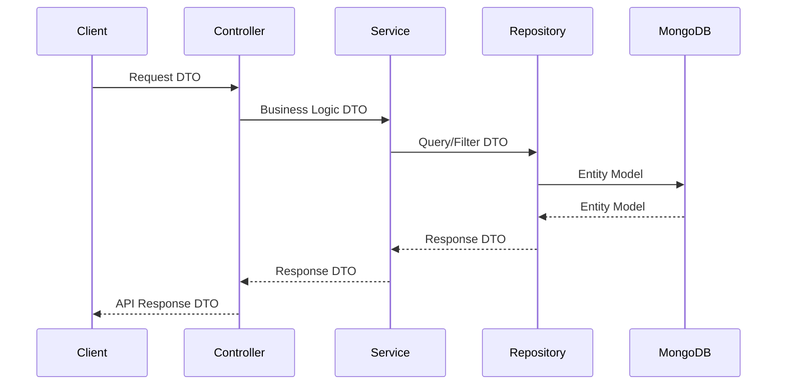

# First Steps with OpenFrame OSS Library

Now that you have OpenFrame up and running, let's explore the essential patterns and features you'll use in daily development. This guide covers the first 5 things every developer should master when working with OpenFrame.

## 🎯 The Essential 5

After completing the Quick Start, focus on these core areas:

1. **[Understanding DTOs and Data Flow](#1-understanding-dtos-and-data-flow)**
2. **[Mastering Cursor-Based Pagination](#2-mastering-cursor-based-pagination)**
3. **[Working with Service Interfaces](#3-working-with-service-interfaces)**
4. **[Implementing Validation Patterns](#4-implementing-validation-patterns)**  
5. **[Exploring Domain Models](#5-exploring-domain-models)**

---

## 1️⃣ Understanding DTOs and Data Flow

OpenFrame uses a layered approach with Data Transfer Objects (DTOs) that define clear contracts between services.

### The DTO Pattern



### Core DTO Categories

| Category | Purpose | Example DTOs |
|----------|---------|-------------|
| **Request DTOs** | Input validation and parsing | `CreateOrganizationRequest`, `DeviceFilterInput` |
| **Response DTOs** | Output formatting | `OrganizationResponse`, `DeviceResponse` |  
| **Filter DTOs** | Query parameters | `DeviceFilters`, `EventFilters` |
| **Shared DTOs** | Cross-cutting concerns | `CursorPaginationInput`, `PageResponse` |

### Practical Example: Device Query Flow

```java
// 1. Create filter input (Request DTO)
DeviceFilterInput filterInput = DeviceFilterInput.builder()
    .pagination(CursorPaginationInput.builder()
        .limit(20)
        .cursor(lastPageCursor)
        .build())
    .filters(DeviceFilters.builder()
        // Add specific device filters
        .build())
    .build();

// 2. Service processes business logic  
CountedGenericQueryResult<Device> result = deviceService.findDevices(filterInput);

// 3. Response contains paginated data
List<Device> devices = result.getItems();
String nextCursor = result.getPageInfo().getNextCursor();
long totalCount = result.getTotalCount();

System.out.println("Found " + devices.size() + " devices");
System.out.println("Total available: " + totalCount);
System.out.println("Next page cursor: " + nextCursor);
```

---

## 2️⃣ Mastering Cursor-Based Pagination

OpenFrame uses cursor-based pagination for efficient navigation through large datasets. This is crucial for MSP platforms handling thousands of devices and events.

### Why Cursor Pagination?

| Traditional Offset | Cursor-Based | Winner |
|-------------------|-------------|--------|
| `LIMIT 1000 OFFSET 50000` | `WHERE id > 'cursor_value' LIMIT 1000` | 🏆 Cursor |
| Performance degrades | Consistent performance | 🏆 Cursor |
| Data shifts cause duplicates | Stable pagination | 🏆 Cursor |
| Simple implementation | Requires cursor handling | 🤝 Tie |

### Implementation Pattern

```java
public class PaginationExample {
    
    public void demonstrateNavigation() {
        String currentCursor = null;
        int pageSize = 25;
        
        do {
            // Create pagination input
            CursorPaginationInput pagination = CursorPaginationInput.builder()
                .limit(pageSize)
                .cursor(currentCursor)
                .build();
                
            // Query with pagination
            CountedGenericQueryResult<Device> page = deviceService.findDevices(
                DeviceFilterInput.builder()
                    .pagination(pagination)
                    .build()
            );
            
            // Process current page
            processDevices(page.getItems());
            
            // Get cursor for next page
            currentCursor = page.getPageInfo().getNextCursor();
            
            System.out.println("Processed page with " + page.getItems().size() + " devices");
            
        } while (currentCursor != null); // Continue while more pages exist
        
        System.out.println("Finished processing all devices");
    }
    
    private void processDevices(List<Device> devices) {
        devices.forEach(device -> {
            System.out.println("Processing device: " + device.getId());
            // Your business logic here
        });
    }
}
```

### Validation and Best Practices

```java
// OpenFrame enforces sensible defaults
CursorPaginationInput pagination = CursorPaginationInput.builder()
    .limit(101)  // ❌ Will fail validation (max 100)
    .limit(0)    // ❌ Will fail validation (min 1)  
    .limit(25)   // ✅ Valid range
    .cursor("eyJpZCI6IjEyMyIsInRzIjoiMjAyNC0wMS0xNSJ9")  // ✅ Base64 cursor
    .build();

// Always validate your pagination input
ValidatorFactory factory = Validation.buildDefaultValidatorFactory();
Validator validator = factory.getValidator();
Set<ConstraintViolation<CursorPaginationInput>> violations = validator.validate(pagination);

if (!violations.isEmpty()) {
    violations.forEach(v -> System.out.println("Validation error: " + v.getMessage()));
}
```

---

## 3️⃣ Working with Service Interfaces

OpenFrame provides clean service interfaces that abstract business logic from implementation details.

### Core Service Interfaces

```java
// Device management
public interface DeviceService {
    CountedGenericQueryResult<Device> findDevices(DeviceFilterInput input);
    Device findDeviceById(String deviceId);
    Device updateDeviceStatus(String deviceId, DeviceStatus status);
}

// Event processing  
public interface EventService {
    CountedGenericQueryResult<Event> findEvents(EventFilterInput input);
    Event createEvent(CreateEventInput input);
}

// Organization management
public interface OrganizationService {
    CountedGenericQueryResult<Organization> findOrganizations(OrganizationFilterInput input);
    Organization createOrganization(CreateOrganizationRequest request);
}
```

### Service Implementation Pattern

```java
@Service
@Transactional
public class MyDeviceServiceImpl implements DeviceService {
    
    private final DeviceRepository deviceRepository;
    private final DeviceMapper deviceMapper;
    
    public MyDeviceServiceImpl(DeviceRepository deviceRepository, 
                              DeviceMapper deviceMapper) {
        this.deviceRepository = deviceRepository;
        this.deviceMapper = deviceMapper;
    }
    
    @Override
    public CountedGenericQueryResult<Device> findDevices(DeviceFilterInput input) {
        // 1. Validate input
        validateDeviceFilterInput(input);
        
        // 2. Convert to repository query
        DeviceQueryFilter queryFilter = deviceMapper.toQueryFilter(input);
        
        // 3. Execute repository query with pagination
        Page<DeviceDocument> page = deviceRepository.findDevicesWithFilters(queryFilter);
        
        // 4. Convert to DTOs
        List<Device> devices = deviceMapper.toDeviceList(page.getContent());
        
        // 5. Build paginated response
        return CountedGenericQueryResult.<Device>builder()
            .items(devices)
            .totalCount(page.getTotalElements())
            .pageInfo(buildPageInfo(page))
            .build();
    }
    
    private void validateDeviceFilterInput(DeviceFilterInput input) {
        if (input == null) {
            throw new IllegalArgumentException("Device filter input cannot be null");
        }
        // Additional validation logic
    }
    
    private CursorPageInfo buildPageInfo(Page<DeviceDocument> page) {
        return CursorPageInfo.builder()
            .hasNextPage(page.hasNext())
            .nextCursor(page.hasNext() ? generateCursor(page.getContent()) : null)
            .build();
    }
}
```

---

## 4️⃣ Implementing Validation Patterns

OpenFrame leverages Jakarta Bean Validation for robust input validation with meaningful error messages.

### Built-in Validations

```java
// OpenFrame DTOs include validation annotations
public class CreateOrganizationRequest {
    
    @NotBlank(message = "Organization name is required")
    @Size(min = 2, max = 100, message = "Organization name must be between 2 and 100 characters")
    private String name;
    
    @Email(message = "Valid email address is required")
    private String email;
    
    @Valid  // Validates nested objects
    private AddressDto address;
    
    @Valid
    private ContactPersonDto primaryContact;
}

public class CursorPaginationInput {
    
    @Min(value = 1, message = "Limit must be at least 1")
    @Max(value = 100, message = "Limit cannot exceed 100")
    private Integer limit;
    
    // Cursor can be null for first page
    private String cursor;
}
```

### Custom Validation Example

```java
public class ValidationService {
    
    private final Validator validator;
    
    public ValidationService() {
        ValidatorFactory factory = Validation.buildDefaultValidatorFactory();
        this.validator = factory.getValidator();
    }
    
    public <T> void validateAndThrow(T object) {
        Set<ConstraintViolation<T>> violations = validator.validate(object);
        
        if (!violations.isEmpty()) {
            List<String> errorMessages = violations.stream()
                .map(ConstraintViolation::getMessage)
                .collect(Collectors.toList());
                
            throw new ValidationException("Validation failed: " + String.join(", ", errorMessages));
        }
    }
    
    public void demonstrateValidation() {
        // This will pass validation
        CursorPaginationInput validPagination = CursorPaginationInput.builder()
            .limit(10)
            .cursor("valid-cursor")
            .build();
        validateAndThrow(validPagination);
        System.out.println("✅ Valid pagination object");
        
        try {
            // This will fail validation
            CursorPaginationInput invalidPagination = CursorPaginationInput.builder()
                .limit(200)  // Exceeds maximum
                .build();
            validateAndThrow(invalidPagination);
        } catch (ValidationException e) {
            System.out.println("❌ Validation failed: " + e.getMessage());
        }
    }
}
```

---

## 5️⃣ Exploring Domain Models

OpenFrame organizes functionality into clear domains, each with its own DTOs and data models.

### Domain Overview

```mermaid
graph TD
    subgraph "Device Domain"
        D1[Device DTOs]
        D2[Device Models]
        D3[Device Services]
    end
    
    subgraph "Event Domain"  
        E1[Event DTOs]
        E2[Event Models]
        E3[Event Services]
    end
    
    subgraph "Organization Domain"
        O1[Organization DTOs] 
        O2[Organization Models]
        O3[Organization Services]
    end
    
    subgraph "Tool Domain"
        T1[Tool DTOs]
        T2[Tool Models] 
        T3[Tool Services]
    end
    
    subgraph "Audit Domain"
        A1[Audit DTOs]
        A2[Audit Models]
        A3[Audit Services]
    end
    
    subgraph "Shared"
        S1[Common DTOs]
        S2[Utilities]
        S3[Validation]
    end
    
    S1 --> D1
    S1 --> E1
    S1 --> O1
    S1 --> T1
    S1 --> A1
```



### Exploring Each Domain

**1. Device Domain**
```java
// Key DTOs and patterns for device management
DeviceFilterOptions filterOptions = DeviceFilterOptions.builder().build();
TagFilterOption tagFilter = TagFilterOption.builder().build();

// Devices represent endpoints in your MSP environment
// - Workstations, servers, mobile devices
// - Health monitoring and compliance tracking
// - Integration with RMM tools
```

**2. Event Domain**
```java
// Event processing for audit trails and monitoring
EventFilterOptions eventFilters = EventFilterOptions.builder().build();

// Events capture system activities:
// - User actions, system changes
// - Integration events from tools
// - Compliance and security events
```

**3. Organization Domain**
```java
// Multi-tenant organization management
CreateOrganizationRequest orgRequest = CreateOrganizationRequest.builder()
    .name("Example MSP")
    .build();

// Organizations represent:
// - MSP customers/tenants
// - Contact information and billing
// - Hierarchical relationships
```

**4. Tool Domain**  
```java
// Integration with MSP tools
ToolFilterOptions toolFilters = ToolFilterOptions.builder().build();

// Tools include:
// - RMM platforms (TacticalRMM, Fleet MDM)
// - Monitoring systems
// - Security tools
```

**5. Audit Domain**
```java
// Comprehensive audit logging
LogFilterOptions logFilters = LogFilterOptions.builder().build();

// Audit trails for:
// - User actions and API calls
// - System changes and integrations
// - Compliance reporting
```

---

## 🎯 Practical Exercise: Build a Mini MSP Dashboard

Let's combine everything you've learned into a practical example:

```java
public class MiniMSPDashboard {
    
    private final DeviceService deviceService;
    private final EventService eventService;  
    private final OrganizationService organizationService;
    
    public void generateDashboard() {
        System.out.println("=== MSP Dashboard ===\n");
        
        // 1. Show organization summary
        showOrganizationSummary();
        
        // 2. Show device overview  
        showDeviceOverview();
        
        // 3. Show recent events
        showRecentEvents();
    }
    
    private void showOrganizationSummary() {
        System.out.println("📊 Organization Summary:");
        
        CursorPaginationInput pagination = CursorPaginationInput.builder()
            .limit(5)
            .build();
            
        OrganizationFilterInput filter = OrganizationFilterInput.builder()
            .pagination(pagination)
            .build();
            
        CountedGenericQueryResult<Organization> orgs = 
            organizationService.findOrganizations(filter);
            
        System.out.println("  Total Organizations: " + orgs.getTotalCount());
        System.out.println("  Active Organizations: " + orgs.getItems().size());
        System.out.println();
    }
    
    private void showDeviceOverview() {
        System.out.println("💻 Device Overview:");
        
        CursorPaginationInput pagination = CursorPaginationInput.builder()
            .limit(10)
            .build();
            
        DeviceFilterInput filter = DeviceFilterInput.builder()
            .pagination(pagination)
            .build();
            
        CountedGenericQueryResult<Device> devices = 
            deviceService.findDevices(filter);
            
        System.out.println("  Total Devices: " + devices.getTotalCount());
        System.out.println("  Showing: " + devices.getItems().size());
        
        devices.getItems().forEach(device -> 
            System.out.println("    - Device: " + device.getId())
        );
        System.out.println();
    }
    
    private void showRecentEvents() {
        System.out.println("📝 Recent Events:");
        
        CursorPaginationInput pagination = CursorPaginationInput.builder()
            .limit(5)
            .build();
            
        EventFilterInput filter = EventFilterInput.builder()
            .pagination(pagination)
            .build();
            
        CountedGenericQueryResult<Event> events = 
            eventService.findEvents(filter);
            
        System.out.println("  Recent Events: " + events.getItems().size());
        events.getItems().forEach(event -> 
            System.out.println("    - Event: " + event.getId())
        );
    }
}
```

---

## 🚀 What's Next?

You've now mastered the essential OpenFrame patterns! Here's your continued learning path:

### Immediate Next Steps
1. **[Local Development Setup](../development/setup/local-development.md)** - Set up a complete development environment
2. **[Architecture Deep Dive](../development/architecture/overview.md)** - Understand the full system design

### Advanced Topics
1. **MongoDB Integration** - Connect to persistent storage
2. **Security Patterns** - Implement authentication and authorization  
3. **Custom Service Implementation** - Build your own service implementations
4. **Tool Integrations** - Connect with RMM and monitoring platforms

### Building Real Applications
1. **Create a device monitoring dashboard**
2. **Build organization management features** 
3. **Implement event processing pipelines**
4. **Develop custom MSP integrations**

## 🤝 Community Resources

- **Questions?** Join [OpenMSP Slack](https://join.slack.com/t/openmsp/shared_invite/zt-36bl7mx0h-3~U2nFH6nqHqoTPXMaHEHA)
- **Examples**: Check the test files for more usage patterns
- **Documentation**: Browse the `/docs/reference` folder for detailed API docs

---

**🎉 Congratulations!** You now understand the core patterns that power OpenFrame. Ready to build something amazing?