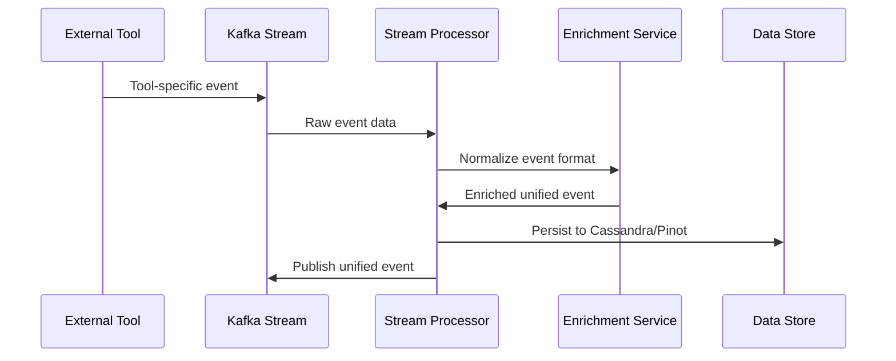
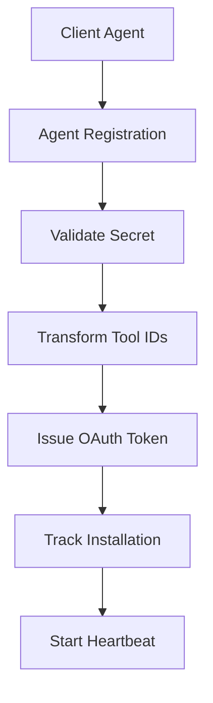

# First Steps

Now that you have OpenFrame OSS Lib built and running, let's explore its key features and understand how to work with this powerful platform foundation.

## 1. Understanding the Module Architecture

OpenFrame OSS Lib is designed around 15 specialized modules. Let's explore the most important ones:

### Core Infrastructure Modules

```bash
# Explore the core utilities
ls openframe-core/src/main/java/com/openframe/core/

# Key utilities you'll find:
# - SlugUtil: URL-safe string generation
# - EncryptionService: Data encryption/decryption
# - TenantDomainValidator: Multi-tenant validation
# - ErrorResponse: Standardized error handling
```

### Data Layer Modules

```bash
# MongoDB data models and repositories
find openframe-data-mongo/src/main/java -name "*.java" | grep -E "(document|repository)" | head -5

# Redis caching infrastructure
ls openframe-data-redis/src/main/java/com/openframe/data/

# Kafka event streaming
ls openframe-data-kafka/src/main/java/com/openframe/kafka/
```

### API and Security Modules

```bash
# API contracts and DTOs
ls openframe-api-lib/src/main/java/com/openframe/api/dto/

# Security and JWT handling  
ls openframe-security-core/src/main/java/com/openframe/security/

# OAuth2 authorization server
ls openframe-authorization-service-core/src/main/java/com/openframe/authz/
```

## 2. Explore Multi-Tenant Data Models

OpenFrame is built for multi-tenancy from the ground up. Let's examine some key data models:

### Organization Model

```bash
# View the Organization document structure
cat openframe-data-mongo/src/main/java/com/openframe/data/document/organization/Organization.java | head -30
```

Organizations represent **tenants** in the system. Each organization has:
- Contact information and addresses
- Associated users and devices  
- Tool integrations and configurations
- Isolated data and security context

### Device/Machine Model

```bash
# Explore device management
cat openframe-data-mongo/src/main/java/com/openframe/data/document/device/Machine.java | head -30
```

Machines represent **managed endpoints** like:
- Servers, workstations, and mobile devices
- Associated with organizations (tenants)
- Tracked via multiple tool integrations
- Status, health, and compliance monitoring

### Tool Integration Model

```bash
# View integrated tool structure
cat openframe-data-mongo/src/main/java/com/openframe/data/document/tool/IntegratedTool.java | head -20
```

Tools represent **external MSP platforms** like:
- FleetDM for device management
- TacticalRMM for remote monitoring
- Custom integrations via SDK framework

## 3. Working with the API Layer

### Understanding GraphQL API Structure

```bash
# Explore GraphQL data fetchers
ls openframe-api-service-core/src/main/java/com/openframe/api/datafetcher/

# Key fetchers handle:
# - DeviceDataFetcher: Device queries and filtering
# - LogDataFetcher: Audit log retrieval  
# - OrganizationDataFetcher: Tenant management
# - EventDataFetcher: Event stream queries
```

### REST API Controllers

```bash
# Check REST controllers
ls openframe-api-service-core/src/main/java/com/openframe/api/controller/

# Controllers for:
# - UserController: User management
# - OrganizationController: Tenant operations
# - ApiKeyController: Programmatic access
# - SSOConfigController: Identity provider setup
```

### External API Integration

```bash
# Public-facing REST API
ls openframe-external-api-service-core/src/main/java/com/openframe/external/controller/

# External endpoints:
# - DeviceController: /api/v1/devices
# - EventController: /api/v1/events  
# - LogController: /api/v1/logs
# - OrganizationController: /api/v1/organizations
```

## 4. Security and Authentication Flow

### Understanding JWT and OAuth2

OpenFrame uses **asymmetric JWT (RS256)** for security:

```bash
# Explore JWT utilities
ls openframe-security-core/src/main/java/com/openframe/security/jwt/

# OAuth2 BFF (Backend for Frontend)
ls openframe-security-oauth/src/main/java/com/openframe/security/oauth/

# Authorization server
ls openframe-authorization-service-core/src/main/java/com/openframe/authz/security/
```

### Key Security Concepts

1. **Multi-tenant JWT validation** - Each tenant has separate RSA keys
2. **API key rate limiting** - Programmatic access with usage tracking  
3. **SSO integration** - Google, Microsoft OAuth2 providers
4. **PKCE flow** - Secure authorization code exchange

## 5. Event-Driven Architecture

### Kafka Integration

```bash
# Kafka producers and consumers
ls openframe-data-kafka/src/main/java/com/openframe/kafka/producer/

# Event models
ls openframe-data-kafka/src/main/java/com/openframe/kafka/model/
```

### Stream Processing

```bash
# Real-time event processing
ls openframe-stream-service-core/src/main/java/com/openframe/stream/

# Key components:
# - Event deserializers for different tool formats
# - Data enrichment services
# - Unified event normalization
# - Cassandra log persistence
```

### Event Flow Example



## 6. Agent Management System

### Client Agent Core

```bash
# Agent lifecycle management
ls openframe-client-core/src/main/java/com/openframe/client/service/

# Key capabilities:
# - Agent registration and authentication
# - Tool installation orchestration
# - Heartbeat processing
# - ID transformation between tools
```

### Agent Registration Flow



## 7. Real-Time Analytics

### Apache Pinot Integration

```bash
# Pinot query builders and repositories
ls openframe-data/src/main/java/com/openframe/data/repository/pinot/

# Analytics capabilities:
# - Real-time device metrics
# - Log aggregation and search
# - Event correlation analysis
# - Multi-tenant data isolation
```

### Cassandra Time-Series Storage

```bash
# Time-series data models
ls openframe-data/src/main/java/com/openframe/data/model/cassandra/

# Unified log events for:
# - Audit trails
# - Performance metrics  
# - Security events
# - Operational insights
```

## 8. Extending with SDKs

OpenFrame includes SDKs for popular MSP tools:

### FleetDM SDK

```bash
# FleetDM client implementation
ls sdk/fleetmdm/src/main/java/com/openframe/sdk/fleetmdm/

# Features:
# - Host search and management
# - Query execution
# - Agent information retrieval
```

### TacticalRMM SDK

```bash
# TacticalRMM client implementation
ls sdk/tacticalrmm/src/main/java/com/openframe/sdk/tacticalrmm/

# Features:
# - Agent lifecycle management
# - Script execution
# - Registration secret parsing
```

### Building Custom SDKs

Follow the SDK patterns to integrate additional tools:

1. **Create client interface** following existing patterns
2. **Implement authentication** (API keys, OAuth, etc.)
3. **Add event deserialization** for tool-specific formats
4. **Register with data enrichment** services
5. **Test integration** with stream processing

## 9. Development Workflow

### Running Individual Modules

```bash
# Test specific functionality
cd openframe-api-service-core
mvn spring-boot:run -Dspring-boot.run.profiles=dev

# Test security modules
cd ../openframe-authorization-service-core  
mvn spring-boot:run -Dspring-boot.run.profiles=dev
```

### Integration Testing

```bash
# Run module integration tests
mvn test -Dtest=*IntegrationTest -DfailIfNoTests=false

# Test specific flows
mvn test -pl openframe-client-core -Dtest=AgentRegistrationServiceTest
```

### Working with Test Data

```bash
# Explore test generators
ls openframe-test-service-core/src/main/java/com/openframe/test/data/generator/

# Test data includes:
# - AuthGenerator: Authentication tokens
# - DeviceGenerator: Mock device data
# - OrganizationGenerator: Tenant data
# - InvitationGenerator: User invitation flows
```

## 10. Common Development Tasks

### Adding a New Data Model

1. **Create document class** in `openframe-data-mongo/src/main/java/com/openframe/data/document/`
2. **Add repository interface** extending `MongoRepository`
3. **Create service layer** in relevant core module
4. **Add API endpoints** in `api-service-core` or `external-api-service-core`
5. **Write integration tests** using test generators

### Integrating a New Tool

1. **Create SDK module** following `sdk/fleetmdm` pattern
2. **Add event deserializers** in `stream-processing-core`
3. **Update enrichment services** for data normalization
4. **Register tool type** in `data-platform-core`
5. **Add configuration** properties and validation

### Extending Authentication

1. **Add provider config** in `authorization-service-core`
2. **Implement strategy pattern** for new OAuth providers
3. **Update security filters** in `gateway-service-core`
4. **Add client registration** handling
5. **Test SSO flow** end-to-end

## What's Next?

You now understand OpenFrame OSS Lib's architecture and key features. Here are your next steps:

### For Application Developers
- **[Development Environment Setup](../development/setup/local-development.md)** - Full development environment
- **[Security Best Practices](../development/security/README.md)** - Authentication and authorization patterns

### For Contributors
- **[Contributing Guidelines](../development/contributing/guidelines.md)** - Code standards and submission process
- **[Testing Guide](../development/testing/README.md)** - Testing strategies and tools

### For Platform Engineers
- **[Architecture Deep Dive](../development/architecture/README.md)** - Detailed system design
- **[Deployment Patterns](../development/setup/environment.md)** - Production deployment strategies

[](https://www.youtube.com/watch?v=O8hbBO5Mym8)

## Getting Help

- **Community**: [OpenMSP Slack](https://join.slack.com/t/openmsp/shared_invite/zt-36bl7mx0h-3~U2nFH6nqHqoTPXMaHEHA)
- **Platform Demo**: [OpenFrame Walkthrough](https://www.youtube.com/watch?v=awc-yAnkhIo)
- **Website**: [flamingo.run](https://flamingo.run) | [openframe.ai](https://openframe.ai)

---

**Ready to build with OpenFrame OSS Lib?** Continue with the [Development Environment Setup](../development/setup/local-development.md) to configure your workspace for contribution and extension.