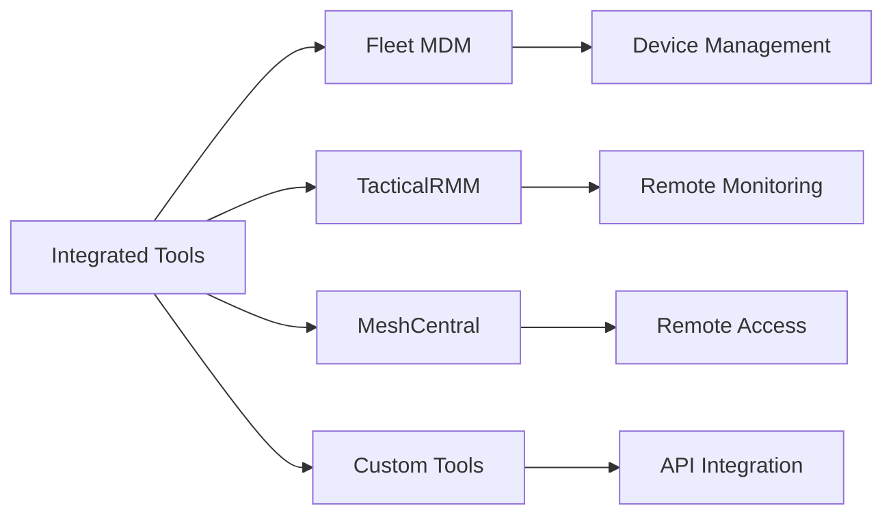
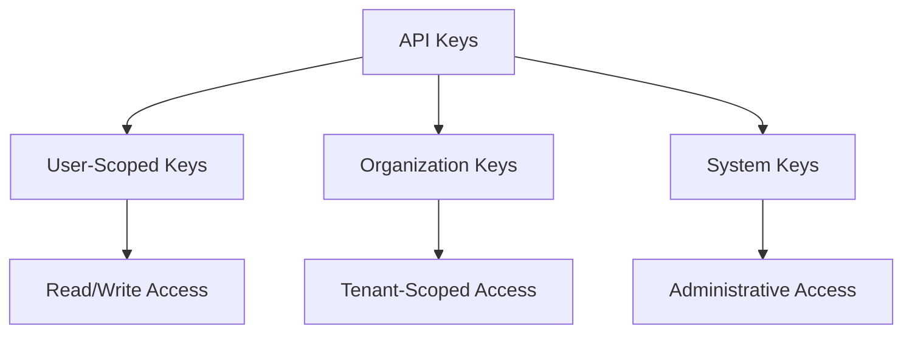

# First Steps with OpenFrame OSS Libraries

Now that you have OpenFrame OSS Libraries running, let's explore the key features and get you started with the essential operations. This guide covers the first 5 things you should do after installation to understand the platform's capabilities.

## 1. Explore the GraphQL API

The GraphQL API is your primary interface for querying and manipulating data. Let's start with the GraphQL playground.

### Access GraphQL Playground

Navigate to: `http://localhost:8080/graphiql`

### Discover the Schema

First, explore what's available:

```graphql
query IntrospectionQuery {
  __schema {
    queryType {
      fields {
        name
        description
        type {
          name
        }
      }
    }
  }
}
```

### Try Your First Queries

**Query Organizations:**
```graphql
query GetOrganizations {
  organizations(first: 10) {
    edges {
      node {
        id
        name
        contactInformation {
          email
          phone
        }
        createdAt
        updatedAt
      }
    }
    pageInfo {
      hasNextPage
      hasPreviousPage
      startCursor
      endCursor
    }
  }
}
```

**Query Devices (if any exist):**
```graphql
query GetDevices {
  devices(first: 5) {
    edges {
      node {
        id
        hostname
        deviceType
        deviceStatus
        organization {
          name
        }
        tags {
          name
          value
        }
      }
    }
  }
}
```

**Query Logs with Filtering:**
```graphql
query GetLogs($filter: LogFilterInput) {
  logs(first: 10, filter: $filter) {
    edges {
      node {
        id
        message
        severity
        timestamp
        source
        organization {
          name
        }
      }
    }
  }
}
```

With variables:
```json
{
  "filter": {
    "severities": ["ERROR", "WARNING"]
  }
}
```

## 2. Understand Multi-Tenant Authentication

OpenFrame OSS Libraries is built with multi-tenancy at its core. Let's explore the authentication system.

### OAuth2/OIDC Discovery

Check the OpenID Connect configuration:

```bash
curl http://localhost:8080/.well-known/openid-configuration | jq
```

**Key endpoints you'll see:**
- `authorization_endpoint` - Start OAuth flows
- `token_endpoint` - Exchange codes for tokens
- `userinfo_endpoint` - Get user information
- `jwks_uri` - Public keys for JWT verification

### Test Token Validation

The system uses JWT tokens for authentication. Each tenant has its own issuer and key pair.

```bash
# Example of a protected endpoint (will return 401 without proper authentication)
curl -v http://localhost:8080/api/users
```

### Create Test Users and Organizations

Use the REST API to create test data:

```bash
# Create an organization
curl -X POST http://localhost:8080/api/organizations \
  -H "Content-Type: application/json" \
  -d '{
    "name": "Acme IT Services",
    "contactInformation": {
      "email": "admin@acmeit.com",
      "phone": "+1-555-0199",
      "website": "https://acmeit.com"
    },
    "address": {
      "street": "123 Tech Street",
      "city": "San Francisco",
      "state": "CA",
      "zipCode": "94105",
      "country": "US"
    }
  }'
```

## 3. Configure Your First Integration

OpenFrame OSS Libraries supports integration with popular MSP tools like Fleet MDM and TacticalRMM.

### Understanding Tool Types

The system supports these tool types:



### Check Available Tool Endpoints

```graphql
query GetToolsInfo {
  tools(first: 10) {
    edges {
      node {
        id
        toolType
        name
        connectionStatus
        toolCredentials {
          username
        }
        toolUrls {
          type
          url
        }
      }
    }
  }
}
```

### Tool Connection Status

Monitor tool connections:

```graphql
query ToolConnectionStatus {
  tools {
    edges {
      node {
        name
        connectionStatus
        lastConnected
        organization {
          name
        }
      }
    }
  }
}
```

## 4. Explore Event-Driven Architecture

OpenFrame OSS Libraries is built around event-driven patterns. Let's examine the event system.

### Query Recent Events

```graphql
query RecentEvents {
  events(first: 20, orderBy: {field: TIMESTAMP, direction: DESC}) {
    edges {
      node {
        id
        type
        source
        timestamp
        message
        metadata
        organization {
          name
        }
      }
    }
  }
}
```

### Event Types and Sources

The system processes various event types:

| Event Type | Source | Description |
|------------|--------|-------------|
| `DEVICE_CONNECTED` | Client Agent | Device comes online |
| `DEVICE_DISCONNECTED` | Client Agent | Device goes offline |
| `TOOL_INSTALLED` | Tool Agent | New tool installed |
| `LOG_ENTRY` | Various | Log message created |
| `ALERT_TRIGGERED` | Monitoring | Alert condition met |
| `SCRIPT_EXECUTED` | RMM Tool | Script execution result |

### Create Test Events

```bash
# Simulate a device connection event via the API
curl -X POST http://localhost:8080/api/events \
  -H "Content-Type: application/json" \
  -d '{
    "type": "DEVICE_CONNECTED",
    "source": "test-agent",
    "message": "Device laptop-001 connected",
    "metadata": {
      "deviceId": "laptop-001",
      "ipAddress": "192.168.1.100"
    }
  }'
```

## 5. Set Up API Keys for External Access

For external integrations, you'll need API keys. Let's create and manage them.

### Create an API Key

```bash
# This requires authentication in a real scenario
curl -X POST http://localhost:8080/api/api-keys \
  -H "Content-Type: application/json" \
  -d '{
    "name": "External Integration Key",
    "description": "API key for third-party tool integration",
    "permissions": ["READ_DEVICES", "READ_EVENTS", "WRITE_EVENTS"]
  }'
```

### Understanding API Key Types

The system supports different API key types:



### Test API Key Authentication

```bash
# Use the API key in subsequent requests
curl -H "Authorization: Bearer your-api-key-here" \
     http://localhost:8080/api/devices
```

### Monitor API Key Usage

```graphql
query ApiKeyStats {
  me {
    apiKeys {
      id
      name
      lastUsed
      requestCount
      permissions
    }
  }
}
```

## Common Configuration Tasks

### Configure SSO (Optional)

Set up Single Sign-On with Google or Microsoft:

```bash
curl -X POST http://localhost:8080/api/sso-config \
  -H "Content-Type: application/json" \
  -d '{
    "provider": "GOOGLE",
    "clientId": "your-google-client-id",
    "clientSecret": "your-google-client-secret",
    "enabled": true,
    "autoProvision": true,
    "allowedDomains": ["yourdomain.com"]
  }'
```

### Set Up User Invitations

Invite team members:

```bash
curl -X POST http://localhost:8080/api/invitations \
  -H "Content-Type: application/json" \
  -d '{
    "email": "teammate@yourcompany.com",
    "role": "USER",
    "message": "Welcome to our OpenFrame instance!"
  }'
```

### Configure Logging Levels

Adjust logging for debugging:

```yaml
# application.yml
logging:
  level:
    com.openframe: DEBUG
    com.openframe.stream: TRACE  # For event processing details
    com.openframe.security: DEBUG  # For auth debugging
```

## Monitoring Your Setup

### Check Service Health

```bash
# Main health check
curl http://localhost:8080/health

# Extended health information
curl http://localhost:8080/actuator/health
```

### Monitor Database Connections

```bash
# MongoDB status
mongosh --eval "db.runCommand({serverStatus: 1}).connections"

# Redis status
redis-cli info clients
```

### Review Application Logs

```bash
# Follow Spring Boot logs
tail -f logs/application.log

# Check for specific errors
grep ERROR logs/application.log
```

## Performance Testing

### Generate Sample Data

Create test organizations, devices, and events to explore performance:

```bash
#!/bin/bash
# create-sample-data.sh

for i in {1..10}; do
  curl -X POST http://localhost:8080/api/organizations \
    -H "Content-Type: application/json" \
    -d "{
      \"name\": \"Test Org ${i}\",
      \"contactInformation\": {
        \"email\": \"admin${i}@testorg.com\"
      }
    }"
done
```

### Test GraphQL Query Performance

```graphql
query LoadTest {
  organizations(first: 100) {
    edges {
      node {
        id
        name
        devices(first: 10) {
          edges {
            node {
              id
              hostname
              deviceStatus
            }
          }
        }
      }
    }
  }
}
```

## Next Steps

You're now familiar with the core capabilities of OpenFrame OSS Libraries! Here's where to go next:

### **Development Path**
- **[Development Environment Setup](../development/setup/environment.md)** - Configure your IDE and tools
- **[Local Development Guide](../development/setup/local-development.md)** - Best practices for development
- **[Architecture Overview](../development/architecture/README.md)** - Understand the system design

### **Integration Path**
- **[API Documentation](./reference/architecture/api-service-core-controllers-and-graphql/api-service-core-controllers-and-graphql.md)** - Complete API reference
- **[Security Guidelines](../development/security/README.md)** - Authentication and authorization
- **[External API Guide](./reference/architecture/external-api-service-core/external-api-service-core.md)** - Third-party integrations

### **Operations Path**
- **[Testing Guide](../development/testing/README.md)** - Testing strategies and tools
- **[Contributing Guidelines](../development/contributing/guidelines.md)** - How to contribute back

## Getting Help

- **Community**: Join our [OpenMSP Slack](https://join.slack.com/t/openmsp/shared_invite/zt-36bl7mx0h-3~U2nFH6nqHqoTPXMaHEHA)
- **Documentation**: Browse the complete [reference docs](./reference/architecture/)
- **Issues**: Report problems on [GitHub](https://github.com/flamingo-stack/openframe-oss-lib/issues)

---

*Congratulations! You've taken your first steps with OpenFrame OSS Libraries. The platform is now ready for serious development and integration work.*