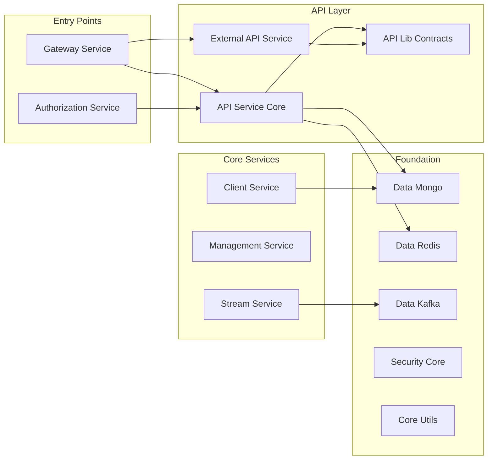
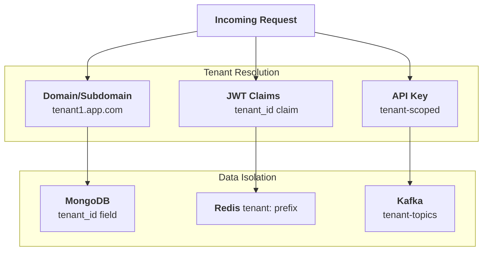
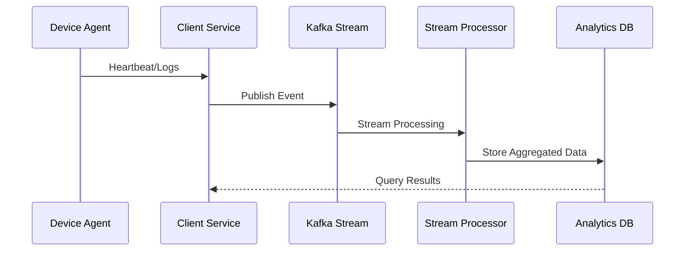

# First Steps

Now that you've built OpenFrame OSS Lib, let's explore the key concepts and features that make this library suite powerful for MSP platform development.

## Your First 5 Actions

### 1. Understand the Module Architecture

OpenFrame OSS Lib organizes functionality into focused, single-responsibility modules:



**Key Insight**: Each module has a specific purpose and clean interfaces. You can use individual modules or the complete stack.

### 2. Explore the Core Domain Models

The heart of the platform lies in its domain models. Let's examine the key entities:

```bash
# Navigate to the data models
cd openframe-data-mongo/src/main/java/com/openframe/data/document/

# Check available domain entities
ls -la
```

**Core Domain Concepts:**

| Entity | Purpose | Location |
|--------|---------|----------|
| **Tenant** | Multi-tenant organization isolation | `tenant/` |
| **User** | Authentication and user management | `user/` |
| **Device/Machine** | Managed endpoints and assets | `device/` |
| **Organization** | Client/customer entities | `organization/` |
| **Tool Connection** | Integration with external MSP tools | `tool/` |
| **Event/Log** | Audit trail and monitoring data | `event/` |

**Example: Understanding the Device Model**

```bash
# Look at the Device document structure
cat openframe-data-mongo/src/main/java/com/openframe/data/document/device/Device.java
```

### 3. Discover API Contracts

The API contracts define how services communicate. This is crucial for understanding integration patterns:

```bash
# Explore API DTOs
cd openframe-api-lib/src/main/java/com/openframe/api/dto/

# Check device-related APIs
ls device/

# Look at filter patterns  
ls */filter/
```

**API Design Patterns:**

- **Request/Response DTOs**: Clean separation between internal domain and API contracts
- **Filter Objects**: Sophisticated querying capabilities for each domain
- **Pagination Support**: Cursor-based pagination for scalability
- **Mapper Interfaces**: Automated conversion between domain and API models

**Example: Device API Pattern**

```bash
# See how device filtering works
find . -name "*Device*" -type f | head -5
```

### 4. Examine Security Architecture

OpenFrame implements a comprehensive security model. Let's understand the key components:

```bash
# Security core components
ls openframe-security-core/src/main/java/com/openframe/security/

# OAuth2 authorization server
ls openframe-authorization-service-core/src/main/java/com/openframe/authz/
```

**Security Concepts:**

1. **Multi-tenant OAuth2**: Each tenant has isolated authentication
2. **JWT-based sessions**: Stateless authentication across services  
3. **API Key support**: For external service integrations
4. **Role-based access**: Fine-grained permission model
5. **SSO Integration**: Google, Microsoft, and custom OIDC providers

**Key Files to Explore:**

```bash
# JWT configuration
find . -name "*Jwt*" -type f

# OAuth2 flows  
find . -name "*OAuth*" -type f

# Authentication principals
find . -name "*Auth*Principal*" -type f
```

### 5. Run Your First Integration Test

Let's see the platform in action with the included test suite:

```bash
# Navigate to test module
cd openframe-test-service-core/

# Look at available test scenarios
ls src/main/java/com/openframe/test/tests/

# Run a specific test category
mvn test -Dtest="*Device*"
```

**Test Categories Available:**

- **Authentication Tests**: OAuth2 flows and JWT validation
- **Device Tests**: Device management and agent lifecycle
- **Organization Tests**: Multi-tenant organization management  
- **User Tests**: User registration and invitation flows
- **Integration Tests**: End-to-end API workflows

## Key Concepts Deep Dive

### Multi-Tenancy

OpenFrame is built for multi-tenant SaaS from the ground up:



### Event-Driven Architecture

The platform processes massive amounts of device and log data through event streams:



### Integration Patterns

OpenFrame connects with existing MSP tools through standardized patterns:

```bash
# Check available integrations
ls sdk/
# fleetmdm/  tacticalrmm/

# Look at integration interfaces
ls openframe-client-core/src/main/java/com/openframe/client/service/
```

## Common Configuration Patterns

### 1. Database Configuration

OpenFrame uses multiple databases optimally:

- **MongoDB**: Operational data (users, devices, configurations)
- **Redis**: Caching and session storage  
- **Cassandra**: Long-term log and event storage
- **Pinot**: Real-time analytics and reporting

### 2. Messaging Configuration  

- **Kafka**: Event streaming between services
- **NATS**: Agent communication and real-time updates

### 3. Security Configuration

- **JWT**: Stateless authentication
- **OAuth2**: Authorization code flow with PKCE
- **API Keys**: Service-to-service authentication

## Development Workflows

### Adding a New Domain Entity

1. **Create MongoDB Document** in `openframe-data-mongo`
2. **Add Repository Interface** with custom queries
3. **Define API DTOs** in `openframe-api-lib`  
4. **Create REST Endpoints** in `openframe-api-service-core`
5. **Add GraphQL DataFetchers** for complex queries
6. **Write Integration Tests** in `openframe-test-service-core`

### Extending Tool Integrations

1. **Create SDK Module** under `sdk/new-tool`
2. **Define Client Interface** with tool-specific operations
3. **Add Authentication Logic** for tool API access
4. **Implement Data Mapping** between tool and OpenFrame models
5. **Create Agent Transformer** in `openframe-client-core`

### Building Custom Services

1. **Extend Base Configuration** from `openframe-core`
2. **Use Security Utilities** from `openframe-security-core`
3. **Leverage Data Repositories** from `openframe-data-mongo`
4. **Follow API Patterns** from existing service cores

## Exploring Further

### Documentation Resources

Each module contains comprehensive documentation:

```bash
# Browse generated documentation for each module
find . -name "*.md" -path "*/docs/*" | head -10

# Check inline code documentation
find . -name "*.java" -exec grep -l "@Api\|@Service\|@Component" {} \; | head -5
```

### Sample Code Patterns

Look for these patterns throughout the codebase:

- **Service Layer**: `@Service` classes with business logic
- **Repository Layer**: Spring Data repositories with custom queries
- **Controller Layer**: `@RestController` with DTO mapping
- **Security Layer**: Method-level security with `@PreAuthorize`
- **Configuration Layer**: `@Configuration` with property binding

### Interactive Exploration

```bash
# Find all REST endpoints
grep -r "@GetMapping\|@PostMapping\|@PutMapping\|@DeleteMapping" --include="*.java" . | head -10

# Discover GraphQL schemas  
find . -name "*.graphqls" -o -name "*DataFetcher.java"

# Locate configuration classes
find . -name "*Config*.java" | head -10
```

## Next Steps

You're now ready to dive deeper into specific areas:

### For API Development
- **[Architecture Overview](../development/architecture/README.md)** - System design patterns
- **[Local Development](../development/setup/local-development.md)** - Full development environment

### For Security Implementation
- **[Security Best Practices](../development/security/README.md)** - Authentication and authorization patterns

### For Testing
- **[Testing Guide](../development/testing/README.md)** - Test structure and best practices

### For Contributing
- **[Contributing Guidelines](../development/contributing/guidelines.md)** - Code style and submission process

## Community Support

Questions or need guidance? The OpenFrame community is here to help:

- **Technical Discussions**: [OpenMSP Slack Community](https://join.slack.com/t/openmsp/shared_invite/zt-36bl7mx0h-3~U2nFH6nqHqoTPXMaHEHA)
- **Platform Information**: [OpenMSP Website](https://www.openmsp.ai/)
- **OpenFrame Product**: [https://flamingo.run](https://flamingo.run)

Start exploring and building with OpenFrame OSS Lib – the foundation for next-generation MSP platforms!