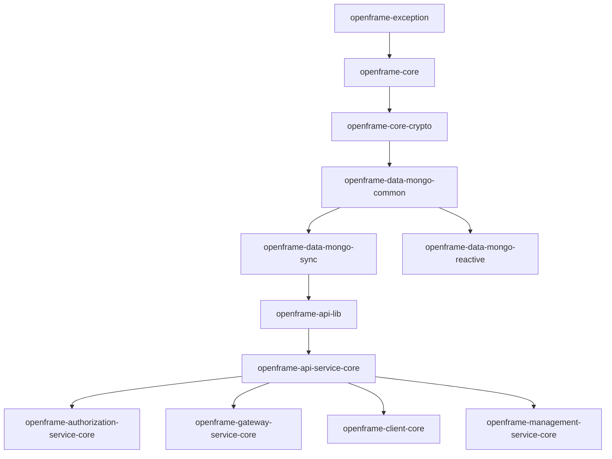

# First Steps

After successfully building `openframe-oss-lib`, here are the five most important things to do to explore the library and start integrating it into your services.

[](https://www.youtube.com/watch?v=O8hbBO5Mym8)

---

## 1. Explore the Module Structure

The repository is a multi-module Maven project. Understanding which module does what is the best starting point.

```bash
# List all modules in the project
mvn help:evaluate -Dexpression=project.modules -q -DforceStdout
```

Or simply open the root `pom.xml` and review the `<modules>` section. The modules follow a layered dependency structure:


```mermaid
graph TD
    A["openframe-exception"] --> B["openframe-core"]
    B --> C["openframe-core-crypto"]
    C --> D["openframe-data-mongo-common"]
    D --> E["openframe-data-mongo-sync"]
    D --> F["openframe-data-mongo-reactive"]
    E --> G["openframe-api-lib"]
    G --> H["openframe-api-service-core"]
    H --> I["openframe-authorization-service-core"]
    H --> J["openframe-gateway-service-core"]
    H --> K["openframe-client-core"]
    H --> L["openframe-management-service-core"]
```

Start with the lower-level modules (`openframe-core`, `openframe-exception`) before moving to higher-level ones.

---

## 2. Understand the Multi-Tenancy Model

Every entity in OpenFrame is **tenant-scoped**. Before writing any business logic, understand how tenancy flows through the system.

**The key class is `TenantIdProvider`:**

```java
// Default implementation reads from TENANT_ID environment variable
// OSS deployments default to "oss"
public class DefaultTenantIdProvider implements TenantIdProvider {
    @Override
    public String getTenantId() {
        return System.getenv().getOrDefault("TENANT_ID", "oss");
    }
}
```

**Key points:**

- Every MongoDB collection uses `tenantId` as a filter field
- JWT tokens carry `tenant_id` as a claim
- The `TENANT_ID` environment variable controls the OSS single-tenant context
- In SaaS mode, the tenant is resolved from the JWT issuer and request path

---

## 3. Set Up a Local Infrastructure Stack

To develop and test any service locally, you need the infrastructure running. Use Docker to start MongoDB:

```bash
# Start MongoDB for integration tests
cd openframe-data-mongo-sync/src/test/docker
docker compose up -d
```

For a full local development stack, you'll also need NATS, Redis, and Kafka. These are typically configured in your deployment environment. Refer to your deployment documentation or ask in the OpenMSP Slack community for environment-specific setup.

**Minimum required for basic module development:**

| Service | Docker Image | Default Port |
|---------|-------------|-------------|
| MongoDB | `mongo:7` | `27017` |
| Redis | `redis:7` | `6379` |
| NATS | `nats:2-alpine` | `4222` |

---

## 4. Explore the Reference Documentation

The `docs/reference/architecture/` directory contains detailed documentation for every major module. Start with the architecture overview:

| Document | What You'll Learn |
|----------|-----------------|
| `api-service-core-config-and-security` | Security config, JWT multi-issuer, GraphQL scalars |
| `authorization-service-core` | OAuth2/OIDC server, SSO flows, tenant key management |
| `gateway-service-core` | Reactive gateway, WebSocket proxy, rate limiting |
| `data-model-and-repositories-mongo` | Domain documents, multi-tenancy, query filters |
| `management-service-core` | Bootstrapping, schedulers, data migrations |
| `eventing-and-messaging-kafka-nats` | Kafka producers, NATS publishers, Debezium CDC |
| `client-core-agent-ingress` | Agent registration, heartbeat, NATS listeners |
| `integrations-sdks` | Tactical RMM and Fleet MDM SDK usage |

---

## 5. Write Your First Extension

OpenFrame modules are designed to be extended through **processor interfaces** and **hooks**. A common first integration is implementing a custom `AgentRegistrationProcessor`:

```java
@Component
public class MyCustomAgentRegistrationProcessor 
        implements AgentRegistrationProcessor {

    @Override
    public void processAfterRegistration(
            AgentRegistrationRequest request,
            AgentRegistrationResponse response) {
        // Your custom logic after an agent registers
        // e.g., send a notification, update a CRM, etc.
    }
}
```

Other common extension points:

| Interface | Purpose |
|-----------|---------|
| `AgentRegistrationProcessor` | Hook into agent registration lifecycle |
| `InvitationProcessor` | Custom logic during user invitation flow |
| `UserProcessor` | Custom user creation and update handling |
| `SSOConfigProcessor` | Extend SSO configuration behavior |
| `RegistrationProcessor` | Hook into tenant registration flow |
| `IntegratedToolPostSaveHook` | React to tool configuration saves |

---

## Key Configuration Properties

When building a Spring Boot service on top of `openframe-oss-lib`, these properties are commonly configured:

```yaml
# application.yml example skeleton
spring:
  data:
    mongodb:
      uri: mongodb://localhost:27017/openframe

openframe:
  security:
    jwt:
      cache:
        expire-after: 3600
        refresh-after: 1800
        maximum-size: 100

  gateway:
    disable-cors: false

jwt:
  issuer: https://auth.yourdomain.com
  # public-key and private-key loaded from secrets manager
```

> Always refer to each module's `@ConfigurationProperties` classes for the full list of available properties.

---

## Get Help from the Community

> The **OpenMSP Slack** is the primary support channel for all OpenFrame questions.
>
> 💬 [Join the community →](https://join.slack.com/t/openmsp/shared_invite/zt-36bl7mx0h-3~U2nFH6nqHqoTPXMaHEHA)

You can also:
- Browse the full architecture reference in `docs/reference/architecture/`
- Review the inline code documentation alongside each source file
- Check the `openframe-test-service-core` module for real usage examples and test patterns
