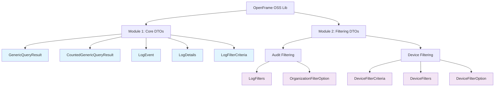

# First Steps with OpenFrame OSS Lib

Now that you have OpenFrame OSS Lib installed, let's explore the core features and patterns you'll use every day.

## Your First 5 Tasks

After completing the [Quick Start](quick-start.md), these are the first 5 things you should do to get familiar with the library.

### 1. Understand the Two Core Modules

OpenFrame OSS Lib is organized into two logical modules:


```mermaid
flowchart TD
    OSS["OpenFrame OSS Lib"] --> Module1["Module 1: Core DTOs"]
    OSS --> Module2["Module 2: Filtering DTOs"]
    
    Module1 --> QueryResult["GenericQueryResult<T>"]
    Module1 --> CountedResult["CountedGenericQueryResult<T>"]
    Module1 --> LogEvent["LogEvent"]
    Module1 --> LogDetails["LogDetails"]
    Module1 --> LogFilterCriteria["LogFilterCriteria"]
    
    Module2 --> AuditFiltering["Audit Filtering"]
    Module2 --> DeviceFiltering["Device Filtering"]
    
    AuditFiltering --> LogFilters["LogFilters"]
    AuditFiltering --> OrgFilterOption["OrganizationFilterOption"]
    
    DeviceFiltering --> DeviceFilterCriteria["DeviceFilterCriteria"] 
    DeviceFiltering --> DeviceFilters["DeviceFilters"]
    DeviceFiltering --> DeviceFilterOption["DeviceFilterOption"]
    
    classDef module1 fill:#e1f5fe
    classDef module2 fill:#f3e5f5
    class QueryResult,CountedResult,LogEvent,LogDetails,LogFilterCriteria module1
    class LogFilters,OrgFilterOption,DeviceFilterCriteria,DeviceFilters,DeviceFilterOption module2
```

**Module 1** provides the foundation: pagination, query results, and core audit DTOs.  
**Module 2** provides advanced filtering capabilities for both audit and device data.

### 2. Create Your First Paginated Response

The most common pattern you'll use is `GenericQueryResult<T>` for paginated API responses:

**Create `examples/PaginationExample.java`:**
```java
import com.openframe.api.dto.GenericQueryResult;
import com.openframe.api.dto.shared.PageInfo;
import java.util.Arrays;
import java.util.List;

public class PaginationExample {
    
    public GenericQueryResult<String> getUserList(int page, int size) {
        // Simulate database results
        List<String> users = Arrays.asList(
            "alice@example.com",
            "bob@example.com", 
            "charlie@example.com"
        );
        
        // Create pagination metadata
        PageInfo pageInfo = PageInfo.builder()
            .pageNumber(page)
            .pageSize(size)
            .totalElements(100)
            .totalPages(34)
            .build();
            
        // Return standardized response
        return GenericQueryResult.<String>builder()
            .items(users)
            .pageInfo(pageInfo)
            .build();
    }
    
    public static void main(String[] args) {
        PaginationExample example = new PaginationExample();
        GenericQueryResult<String> result = example.getUserList(1, 3);
        
        System.out.println("Page: " + result.getPageInfo().getPageNumber());
        System.out.println("Items: " + result.getItems().size());
        System.out.println("Total: " + result.getPageInfo().getTotalElements());
    }
}
```

**Run the example:**
```bash
cd examples
javac -cp "~/.m2/repository/com/openframe/api/openframe-api-lib/1.0-SNAPSHOT/*" PaginationExample.java
java -cp ".:~/.m2/repository/com/openframe/api/openframe-api-lib/1.0-SNAPSHOT/*" PaginationExample
```

### 3. Implement Filtered Counting

`CountedGenericQueryResult<T>` extends basic pagination with filtered totals:

**Create `examples/FilteredCountExample.java`:**
```java
import com.openframe.api.dto.CountedGenericQueryResult;
import com.openframe.api.dto.audit.LogEvent;
import com.openframe.api.dto.audit.LogFilterCriteria;
import java.time.LocalDate;
import java.time.LocalDateTime;
import java.util.Arrays;
import java.util.List;

public class FilteredCountExample {
    
    public CountedGenericQueryResult<LogEvent> getAuditLogs(LogFilterCriteria criteria) {
        // Simulate filtered audit events
        List<LogEvent> events = Arrays.asList(
            LogEvent.builder()
                .id("evt_001")
                .summary("User login successful")
                .eventType("AUTHENTICATION")
                .severity("INFO")
                .timestamp(LocalDateTime.now())
                .build(),
            LogEvent.builder()
                .id("evt_002") 
                .summary("Failed password attempt")
                .eventType("AUTHENTICATION")
                .severity("WARN")
                .timestamp(LocalDateTime.now())
                .build()
        );
        
        // Return with filtered count (showing 2 of 1,247 total matching)
        return CountedGenericQueryResult.<LogEvent>builder()
            .items(events)                    // Current page items
            .filteredCount(1247)              // Total matching filter
            .pageInfo(buildPageInfo())        // Pagination metadata
            .build();
    }
    
    public static void main(String[] args) {
        FilteredCountExample example = new FilteredCountExample();
        
        LogFilterCriteria criteria = LogFilterCriteria.builder()
            .startDate(LocalDate.now().minusDays(7))
            .endDate(LocalDate.now())
            .eventTypes(Arrays.asList("AUTHENTICATION"))
            .build();
            
        CountedGenericQueryResult<LogEvent> result = example.getAuditLogs(criteria);
        
        System.out.println("Events on page: " + result.getItems().size());
        System.out.println("Total matching filter: " + result.getFilteredCount());
        System.out.println("First event: " + result.getItems().get(0).getSummary());
    }
}
```

### 4. Explore Filtering Patterns

OpenFrame uses sophisticated filtering patterns for both audit logs and devices:

**Audit Log Filtering Example:**
```java
import com.openframe.api.dto.audit.LogFilterCriteria;
import com.openframe.api.dto.audit.LogFilters;
import com.openframe.api.dto.audit.OrganizationFilterOption;
import java.time.LocalDate;
import java.util.Arrays;

public class AuditFilterExample {
    
    public LogFilters buildAuditFilterOptions() {
        // Organization filter options (for dropdowns)
        List<OrganizationFilterOption> orgOptions = Arrays.asList(
            OrganizationFilterOption.builder()
                .organizationId("org_123")
                .organizationName("Acme Corp")
                .count(45)  // Number of audit logs for this org
                .build(),
            OrganizationFilterOption.builder()
                .organizationId("org_456") 
                .organizationName("Beta Inc")
                .count(23)
                .build()
        );
        
        return LogFilters.builder()
            .organizationOptions(orgOptions)
            .eventTypes(Arrays.asList("AUTHENTICATION", "DATA_EXPORT", "CONFIGURATION"))
            .severities(Arrays.asList("INFO", "WARN", "ERROR", "CRITICAL"))
            .build();
    }
    
    public LogFilterCriteria buildFilterCriteria() {
        return LogFilterCriteria.builder()
            .startDate(LocalDate.now().minusDays(30))
            .endDate(LocalDate.now())
            .eventTypes(Arrays.asList("AUTHENTICATION", "DATA_EXPORT"))
            .severities(Arrays.asList("WARN", "ERROR"))
            .organizationIds(Arrays.asList("org_123"))
            .build();
    }
}
```

### 5. Set Up Your IDE for Productive Development

Configure your IDE to work efficiently with OpenFrame OSS Lib:

#### IntelliJ IDEA Setup

1. **Import the project:**
   ```bash
   # Open IntelliJ IDEA
   File → Open → Select openframe-oss-lib directory
   ```

2. **Configure Lombok:**
   - `File → Settings → Plugins → Install "Lombok Plugin"`
   - `File → Settings → Build → Compiler → Annotation Processors → Enable annotation processing`

3. **Set up code style:**
   ```bash
   # Import code style settings if available
   File → Settings → Editor → Code Style → Import Scheme
   ```

4. **Enable auto-import:**
   - `File → Settings → Editor → General → Auto Import`
   - Check "Add unambiguous imports on the fly"

#### Eclipse Setup

1. **Import as Maven project:**
   ```bash
   File → Import → Existing Maven Projects → Select openframe-oss-lib
   ```

2. **Install Lombok:**
   ```bash
   # Download lombok.jar and run installer
   java -jar lombok.jar
   # Follow installation wizard
   ```

#### VS Code Setup

1. **Open project:**
   ```bash
   code openframe-oss-lib
   ```

2. **Install extensions:**
   ```bash
   # Install Java extension pack (includes Lombok support)
   code --install-extension vscjava.vscode-java-pack
   ```

## Key Patterns You'll Use Daily

### Pattern 1: Building Query Results

```java
// Always use the builder pattern
GenericQueryResult<MyDTO> result = GenericQueryResult.<MyDTO>builder()
    .items(dataList)
    .pageInfo(pageInfo)
    .build();

// For filtered results, add filteredCount
CountedGenericQueryResult<MyDTO> countedResult = 
    CountedGenericQueryResult.<MyDTO>builder()
        .items(dataList)
        .pageInfo(pageInfo) 
        .filteredCount(totalMatching)
        .build();
```

### Pattern 2: Defining Filter Criteria

```java
// Build comprehensive filter criteria
LogFilterCriteria criteria = LogFilterCriteria.builder()
    .startDate(LocalDate.now().minusDays(30))
    .endDate(LocalDate.now())
    .eventTypes(Arrays.asList("AUTHENTICATION", "DATA_EXPORT"))
    .organizationIds(Arrays.asList("org_123", "org_456"))
    .deviceId("device_789")
    .build();
```

### Pattern 3: Creating Filter Options

```java
// Build filter options for UI dropdowns
DeviceFilters deviceFilterOptions = DeviceFilters.builder()
    .deviceTypes(Arrays.asList("LAPTOP", "MOBILE", "SERVER"))
    .organizationOptions(orgOptions)
    .statusOptions(Arrays.asList("ACTIVE", "INACTIVE", "MAINTENANCE"))
    .build();
```

## Common Configuration

### Maven Settings

Add this to your project's `pom.xml`:

```xml
<properties>
    <lombok.version>1.18.28</lombok.version>
    <jackson.version>2.15.2</jackson.version>
</properties>

<dependencies>
    <!-- OpenFrame OSS Lib -->
    <dependency>
        <groupId>com.openframe.api</groupId>
        <artifactId>openframe-api-lib</artifactId>
        <version>1.0-SNAPSHOT</version>
    </dependency>
    
    <!-- Lombok for annotation processing -->
    <dependency>
        <groupId>org.projectlombok</groupId>
        <artifactId>lombok</artifactId>
        <version>${lombok.version}</version>
        <scope>provided</scope>
    </dependency>
</dependencies>
```

### Spring Boot Integration

If using Spring Boot, configure JSON serialization:

```java
@Configuration
public class JsonConfig {
    
    @Bean
    @Primary
    public ObjectMapper objectMapper() {
        return new ObjectMapper()
            .registerModule(new JavaTimeModule())
            .disable(SerializationFeature.WRITE_DATES_AS_TIMESTAMPS);
    }
}
```

## Explore Real Examples

Check out these directories in your cloned repository:

```bash
# View actual DTO implementations
find openframe-api-lib/src/main/java -name "*.java" | xargs ls -la

# Study the test files (if available)
find . -name "*Test.java" | head -5

# Look at POM configuration
cat openframe-api-lib/pom.xml
```

## Where to Get Help

When you need assistance:

| Resource | Purpose | Link |
|----------|---------|------|
| **Architecture Docs** | Understand design patterns | [Module 1](../reference/architecture/module_1/module_1.md), [Module 2](../reference/architecture/module_2/module_2.md) |
| **Community Slack** | Ask questions, get help | [OpenMSP Slack](https://join.slack.com/t/openmsp/shared_invite/zt-36bl7mx0h-3~U2nFH6nqHqoTPXMaHEHA) |
| **Source Code** | See implementation details | Browse the `openframe-api-lib/src` directory |
| **Maven Central** | Find version information | Search for "openframe-api" |

## Next Steps

Now that you understand the basics:

1. **Study the Architecture** - Read the detailed [architecture documentation](../reference/architecture/README.md)
2. **Build a Real API** - Create a service using these DTOs  
3. **Contribute Back** - Check the development documentation for contribution guidelines
4. **Join the Community** - Connect with other OpenFrame developers

## Summary

You've now learned the essential patterns for working with OpenFrame OSS Lib:

✅ **Two-module structure** - Core DTOs (Module 1) and Filtering (Module 2)  
✅ **Pagination patterns** - `GenericQueryResult<T>` and `CountedGenericQueryResult<T>`  
✅ **Filtering workflows** - Criteria inputs and filter option outputs  
✅ **IDE configuration** - Lombok setup and productivity features  
✅ **Common patterns** - Builder pattern usage and best practices  

These foundations will serve you well as you build scalable, type-safe APIs for the OpenFrame platform.

---

*🚀 You're now ready to build production-quality APIs using OpenFrame OSS Lib! The standardized DTOs will ensure your services integrate seamlessly with the broader OpenFrame ecosystem.*