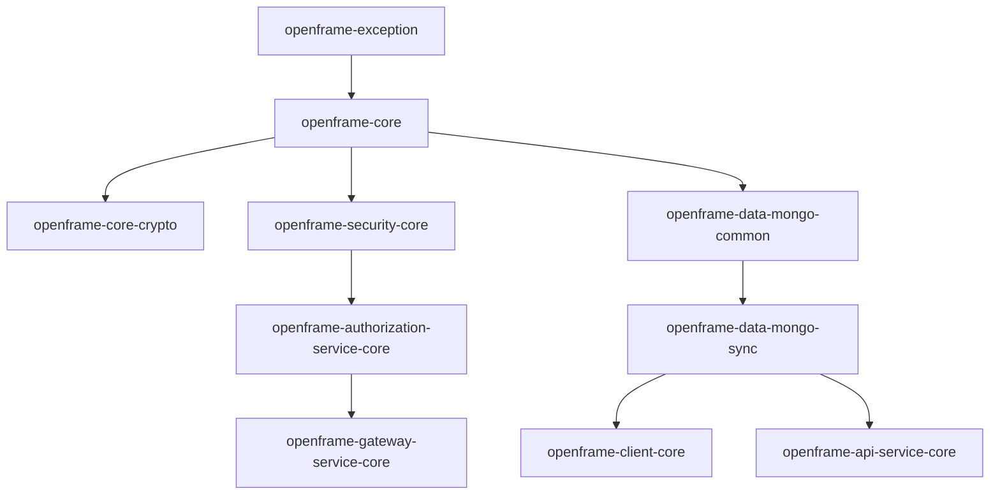
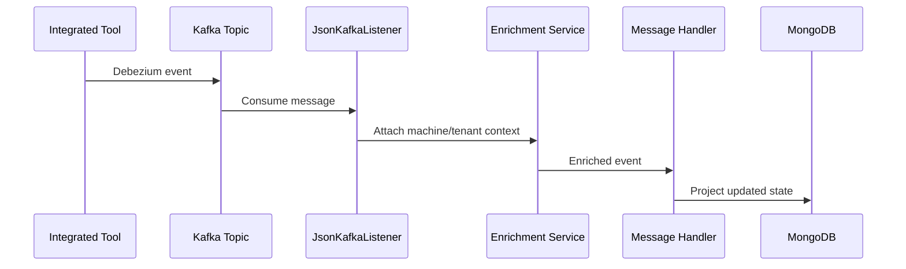

# First Steps

After building OpenFrame OSS Lib, here are the first 5 things to do to understand the codebase and start contributing effectively.

---

## 1. Understand the Module Hierarchy

OpenFrame OSS Lib is a Maven multi-module project. The root `pom.xml` declares the parent and all child modules. Every module shares the same version through the `${revision}` placeholder (defaulting to `999-SNAPSHOT`).

Start by reviewing the parent POM structure:

```bash
cat pom.xml | grep '<module>'
```

The module dependency chain from bottom to top:


```mermaid
graph TD
    Exception["openframe-exception"] --> Core["openframe-core"]
    Core --> Crypto["openframe-core-crypto"]
    Core --> SecurityCore["openframe-security-core"]
    Core --> DataMongoCom["openframe-data-mongo-common"]
    DataMongoCom --> DataMongoSync["openframe-data-mongo-sync"]
    DataMongoSync --> ClientCore["openframe-client-core"]
    DataMongoSync --> ApiServiceCore["openframe-api-service-core"]
    SecurityCore --> AuthorizationCore["openframe-authorization-service-core"]
    AuthorizationCore --> GatewayCore["openframe-gateway-service-core"]
```

Understanding this hierarchy helps you know which module to modify for a given concern.

---

## 2. Explore the Domain Model

The heart of the platform data layer is `openframe-data-mongo-common`. It defines all MongoDB documents used across every service.

Browse key domain documents:

```bash
find openframe-data-mongo-common/src/main/java -name "*.java" | head -20
```

Key domains you'll find:

| Package | Description |
|---|---|
| `device` | Machine, Device, DeviceStatus, DeviceHealth |
| `organization` | Organization, ContactInformation, Address |
| `rmm` | Script, ScriptExecution, ScriptSchedule, CommandExecution |
| `user` | User, Invitation, UserRole |
| `tenant` | Tenant, TenantKey, TenantStatus |
| `notification` | Notification, NotificationContext, ReadStatus |
| `tool` | IntegratedTool, ToolConnection, ToolCredentials |
| `ticket` | Ticket, TicketStatus, TicketNote |

All documents implement tenant scoping through the `TenantScoped` base class pattern.

---

## 3. Run the Test Suite

OpenFrame OSS Lib has a comprehensive test suite covering unit tests, integration tests, and Testcontainers-based tests.

### Unit Tests Only (Fast)

```bash
mvn test -pl openframe-api-service-core
```

### Integration Tests (Requires Docker)

Some modules include integration tests that spin up real MongoDB, NATS, or Redis instances via Testcontainers. Run integration tests for a specific module:

```bash
# Start Docker first, then:
mvn verify -pl openframe-data-mongo-sync -Dtest="*IT"
```

### Full Module Test Suite

```bash
mvn test -pl openframe-data-nats
```

Expected successful test output:

```text
[INFO] Tests run: 42, Failures: 0, Errors: 0, Skipped: 0
[INFO] BUILD SUCCESS
```

---

## 4. Explore the Security Architecture

Security is a cross-cutting concern spanning multiple modules. Understanding how JWT tokens flow through the system is essential.

### Key Security Modules

| Module | Role |
|---|---|
| `openframe-security-core` | JWT config, `AuthPrincipal`, cookie service |
| `openframe-authorization-service-core` | OAuth2 server, tenant context, SSO |
| `openframe-gateway-service-core` | JWT validation, API key auth, rate limiting |
| `openframe-security-oauth` | OAuth BFF (Browser-Facing Frontend) flow |

### Tracing a JWT Token

A JWT token issued by the authorization service contains:

```text
{
  "sub": "user@example.com",
  "tenant_id": "your-tenant-id",
  "userId": "mongo-object-id",
  "roles": ["ADMIN"]
}
```

The gateway validates this token on every request using a multi-issuer `JwtIssuerReactiveAuthenticationManagerResolver` with Caffeine caching.

Explore the security configuration:

```bash
find openframe-gateway-service-core/src/main/java -name "Security*.java"
find openframe-authorization-service-core/src/main/java -name "*.java" -path "*/config/*"
```

---

## 5. Understand the Event-Driven Pipeline

OpenFrame uses Kafka for real-time event processing. The `openframe-stream-service-core` module handles inbound Debezium change events, enriches them, and projects state into MongoDB.

Trace the event flow:


```mermaid
sequenceDiagram
    participant Tool as Integrated Tool
    participant Kafka as Kafka Topic
    participant Listener as JsonKafkaListener
    participant Enrich as Enrichment Service
    participant Handler as Message Handler
    participant Mongo as MongoDB

    Tool->>Kafka: Debezium event
    Kafka->>Listener: Consume message
    Listener->>Enrich: Attach machine/tenant context
    Enrich->>Handler: Enriched event
    Handler->>Mongo: Project updated state
```

Key classes to review:

```bash
find openframe-stream-service-core/src/main/java -name "*.java" | head -20
```

Important files:
- `JsonKafkaListener.java` — Kafka listener
- `GenericMessageHandler.java` — Abstract message handler base
- `ActivityEnrichmentService.java` — Kafka Streams enrichment
- `ScriptExecutionStatusUpdateHandler.java` — Script result projection

---

## Common Initial Configuration

When integrating a library module into a service, these Spring Boot auto-configurations are commonly needed:

### MongoDB Configuration

```yaml
spring:
  data:
    mongodb:
      uri: mongodb://localhost:27017/openframe
```

### NATS Configuration

```yaml
spring:
  cloud:
    stream:
      binders:
        nats:
          type: nats
```

### Kafka Configuration

```yaml
spring:
  kafka:
    bootstrap-servers: localhost:9092
```

Refer to your environment's configuration documentation for actual values.

---

## Exploring Key Features

### Frontend Component Library

The `openframe-frontend-core` module contains the React/TypeScript UI components used across all OpenFrame applications. It includes Storybook stories for interactive exploration:

```bash
cd openframe-frontend-core
npm install
npm run storybook
```

This will open the Storybook development server where you can browse all available components.

### Fleet MDM SDK

The `sdk/fleetmdm` module provides a Java client for Fleet MDM integration:

```bash
find sdk/fleetmdm/src/main/java -name "*.java"
```

Key classes: `FleetMdmClient`, `FleetMdmSetupClient`.

---

## Where to Get Help

- **OpenMSP Slack Community** — The primary support and discussion channel:

  https://join.slack.com/t/openmsp/shared_invite/zt-36bl7mx0h-3~U2nFH6nqHqoTPXMaHEHA

- **OpenFrame Platform Documentation** — For how these modules are deployed:
  [https://github.com/flamingo-stack/openframe-oss-tenant](https://github.com/flamingo-stack/openframe-oss-tenant)

- **GitHub Repository** — Browse source and raise pull requests:
  [https://github.com/flamingo-stack/openframe-oss-lib](https://github.com/flamingo-stack/openframe-oss-lib)

---

## Summary

| Step | What to Do |
|---|---|
| 1 | Understand the module hierarchy via `pom.xml` |
| 2 | Explore the domain model in `openframe-data-mongo-common` |
| 3 | Run the test suite for your target module |
| 4 | Trace the JWT security flow across modules |
| 5 | Follow an event through the Kafka streaming pipeline |
