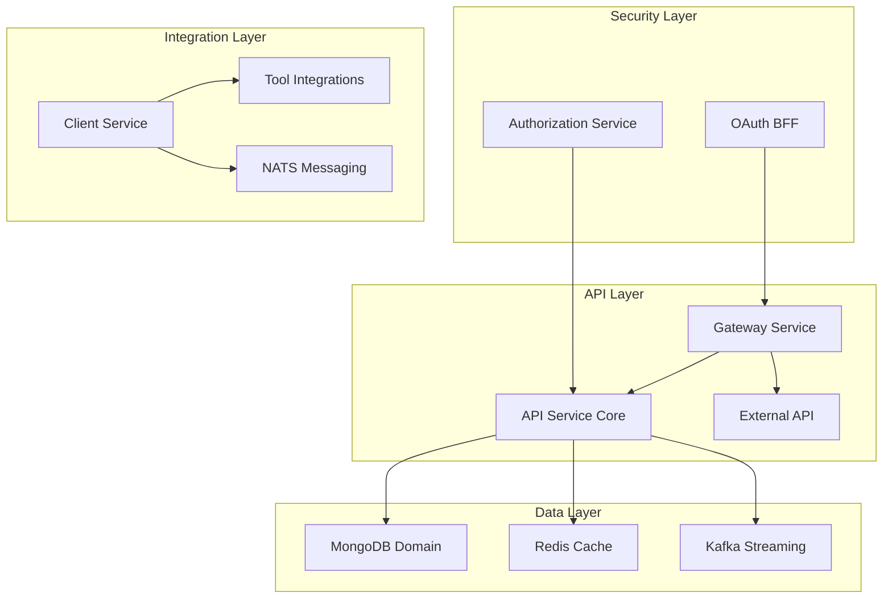

# OpenFrame OSS Lib Introduction

Welcome to **OpenFrame OSS Lib** – the foundational backend library collection that powers the OpenFrame AI-driven MSP platform.

## What is OpenFrame OSS Lib?

OpenFrame OSS Lib is a comprehensive, modular Spring Boot library suite designed to provide the core building blocks for modern MSP (Managed Service Provider) platforms. It serves as the backbone of the OpenFrame platform, delivering enterprise-grade functionality through a clean, extensible architecture.

## Key Features

### 🔐 Identity & Security
- **Multi-tenant OAuth2 Authorization Server** with per-tenant RSA keys
- **SSO Integration** (Google, Microsoft) with invitation-based onboarding
- **JWT-based authentication** with secure HttpOnly cookie handling
- **PKCE utilities** and Backend-for-Frontend (BFF) OAuth flows

### 🌐 API & Gateway
- **Reactive Spring Cloud Gateway** with multi-issuer JWT validation
- **REST + GraphQL APIs** powered by Netflix DGS
- **API key enforcement** with rate limiting
- **WebSocket routing** for real-time communication

### 📊 Data & Analytics  
- **Multi-database support**: MongoDB, Cassandra, Redis, Apache Pinot
- **Event-driven architecture** with Kafka streaming
- **Real-time analytics** and device monitoring
- **Tenant-aware data isolation**

### 🔧 Tool Integration
- **Universal MSP tool connector** (Fleet MDM, Tactical RMM, MeshCentral)
- **Agent lifecycle management** with NATS messaging
- **Tool-agnostic integration hub** for existing MSP stacks

### 🚀 Platform Features
- **Multi-tenant SaaS-ready** architecture
- **Microservice foundation** with clean separation of concerns
- **Scalable streaming pipelines** for device and log data
- **Operational orchestration** and bootstrapping

## Architecture Overview

OpenFrame OSS Lib implements a layered, event-driven architecture:

## Target Audience

This library suite is designed for:

- **MSP Platform Developers** building comprehensive service management solutions
- **Enterprise IT Teams** needing secure, scalable backend infrastructure  
- **Integration Partners** connecting existing tools to modern platforms
- **DevOps Engineers** implementing multi-tenant SaaS architectures

## Technology Stack

- **Framework**: Spring Boot 3.3.0 with Java 21
- **Security**: Spring Security OAuth2, JWT, PKCE
- **Data**: MongoDB, Redis, Cassandra, Apache Pinot
- **Messaging**: Kafka, NATS JetStream
- **API**: REST, GraphQL (Netflix DGS)
- **Gateway**: Spring Cloud Gateway (Reactive)

## Module Structure

OpenFrame OSS Lib consists of 20+ specialized modules organized into logical layers:

| Module Category | Purpose | Key Modules |
|----------------|---------|-------------|
| **Security** | Authentication & Authorization | `authorization-service-core`, `security-core` |
| **API** | REST & GraphQL Endpoints | `api-service-core`, `external-api-service-core` |
| **Gateway** | Edge Routing & Security | `gateway-service-core` |
| **Data** | Persistence & Caching | `data-mongo`, `data-redis`, `data-kafka` |
| **Client** | Agent Management | `client-service-core` |
| **Streaming** | Real-time Processing | `stream-service-core` |
| **Management** | Platform Operations | `management-service-core` |
| **Integrations** | External Tool SDKs | `sdk/fleetmdm`, `sdk/tacticalrmm` |

## Getting Started

Ready to dive in? Here's your next steps:

1. **[Prerequisites](prerequisites.md)** - Set up your development environment
2. **[Quick Start](quick-start.md)** - Build and run in 5 minutes  
3. **[First Steps](first-steps.md)** - Explore key features and concepts

## OpenFrame Platform Context

OpenFrame OSS Lib powers [OpenFrame](https://openframe.ai) – the unified AI-powered MSP platform that integrates multiple tools into a single interface. While you can use these libraries independently, they're designed to work seamlessly as part of the broader OpenFrame ecosystem.

For more about the complete OpenFrame platform and its AI capabilities (Mingo AI for technicians, Fae for clients), visit [https://flamingo.run](https://flamingo.run).

## Community & Support

- **OpenMSP Community**: [Join our Slack](https://join.slack.com/t/openmsp/shared_invite/zt-36bl7mx0h-3~U2nFH6nqHqoTPXMaHEHA)
- **Platform Website**: [https://www.openmsp.ai/](https://www.openmsp.ai/)
- **Source Code**: Available on GitHub (link in repository)

---

*Built with ❤️ by the Flamingo Stack team for the open source MSP community.*