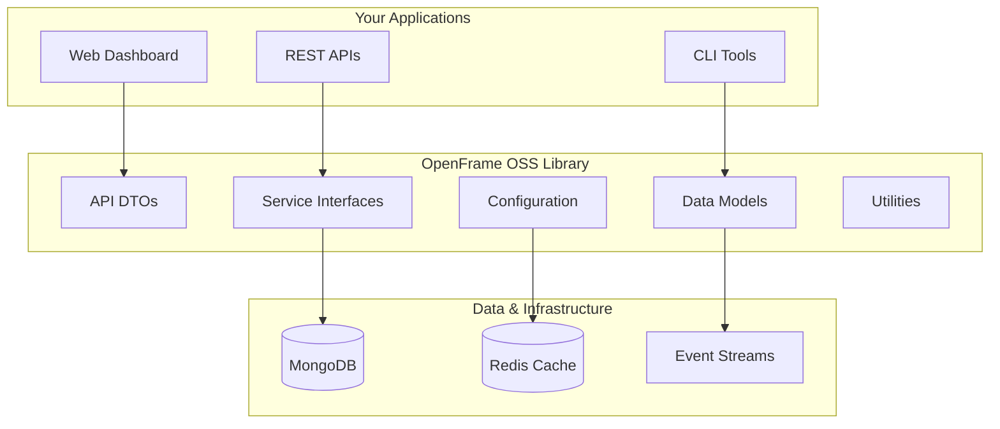
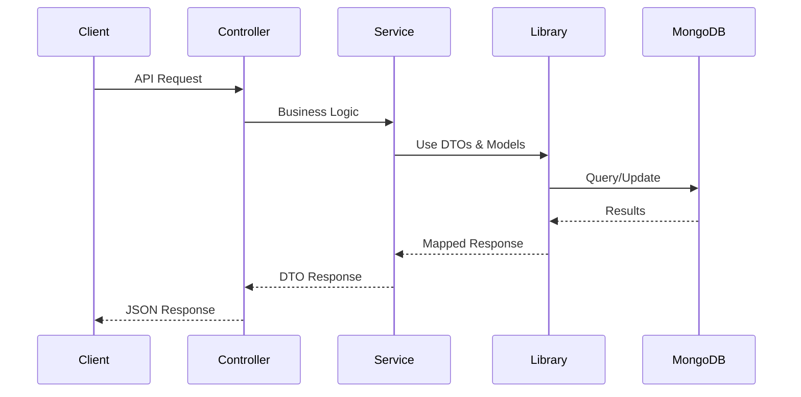

# Introduction to OpenFrame OSS Library

OpenFrame OSS Library is the foundational library for building secure, scalable device and organization management platforms. It provides standardized data models, API DTOs, and service interfaces that power the entire OpenFrame ecosystem, enabling organizations to build robust, multi-tenant device management solutions.

## What is OpenFrame OSS Library?

OpenFrame OSS Library serves as the core building block for modern IT management platforms, providing:

- **Standardized APIs** - Consistent data models and transfer objects across all services
- **Multi-Tenant Architecture** - Complete tenant isolation and security for SaaS applications
- **Device Management** - Comprehensive device tracking, monitoring, and integration capabilities
- **Security Framework** - Enterprise-grade authentication, authorization, and audit trails
- **Extensible Architecture** - Modular design supporting custom integrations and extensions

## Key Features

### 🏢 Multi-Tenant Organization Management
- Complete organization structure with contact management
- User invitation and role-based access control
- SSO configuration support with OAuth 2.0 and OIDC
- Tenant isolation and security

### 💻 Comprehensive Device Management
- Device inventory and tracking across multiple types (Desktop, Laptop, Server)
- Health monitoring and compliance tracking
- Integration with popular MDM tools (Fleet, Tactical RMM, MeshCentral)
- Real-time device status and alerts

### 📊 Event & Audit System
- Centralized event logging and tracking
- Comprehensive audit trail capabilities
- Flexible filtering and cursor-based pagination
- Real-time event processing with Kafka streams

### 🔧 Extensible Tool Integration
- Plugin architecture for tool connections
- API key and credential management
- Tool agent installation and management
- Support for external RMM integrations

### 🔐 Enterprise Security
- JWT-based authentication with refresh tokens
- OAuth 2.0 and OIDC provider support
- API key management with rate limiting
- Multi-tenant data isolation

## Target Audience

OpenFrame OSS Library is designed for:

### MSP/IT Service Providers
Build centralized device management dashboards with multi-client support, automated monitoring, and compliance reporting.

### Enterprise Organizations  
Deploy secure, scalable device management infrastructure with SSO integration, audit trails, and policy enforcement.

### Software Vendors
Integrate device management capabilities into existing products using standardized APIs and data models.

### Platform Developers
Create custom device management solutions with battle-tested components and patterns.

## Architecture Overview

## Core Modules

| Module | Purpose | Key Components |
|--------|---------|----------------|
| **API DTOs** | Standardized data transfer | `DeviceResponse`, `OrganizationRequest`, `EventFilter` |
| **Service Interfaces** | Business logic contracts | `DeviceService`, `OrganizationService`, `EventService` |
| **Data Models** | MongoDB entities | Device, Organization, Event, Tool documents |
| **Security Core** | Authentication & authorization | JWT handlers, OAuth providers, tenant isolation |
| **Core Utilities** | Shared functionality | Pagination, validation, encryption, slug generation |

## What You Can Build

With OpenFrame OSS Library, you can create:

- **Device Management Platforms** - Inventory, monitoring, and compliance
- **IT Service Dashboards** - Multi-tenant MSP solutions  
- **Security Monitoring** - Device security and compliance tracking
- **Integration Platforms** - Connect RMM tools and monitoring systems
- **Analytics Dashboards** - Device usage and health analytics
- **Mobile Device Management** - Enterprise mobility solutions

## Data Flow Overview

## Getting Started

Ready to build with OpenFrame OSS Library? Here's your learning path:

1. **[Prerequisites](./prerequisites.md)** - Set up your development environment
2. **[Quick Start](./quick-start.md)** - Get your first application running in 5 minutes
3. **[First Steps](./first-steps.md)** - Explore key features and capabilities

## Support & Community

- 💬 **Community**: [OpenMSP Slack](https://join.slack.com/t/openmsp/shared_invite/zt-36bl7mx0h-3~U2nFH6nqHqoTPXMaHEHA) - Get help and connect with developers
- 🚀 **Platform**: [OpenFrame.ai](https://openframe.ai) - Product information and platform access
- 🏢 **About Flamingo**: [Flamingo.run](https://flamingo.run) - Learn about our mission and team

> **Note**: We manage all discussions and support through our **OpenMSP Slack community**.

## Next Steps

Continue with [Prerequisites](./prerequisites.md) to set up your development environment, or jump to [Quick Start](./quick-start.md) if you're ready to start building immediately.