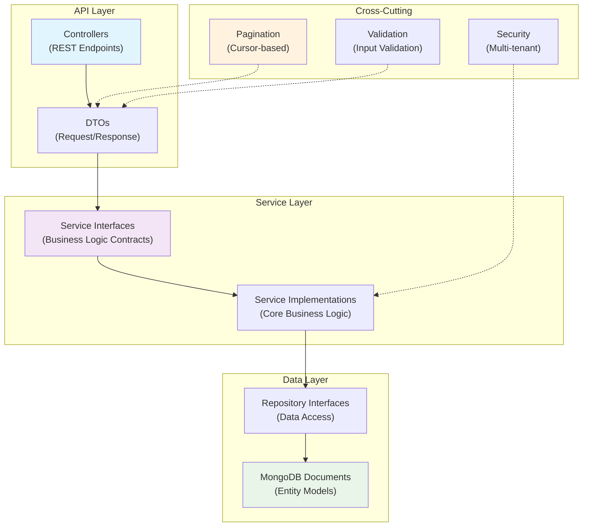

# OpenFrame OSS Library Introduction

Welcome to **OpenFrame OSS Library** - the foundational building blocks for the OpenFrame platform! This library provides the core Data Transfer Objects (DTOs), service interfaces, and data models that power OpenFrame's unified MSP (Managed Service Provider) platform.

## What is OpenFrame OSS Library?

OpenFrame OSS Library (`openframe-oss-lib`) is a comprehensive Java library that standardizes data models, API contracts, and service interfaces across the entire OpenFrame ecosystem. Think of it as the "common language" that all OpenFrame services speak.

[](https://www.youtube.com/watch?v=awc-yAnkhIo)

## 🚀 Key Features

### Core Capabilities
- **Standardized DTOs**: Consistent data transfer objects for all domains (devices, events, organizations, tools, audit logs)
- **Service Interfaces**: Well-defined contracts for business logic implementation
- **MongoDB Data Models**: Complete entity definitions for multi-tenant SaaS architecture
- **Cursor-based Pagination**: Efficient navigation through large datasets
- **Multi-tenant Security**: Built-in patterns for secure, isolated tenant operations

### Domain Coverage
- **Device Management**: Models and DTOs for endpoint management, compliance tracking, and health monitoring
- **Event Processing**: Structured event handling for audit trails and system monitoring  
- **Organization Management**: Multi-tenant organization structures with contact management
- **Tool Integration**: Framework for integrating MSP tools like TacticalRMM, Fleet MDM, and MeshCentral
- **User & Authentication**: Comprehensive user management with SSO and invitation workflows

## 🎯 Who Should Use This Library?

### Primary Audiences

| Audience | Use Case | Benefits |
|----------|----------|----------|
| **MSP Platform Developers** | Building OpenFrame-compatible services | Consistent APIs, reduced development time |
| **Integration Partners** | Connecting existing tools to OpenFrame | Standardized data models, clear contracts |
| **Enterprise Developers** | Extending OpenFrame functionality | Well-documented interfaces, modular design |
| **Open Source Contributors** | Contributing to the OpenFrame ecosystem | Foundation knowledge, architectural patterns |

## 🏗️ High-Level Architecture

The library follows a layered architecture with clear separation of concerns:



## 📦 Core Modules

| Module | Purpose | Key Components |
|--------|---------|----------------|
| `api-lib` | Core DTOs and service interfaces | Device, Event, Organization, Tool, Audit DTOs |
| `data-mongo` | MongoDB data models and repositories | Entity documents, repository interfaces |
| `core` | Shared utilities and validation | Pagination, validation, security utilities |
| `security-core` | Authentication and authorization | JWT handling, multi-tenant security |

## 🌟 Key Benefits

### For Developers
- **Reduced Boilerplate**: Pre-built DTOs and models eliminate repetitive code
- **Type Safety**: Strong typing with Java generics and validation annotations
- **Consistent APIs**: Standardized pagination, filtering, and response patterns
- **Documentation**: Comprehensive inline documentation and architectural guides

### For Organizations  
- **Faster Time-to-Market**: Leverage existing, battle-tested components
- **Scalability**: Built-in support for multi-tenancy and high-volume operations
- **Interoperability**: Seamless integration with OpenFrame ecosystem
- **Open Source**: No vendor lock-in, full source code access

## 🚦 Quick Start Preview

Here's a taste of what working with the library looks like:

```java
// Paginated device query with filtering
@Data
@Builder
public class DeviceFilterInput {
    @Valid
    private CursorPaginationInput pagination;
    
    @Valid 
    private DeviceFilters filters;
}

// Service interface for device operations
public interface DeviceService {
    CountedGenericQueryResult<Device> findDevices(DeviceFilterInput input);
    Device findDeviceById(String deviceId);
    Device updateDeviceStatus(String deviceId, DeviceStatus status);
}
```

## 📋 What's Next?

Ready to dive in? Here's your learning path:

1. **[Prerequisites](prerequisites.md)** - Set up your development environment
2. **[Quick Start](quick-start.md)** - Get the library running in 5 minutes  
3. **[First Steps](first-steps.md)** - Explore core features and common patterns
4. **[Development Guide](../development/README.md)** - Deep dive into architecture and implementation

## 🤝 Community & Support

- **Slack Community**: [OpenMSP Slack](https://join.slack.com/t/openmsp/shared_invite/zt-36bl7mx0h-3~U2nFH6nqHqoTPXMaHEHA) - Get help and connect with other developers
- **Platform Website**: [OpenFrame.ai](https://openframe.ai) - Product information and updates  
- **Company Website**: [Flamingo.run](https://flamingo.run) - About the team and mission

> **Note**: We don't use GitHub Issues or Discussions. All community interaction happens on our OpenMSP Slack community where you'll find active developers, documentation, and real-time support.

---

**Ready to build the future of MSP platforms?** Let's get you set up with the prerequisites and your first OpenFrame integration!