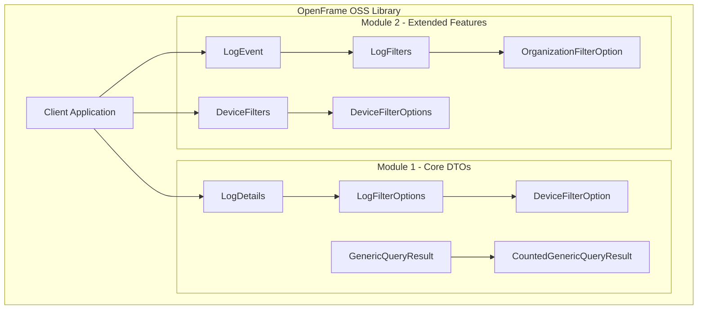

# OpenFrame OSS Library - Introduction

Welcome to the OpenFrame OSS Library, a comprehensive Java library designed to facilitate the management and querying of audit logs and device-related data within the OpenFrame API ecosystem.

## What is OpenFrame OSS Library?

The `openframe-oss-lib` is a robust collection of Data Transfer Objects (DTOs) that enables efficient data handling and filtering capabilities for audit logging and device management. Built with modern Java practices and Lombok annotations, this library provides a clean, maintainable foundation for your OpenFrame API integrations.

## 🎯 Key Features

- **Comprehensive Audit Logging**: Full support for audit log events with detailed metadata
- **Advanced Device Filtering**: Sophisticated filtering options for device management
- **Type-Safe DTOs**: Strongly typed data structures for reliable data handling
- **Lombok Integration**: Reduced boilerplate with automatic getter/setter generation
- **Builder Pattern Support**: Fluent API for object creation
- **Pagination Support**: Built-in support for paginated queries
- **Generic Query Results**: Flexible result structures for various data types

## 🏗️ High-Level Architecture



## 🎯 Target Audience

This library is designed for:

- **Java Developers** building applications that integrate with OpenFrame APIs
- **DevOps Engineers** implementing audit logging and device monitoring
- **Security Teams** requiring detailed audit trail management
- **Enterprise Developers** needing robust data filtering capabilities

## 💡 Core Benefits

| Benefit | Description |
|---------|-------------|
| **Type Safety** | Strongly typed DTOs prevent runtime errors |
| **Reduced Boilerplate** | Lombok annotations minimize repetitive code |
| **Consistent API** | Standardized patterns across all DTOs |
| **Filtering Power** | Advanced filtering options for complex queries |
| **Pagination Ready** | Built-in support for large dataset handling |
| **Enterprise Ready** | Production-grade reliability and performance |

## 🚀 Quick Example

Here's a taste of what working with the library looks like:

```java
// Create an audit log event
LogEvent event = LogEvent.builder()
    .toolEventId("evt-12345")
    .eventType("USER_LOGIN")
    .severity("INFO")
    .userId("user-789")
    .organizationName("Acme Corp")
    .timestamp(Instant.now())
    .build();

// Apply filters to device queries
DeviceFilters filters = DeviceFilters.builder()
    .statuses(Arrays.asList("ACTIVE", "PENDING"))
    .deviceTypes(Arrays.asList("LAPTOP", "MOBILE"))
    .build();
```

## 📚 What's Next?

Ready to get started? Here's your learning path:

1. **[Prerequisites](prerequisites.md)** - Set up your development environment
2. **[Quick Start](quick-start.md)** - Get up and running in 5 minutes
3. **[First Steps](first-steps.md)** - Explore the key features

## 🔗 Related Resources

- [Development Documentation](../development/README.md) - For contributors and advanced users
- [Architecture Overview](../development/architecture/overview.md) - Deep dive into system design
- [API Reference](../reference/architecture/overview.md) - Complete API documentation

---

> **💡 Pro Tip**: Start with the [Quick Start Guide](quick-start.md) if you want to see the library in action immediately, or check [Prerequisites](prerequisites.md) if you're setting up a new development environment.