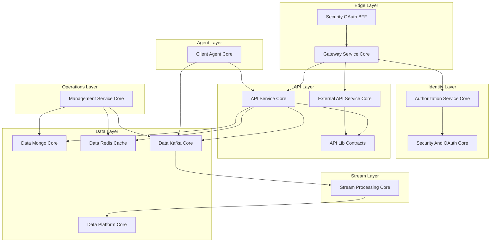

# OpenFrame OSS Lib – Introduction

Welcome to **OpenFrame OSS Lib**, the modular, open-source foundation powering the OpenFrame platform. This library collection provides enterprise-grade infrastructure for building AI-powered MSP (Managed Service Provider) platforms and modern IT automation systems.

[](https://www.youtube.com/watch?v=awc-yAnkhIo)

## What is OpenFrame OSS Lib?

OpenFrame OSS Lib is a **full-stack, multi-tenant, event-driven backend foundation** that replaces expensive proprietary software with open-source alternatives enhanced by intelligent automation. It serves as the core infrastructure layer that powers:

- **Flamingo** - AI-powered MSP platform with Mingo AI for technicians and Fae for clients
- **OpenFrame** - Unified platform integrating multiple MSP tools into a single AI-driven interface
- Custom MSP platforms and IT automation solutions

## Key Features & Benefits

### 🏗️ **Microservice-Ready Architecture**
- 15 modular core libraries
- Independent deployment capability
- Clear separation of concerns
- Event-driven communication patterns

### 🔐 **Enterprise Security**
- Multi-tenant JWT authentication (RS256)
- OAuth2 Authorization Server with OIDC support
- SSO integration (Google, Microsoft)
- API key management with rate limiting
- Per-tenant RSA key management

### 📊 **Real-Time Data Processing**
- Apache Kafka event streaming
- Apache Pinot analytics
- Cassandra time-series storage
- Redis distributed caching
- Real-time event enrichment and normalization

### 🤖 **Agent Management**
- Machine agent lifecycle management
- Tool installation orchestration
- Heartbeat processing and monitoring
- Integration with FleetDM and TacticalRMM

### 🌐 **API-First Design**
- GraphQL API with cursor-based pagination
- REST API for external integrations
- Reactive Spring Cloud Gateway
- WebSocket support for real-time communication

## Architecture Overview

OpenFrame OSS Lib implements a layered, event-driven system optimized for scale:



## Target Audience

This library is designed for:

### **MSP Developers & Platform Engineers**
- Building next-generation MSP platforms
- Integrating multiple tools into unified interfaces
- Scaling IT automation workflows

### **Enterprise Development Teams**
- Creating multi-tenant SaaS applications
- Implementing event-driven architectures
- Building real-time analytics platforms

### **Open Source Contributors**
- Contributing to the OpenFrame ecosystem
- Extending MSP platform capabilities
- Building community-driven integrations

## Technology Stack

| Layer | Technologies |
|-------|-------------|
| **Framework** | Spring Boot 3.3.0, Java 21 |
| **Security** | OAuth2, JWT (RS256), Spring Security |
| **Data Storage** | MongoDB, Apache Cassandra, Redis |
| **Streaming** | Apache Kafka, NATS, Debezium |
| **Analytics** | Apache Pinot |
| **API** | GraphQL (Netflix DGS), REST |
| **Gateway** | Spring Cloud Gateway (Reactive) |
| **Testing** | Spring Boot Test, RestAssured |
| **AI Integration** | Anthropic Claude, VoltAgent |

## Core Design Principles

✅ **Multi-tenant by design** - Built for SaaS-scale isolation  
✅ **Event-driven architecture** - Real-time processing and integration  
✅ **Cursor-based pagination** - Efficient data access patterns  
✅ **Asymmetric JWT cryptography** - Secure token validation  
✅ **Tool-agnostic normalization** - Universal event and data models  
✅ **Infrastructure auto-bootstrap** - Zero-configuration deployments  
✅ **Reactive edge gateway** - High-performance API routing  
✅ **Clear separation of concerns** - Maintainable modular design  

## Getting Started Path

Ready to dive in? Follow this learning path:

1. **[Prerequisites](prerequisites.md)** - Set up your development environment
2. **[Quick Start](quick-start.md)** - Get a basic setup running in 5 minutes  
3. **[First Steps](first-steps.md)** - Explore key features and capabilities
4. **[Development Setup](../development/setup/local-development.md)** - Set up for contribution and extension

## Repository Structure

The library is organized into 15 modular cores:

```text
openframe-oss-lib/
├── api-lib-contracts/          # Shared DTOs and contracts
├── api-service-core/           # Internal GraphQL + REST API
├── authorization-service-core/ # OAuth2 Authorization Server
├── client-agent-core/          # Machine agent management
├── core-utilities/             # Shared utilities
├── data-kafka-core/           # Kafka infrastructure
├── data-mongo-core/           # MongoDB persistence
├── data-redis-cache/          # Redis caching
├── data-platform-core/        # Pinot + Cassandra orchestration
├── external-api-service-core/ # Public REST API
├── gateway-service-core/      # Reactive API Gateway
├── management-service-core/   # Infrastructure control plane
├── security-and-oauth-core/   # JWT + PKCE utilities
├── security-oauth-bff/        # OAuth BFF layer
└── stream-processing-core/    # Event processing engine
```

Each module is independently reusable but designed to interoperate within a unified OpenFrame deployment.

## Community & Support

Join the OpenFrame community:

- **Slack Community**: [OpenMSP Slack](https://join.slack.com/t/openmsp/shared_invite/zt-36bl7mx0h-3~U2nFH6nqHqoTPXMaHEHA)
- **Website**: [flamingo.run](https://flamingo.run)
- **OpenFrame Platform**: [openframe.ai](https://openframe.ai)
- **GitHub**: [flamingo-stack/openframe-oss-lib](https://github.com/flamingo-stack/openframe-oss-lib)

> **Note**: We use the OpenMSP Slack community for all discussions, issues, and collaboration. GitHub Issues and Discussions are not actively monitored.

---

**Ready to build the future of MSP platforms?** Continue with the [Prerequisites Guide](prerequisites.md) to set up your development environment.