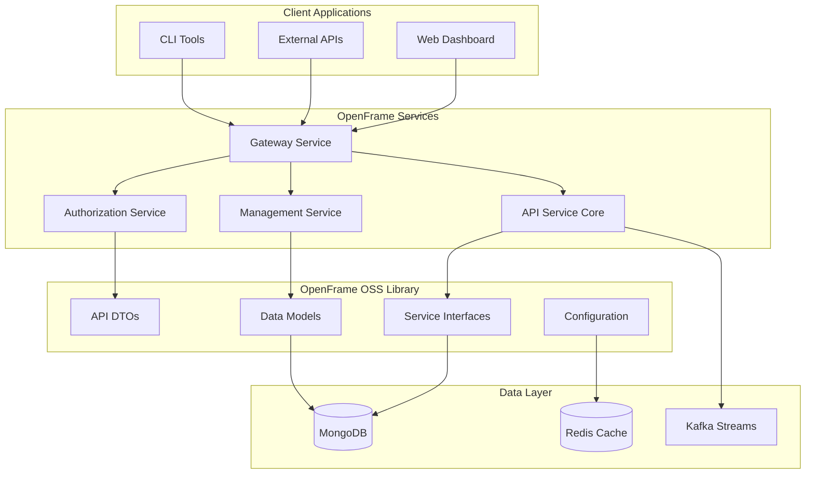
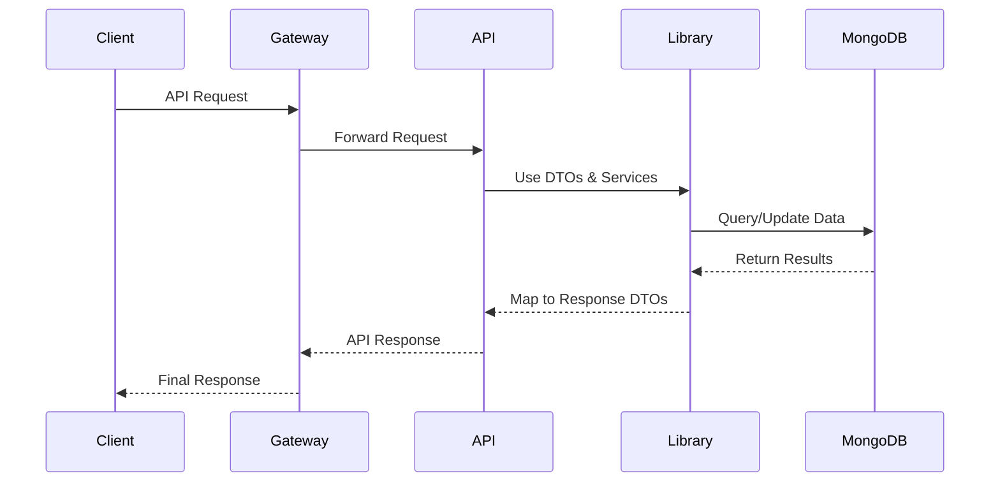

# Introduction to OpenFrame OSS Library

Welcome to the OpenFrame OSS Library - the foundational building block for secure, scalable device and organization management platforms. This comprehensive library provides the core data models, API DTOs, and service interfaces that power the entire OpenFrame ecosystem.

## What is OpenFrame OSS Library?

OpenFrame OSS Library (`openframe-oss-lib`) is the cornerstone library that enables organizations to build robust, multi-tenant device management solutions. It provides standardized data transfer objects (DTOs), service interfaces, and MongoDB data models for managing devices, organizations, events, tools, and audit logs across distributed environments.

## Key Features

### 🏢 Organization Management
- Multi-tenant organization structure
- Contact information and address management
- User invitation and role management
- SSO configuration support

### 💻 Device Management
- Comprehensive device inventory and tracking
- Support for multiple device types (Desktop, Laptop, Server)
- Health monitoring and compliance tracking
- Integration with popular MDM tools (Fleet, Tactical RMM, MeshCentral)

### 📊 Event & Audit System
- Centralized event logging and tracking
- Comprehensive audit trail capabilities
- Flexible filtering and querying
- Real-time event processing

### 🔧 Tool Integration
- Extensible tool connection framework
- API key and credential management
- Tool agent installation and management
- Support for external tool integrations

### 🔐 Security & Authentication
- JWT-based authentication
- OAuth 2.0 and OIDC support
- Multi-tenant security isolation
- API key management with rate limiting

## Architecture Overview

## Who Should Use This Library?

### Platform Developers
Build custom device management solutions with standardized APIs and data models.

### MSP/IT Teams
Integrate with existing RMM tools and create unified device management dashboards.

### Enterprise Organizations
Deploy secure, scalable device management infrastructure with multi-tenant capabilities.

### Integration Partners
Develop third-party integrations using consistent DTOs and service interfaces.

## Core Modules

| Module | Purpose | Key Components |
|--------|---------|----------------|
| **API DTOs** | Data transfer objects | Device, Organization, Event, Tool, Audit DTOs |
| **Service Interfaces** | Business logic contracts | DeviceService, OrganizationService, EventService |
| **Data Models** | MongoDB entities | Device, Organization, Event, Tool documents |
| **Configuration** | Spring configuration | Security, Database, Validation configs |
| **Utilities** | Shared utilities | Pagination, Validation, Encryption |

## Quick Overview

## Benefits

### ✅ Standardization
- Consistent data models across all services
- Unified API patterns and responses
- Standardized pagination and filtering

### ✅ Scalability
- Multi-tenant architecture support
- Cursor-based pagination for large datasets
- Microservices-ready design patterns

### ✅ Security
- Built-in validation and security patterns
- JWT and OAuth 2.0 support
- Tenant isolation and data security

### ✅ Extensibility
- Modular design for easy customization
- Plugin architecture for tool integrations
- Flexible configuration options

## Getting Started

Ready to dive in? Here's your learning path:

1. **[Prerequisites](prerequisites.md)** - Set up your development environment
2. **[Quick Start](quick-start.md)** - Get running in 5 minutes
3. **[First Steps](first-steps.md)** - Explore key features and concepts
4. **[Development Setup](../development/setup/environment.md)** - Full development environment
5. **[Architecture Overview](../development/architecture/overview.md)** - Deep dive into the system design

## Community and Support

- 📖 **Documentation**: Comprehensive guides and API references
- 🐛 **Issues**: Report bugs and request features on GitHub
- 💬 **Discussions**: Community discussions and Q&A
- 🚀 **Contributions**: Open source contributions welcome

## What's Next?

Start with our [Prerequisites Guide](prerequisites.md) to set up your environment, then follow the [Quick Start Guide](quick-start.md) to see OpenFrame OSS Library in action.

Whether you're building a simple device inventory system or a complex multi-tenant management platform, OpenFrame OSS Library provides the foundation you need to succeed.