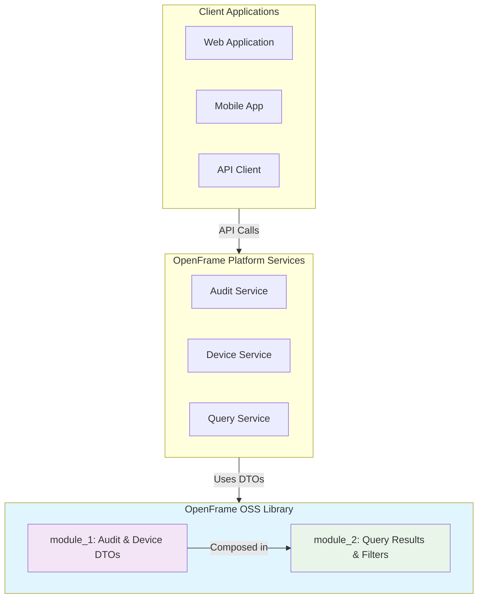

# OpenFrame OSS Library Introduction

Welcome to the OpenFrame OSS Library (openframe-oss-lib) - a foundational Java library that provides essential data transfer objects (DTOs), filter options, and query result structures for the OpenFrame API ecosystem.

## What is OpenFrame OSS Library?

The OpenFrame OSS Library is the backbone for OpenFrame API data modeling, providing reusable, composable DTOs that enable robust audit logging, device management, and flexible querying across OpenFrame platform services.



## Key Features & Benefits

### 🔍 **Comprehensive Audit Logging**
- **LogEvent & LogDetails**: Rich audit trail representation with metadata capture
- **Flexible Filtering**: Advanced search capabilities across tool types, severities, and organizations
- **Event Tracking**: Complete audit history with user, device, and organizational context

### 📱 **Device Management**
- **Device Filter Options**: Status, type, OS, organization, and tag-based filtering
- **Inventory Queries**: Streamlined device discovery and management
- **Organizational Grouping**: Multi-tenant device organization support

### 📊 **Generic Query Results**
- **Paginated Responses**: Cursor-based pagination for efficient data retrieval
- **Counted Results**: Total count information for UI pagination
- **Type-Safe Generics**: Reusable across different data types

### 🏗️ **Modular Architecture**
- **Clean Separation**: Distinct modules for audit/device DTOs and query results
- **Compositional Design**: DTOs designed for flexible combination and extension
- **Reusable Components**: Shared across OpenFrame platform services

## Target Audience

This library is designed for:

- **Backend Developers** building OpenFrame platform services
- **API Developers** creating audit logging and device management endpoints
- **DevOps Teams** implementing monitoring and compliance solutions
- **System Integrators** connecting with OpenFrame ecosystem APIs

## High-Level Architecture

## Core Components Overview

| Component | Module | Purpose |
|-----------|--------|---------|
| **LogEvent** | module_1 | Represents audit log events with metadata |
| **LogDetails** | module_1 | Extended log information with messages |
| **LogFilters** | module_1 | Audit log search criteria |
| **DeviceFilterOptions** | module_1 | Device filtering capabilities |
| **GenericQueryResult** | module_2 | Paginated query responses |
| **CountedGenericQueryResult** | module_2 | Query results with total counts |
| **DeviceFilters** | module_2 | Device filter aggregations |
| **LogFilterOptions** | module_2 | Audit log filter options |

> **Note**: The library uses Lombok annotations for clean, boilerplate-free code with automatic getter/setter generation.

## Getting Started Resources

Ready to dive in? Here's your learning path:

1. **[Prerequisites](prerequisites.md)** - Check system requirements and setup
2. **[Quick Start](quick-start.md)** - Get up and running in 5 minutes
3. **[First Steps](first-steps.md)** - Explore key features and common patterns

## Development Resources

For developers working with the library:

- **[Development Guide](../development/README.md)** - Complete development documentation
- **[Architecture Overview](../development/architecture/overview.md)** - Deep dive into system design
- **[API Reference](../reference/architecture/overview.md)** - Detailed component documentation

## Community & Support

- **Documentation**: Comprehensive guides and API references
- **Examples**: Sample implementations and use cases
- **Issues**: Report bugs and request features via project repository

---

**Next Steps**: Start with our [Prerequisites Guide](prerequisites.md) to ensure your environment is ready for development.