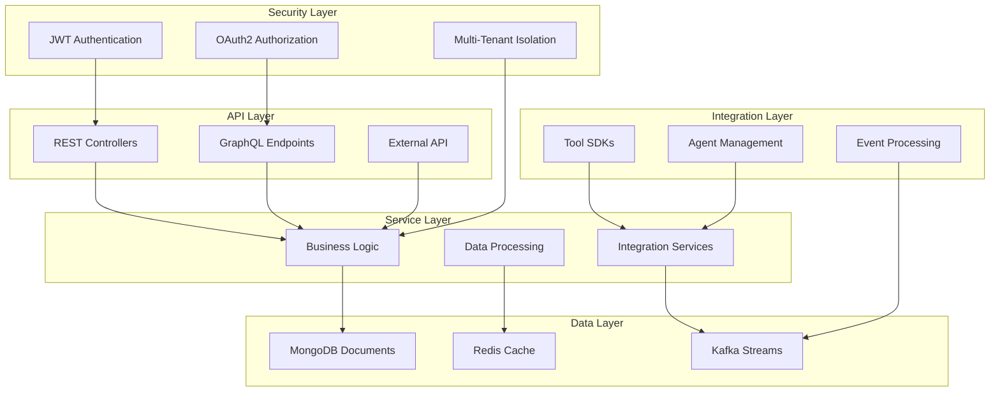

# OpenFrame OSS Library Introduction

Welcome to the OpenFrame OSS Library - the foundational backbone of the OpenFrame AI-powered MSP platform. This library provides the core building blocks that power Flamingo's mission to replace expensive proprietary software with open-source alternatives enhanced by intelligent automation.

## What is OpenFrame OSS Library?

The OpenFrame OSS Library (`openframe-oss-lib`) is a comprehensive collection of Java-based libraries, data models, API DTOs, and service interfaces that provide the foundation for building scalable MSP (Managed Service Provider) platforms. It serves as the core infrastructure that powers:

- **OpenFrame** - The unified platform integrating multiple MSP tools
- **Mingo AI** - Intelligent automation for technicians
- **Fae** - AI-powered client interaction systems

## Key Features & Benefits

| Feature | Description | Benefit |
|---------|-------------|---------|
| **Multi-Tenant Architecture** | Built-in support for secure, isolated tenant environments | Scale from single MSP to enterprise platform |
| **Modular Design** | Loosely coupled modules for devices, events, organizations, tools | Easy to extend and customize |
| **Security-First** | JWT-based authentication with OAuth2 integration | Enterprise-grade security out of the box |
| **Event-Driven** | Apache Kafka integration for real-time data streaming | Responsive and scalable architecture |
| **Tool Agnostic** | Support for FleetDM, Tactical RMM, MeshCentral, and more | Integrate with existing MSP tools |

## Target Audience

This library is designed for:

- **MSP Developers** building custom management platforms
- **Platform Engineers** creating multi-tenant SaaS solutions
- **DevOps Teams** implementing monitoring and automation tools
- **Open Source Contributors** extending MSP capabilities

## Architecture Overview

The OpenFrame OSS Library follows a layered architecture pattern:

## Core Modules

### Essential Components

- **openframe-api-lib** - Core API DTOs and service interfaces
- **openframe-data-mongo** - MongoDB document models and repositories
- **openframe-security-core** - JWT and OAuth2 security infrastructure
- **openframe-core** - Shared utilities and validation

### Service Modules

- **openframe-api-service-core** - Main API service implementation
- **openframe-client-core** - Agent and client management
- **openframe-management-service-core** - Platform administration
- **openframe-gateway-service-core** - API gateway and routing

### Integration Modules

- **sdk/fleetmdm** - FleetDM integration SDK
- **sdk/tacticalrmm** - Tactical RMM integration SDK
- **openframe-stream-service-core** - Event streaming and processing

## Quick Start Preview

> **Ready to dive in?** Here's what you'll accomplish in the next steps:

1. **Prerequisites** - Set up your development environment with Java 21, Maven, and MongoDB
2. **Quick Start** - Get a basic OpenFrame service running in under 5 minutes
3. **First Steps** - Create your first organization, device, and event

## Technology Stack

| Component | Technology | Version |
|-----------|------------|---------|
| **Language** | Java | 21 |
| **Framework** | Spring Boot | 3.3.0 |
| **Database** | MongoDB | Latest |
| **Caching** | Redis | Latest |
| **Messaging** | Apache Kafka | Latest |
| **Security** | Spring Security + JWT | Latest |
| **Build Tool** | Maven | 3.6+ |

## Why Choose OpenFrame OSS?

### 🔓 Open Source Freedom
- No vendor lock-in
- Full source code access
- Community-driven development
- MIT License for commercial use

### 🤖 AI-Enhanced
- Built-in AI automation capabilities
- Intelligent event processing
- Automated tool management
- Smart compliance monitoring

### 🛡️ Enterprise Ready
- Multi-tenant architecture
- Comprehensive audit trails
- Role-based access control
- High availability design

### 🔧 MSP Focused
- Pre-built integrations with popular tools
- Device and asset management
- Event correlation and alerting
- Client organization management

## Next Steps

Ready to get started? Follow this learning path:

1. **[Prerequisites](prerequisites.md)** - Ensure your environment is ready
2. **[Quick Start](quick-start.md)** - Get OpenFrame running in 5 minutes
3. **[First Steps](first-steps.md)** - Learn the basics with hands-on examples

## Community & Support

- **GitHub**: [flamingo-stack/openframe-oss-lib](https://github.com/flamingo-stack/openframe-oss-lib)
- **Website**: [openframe.ai](https://openframe.ai)
- **Flamingo Platform**: [flamingo.run](https://flamingo.run)

---

> 💡 **Pro Tip**: OpenFrame OSS Library is designed to be modular. You can use individual modules in existing projects or build complete MSP platforms from scratch.

Welcome to the future of open-source MSP platforms! 🚀