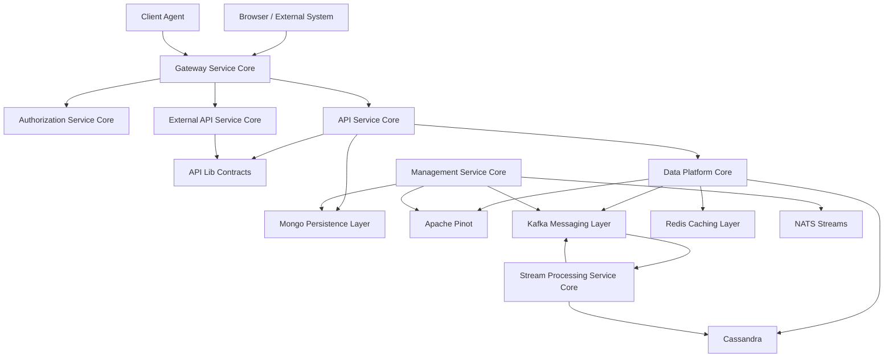

# OpenFrame OSS Libraries - Introduction

Welcome to **OpenFrame OSS Libraries** – the core backend foundation that powers the OpenFrame AI-driven MSP platform. This repository provides all the shared libraries and service cores needed to build and run a scalable, multi-tenant, event-driven IT management infrastructure.

## What is OpenFrame?

OpenFrame is Flamingo's unified platform that integrates multiple MSP tools into a single AI-driven interface, automating IT support operations across the technology stack. The **OpenFrame OSS Libraries** serve as the foundational backend components that enable:

- **Multi-tenant architecture** supporting thousands of MSP organizations
- **Event-driven processing** with real-time data enrichment and normalization
- **AI-ready infrastructure** for intelligent automation and insights
- **Modern authentication** with OAuth2 and OIDC compliance
- **Scalable data platform** combining MongoDB, Cassandra, Redis, and Apache Pinot

## Key Features

### 🏗️ **Modular Architecture**
Built as a collection of service-core modules, each handling specific responsibilities like authentication, data persistence, event processing, and external integrations.

### 🔐 **Enterprise Security**
- Multi-tenant OAuth2 Authorization Server
- JWT-based authentication with per-tenant key pairs
- API key management for external integrations
- RBAC with fine-grained permissions

### 📊 **Data Platform**
- MongoDB for operational data storage
- Apache Pinot for real-time analytics
- Cassandra for audit log storage
- Redis for caching and session management

### ⚡ **Event-Driven Architecture**
- Kafka messaging backbone for reliable event processing
- NATS streams for real-time agent communication
- Debezium CDC for data synchronization
- Stream processing for data enrichment

### 🤖 **Agent Orchestration**
- Client agent registration and lifecycle management
- Tool agent integration with popular MSP platforms
- Real-time heartbeat monitoring
- Automated deployment and updates

### 🌐 **API Layer**
- RESTful APIs for administrative operations
- GraphQL APIs for efficient data querying
- External APIs for third-party integrations
- WebSocket support for real-time communication

## Architecture Overview

## Target Audience

### **MSP Platform Developers**
Build and customize OpenFrame-powered MSP solutions with comprehensive backend services and APIs.

### **Enterprise IT Teams**
Deploy secure, scalable IT management infrastructure with modern authentication and multi-tenancy.

### **Integration Partners**
Connect existing tools and workflows using standardized APIs and event-driven interfaces.

### **Open Source Contributors**
Contribute to the evolution of open-source MSP tooling and AI-driven automation.

## Technology Stack

| Component | Technology | Version |
|-----------|------------|---------|
| **Runtime** | Java | 21 |
| **Framework** | Spring Boot | 3.3.0 |
| **Security** | Spring Authorization Server | 1.3.1 |
| **Data** | MongoDB, Cassandra, Redis, Pinot | Latest |
| **Messaging** | Apache Kafka, NATS | Latest |
| **API** | Netflix DGS (GraphQL) | 9.0.3 |
| **Build** | Maven | 3.x |

## Core Modules

The repository is organized into focused service-core modules:

### **API & Contracts**
- `openframe-api-lib` - Shared DTOs, filters, and reusable services
- `openframe-api-service-core` - REST + GraphQL API orchestration

### **Security & Identity**
- `openframe-authorization-service-core` - Multi-tenant OAuth2/OIDC server
- `openframe-security-core` - JWT infrastructure and authentication
- `openframe-gateway-service-core` - Reactive edge gateway

### **Data & Infrastructure**
- `openframe-data-mongo` - MongoDB models and repositories
- `openframe-data` - Cassandra + Pinot configuration and analytics
- `openframe-data-kafka` - Multi-tenant Kafka infrastructure
- `openframe-data-redis` - Redis caching with tenant-aware keys

### **Processing & Integration**
- `openframe-stream-service-core` - CDC ingestion and data enrichment
- `openframe-management-service-core` - Automation and scheduled operations
- `openframe-client-core` - Agent registration and lifecycle management
- `openframe-external-api-service-core` - External integration APIs

## Getting Started

Ready to dive in? Here's your next steps:

1. **[Prerequisites](prerequisites.md)** - Ensure your development environment is ready
2. **[Quick Start](quick-start.md)** - Get OpenFrame OSS Lib running in 5 minutes
3. **[First Steps](first-steps.md)** - Explore the key features and capabilities

## Community & Support

- **Slack Community**: [OpenMSP Community](https://join.slack.com/t/openmsp/shared_invite/zt-36bl7mx0h-3~U2nFH6nqHqoTPXMaHEHA)
- **GitHub**: [flamingo-stack/openframe-oss-lib](https://github.com/flamingo-stack/openframe-oss-lib)
- **Documentation**: [OpenFrame Documentation](https://www.flamingo.run/openframe)

---

*OpenFrame OSS Libraries is part of the [Flamingo](https://flamingo.run) ecosystem - replacing expensive proprietary software with open-source alternatives enhanced by intelligent automation.*