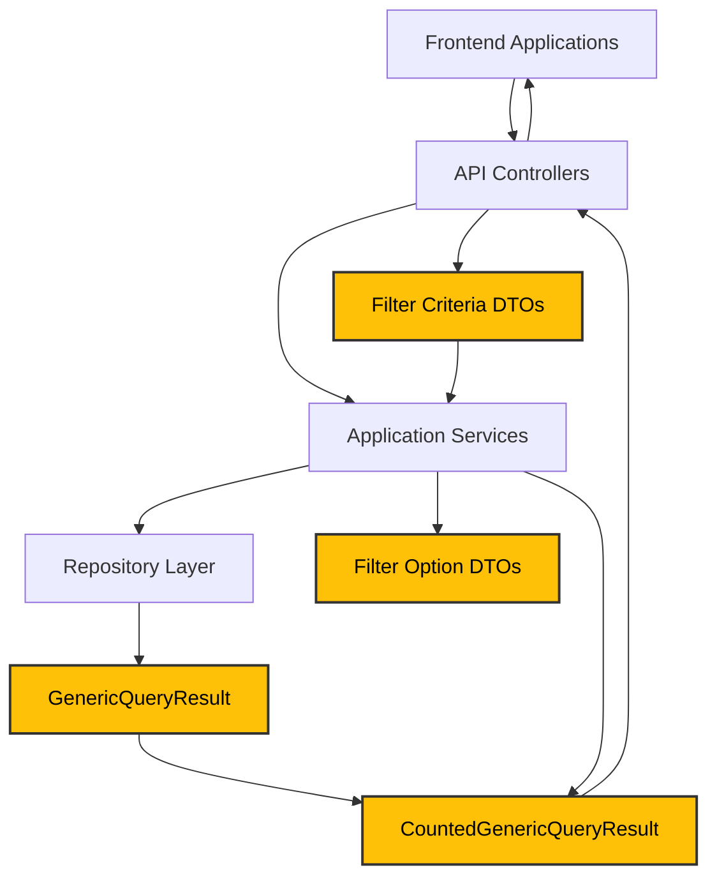

# Welcome to OpenFrame OSS Lib

OpenFrame OSS Lib is the foundational **API DTO library** for the OpenFrame platform - an AI-powered MSP platform that replaces expensive proprietary software with open-source alternatives enhanced by intelligent automation.

[](https://www.youtube.com/watch?v=-_56_qYvMWk)

## What is OpenFrame OSS Lib?

This library provides the **strongly typed, reusable contract layer** that standardizes communication across the entire OpenFrame platform. It defines shared Data Transfer Objects (DTOs) used for:

- **Generic paginated query results** - Consistent response structures across endpoints
- **Count-aware filtered responses** - Enhanced pagination with filtering totals  
- **Audit log summaries and detailed records** - Comprehensive activity tracking
- **Device and audit filtering criteria** - Dynamic filtering capabilities
- **Faceted filter options** - UI-driven filtering and search

## Key Features

| Feature | Description | Benefit |
|---------|-------------|---------|
| **Type Safety** | Strongly typed DTOs with Lombok annotations | Compile-time validation, reduced runtime errors |
| **Reusability** | Shared across API controllers, services, and frontend | Consistent contracts, reduced duplication |
| **Pagination** | Built-in support for paginated responses | Scalable data handling for large datasets |
| **Filtering** | Comprehensive filtering DTOs for audit and device data | Dynamic search and faceted browsing |
| **Multi-tenant** | Organization-scoped filtering and isolation | Secure data separation |
| **Contract-First** | API-first design independent of implementation | Flexible backend implementations |

## Architecture Overview

OpenFrame OSS Lib sits at the **contract boundary** between clients and backend services:


```mermaid
flowchart TD
    Frontend["Frontend Applications"] --> API["API Controllers"]
    API --> Service["Application Services"]  
    Service --> Repository["Repository Layer"]
    
    Repository --> QueryResult["GenericQueryResult<T>"]
    QueryResult --> CountedResult["CountedGenericQueryResult<T>"]
    
    API --> FilterCriteria["Filter Criteria DTOs"]
    Service --> FilterOptions["Filter Option DTOs"]
    
    FilterCriteria --> Service
    Service --> CountedResult
    CountedResult --> API
    API --> Frontend
    
    classDef dto fill:#FFC008,stroke:#333,stroke-width:2px,color:#000
    class QueryResult,CountedResult,FilterCriteria,FilterOptions dto
```

## Target Audience

This library is designed for:

- **Backend Developers** - Building OpenFrame platform services
- **Frontend Developers** - Consuming OpenFrame APIs
- **API Designers** - Defining consistent data contracts
- **Integration Teams** - Connecting external systems to OpenFrame

## Core Modules

The library is organized into two core modules:

### Module 1 - Query Results & Audit Core
- `GenericQueryResult<T>` - Paginated response wrapper
- `CountedGenericQueryResult<T>` - Filtered count-aware responses  
- `LogEvent` - Audit log summary view
- `LogDetails` - Detailed audit log view
- `LogFilterCriteria` - Structured audit filtering

### Module 2 - Advanced Filtering
- **Audit Filtering** - Log query filters and organization options
- **Device Filtering** - Device inventory criteria and faceted filters

## Quick Example

Here's how the DTOs work together in a typical API flow:

```java
// Controller receives filter criteria
@PostMapping("/audit/logs")
public CountedGenericQueryResult<LogEvent> getAuditLogs(
    @RequestBody LogFilterCriteria criteria) {
    
    // Service applies filters and returns counted results
    return auditService.getFilteredLogs(criteria);
}

// Response structure
{
  "items": [...],           // List of LogEvent objects
  "pageInfo": {...},        // Pagination metadata  
  "filteredCount": 1247     // Total matching filter criteria
}
```

## Benefits for Your Team

> **Consistency**: Every API endpoint returns data in the same structure
> 
> **Type Safety**: Compile-time validation prevents runtime errors
> 
> **Productivity**: Pre-built pagination and filtering patterns
> 
> **Scalability**: Handle large datasets efficiently with counting and pagination

## Next Steps

Ready to get started? Follow our step-by-step guides:

- [**Prerequisites**](prerequisites.md) - Ensure your environment is ready
- [**Quick Start**](quick-start.md) - Get up and running in 5 minutes  
- [**First Steps**](first-steps.md) - Explore key features and patterns

## Learn More

- **Platform**: [OpenFrame](https://openframe.ai) - The unified MSP platform
- **Company**: [Flamingo](https://flamingo.run) - AI-powered MSP solutions
- **Community**: [OpenMSP Slack](https://join.slack.com/t/openmsp/shared_invite/zt-36bl7mx0h-3~U2nFH6nqHqoTPXMaHEHA) - Get support and connect with the community

---

*OpenFrame OSS Lib is the foundation that makes the entire OpenFrame platform possible - providing the data contracts that enable seamless communication between Mingo AI (for technicians) and Fae (for clients).*