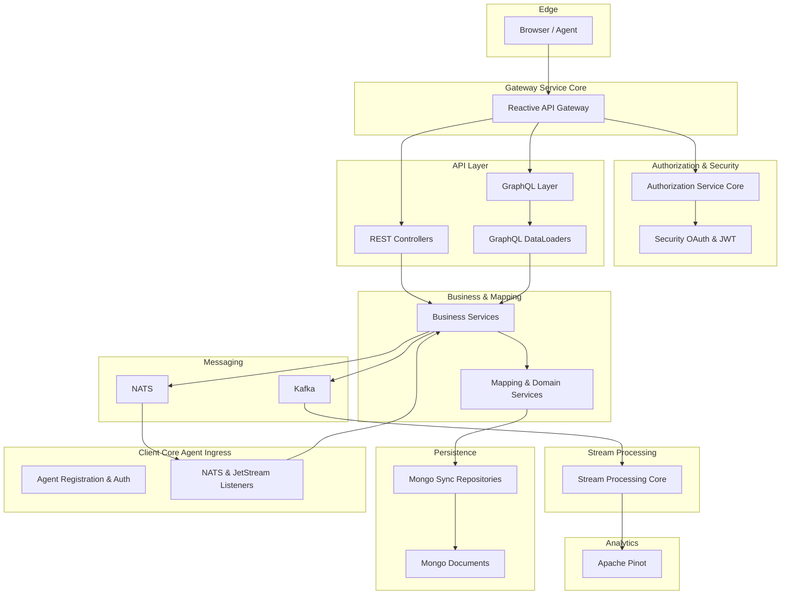

# Introduction to OpenFrame OSS Lib

**`openframe-oss-lib`** is the modular backend foundation of the [OpenFrame platform](https://openframe.ai) — the unified AI-driven MSP platform by [Flamingo](https://flamingo.run). It provides a production-ready, multi-tenant, event-driven, analytics-enabled backend library that powers IT support operations at scale.

---

## What Is OpenFrame OSS Lib?

`openframe-oss-lib` is a **Spring Boot 3 multi-module Maven project** written in Java 21. It ships as a set of reusable library modules that are composed together to build a fully functional MSP backend platform including:

- **REST + GraphQL API surface** — Device, ticket, organization, and script management
- **OAuth2 / OIDC Authorization Server** — Multi-tenant identity with Google and Microsoft SSO support
- **JWT-based Gateway Security** — Reactive API gateway with API key authentication and rate limiting
- **Event-driven Messaging** — Hybrid Kafka (durable) and NATS (real-time) messaging
- **MongoDB Persistence** — Tenant-aware document model for all core aggregates
- **Apache Pinot Analytics** — High-performance time-series analytics for logs and device metrics
- **Tool Integrations** — SDK adapters for Tactical RMM and Fleet MDM
- **Agent Ingress** — Endpoint agent registration, heartbeat, and command dispatch

---

## Key Features

| Feature | Description |
|---------|-------------|
| **Multi-tenancy** | Every domain entity is tenant-scoped; JWT tokens carry tenant identity |
| **OAuth2 + OIDC** | Full Authorization Server with dynamic SSO provider registration |
| **Reactive Gateway** | Spring Cloud Gateway with WebSocket proxying and upstream tool routing |
| **GraphQL with DataLoaders** | Relay-compliant GraphQL API with N+1-safe batching |
| **Hybrid Messaging** | Kafka for durable event streaming, NATS for real-time agent communication |
| **Analytics-Ready** | Apache Pinot integration for sub-second log and device queries |
| **Agent Protocol** | NATS JetStream-based heartbeat, installation, and command dispatch |
| **Extensible by Design** | Processor interfaces and hooks allow tenant-specific customization |

---

## Target Audience

This library is aimed at:

- **MSP Platform Engineers** building or extending OpenFrame-based services
- **Backend developers** working on multi-tenant SaaS applications
- **DevOps engineers** deploying and operating the OpenFrame stack
- **Contributors** adding new features, modules, or tool integrations

---

## Architecture Overview

The following diagram shows how all modules interact end-to-end:

```mermaid
flowchart TD
    subgraph Edge["Edge"]
        Client["Browser / Agent"]
    end

    subgraph GatewayLayer["Gateway Service Core"]
        Gateway["Reactive API Gateway"]
    end

    subgraph SecurityLayer["Authorization & Security"]
        AuthServer["Authorization Service Core"]
        SecurityCore["Security OAuth & JWT"]
    end

    subgraph ApiLayer["API Layer"]
        Rest["REST Controllers"]
        GraphQL["GraphQL Layer"]
        DataLoaders["GraphQL DataLoaders"]
    end

    subgraph DomainLayer["Business & Mapping"]
        Services["Business Services"]
        Mapping["Mapping & Domain Services"]
    end

    subgraph PersistenceLayer["Persistence"]
        MongoDocs["Mongo Documents"]
        MongoSync["Mongo Sync Repositories"]
    end

    subgraph MessagingLayer["Messaging"]
        Kafka["Kafka"]
        Nats["NATS"]
    end

    subgraph StreamLayer["Stream Processing"]
        StreamCore["Stream Processing Core"]
    end

    subgraph AnalyticsLayer["Analytics"]
        Pinot["Apache Pinot"]
    end

    subgraph AgentIngress["Client Core Agent Ingress"]
        AgentAPI["Agent Registration & Auth"]
        AgentListeners["NATS & JetStream Listeners"]
    end

    Client --> Gateway
    Gateway --> Rest
    Gateway --> GraphQL
    Gateway --> AuthServer

    AuthServer --> SecurityCore

    Rest --> Services
    GraphQL --> DataLoaders
    DataLoaders --> Services

    Services --> Mapping
    Mapping --> MongoSync
    MongoSync --> MongoDocs

    Services --> Kafka
    Services --> Nats

    Kafka --> StreamCore
    StreamCore --> Pinot

    Nats --> AgentListeners
    AgentListeners --> Services
```

---

## Repository Module Summary

| Module | Purpose |
|--------|---------|
| `openframe-api-service-core` | REST + GraphQL API with security config |
| `openframe-api-lib` | Shared DTO contracts and domain services |
| `openframe-authorization-service-core` | OAuth2/OIDC Authorization Server |
| `openframe-security-core` | JWT infrastructure (encoder/decoder) |
| `openframe-security-oauth` | BFF OAuth controller and cookie strategy |
| `openframe-gateway-service-core` | Reactive edge gateway with routing and rate limiting |
| `openframe-client-core` | Agent ingress: registration, auth, NATS listeners |
| `openframe-management-service-core` | Bootstrapping, schedulers, migrations |
| `openframe-data-mongo-common` | Domain documents and base repository contracts |
| `openframe-data-mongo-sync` | MongoTemplate repository implementations |
| `openframe-data-mongo-reactive` | Reactive MongoDB repositories |
| `openframe-data-kafka` | Kafka producer, consumer, and config |
| `openframe-data-nats` | NATS publisher and real-time messaging |
| `openframe-data-pinot` | Apache Pinot query client |
| `openframe-data-redis` | Redis cache and rate limiting |
| `openframe-stream-service-core` | Kafka Streams and Debezium CDC processing |
| `openframe-external-api-service-core` | External REST API for third-party consumers |
| `openframe-debezium-initializer` | Debezium connector lifecycle management |
| `openframe-pinot-initializer` | Pinot schema and table initialization |
| `sdk/tacticalrmm` | Tactical RMM SDK (agents, scripts, schedules) |
| `sdk/fleetmdm` | Fleet MDM SDK (hosts, policies, queries) |
| `openframe-test-service-core` | E2E test framework and utilities |

---

## Community & Support

> We use the **OpenMSP Slack community** for all discussions and support — we don't use GitHub Issues or GitHub Discussions.

- 💬 **Join Slack**: [https://www.openmsp.ai/](https://www.openmsp.ai/)
- 🌐 **Flamingo Platform**: [https://flamingo.run](https://flamingo.run)
- 🔧 **OpenFrame**: [https://openframe.ai](https://openframe.ai)

---

## Next Steps

Ready to dive in? Continue with:

- **[Prerequisites](prerequisites.md)** — What you need before getting started
- **[Quick Start](quick-start.md)** — Build and run in 5 minutes
- **[First Steps](first-steps.md)** — Explore key features after setup
