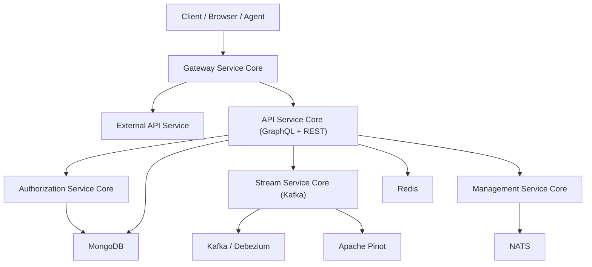
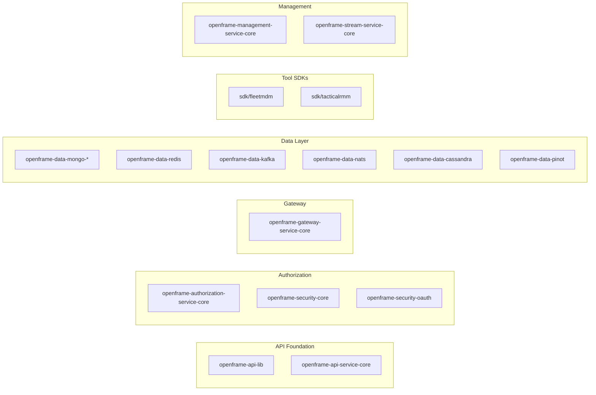

# OpenFrame OSS Lib — Introduction

**openframe-oss-lib** is the foundational backend library powering the [OpenFrame](https://openframe.ai) platform — the AI-driven, open-source MSP infrastructure stack built by [Flamingo](https://flamingo.run).

This repository provides the **shared Spring Boot libraries** that every OpenFrame service is built upon: authentication, API layers, gateway routing, streaming, persistence, and more.

---

## What Is OpenFrame OSS Lib?

OpenFrame OSS Lib is a multi-module Maven project (Java 21, Spring Boot 3.3) that delivers the **core backend infrastructure** for the OpenFrame MSP platform. Rather than a standalone application, it is a set of reusable modules consumed by every service deployed inside an OpenFrame installation.

The library covers:

- **Multi-tenant authentication and authorization** — OAuth2 Authorization Server, per-tenant RSA key pairs, JWT issuance, SSO integration
- **API service layers** — REST controllers and Relay-compliant GraphQL execution
- **Gateway routing and security** — reactive edge gateway, API key rate limiting, WebSocket proxying
- **Event ingestion and streaming** — Kafka / Debezium CDC processing, Kafka Streams enrichment
- **Real-time messaging** — NATS publish/subscribe for device and tool notifications
- **Polyglot persistence** — MongoDB (sync + reactive), Redis caching, Apache Pinot analytics, Cassandra log storage
- **Management initializers and schedulers** — distributed ShedLock-based cluster-safe schedulers, startup bootstrapping
- **External REST API** — API key–authenticated integration surface for third parties
- **SDKs** — Fleet MDM and Tactical RMM Java clients

---

## Key Features & Benefits

| Feature | Description |
|---------|-------------|
| Multi-tenant by default | Every module is designed with tenant isolation: scoped keys, scoped caches, scoped scheduler locks |
| Spring Boot 3.3 / Java 21 | Latest LTS Java with virtual threads ready, modern Spring Security |
| Modular Maven structure | 30+ independent modules — include only what you need |
| Open source, GitHub Packages | Published to GitHub Maven Packages with unified versioning |
| Tool integrations | First-class support for Tactical RMM, Fleet MDM, MeshCentral |
| AI-ready event model | Unified event type model enables Mingo AI and Fae agent consumption |
| GraphQL + REST | Relay-compliant GraphQL for the internal API and versioned REST for external integrations |
| Reactive gateway | Spring Cloud Gateway + WebFlux + Netty for high-concurrency proxying |

---

## Target Audience

This library is intended for:

- **Platform engineers** building or extending OpenFrame microservices
- **MSP developers** integrating their tooling with the OpenFrame event model
- **Open-source contributors** improving the Flamingo/OpenFrame ecosystem

> **Community:** Questions, discussions, and support happen on the [OpenMSP Slack Community](https://join.slack.com/t/openmsp/shared_invite/zt-36bl7mx0h-3~U2nFH6nqHqoTPXMaHEHA). We don't use GitHub Issues.

---

## High-Level Architecture

```mermaid
flowchart TD
    Client["Client / Browser / Agent"] --> Gateway["Gateway Service Core"]
    Gateway --> ExternalAPI["External API Service"]
    Gateway --> ApiCore["API Service Core (GraphQL + REST)"]

    ApiCore --> Authz["Authorization Service Core"]
    ApiCore --> Stream["Stream Service Core (Kafka)"]
    ApiCore --> Management["Management Service Core"]

    Authz --> Mongo["MongoDB"]
    ApiCore --> Mongo
    Stream --> Kafka["Kafka / Debezium"]
    Stream --> Pinot["Apache Pinot"]
    ApiCore --> Redis["Redis"]
    Management --> NATS["NATS"]
```

---

## Module Overview

The library is organized into functional groups:

```mermaid
graph LR
    subgraph apiFoundation["API Foundation"]
        A1["openframe-api-lib"]
        A2["openframe-api-service-core"]
    end
    subgraph auth["Authorization"]
        B1["openframe-authorization-service-core"]
        B2["openframe-security-core"]
        B3["openframe-security-oauth"]
    end
    subgraph gateway["Gateway"]
        C1["openframe-gateway-service-core"]
    end
    subgraph data["Data Layer"]
        D1["openframe-data-mongo-*"]
        D2["openframe-data-redis"]
        D3["openframe-data-kafka"]
        D4["openframe-data-nats"]
        D5["openframe-data-cassandra"]
        D6["openframe-data-pinot"]
    end
    subgraph tools["Tool SDKs"]
        E1["sdk/fleetmdm"]
        E2["sdk/tacticalrmm"]
    end
    subgraph management["Management"]
        F1["openframe-management-service-core"]
        F2["openframe-stream-service-core"]
    end
```

---

## Current Version

The current library version is **5.79.3** — published to [GitHub Packages](https://github.com/flamingo-stack/openframe-oss-lib).

---

## Links & Resources

- **OpenFrame Platform:** [https://openframe.ai](https://openframe.ai)
- **Flamingo:** [https://flamingo.run](https://flamingo.run)
- **GitHub Repository:** [https://github.com/flamingo-stack/openframe-oss-lib](https://github.com/flamingo-stack/openframe-oss-lib)
- **OpenMSP Community (Slack):** [https://www.openmsp.ai/](https://www.openmsp.ai/)
- **Reference Architecture Docs:** [./reference/architecture/README.md](./reference/architecture/README.md)

---

## Next Steps

- Review the [Prerequisites Guide](prerequisites.md) for environment requirements
- Follow the [Quick Start Guide](quick-start.md) to set up the library
- Explore [First Steps](first-steps.md) to understand the key modules
