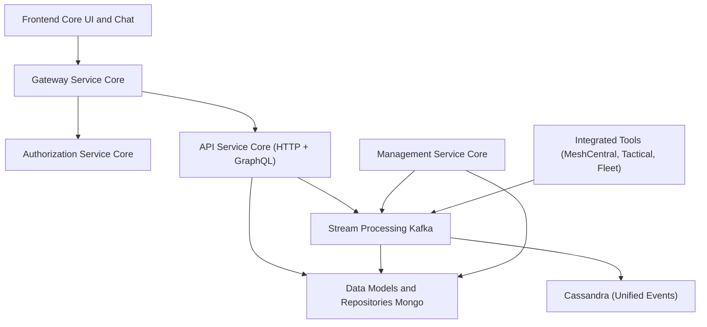

# Introduction to OpenFrame OSS Lib

**OpenFrame OSS Lib** (`openframe-oss-lib`) is the modular backbone of [OpenFrame](https://openframe.ai) — Flamingo's AI-powered MSP platform that replaces expensive proprietary software with open-source alternatives enhanced by intelligent automation.

This library provides the shared, composable building blocks that power the entire OpenFrame stack: from multi-tenant identity and OAuth2 authorization, to reactive APIs, event-driven stream processing, and an embeddable AI chat engine.

---

## What Is OpenFrame OSS Lib?

`openframe-oss-lib` is a multi-module **Spring Boot 3 / Java 21** Maven project (version `6.0.10`) that provides reusable infrastructure libraries for building OpenFrame-compatible services. It is the foundational layer consumed by all services running inside the OpenFrame platform.

> This repository does **not** ship a standalone application — it provides libraries and service-core modules that are embedded into deployable services.

---

## Key Features

| Feature | Description |
|---------|-------------|
| **Multi-Tenant Identity** | OAuth2 Authorization Server with per-tenant RSA key pairs and OIDC support |
| **Reactive API Layer** | REST + GraphQL (Netflix DGS) with Relay-style pagination and DataLoader batching |
| **Gateway & WebSocket Routing** | Spring Cloud Gateway with JWT validation, rate limiting, and tool proxying |
| **MongoDB Data Layer** | Reactive + sync repositories, cursor pagination, multi-tenant scoping |
| **Kafka Stream Processing** | Debezium CDC ingestion, event normalization, Kafka Streams enrichment |
| **Management & Operations** | Distributed schedulers, migration support (Mongock), NATS initialization |
| **Frontend UI & AI Chat** | Embeddable React AI assistant (Guide + Mingo modes), Kanban, Notifications |
| **Integrated Tool SDKs** | Native SDKs for MeshCentral, Tactical RMM, and Fleet MDM |
| **Shared API Contracts** | Centralized DTOs, filters, and pagination primitives for all services |

---

## Target Audience

This library is intended for:

- **MSP Platform Engineers** building services that integrate with OpenFrame
- **Backend Developers** implementing new OpenFrame microservices
- **Open-Source Contributors** extending the OpenFrame ecosystem
- **System Architects** designing multi-tenant SaaS or OSS MSP platforms

---

## Platform Overview

```mermaid
flowchart TD
    Frontend["Frontend Core UI and Chat"]
    Gateway["Gateway Service Core"]
    Auth["Authorization Service Core"]
    API["API Service Core (HTTP + GraphQL)"]
    Management["Management Service Core"]
    Data["Data Models and Repositories Mongo"]
    Stream["Stream Processing Kafka"]
    Cassandra["Cassandra (Unified Events)"]
    Tools["Integrated Tools (MeshCentral, Tactical, Fleet)"]

    Frontend --> Gateway
    Gateway --> Auth
    Gateway --> API
    API --> Data
    API --> Stream
    Stream --> Cassandra
    Stream --> Data
    Management --> Data
    Management --> Stream
    Tools --> Stream
```

---

## Module Ecosystem

The library is organized into 29+ composable modules, grouped by domain:

### Core Infrastructure
- `openframe-core` – Shared utilities, constants, validation
- `openframe-exception` – Unified exception hierarchy
- `openframe-core-crypto` – Encryption services
- `openframe-config-core` – Configuration server support

### Data Layer
- `openframe-data-mongo-common` – Document models and base repositories
- `openframe-data-mongo-sync` – Synchronous MongoDB repositories
- `openframe-data-mongo-reactive` – Reactive MongoDB repositories
- `openframe-data-redis` – Redis caching and rate limiting
- `openframe-data-kafka` – Kafka producer utilities
- `openframe-data-cassandra` – Cassandra persistence for event logs
- `openframe-data-pinot` – Apache Pinot analytics queries
- `openframe-data-nats` – NATS messaging and pub/sub

### Service Cores
- `openframe-api-service-core` – REST + GraphQL application layer
- `openframe-api-lib` – Shared API contracts and DTOs
- `openframe-authorization-service-core` – OAuth2/OIDC Authorization Server
- `openframe-gateway-service-core` – Reactive edge gateway
- `openframe-management-service-core` – Operational control plane
- `openframe-stream-service-core` – Kafka event ingestion pipeline
- `openframe-client-core` – Agent registration and device management
- `openframe-security-core` – JWT and security primitives
- `openframe-security-oauth` – OAuth2 BFF (Backend For Frontend)

### Tool Integrations
- `openframe-tactical-sdk` – Tactical RMM integration
- `sdk/fleetmdm` – Fleet MDM client SDK
- `sdk/tacticalrmm` – Tactical RMM client SDK

### Frontend
- `openframe-frontend-core` – Reusable React UI components and AI Chat

---

## The Flamingo / OpenFrame Platform

OpenFrame is part of the [Flamingo](https://flamingo.run) AI-powered MSP stack:

- **Mingo AI** – AI assistant for technicians
- **Fae** – AI assistant for clients
- **OpenFrame** – Unified platform integrating MSP tools with intelligent automation

Join the community: [OpenMSP Slack](https://join.slack.com/t/openmsp/shared_invite/zt-36bl7mx0h-3~U2nFH6nqHqoTPXMaHEHA)

---

## Next Steps

- Review the [Prerequisites](prerequisites.md) to set up your environment
- Follow the [Quick Start Guide](quick-start.md) to get up and running in 5 minutes
- Explore [First Steps](first-steps.md) after your initial setup
