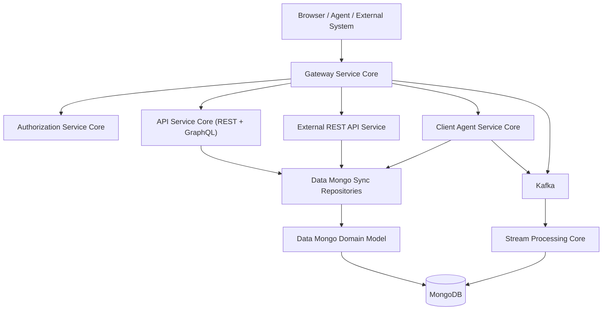

# Introduction to OpenFrame OSS Lib

**OpenFrame OSS Lib** (`flamingo-stack/openframe-oss-lib`) is the core backend shared library collection of the [OpenFrame platform](https://openframe.ai) — the AI-driven unified MSP (Managed Service Provider) infrastructure built by [Flamingo](https://flamingo.run).

This monorepo provides the reusable Spring Boot modules that power every OpenFrame service. It delivers multi-tenant authentication, reactive API routing, event-driven stream processing, agent lifecycle management, and more — all packaged as independently versionable Maven artifacts.

---

## What Is OpenFrame OSS Lib?

OpenFrame OSS Lib is a **modular Java/Spring Boot library monorepo** that serves as the foundational building block for the OpenFrame platform. Instead of reimplementing cross-cutting concerns in each service, OpenFrame services depend on these shared modules for:

- Multi-tenant OAuth2/OIDC authorization
- Reactive gateway routing and security
- GraphQL and REST API infrastructure
- MongoDB domain modeling and repositories
- Kafka-based event streaming and enrichment
- Agent registration, heartbeat, and RMM execution
- Notification, encryption, and configuration utilities

> **Note:** This repository contains **shared library modules**, not a standalone deployable service. It is intended for use by [openframe-oss-tenant](https://github.com/flamingo-stack/openframe-oss-tenant) and related OpenFrame services.

---

## Key Features

| Feature | Description |
|---|---|
| **Multi-Tenant by Design** | Every module respects tenant isolation via `TenantContext`, scoped repositories, and JWT claims |
| **OAuth2 / OIDC Authorization** | Full Spring Authorization Server implementation with Mongo persistence |
| **Reactive Gateway** | Spring Cloud Gateway (WebFlux + Netty) with JWT, API key, and rate limiting |
| **GraphQL API Layer** | Netflix DGS-based Relay-compliant API with cursor pagination and DataLoaders |
| **External REST API** | Versioned `/api/v1/**` endpoints for third-party integrations |
| **Event-Driven Streaming** | Kafka + Kafka Streams for real-time enrichment and state projection |
| **Agent Lifecycle** | Full agent registration, heartbeat, RMM script scheduling, and execution watchdog |
| **MongoDB Domain Model** | Rich document model covering devices, organizations, scripts, tickets, and more |
| **Frontend Core** | React/TypeScript component library for the OpenFrame UI |

---

## Target Audience

This library is intended for:

- **OpenFrame platform engineers** building or extending OpenFrame services
- **MSP developers** who want to self-host or customize the OpenFrame stack
- **Contributors** to the open-source OpenFrame ecosystem

---

## Architecture Overview

OpenFrame OSS Lib follows a layered, multi-tenant, event-driven architecture:


```mermaid
flowchart TD
    Client["Browser / Agent / External System"] --> Gateway["Gateway Service Core"]

    Gateway --> Authz["Authorization Service Core"]
    Gateway --> Api["API Service Core (REST + GraphQL)"]
    Gateway --> ExternalApi["External REST API Service"]
    Gateway --> ClientAgent["Client Agent Service Core"]

    Api --> Repos["Data Mongo Sync Repositories"]
    ExternalApi --> Repos
    ClientAgent --> Repos

    Repos --> Domain["Data Mongo Domain Model"]
    Domain --> Mongo[("MongoDB")]

    ClientAgent --> Kafka["Kafka"]
    Gateway --> Kafka
    Kafka --> Stream["Stream Processing Core"]
    Stream --> Mongo
```

### Module Summary

| Layer | Module | Purpose |
|---|---|---|
| **Edge** | `openframe-gateway-service-core` | Reactive JWT/API-key gateway |
| **Identity** | `openframe-authorization-service-core` | OAuth2 + OIDC authorization server |
| **API** | `openframe-api-service-core` | Internal GraphQL + REST API |
| **External API** | `openframe-external-api-service-core` | Public REST API surface |
| **Agent** | `openframe-client-core` | Agent registration + RMM |
| **Domain** | `openframe-data-mongo-common` | MongoDB document model |
| **Repositories** | `openframe-data-mongo-sync` | Sync MongoDB repositories |
| **Streaming** | `openframe-stream-service-core` | Kafka event processing |
| **Security** | `openframe-security-core` | JWT helpers and auth context |
| **Frontend** | `openframe-frontend-core` | React UI component library |

---

## Repository Structure

The repository is organized as a Maven multi-module project:

```text
openframe-oss-lib/
├── openframe-exception/              # Exception hierarchy
├── openframe-core/                   # Core utilities and validation
├── openframe-core-crypto/            # Encryption service
├── openframe-security-core/          # JWT security config
├── openframe-security-oauth/         # OAuth BFF service
├── openframe-authorization-service-core/  # OAuth2/OIDC server
├── openframe-gateway-service-core/   # Reactive API gateway
├── openframe-api-service-core/       # Internal GraphQL + REST API
├── openframe-api-lib/                # API contracts & DTO library
├── openframe-external-api-service-core/  # External REST API
├── openframe-client-core/            # Agent service core
├── openframe-data-mongo-common/      # MongoDB domain documents
├── openframe-data-mongo-sync/        # Synchronous repositories
├── openframe-data-mongo-reactive/    # Reactive repositories
├── openframe-data-redis/             # Redis caching
├── openframe-data-kafka/             # Kafka producer utilities
├── openframe-data-nats/              # NATS messaging
├── openframe-stream-service-core/    # Kafka Streams processing
├── openframe-management-service-core/  # Platform management
├── openframe-notification-mail/      # Email notifications
├── openframe-notification-push/      # Push notifications
├── openframe-frontend-core/          # React/TypeScript UI library
├── clients/openframe-client/         # Rust agent client
└── sdk/fleetmdm/                     # Fleet MDM SDK
```

---

## Related Projects

| Project | Description |
|---|---|
| [openframe-oss-tenant](https://github.com/flamingo-stack/openframe-oss-tenant) | Main OpenFrame platform application |
| [openframe-cli](https://github.com/flamingo-stack/openframe-cli) | CLI tool for self-hosted deployment |
| [Flamingo](https://flamingo.run) | Commercial MSP platform powered by OpenFrame |

---

## Community & Support

OpenFrame is developed in the open. Questions, ideas, and contributions are welcome on the **OpenMSP Slack community**:

https://join.slack.com/t/openmsp/shared_invite/zt-36bl7mx0h-3~U2nFH6nqHqoTPXMaHEHA

---

## Next Steps

- Review the [Prerequisites](prerequisites.md) to set up your environment
- Follow the [Quick Start](quick-start.md) to get started fast
- Read [First Steps](first-steps.md) to explore key library features
