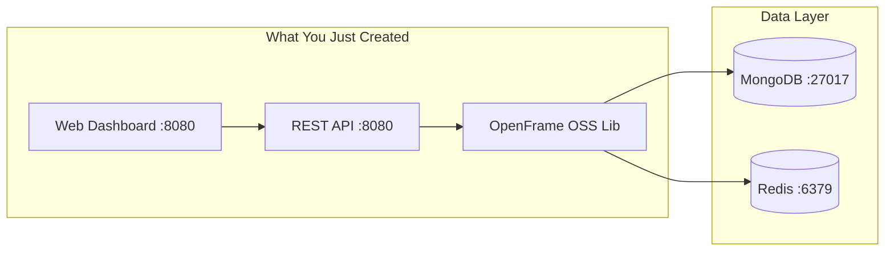
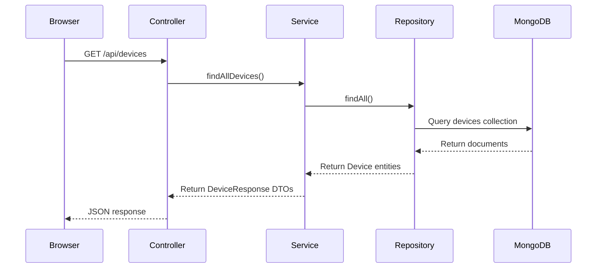

# Quick Start Guide

Get OpenFrame OSS Library up and running in 5 minutes! This guide provides the fastest path to see the library in action with a working device management example.

## TL;DR - 5 Minute Setup

```bash
# Clone the repository
git clone https://github.com/openframe/openframe-oss-lib.git
cd openframe-oss-lib

# Start dependencies
docker-compose up -d mongodb redis

# Build the project
./gradlew build

# Run the example application
./gradlew :examples:device-management:bootRun
```

Navigate to `http://localhost:8080` to see your device management dashboard.

## Step 1: Clone and Setup

### Clone the Repository

```bash
git clone https://github.com/openframe/openframe-oss-lib.git
cd openframe-oss-lib
```

### Quick Dependencies with Docker

The fastest way to get dependencies running:

```bash
# Start MongoDB and Redis
docker-compose up -d

# Verify services are running
docker ps
```

You should see:
```text
CONTAINER ID   IMAGE         PORTS                      NAMES
xxxxx         mongo:7.0     0.0.0.0:27017->27017/tcp   mongodb
xxxxx         redis:7-alpine 0.0.0.0:6379->6379/tcp    redis
```

## Step 2: Build the Project

### Build All Modules

```bash
./gradlew build
```

This command will:
- ✅ Download all dependencies
- ✅ Compile Java source code
- ✅ Run unit tests
- ✅ Create library JARs

Expected output:
```text
BUILD SUCCESSFUL in 2m 15s
45 actionable tasks: 45 executed
```

### Quick Build (Skip Tests)

For faster builds during development:

```bash
./gradlew build -x test
```

## Step 3: Run Example Application

### Start the Device Management Example

```bash
./gradlew :examples:device-management:bootRun
```

The application will start on `http://localhost:8080`

You should see:
```text
  ____                   _____                          
 / __ \                 |  __ \                         
| |  | |_ __   ___ _ __ | |__) |_ _ _ __ ___   ___       
| |  | | '_ \ / _ \ '_ \|  _  /| '_| '_  _ \ / _ \      
| |__| | |_) |  __/ | | | | \ \| | | | | | |  __/      
 \____/| .__/ \___|_| |_|_|  \_\_| |_| |_| |_|\___|     
       | |                                             
       |_|                                             

2024-01-20 10:30:00.000  INFO --- [  restartedMain] c.o.examples.DeviceManagementApp : Starting DeviceManagementApp
2024-01-20 10:30:02.000  INFO --- [  restartedMain] c.o.examples.DeviceManagementApp : Started DeviceManagementApp in 2.5 seconds
```

## Step 4: Explore the Example

### Access the Web Dashboard

Open your browser to: `http://localhost:8080`

You'll see the OpenFrame device management dashboard with:

- 📊 **Device Overview** - Total devices, online/offline status
- 💻 **Device List** - Sample devices with different types
- 🔍 **Search & Filter** - Find devices by type, status, or organization
- 📈 **Health Metrics** - Device health and compliance status

### Sample API Calls

The example includes sample data. Try these API calls:

```bash
# List all devices
curl http://localhost:8080/api/devices

# Get device by ID
curl http://localhost:8080/api/devices/device-001

# Filter devices by type
curl "http://localhost:8080/api/devices?type=LAPTOP"

# Get organizations
curl http://localhost:8080/api/organizations
```

### Expected Response

```json
{
  "items": [
    {
      "id": "device-001",
      "machineId": "machine-123",
      "serialNumber": "SN123456789",
      "model": "Dell OptiPlex 7090", 
      "osVersion": "Windows 11 Pro",
      "status": "ACTIVE",
      "type": "DESKTOP",
      "lastCheckin": "2024-01-20T10:30:00Z"
    }
  ],
  "pageInfo": {
    "hasNextPage": false,
    "hasPreviousPage": false,
    "startCursor": "cursor_start",
    "endCursor": "cursor_end"
  }
}
```

## Step 5: Understanding What You Built

### Architecture Components



### Key Files Created

| Component | File | Purpose |
|-----------|------|---------|
| **DTOs** | `DeviceResponse.java` | API response objects |
| **Services** | `DeviceService.java` | Business logic |
| **Models** | `Device.java` | MongoDB entities |
| **Controllers** | `DeviceController.java` | REST endpoints |
| **Config** | `MongoConfig.java` | Database configuration |

### Data Flow



## What's Working Now

✅ **Device Management**
- Device CRUD operations
- Device filtering by type and status
- Device health monitoring

✅ **Organization Management**
- Organization listing and details
- Contact information management

✅ **API Infrastructure**
- RESTful API endpoints
- Cursor-based pagination
- Input validation and error handling

✅ **Data Persistence**
- MongoDB document storage
- Redis caching layer
- Automatic data mapping

## Testing Your Setup

### Verify Components

```bash
# Check application health
curl http://localhost:8080/actuator/health

# Expected response
{
  "status": "UP",
  "components": {
    "mongo": {"status": "UP"},
    "redis": {"status": "UP"}
  }
}
```

### Create Your First Device

```bash
curl -X POST http://localhost:8080/api/devices \
  -H "Content-Type: application/json" \
  -d '{
    "machineId": "my-machine-001",
    "serialNumber": "MY123456789", 
    "model": "MacBook Pro M2",
    "osVersion": "macOS 14.0",
    "status": "ACTIVE",
    "type": "LAPTOP"
  }'
```

### Query Your Device

```bash
curl http://localhost:8080/api/devices | jq '.items[] | select(.serialNumber=="MY123456789")'
```

## Next Steps

🎉 **Congratulations!** You have OpenFrame OSS Library running with a complete device management example.

### Immediate Next Steps

1. **[First Steps Guide](first-steps.md)** - Explore key features and concepts
2. **[Development Environment](../development/setup/environment.md)** - Set up full development environment
3. **[Architecture Overview](../development/architecture/overview.md)** - Understand the system design

### Explore Further

- **Add Organizations**: Create organizations and assign devices
- **Event Logging**: Enable audit trails and event tracking
- **Tool Integration**: Connect external RMM tools
- **Security**: Add authentication and authorization

### Customize Your Setup

```bash
# Edit application configuration
vim examples/device-management/src/main/resources/application.yml

# Add your database URL
spring:
  data:
    mongodb:
      uri: mongodb://your-mongodb-url:27017/openframe

# Restart the application
./gradlew :examples:device-management:bootRun
```

## Common Issues & Solutions

### Port 8080 Already in Use

```bash
# Find and kill the process
lsof -i :8080
kill -9 <PID>

# Or change the port
export SERVER_PORT=8081
./gradlew :examples:device-management:bootRun
```

### MongoDB Connection Error

```bash
# Check MongoDB is running
docker ps | grep mongo

# If not running
docker-compose up -d mongodb

# Check logs
docker logs mongodb
```

### Build Failures

```bash
# Clean and rebuild
./gradlew clean build

# Check Java version
java -version  # Should be 17+
```

## Resources

- 📖 **[Full Documentation](../development/README.md)**
- 🔧 **[Configuration Guide](../development/setup/local-development.md)**
- 🏗️ **[Architecture Deep Dive](../development/architecture/overview.md)**
- 🧪 **[Testing Guide](../development/testing/overview.md)**

## Need Help?

- 💬 GitHub Discussions for community support
- 🐛 GitHub Issues for bug reports
- 📧 Email support for enterprise customers

You're now ready to build powerful device management applications with OpenFrame OSS Library!