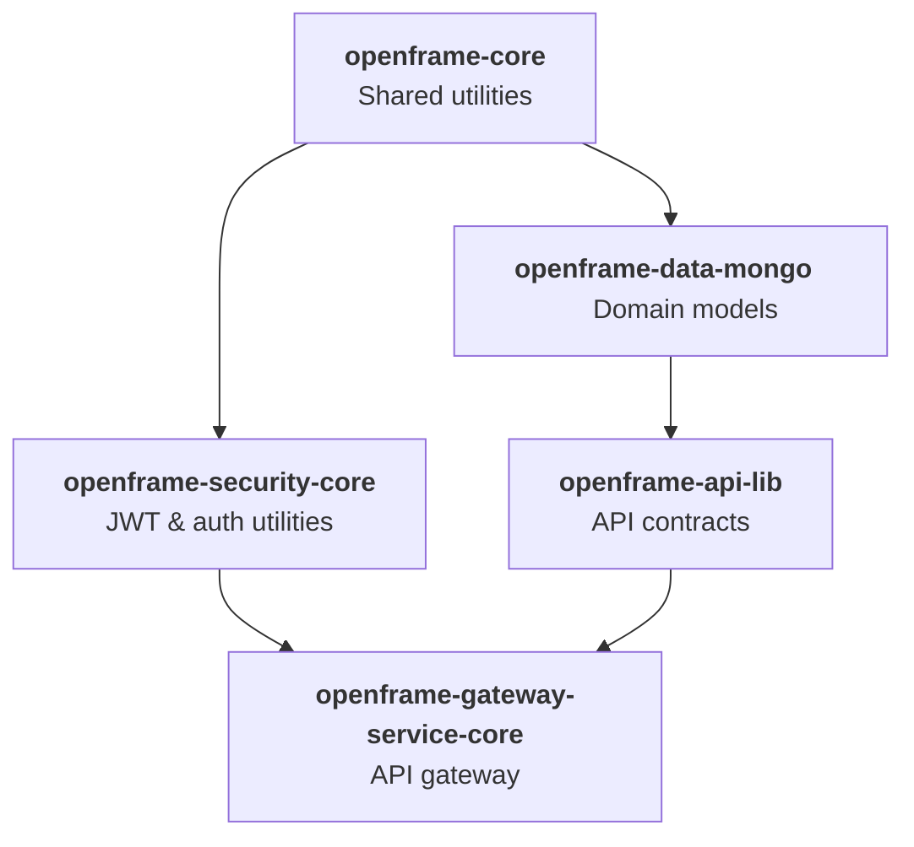

# Quick Start

Get OpenFrame OSS Lib up and running in 5 minutes! This guide covers the essentials to build and explore the libraries.

[](https://www.youtube.com/watch?v=O8hbBO5Mym8)

## TL;DR - 5-Minute Setup

```bash
# 1. Clone the repository
git clone https://github.com/flamingo-stack/openframe-oss-lib.git
cd openframe-oss-lib

# 2. Build all modules
mvn clean install

# 3. Explore the modules
ls -la */

# 4. Run tests (optional)
mvn test
```

That's it! You now have all OpenFrame OSS Lib modules built and available in your local Maven repository.

## Step-by-Step Guide

### 1. Clone the Repository

```bash
git clone https://github.com/flamingo-stack/openframe-oss-lib.git
cd openframe-oss-lib
```

**What you'll see:**

```text
openframe-oss-lib/
├── openframe-api-lib/                    # API contracts & DTOs
├── openframe-api-service-core/           # Internal REST & GraphQL APIs  
├── openframe-authorization-service-core/ # OAuth2 authorization server
├── openframe-client-core/                # Agent lifecycle management
├── openframe-core/                       # Shared utilities
├── openframe-data/                       # Analytics & streaming data
├── openframe-data-kafka/                 # Kafka event foundation
├── openframe-data-mongo/                 # MongoDB domain & repos
├── openframe-data-redis/                 # Redis caching layer
├── openframe-external-api-service-core/  # Public REST APIs
├── openframe-gateway-service-core/       # API gateway & routing
├── openframe-management-service-core/    # Platform operations
├── openframe-security-core/              # JWT & security utilities
├── openframe-security-oauth/             # OAuth BFF
├── openframe-stream-service-core/        # Real-time event processing
├── openframe-test-service-core/          # Integration testing
├── sdk/                                  # External tool integrations
├── pom.xml                              # Parent POM
└── README.md
```

### 2. Build the Project

Build all modules with a single command:

```bash
mvn clean install
```

**Expected output:**

```text
[INFO] Scanning for projects...
[INFO] ------------------------------------------------------------------------
[INFO] Reactor Build Order:
[INFO] 
[INFO] OpenFrame OSS Libraries                                            [pom]
[INFO] openframe-core                                                     [jar]
[INFO] openframe-data-mongo                                               [jar]
[INFO] openframe-data-redis                                               [jar]
[INFO] ... (more modules)
[INFO] 
[INFO] ------------------------------------------------------------------------
[INFO] BUILD SUCCESS
[INFO] ------------------------------------------------------------------------
[INFO] Total time: 2-4 minutes (depending on your machine)
```

> **Note**: The first build will take longer as Maven downloads all dependencies. Subsequent builds are much faster.

### 3. Verify the Build

Check that all modules compiled successfully:

```bash
# Check build artifacts
find . -name "*.jar" -path "*/target/*" | head -10

# Verify main modules exist
ls */target/*.jar
```

**Expected output:**

```text
./openframe-core/target/openframe-core-5.30.0.jar
./openframe-data-mongo/target/openframe-data-mongo-5.30.0.jar
./openframe-api-lib/target/openframe-api-lib-5.30.0.jar
... (more JARs)
```

### 4. Run Tests (Optional)

Execute the test suite to ensure everything works:

```bash
# Run all tests
mvn test

# Or run tests for a specific module
cd openframe-core
mvn test
```

## Exploring the Modules

### Core Library Structure

The project follows a layered architecture. Here are the key modules to explore:



### Examine Module Contents

```bash
# Core utilities and shared components
ls openframe-core/src/main/java/com/openframe/core/

# MongoDB domain models and repositories  
ls openframe-data-mongo/src/main/java/com/openframe/data/document/

# API contracts and DTOs
ls openframe-api-lib/src/main/java/com/openframe/api/dto/

# Security configuration
ls openframe-security-core/src/main/java/com/openframe/security/
```

## Understanding the Build

### Maven Reactor

OpenFrame OSS Lib uses Maven's multi-module reactor build. The parent POM (`pom.xml`) defines:

- **Shared properties**: Java 21, Spring Boot 3.3.0, library versions
- **Module ordering**: Ensures dependencies build before dependents  
- **Common dependencies**: Lombok, Spring Boot, testing frameworks
- **Build plugins**: Source generation, flattening for CI/CD

### Key Dependencies

The project uses these major dependencies:

| Technology | Version | Purpose |
|------------|---------|---------|
| **Spring Boot** | 3.3.0 | Application framework |
| **Java** | 21 | Runtime platform |
| **Spring Cloud** | 2023.0.3 | Gateway and service discovery |
| **Spring Data MongoDB** | 4.2.0 | Database integration |
| **JJWT** | 0.11.5 | JWT processing |
| **Apache Pinot** | 1.2.0 | Analytics database |
| **NATS** | 0.6.2+3.5 | Messaging system |

## Quick Architecture Tour

### 1. Core Utilities (`openframe-core`)

```bash
# Explore shared utilities
find openframe-core/src -name "*.java" | head -5
```

**Purpose**: Validation, error handling, encryption, pagination utilities used across all modules.

### 2. Data Layer (`openframe-data-mongo`)

```bash  
# Check domain documents
ls openframe-data-mongo/src/main/java/com/openframe/data/document/
```

**Purpose**: MongoDB entities like User, Organization, Device, OAuth clients with repositories.

### 3. API Contracts (`openframe-api-lib`)

```bash
# Browse API DTOs  
ls openframe-api-lib/src/main/java/com/openframe/api/dto/
```

**Purpose**: Request/response DTOs, filters, and mappers that define API contracts.

### 4. Security (`openframe-security-core`)

```bash
# Security components
ls openframe-security-core/src/main/java/com/openframe/security/
```

**Purpose**: JWT handling, authentication utilities, PKCE support for OAuth2.

## Next Steps

Congratulations! You've successfully built OpenFrame OSS Lib. Here's what to explore next:

### Immediate Next Steps

1. **[First Steps Guide](first-steps.md)** - Learn key concepts and explore features
2. **[Local Development Setup](../development/setup/local-development.md)** - Set up a full development environment
3. **[Architecture Overview](../development/architecture/README.md)** - Understand the system design

### Deep Dives

- **API Development**: Start with `openframe-api-service-core` REST controllers
- **Security**: Explore OAuth2 flows in `openframe-authorization-service-core`  
- **Data Integration**: Study MongoDB repositories in `openframe-data-mongo`
- **Gateway Configuration**: Review routing in `openframe-gateway-service-core`

### Sample Integration

Try building a simple application using the libraries:

```bash
# Create a new Spring Boot project
# Add openframe-api-lib as a dependency  
# Explore the DTOs and services available
```

## Troubleshooting

### Build Failures

**OutOfMemoryError:**
```bash
export MAVEN_OPTS="-Xmx4096m -XX:MaxPermSize=512m"
mvn clean install
```

**Compilation Errors:**
- Ensure Java 21 is active: `java -version`
- Clear Maven cache: `rm -rf ~/.m2/repository`
- Rebuild: `mvn clean install`

**Test Failures:**
```bash  
# Skip tests if needed for initial exploration
mvn clean install -DskipTests
```

### Common Issues

- **Lombok not working**: Install IDE plugin and enable annotation processing
- **Module not found**: Check module names match directory structure
- **Version conflicts**: The parent POM manages all versions centrally

## Getting Help

- **OpenMSP Community**: [Join our Slack](https://join.slack.com/t/openmsp/shared_invite/zt-36bl7mx0h-3~U2nFH6nqHqoTPXMaHEHA)
- **Documentation Issues**: Check the generated documentation in each module
- **Build Problems**: Review Maven output for specific error details

You're now ready to dive deeper into OpenFrame OSS Lib development!