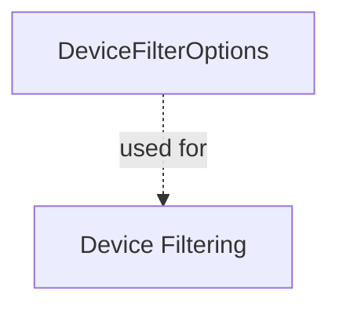

# DeviceFilterOptions

## Purpose

`DeviceFilterOptions` is a data transfer object (DTO) that defines the available filter options for devices in the OpenFrame API. It enables clients to filter devices based on status, type, operating system, organization, and tags.

## Core Fields

| Field           | Type                 | Description                                 |
|-----------------|----------------------|---------------------------------------------|
| statuses        | List<DeviceStatus>   | Device status options (e.g., online, offline)|
| deviceTypes     | List<DeviceType>     | Device type options (e.g., laptop, server)  |
| osTypes         | List<String>         | Operating system types                      |
| organizationIds | List<String>         | Organization IDs for filtering              |
| tagNames        | List<String>         | Tag names for filtering                     |

## Usage

- Used to populate filter dropdowns and criteria in device management UIs.
- Supports API endpoints for device querying and filtering.

## Relationships

## See Also
- [module_2.md](module_2.md) for related device filter and query result DTOs.
