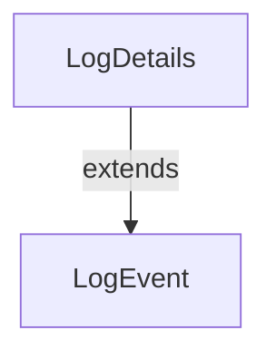

# LogDetails

## Purpose

`LogDetails` is a data transfer object (DTO) that extends the information available in a `LogEvent` by including additional message and detail fields. It provides a more comprehensive view of an audit event for in-depth analysis and troubleshooting.

## Core Fields

| Field             | Type      | Description                                      |
|-------------------|-----------|--------------------------------------------------|
| toolEventId       | String    | Unique identifier for the tool event             |
| eventType         | String    | Type/category of the event                       |
| ingestDay         | String    | Day the event was ingested (for partitioning)    |
| toolType          | String    | Type of tool that generated the event            |
| severity          | String    | Severity level of the event                      |
| userId            | String    | ID of the user associated with the event         |
| deviceId          | String    | ID of the device involved                        |
| hostname          | String    | Hostname where the event occurred                |
| organizationId    | String    | Organization context for the event               |
| organizationName  | String    | Name of the organization                         |
| summary           | String    | Short summary of the event                       |
| timestamp         | Instant   | Timestamp of the event occurrence                |
| message           | String    | Detailed message about the event                 |
| details           | String    | Additional details for in-depth analysis         |

## Usage

- Used when a more detailed representation of an audit log event is required.
- Typically returned in API endpoints that provide full event context.

## Relationships

## See Also
- [LogEvent](LogEvent.md)
