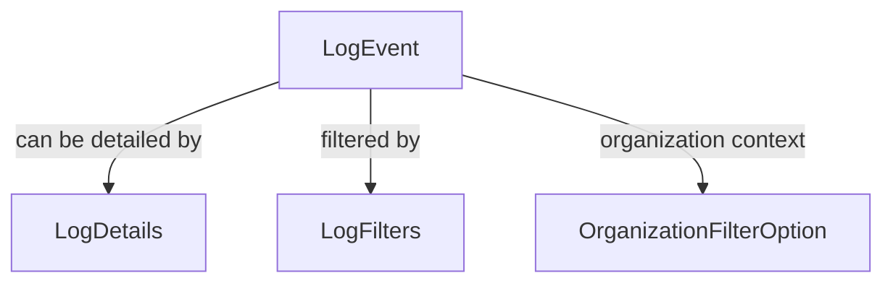

# LogEvent

## Purpose

`LogEvent` is a data transfer object (DTO) representing a single audit log event within the OpenFrame API. It encapsulates metadata about the event, such as its type, severity, associated user, device, and organization context.

## Core Fields

| Field             | Type      | Description                                      |
|-------------------|-----------|--------------------------------------------------|
| toolEventId       | String    | Unique identifier for the tool event             |
| eventType         | String    | Type/category of the event                       |
| ingestDay         | String    | Day the event was ingested (for partitioning)    |
| toolType          | String    | Type of tool that generated the event            |
| severity          | String    | Severity level of the event                      |
| userId            | String    | ID of the user associated with the event         |
| deviceId          | String    | ID of the device involved                        |
| hostname          | String    | Hostname where the event occurred                |
| organizationId    | String    | Organization context for the event               |
| organizationName  | String    | Name of the organization                         |
| summary           | String    | Short summary of the event                       |
| timestamp         | Instant   | Timestamp of the event occurrence                |

## Usage

- Used as the primary representation of audit log entries in API responses.
- Often paired with `LogDetails` for more comprehensive event information.

## Relationships

## See Also
- [LogDetails](LogDetails.md)
- [LogFilters](LogFilters.md)
- [OrganizationFilterOption](OrganizationFilterOption.md)
